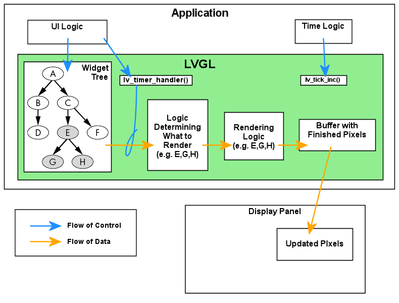

# LVGL - Light and Versatile Graphics Library

## Object tree

LVGL sử dụng mô hình object tree, trong đó:
- Mỗi widget như button, text, table,... thì đều là một object `lv_obj_t`.
- Quan hệ parent-child
  - Mỗi object thì sẽ chỉ có một parent nhưng có thể có nhiều children.
  - Object child sẽ nằm trong vùng tọa độ của object parent.
  - Di chuyển parent thì child cũng sẽ di chuyển theo.
  - Ẩn parent thì child cũng được ẩn theo.
  - Delete parent thì cũng delete child. 
- Root của một object tree được gọi là screen.
- Mỗi display có thể có nhiều screen, nhưng chỉ có một screen tại một thời điểm.

Mỗi object sẽ chứa:
- `Coords`: tọa độ, kích thước.
- `Style`: màu, border, radius, font,...
- `State`: pressed, focused,...

## Cơ chế render của lvgl

Khi một object cần được vẽ lại, thì lvgl sẽ gọi hàm `lv_obj_invalidate` để thực hiện đánh dấu object này là invalidate và tọa độ của object được gọi là invalid area sẽ được lưu vào trong invalid buffer.

Khi định kỳ gọi hàm `lv_timer_handler`, nó sẽ thực hiện công việc là lấy các invalid area trong invalid buffer. Các invalid area có thể được merge hoặc join để giảm số lần flush.

Sau đó, lvgl sẽ đi từ root của object tree để tìm các object nằm trong vùng invalid area, xong đó nó sẽ draw pixel vào một buffer gọi là virtual display buffer.

Có hai mô hình virtual display buffer:
- Single buffer: 1 vùng ram, lvgl sẽ draw pixel rồi được flush ra màn hình.
- Double buffer: 2 vùng ram, lvgl có thể draw vào buffer A, trong khi driver đang flush buffer B (nếu có hỗ trợ DMA).



## Screen

### Khái niệm

Trong LVGL, screen là một `lv_obj_t` đặc biệt - nó là root của một object tree. Mỗi display có thể tạo nhiều screen, nhưng tại một thời điểm chỉ có một screen được hiển thị (gọi là active screen). Các screen khác vẫn tồn tại trong RAM, sẵn sàng để chuyển đổi.

### Tạo screen

Để tạo một screen, ta gọi `lv_obj_create()` với tham số `NULL`:

```c
lv_obj_t *scr_main = lv_obj_create(NULL);
lv_obj_t *scr_settings = lv_obj_create(NULL);
```

Khi truyền `NULL`, LVGL hiểu đây là một screen object, không gắn vào screen nào cả. Nó tồn tại trong memory nhưng chưa được hiển thị.

So sánh với việc tạo widget thông thường:

```c
// Tạo screen - parent là NULL
lv_obj_t *screen = lv_obj_create(NULL);

// Tạo widget - parent là screen hoặc widget khác
lv_obj_t *button = lv_btn_create(screen);
```

### Chuyển screen

Có hai cách chuyển screen:

**Chuyển ngay lập tức:**

```c
lv_scr_load(scr_settings);
```

**Chuyển có animation:**

```c
lv_scr_load_anim(scr_settings, LV_SCR_LOAD_ANIM_MOVE_LEFT, 300, 0, false);
```

Prototype của `lv_scr_load_anim`:

```c
void lv_scr_load_anim(lv_obj_t *new_scr,
                       lv_scr_load_anim_t anim_type,
                       uint32_t time,
                       uint32_t delay,
                       bool auto_del);
```

Trong đó:
- `new_scr`: screen cần chuyển tới.
- `anim_type`: kiểu animation (xem bảng bên dưới).
- `time`: thời gian animation, đơn vị millisecond.
- `delay`: thời gian chờ trước khi bắt đầu animation.
- `auto_del`: nếu `true`, screen cũ sẽ tự động bị xóa khỏi RAM sau khi animation kết thúc. Nếu `false`, screen cũ được giữ lại. Khi ứng dụng có nhiều screen cần chuyển qua lại, nên đặt `false` để không phải tạo lại mỗi lần.

### Các animation type

- `LV_SCR_LOAD_ANIM_NONE`
- `LV_SCR_LOAD_ANIM_FADE_IN`
- `LV_SCR_LOAD_ANIM_FADE_OUT`
- `LV_SCR_LOAD_ANIM_MOVE_LEFT`
- `LV_SCR_LOAD_ANIM_MOVE_RIGHT`
- `LV_SCR_LOAD_ANIM_MOVE_TOP`
- `LV_SCR_LOAD_ANIM_MOVE_BOTTOM`
- `LV_SCR_LOAD_ANIM_OVER_LEFT`
- `LV_SCR_LOAD_ANIM_OVER_RIGHT`
- `LV_SCR_LOAD_ANIM_OVER_TOP`
- `LV_SCR_LOAD_ANIM_OVER_BOTTOM`

:::warning Hiệu năng
Các animation dạng `MOVE_*` animate cả 2 screen đồng thời, trong khi `OVER_*` chỉ animate screen mới (screen cũ đứng yên), do đó `OVER_*` nhẹ hơn trên các hệ thống có tài nguyên hạn chế.
:::

### Lấy screen hiện tại

```c
lv_obj_t *current = lv_screen_active();
```

### Screen event

LVGL cung cấp hai event đặc biệt cho screen, hữu ích khi cần thực hiện hành động tại thời điểm chuyển screen:

```c
// Được gọi khi screen đã hiển thị xong (sau animation)
lv_obj_add_event_cb(my_screen, on_screen_loaded, LV_EVENT_SCREEN_LOADED, NULL);

// Được gọi khi screen bị thay thế bởi screen khác
lv_obj_add_event_cb(my_screen, on_screen_unloaded, LV_EVENT_SCREEN_UNLOADED, NULL);
```

`LV_EVENT_SCREEN_LOADED` thường được dùng để bắt đầu load dữ liệu hoặc khởi tạo tài nguyên khi screen hiện lên. `LV_EVENT_SCREEN_UNLOADED` thường dùng để cleanup tài nguyên, dừng timer, hoặc giải phóng bộ nhớ khi screen không còn hiển thị.

## Event

### Cơ chế event

Mọi tương tác trong LVGL đều thông qua hệ thống event. Khi người dùng chạm vào một button, kéo một slider, hoặc khi giá trị của một widget thay đổi, LVGL sẽ phát ra event tương ứng. Lập trình viên đăng ký callback cho các event quan tâm để xử lý logic.

### Đăng ký event callback

```c
lv_obj_add_event_cb(obj, callback, event_filter, user_data);
```

Trong đó:
- `obj`: widget cần lắng nghe event.
- `callback`: hàm sẽ được gọi khi event xảy ra.
- `event_filter`: loại event cần bắt, ví dụ `LV_EVENT_CLICKED`. Nếu truyền `LV_EVENT_ALL` thì callback sẽ nhận tất cả event (thường chỉ dùng cho debug).
- `user_data`: con trỏ tới dữ liệu tùy ý mà lập trình viên muốn truyền vào callback. Đây là cơ chế quan trọng để callback biết được ngữ cảnh, vì LVGL callback chỉ nhận một tham số duy nhất là `lv_event_t *`.

### Xử lý trong callback

Bên trong callback, ta sử dụng các hàm sau để lấy thông tin:

```c
void my_callback(lv_event_t *e) {
    lv_event_code_t code = lv_event_get_code(e);       // loại event gì?
    lv_obj_t *target = lv_event_get_target(e);         // widget nào phát ra event?
    void *user_data = lv_event_get_user_data(e);       // dữ liệu đã truyền khi đăng ký
}
```

### Cơ chế user_data

`user_data` là cách chính để truyền ngữ cảnh vào callback. Ví dụ, khi có một danh sách file với nhiều item, mỗi item đều dùng chung một callback, nhưng cần biết item nào được nhấn:

```c
typedef struct {
    char name[64];
    char path[128];
} file_entry_t;

static file_entry_t files[10];

static void cb_file_clicked(lv_event_t *e) {
    // Lấy lại con trỏ đã truyền khi đăng ký
    file_entry_t *file = (file_entry_t *)lv_event_get_user_data(e);
    printf("Selected: %s\n", file->name);
}

// Khi tạo list item
for (int i = 0; i < file_count; i++) {
    lv_obj_t *item = lv_list_add_btn(list, LV_SYMBOL_AUDIO, files[i].name);
    // Truyền &files[i] vào → callback biết đây là file nào
    lv_obj_add_event_cb(item, cb_file_clicked, LV_EVENT_CLICKED, &files[i]);
}
```

:::warning Lưu ý
Dữ liệu mà `user_data` trỏ tới phải tồn tại trong suốt vòng đời của widget. Nếu dữ liệu nằm trên stack (biến local) và hàm đã return, callback sẽ đọc vùng nhớ không hợp lệ. Nên dùng biến global, static, hoặc cấp phát trên heap.
:::

### Các event type thường dùng

| Event Type | Mô tả |
|---|---|
| `LV_EVENT_PRESSED` | Ngón tay vừa chạm vào widget |
| `LV_EVENT_RELEASED` | Ngón tay nhấc lên khỏi widget |
| `LV_EVENT_CLICKED` | Nhấn rồi thả trên cùng widget (thường dùng nhất cho button) |
| `LV_EVENT_LONG_PRESSED` | Giữ ngón tay trên widget đủ lâu (mặc định khoảng 400ms) |
| `LV_EVENT_LONG_PRESSED_REPEAT` | Giữ lâu và lặp lại liên tục (ví dụ giữ nút tăng volume) |
| `LV_EVENT_VALUE_CHANGED` | Giá trị widget thay đổi (slider kéo, switch bật/tắt, checkbox tick, dropdown chọn item) |
| `LV_EVENT_FOCUSED` | Widget được focus (qua touch hoặc encoder navigation) |
| `LV_EVENT_DEFOCUSED` | Widget mất focus |
| `LV_EVENT_SCROLL` | Widget đang được scroll |
| `LV_EVENT_SCROLL_END` | Scroll kết thúc |
| `LV_EVENT_KEY` | Nhận phím từ keyboard hoặc encoder input device |
| `LV_EVENT_GESTURE` | Phát hiện gesture (swipe left/right/up/down) |
| `LV_EVENT_SCREEN_LOADED` | Screen đã hiển thị xong sau animation |
| `LV_EVENT_SCREEN_UNLOADED` | Screen đã bị thay thế bởi screen khác |
| `LV_EVENT_DELETE` | Widget sắp bị xóa - dùng để giải phóng tài nguyên liên quan |
| `LV_EVENT_ALL` | Bắt tất cả event (chỉ nên dùng cho debug) |

## Style

### Khái niệm

Style trong LVGL là một tập hợp các thuộc tính hiển thị (màu nền, border, font, padding,...) được đóng gói thành một struct `lv_style_t`. Style có thể được gán cho widget kèm theo một state cụ thể, LVGL sẽ tự động áp dụng style tương ứng khi widget chuyển state.

### Tạo và áp dụng style

```c
static lv_style_t style_btn;

// Khởi tạo
lv_style_init(&style_btn);
lv_style_set_bg_color(&style_btn, lv_color_hex(0x2196F3));
lv_style_set_bg_opa(&style_btn, LV_OPA_COVER);
lv_style_set_border_width(&style_btn, 0);
lv_style_set_radius(&style_btn, 8);
lv_style_set_text_color(&style_btn, lv_color_hex(0xFFFFFF));

// Áp dụng cho widget tại state cụ thể
lv_obj_add_style(btn, &style_btn, LV_STATE_DEFAULT);
```

### State

LVGL tự động chuyển state của widget khi người dùng tương tác. Khi gán style cho một state, style đó chỉ có hiệu lực khi widget ở state tương ứng:

```c
// Style bình thường
lv_obj_add_style(btn, &style_normal, LV_STATE_DEFAULT);

// Style khi nhấn - LVGL tự chuyển khi ngón tay chạm vào
lv_obj_add_style(btn, &style_pressed, LV_STATE_PRESSED);
```

Các state thường dùng:

| State | Khi nào active |
|---|---|
| `LV_STATE_DEFAULT` | Bình thường, không có tương tác |
| `LV_STATE_PRESSED` | Ngón tay đang chạm vào widget |
| `LV_STATE_FOCUSED` | Widget đang được focus |
| `LV_STATE_CHECKED` | Checkbox hoặc switch đang bật |
| `LV_STATE_DISABLED` | Widget bị vô hiệu hóa |

### Part

Một số widget phức tạp có nhiều phần (part), mỗi phần có thể có style riêng. Ví dụ, slider gồm 3 phần:

```c
// LV_PART_MAIN        - track nền (thanh nằm ngang)
// LV_PART_INDICATOR   - phần đã fill (từ min đến giá trị hiện tại)
// LV_PART_KNOB        - nút kéo tròn

lv_obj_add_style(slider, &style_track, LV_PART_MAIN);
lv_obj_add_style(slider, &style_fill, LV_PART_INDICATOR);
lv_obj_add_style(slider, &style_knob, LV_PART_KNOB);
```

### Inline style vs shared style

Có hai cách đặt style cho widget:

**Inline style** - đặt trực tiếp trên widget bằng `lv_obj_set_style_*`:

```c
lv_obj_set_style_bg_color(btn, lv_color_hex(0xFF0000), 0);
lv_obj_set_style_border_width(btn, 2, 0);
```

Mỗi lần gọi sẽ lưu một bản copy thuộc tính bên trong widget. Nếu có 50 widget giống nhau, sẽ tốn 50 bản copy.

**Shared style** - tạo style một lần, nhiều widget dùng chung:

```c
static lv_style_t style_item;
lv_style_init(&style_item);
lv_style_set_bg_color(&style_item, lv_color_hex(0xFF0000));
lv_style_set_border_width(&style_item, 2);

// 50 widget cùng trỏ tới 1 style → tiết kiệm RAM đáng kể
for (int i = 0; i < 50; i++) {
    lv_obj_add_style(items[i], &style_item, LV_STATE_DEFAULT);
}
```

Trên hệ thống nhúng có RAM hạn chế, nên ưu tiên dùng shared style khi có nhiều widget cùng kiểu.

## Tích hợp SquareLine studio

### Giới thiệu

SquareLine Studio là công cụ thiết kế giao diện LVGL bằng kéo thả. Thay vì viết code tạo widget thủ công, ta thiết kế giao diện trong GUI, sau đó SquareLine export ra mã C tương ứng.

### Cấu trúc file export

Khi export, SquareLine tạo ra các file theo cấu trúc sau:

```
ui/
├── ui.h                    // Header chính, khai báo biến global cho tất cả widget
├── ui.c                    // Hàm ui_init() - entry point khởi tạo toàn bộ UI
├── ui_helpers.h            // Khai báo hàm helper (animation, action)
├── ui_helpers.c            // Implement các helper
├── ui_events.h             // Khai báo prototype cho các event callback
├── ui_events.c             // Nơi viết logic xử lý event
├── screens/
│   ├── ui_ScreenHome.c     // Tạo widgets cho screen Home
│   └── ui_ScreenPlayer.c   // Tạo widgets cho screen Player
├── fonts/                  // Font custom
└── images/                 // Ảnh, icon export dạng C array
```

### Vai trò từng file

**`ui.h` / `ui.c`** - Entry point. File `ui.h` khai báo biến `extern` cho mọi widget mà ta đặt tên trong SquareLine:

```c
// Ví dụ nội dung ui.h sau khi export
extern lv_obj_t *ui_ScreenHome;
extern lv_obj_t *ui_ScreenPlayer;
extern lv_obj_t *ui_btnPlay;
extern lv_obj_t *ui_sliderProgress;
extern lv_obj_t *ui_lblSongName;
```

File `ui.c` chứa hàm `ui_init()` - gọi hàm khởi tạo từng screen, sau đó load screen đầu tiên. Ta gọi `ui_init()` một lần duy nhất sau khi đã init LVGL.

**`screens/ui_ScreenXxx.c`** - Mỗi file tương ứng với một screen, chứa code tạo widget, đặt vị trí, gán style, và đăng ký event callback theo thiết kế trong SquareLine.

**`ui_events.c`** - Đây là file quan trọng nhất cho dev. SquareLine tạo skeleton (hàm rỗng) cho mỗi event callback đã gán trong GUI. Dev viết logic xử lý vào đây:

```c
void ui_event_btnPlay(lv_event_t *e) {
    lv_event_code_t code = lv_event_get_code(e);
    if (code == LV_EVENT_CLICKED) {
        // Do something
    }
}
```

**`ui_helpers.h` / `ui_helpers.c`** - Chứa các hàm tiện ích mà SquareLine sử dụng nội bộ cho action/animation được gán trong GUI (ví dụ action "Change Screen" sẽ dùng hàm `_ui_screen_change`).

### Quy tắc chỉnh sửa file

| File | Chỉnh sửa? | Lý do |
|---|---|---|
| `ui.h` / `ui.c` | Không | SquareLine ghi đè mỗi lần export |
| `screens/ui_Screen*.c` | Không | Auto-generated, sẽ bị ghi đè |
| `ui_helpers.*` | Không | Auto-generated |
| `ui_events.c` | **Có** | SquareLine không ghi đè file này |
| `fonts/`, `images/` | Không | Auto-generated |

### Hạn chế của SquareLine studio

SquareLine không hỗ trợ tất cả widget của LVGL. Một ví dụ cụ thể là widget `lv_list` không có trong SquareLine. Giải pháp là dùng SquareLine thiết kế phần tĩnh (layout tổng thể, các screen, button, slider,...), còn phần động (danh sách file từ SD card, nội dung thay đổi runtime) thì tạo bằng code.

Cách tiếp cận: trong SquareLine, tạo một panel container (bật scrollable), đặt tên ví dụ `ui_PanelFileList`. Khi export, ta có biến `ui_PanelFileList` trỏ tới container rỗng. Trong code, ta tự thêm widget con vào container này:

```c
lv_obj_set_flex_flow(ui_PanelFileList, LV_FLEX_FLOW_COLUMN);

for (int i = 0; i < file_count; i++) {
    lv_obj_t *item = lv_obj_create(ui_PanelFileList);
    // ... tạo icon, label, đăng ký event ...
}
```

## Thread safety

### LVGL không thread-safe

Đây là một điểm quan trọng cần nắm vững khi phát triển ứng dụng trên hệ thống multi-task (FreeRTOS). LVGL sử dụng các cấu trúc dữ liệu nội bộ (memory allocator, object tree, style cache,...) mà không có cơ chế bảo vệ. Nếu hai task cùng gọi LVGL API tại cùng một thời điểm, sẽ xảy ra race condition, có thể dẫn đến corrupt dữ liệu hoặc crash.

### Biểu hiện thường gặp

Khi gọi LVGL API từ một task khác mà không có bảo vệ, các triệu chứng có thể gặp:
- Watchdog Timer (WDT) timeout - task bị kẹt do deadlock bên trong LVGL.
- Crash tại các hàm liên quan đến memory allocation (`lv_label_set_text`, `lv_label_set_text_fmt`,...).
- Hiển thị bị lỗi, widget vẽ sai vị trí.

Không phải mọi hàm LVGL đều có cùng mức độ nguy hiểm khi bị gọi đồng thời. Các hàm thao tác memory allocation (như `lv_label_set_text_fmt`) có xác suất crash cao hơn nhiều so với các hàm chỉ ghi một giá trị đơn giản (như `lv_slider_set_value`). Tuy nhiên, tất cả đều không an toàn nếu không có mutex.

Lý do: `lv_label_set_text_fmt` bên trong thực hiện `lv_mem_realloc` để cấp phát bộ nhớ cho chuỗi mới. LVGL memory allocator quản lý bằng linked list - nếu hai task cùng thao tác linked list này, dữ liệu sẽ bị corrupt, dẫn đến infinite loop hoặc crash, kéo theo WDT timeout.

### Giải pháp: mutex

Nếu sử dụng component `esp_lvgl_port` của Espressif, mutex đã được tích hợp sẵn. Khi cần gọi LVGL API từ bất kỳ task nào ngoài LVGL task, ta wrap bằng `lvgl_port_lock()` / `lvgl_port_unlock()`:

```c
// Từ Bluetooth callback, audio task, hoặc bất kỳ task nào
if (lvgl_port_lock(100)) {          // chờ tối đa 100ms để lấy mutex
    lv_label_set_text(label, "Hello");
    lv_slider_set_value(slider, 50, LV_ANIM_ON);
    lvgl_port_unlock();             // phải luôn unlock sau khi xong
}
```

Khi `lvgl_port_lock()` thành công, LVGL task sẽ bị block cho đến khi `lvgl_port_unlock()` được gọi. Trong khoảng thời gian giữ lock, chỉ có task hiện tại truy cập LVGL, đảm bảo an toàn.

Lưu ý khi sử dụng mutex:
- **Timeout hợp lý:** Không nên dùng `portMAX_DELAY` trong callback của các stack ngoại vi (Bluetooth, WiFi,...) vì nếu LVGL task xử lý lâu, callback sẽ bị block quá lâu, gây timeout ở stack gọi nó. Giá trị 50-100ms thường là đủ.
- **Giữ lock ngắn nhất có thể:** Chỉ gọi các hàm LVGL cần thiết bên trong lock, không thực hiện các thao tác nặng (đọc file, decode audio,...).
- **Luôn unlock:** Nếu quên gọi `lvgl_port_unlock()`, LVGL task sẽ bị block vĩnh viễn, giao diện đóng băng.

### Giải pháp thay thế: lv_timer

Đối với dữ liệu cần cập nhật liên tục, một cách tiếp cận khác là sử dụng `lv_timer`. Timer được LVGL gọi bên trong LVGL task, do đó gọi LVGL API trong timer callback luôn an toàn:

```c
static void update_progress_cb(lv_timer_t *timer) {
    int process = something_function();
    lv_slider_set_value(slider_progress, progress, LV_ANIM_ON);
}

// Tạo timer cập nhật mỗi 500ms
lv_timer_t *tmr = lv_timer_create(update_progress_cb, 500, NULL);
```