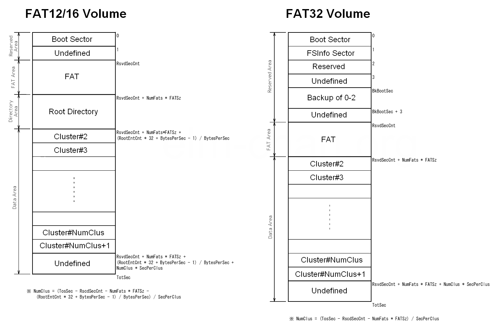
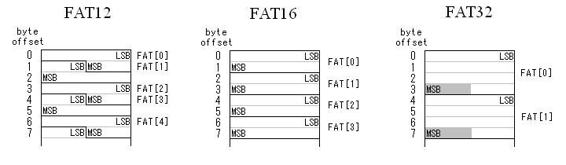

## 1. Tổng quan

FAT (File Allocation Table) là một họ filesystem lâu đời nhưng vẫn được sử dụng rộng rãi trong các hệ thống nhúng hiện đại, đặc biệt là trên các nền tảng MCU như ESP32. Lý do chính khiến FAT vẫn còn phù hợp nằm ở sự đơn giản trong thiết kế, khả năng tương thích cao với các hệ điều hành phổ biến (Windows, Linux, macOS), và sự phù hợp tự nhiên với các thiết bị lưu trữ dạng removable như SD card hoặc USB Mass Storage.

Trong ESP-IDF, FAT filesystem được triển khai dựa trên thư viện FatFs của ChaN. Đây không phải là filesystem ở mức kernel như trong Linux, mà là một thư viện chạy ở user space, kết hợp với lớp VFS (Virtual File System) của ESP-IDF để cung cấp các API quen thuộc kiểu POSIX như `fopen`, `fread`, `fwrite`, `fclose`.

## 2. Kiến trúc vật lý

Để debug ở mức thấp (hex view) hoặc khôi phục dữ liệu, ta cần nắm rõ 4 vùng nhớ chính của một phân vùng FAT:
- **Reserved Region:** chứa boot sector, là sector khởi động nằm ở sector 0 của volume hoặc disk chứa thông tin cụ thể về phần còn lại của file system bao gồm loại file system, kích thước của sector, kích thước của cluster,...
- **FAT Region:** Đây là bản đồ ánh xạ các cluster. Thường có 2 bản sao (FAT1, FAT2) để dự phòng.
- **Root Directory Region:** Lưu trữ một bảng entry chứa các entry mô tả các file và directory được lưu trữ trên ổ đĩa. Mỗi entry bao gồm các thông tin như tên, kích thước, ngày tạo và ngày sửa đổi lần cuối.
    - *Lưu ý:* Trên FAT32, vùng này không cố định vị trí mà được coi là một chuỗi cluster bình thường.
- **Data Region:** Vùng chứa nội dung thực của file. Dữ liệu được quản lý theo đơn vị cluster.



Để hiểu đúng FAT, cần coi nó như một filesystem dạng bảng phân bổ (allocation table) hoạt động trên thiết bị lưu trữ theo block/sector, chứ không phải một hệ thống file phức tạp như ext4.

## 3. Cluster, sector

### 3.1. Sector

Sector là đơn vị đọc/ghi nhỏ nhất của thiết bị lưu trữ. Trên SD card và hầu hết block device hiện nay, sector có kích thước 512 byte.

FAT filesystem không bao giờ ghi dữ liệu nhỏ hơn 1 sector xuống thiết bị vật lý.

Ví dụ: Khi ta sửa 1 byte trong file, controller thực tế phải đọc cả sector 512 byte ra RAM, sửa byte đó, rồi ghi lại cả 512 byte xuống flash.

### 3.2. Cluster

Cluster là đơn vị cấp phát nhỏ nhất của filesystem, được tạo thành từ một hoặc nhiều sector liên tiếp.

Công thức: `Cluster Size = Sector Size * 2^n`

Ví dụ:

- Sector size = 512 byte
- Sectors per cluster = 8
  → Cluster size = 4096 byte (4 KB)

Filesystem chỉ biết cấp phát theo cluster. Điều này dẫn đến:
- File dù chỉ 1 byte vẫn chiếm ít nhất 1 cluster
- File lớn sẽ là một chuỗi các cluster liên kết với nhau thông qua FAT table

:::warning Lưu ý
Một Cluster chỉ có thể chứa dữ liệu của một file duy nhất. Hai file không thể ở chung 1 cluster.
:::

## 3. Các biến thể FAT

Fat type được xác định dựa trên số cluster của volume, ngoài ra không có cách quyết định nào khác.

| Phiên bản | Cluster Address | Max Volume | Max File Size | Use Case |
| :--- | :--- | :--- | :--- | :--- |
| **FAT12** | 12-bit | ~16 MB | 16 MB | EEPROM nhỏ, Floppy. |
| **FAT16** | 16-bit | 2 GB (tối đa 4GB) | 2 GB | Thẻ SD đời cũ (<2GB). |
| **FAT32** | 28-bit | 2 TB - 16 TB | 4 GB | SDHC/SDXC, USB hiện đại. |

:::warning Critical Constraint
FAT32 không hỗ trợ file đơn lẻ lớn hơn 4GB. Nếu ứng dụng datalogging yêu cầu ghi liên tục thời gian dài, bắt buộc phải thực hiện cơ chế **file splitting** (chia nhỏ file theo dung lượng hoặc thời gian).
:::

## 5. FAT table hoạt động như thế nào?

FAT Table thực chất là một mảng các con số, hoạt động như một Danh sách liên kết. Đây là "bản đồ kho báu" chỉ dẫn các file nằm rải rác ở đâu.

### 5.1. Cấu trúc

Mỗi phần tử trong mảng FAT tương ứng với một cluster trên vùng dữ liệu (Data Region).
- Index: Số thứ tự của cluster (cluster #1, cluster #2...).
- Value: Trạng thái của cluster đó.



Các giá trị đặc biệt trong bảng FAT32:

| Giá trị (Hex) | Ý nghĩa |
| ------------- | ------- |
| 0x00000000    | Free Cluster: Cluster trống, có thể ghi dữ liệu. |
| 0x00000002 - 0x0FFFFFEF | Next Cluster: Trỏ đến địa chỉ của cluster tiếp theo chứa dữ liệu của file này. |
| 0x0FFFFFF7    | Bad Cluster: Cluster bị hỏng vật lý, không được dùng. |
| 0x0FFFFFFF    | EOC (End of Chain): Kết thúc file. Đây là cluster cuối cùng. |

### 5.2. Ví dụ thực tế: Đọc file "DATA.TXT"

Giả sử file `DATA.TXT` có kích thước lớn, chiếm 3 clusters. Trong root directory, hệ thống thấy file này bắt đầu tại cluster 03.

Quy trình tìm kiếm của driver như sau:
- Đọc data tại cluster 03: Lấy phần đầu của file.
- Tra bảng FAT tại vị trí 03: Giả sử giá trị là 0x00000005.
  - Nghĩa là: Phần tiếp theo của file nằm ở cluster 05.
- Đọc data tại cluster 05: Lấy phần giữa của file.
- Tra bảng FAT tại vị trí 05: Giả sử giá trị là 0x00000006.
  - Nghĩa là: Phần tiếp theo nằm ở Cluster 06.
- Đọc Data tại cluster 06: Lấy phần cuối file.
- Tra bảng FAT tại vị trí 06: Giá trị là 0x0FFFFFFF (EOC).
  - Nghĩa là: Đã hết file. Dừng lại.

=> Chuỗi liên kết là: 3 -> 5 -> 6 -> EOC.

## 6. Root directory

### 6.1. Tổng quan

Root directory là cấu trúc dữ liệu cấp cao nhất của hệ thống tập tin FAT. Nó đóng vai trò là entry point để truy xuất toàn bộ cây thư mục và tập tin trên phân vùng.

Về mặt logic, root directory là một danh sách chứa các directory entry. Mỗi entry có kích thước 32 byte đại diện cho một file, một thư mục con, hoặc nhãn đĩa (Volume Label).

Vị trí và cơ chế lưu trữ của root directory thay đổi tùy thuộc vào phiên bản FAT. Đây là điểm mấu chốt khi xây dựng driver hoặc debug hex dump.

FAT12 / FAT16 (Static Root)
- Vị trí: Cố định tại các sector ngay sau bảng FAT số 2 (FAT2).
- Kích thước: Được xác định cố định khi format (thường là 512 entry).
- Hệ quả: Có giới hạn về số lượng file/folder tối đa nằm tại root. Nếu root directory đã chứa đủ 512 file, ta không thể tạo thêm file mới dù đĩa còn trống dung lượng.

FAT32 (Dynamic Root)
- Vị trí: Không cố định. Root directory được quản lý như một chuỗi cluster bình thường, thường bắt đầu tại cluster 2.
- Kích thước: Có thể mở rộng động khi số lượng file tăng lên.
- Hệ quả: Không giới hạn số lượng file tại gốc (trừ giới hạn dung lượng đĩa).

:::warning
Trong header boot sector của FAT32, trường `BPB_RootClus` chỉ định cluster bắt đầu của root directory. Mặc định thường là cluster 2, nhưng driver cần đọc giá trị này thay vì hard-code số 2 để đảm bảo tương thích.
:::

### 6.2. Cấu trúc directory entry

Mỗi entry 32 byte chứa metadata của file. Cấu trúc chuẩn (Short File Name) được định nghĩa như sau:

| Offset | Length	| Name	        | Description |
| ------ | ------ | ------------- | ----------- |
| 0x00   | 8 byte	| `DIR_Name`	    | Tên file (ASCII). Nếu ký tự đầu là 0xE5, file đã bị xóa. Nếu là 0x00, entry trống và không còn entry nào phía sau. |
| 0x08   | 3 byte	| `DIR_Ext`	    | Phần mở rộng (Extension). Ví dụ: TXT, BIN. |
| 0x0B   | 1 byte	| `DIR_Attr`	    | Byte thuộc tính (Attribute Byte). |
| 0x0C   | 1 byte	| `Reserved`	    | Reserved (thường dùng cho Windows NT case info). |
| 0x0D   | 1 byte	| `CrtTimeTenth`	| Millisecond stamp lúc tạo file. |
| 0x0E   | 2 byte	| `CrtTime`	    | Thời gian tạo (Creation Time). |
| 0x10   | 2 byte	| `CrtDate`	    | Ngày tạo (Creation Date). |
| 0x12   | 2 byte	| `LstAccDate`	| Ngày truy cập cuối cùng. |
| 0x14   | 2 byte	| `DIR_FstClusHI`	| 16-bit cao của Cluster bắt đầu (Chỉ dùng cho FAT32). |
| 0x16   | 2 byte	| `WrtTime`	    | Thời gian ghi cuối cùng (Last Write Time). |
| 0x18   | 2 byte	| `WrtDate`	    | Ngày ghi cuối cùng (Last Write Date). |
| 0x1A   | 2 byte	| `DIR_FstClusLO` | 16-bit thấp của Cluster bắt đầu. |
| 0x1C   | 4 byte	| `DIR_FileSize`  | Kích thước file tính bằng byte (32-bit unsigned). |

Tại offset 0x0B, mỗi bit đại diện cho một tính chất của file:
- Bit 0 (R): Read-only (Chỉ đọc).
- Bit 1 (H): Hidden (Ẩn).
- Bit 2 (S): System (File hệ thống).
- Bit 3 (V): Volume Label (Tên ổ đĩa).
- Bit 4 (D): Directory (Đây là folder, không phải file).
- Bit 5 (A): Archive (Đánh dấu file cần backup).

:::tip
Folder cũng là file trong FAT, một thư mục con thực chất là một file đặc biệt có thuộc tính Directory (Bit 4). Nội dung của file này không phải là data, mà là một danh sách các entry khác nằm bên trong nó.
:::

### 6.3. Cơ chế hoạt động:

Khi ta gọi `fopen("/sdcard/DATA.LOG", "r")`:
- Hệ thống quét root directory.
- Nó so sánh 11 byte đầu (Filename + Extension) của từng entry.
- Khi tìm thấy khớp DATALOG , nó đọc 2 byte tại offset 0x1A để biết file bắt đầu tại Cluster nào.
- Nó đọc 4 byte tại offset 0x1C để biết kích thước file.

### 6.4. Long file name

- Hạn chế: Cấu trúc directory entry chỉ dành 8 byte cho tên và 3 bytes cho đuôi (Format 8.3). Ví dụ: `MYFILE.TXT`.
- Nhu cầu: Người dùng muốn đặt tên: `Project_Report_Q1_2026.pdf`.
- Giải pháp: Hệ thống không sửa đổi cấu trúc 32-byte chuẩn. Thay vào đó, nó tạo ra thêm các entry giả nằm ngay phía trước entry chính để chứa các ký tự thừa -> Long file name.

Để đảm bảo các hệ điều hành cũ như MS-DOS 6.0 không bị lỗi khi nhìn thấy các entry lạ này, LFN entry được đánh dấu bằng một tổ hợp thuộc tính đặc biệt: `READ_ONLY | HIDDEN | SYSTEM | VOLUME_ID = 0x0F`

Khi một hệ điều hành cũ quét thư mục:
- Nó gặp entry LFN -> Kiểm tra thuộc tính thấy 0x0F -> Nó hiểu đây là "Volume ID" hoặc file hệ thống lạ -> Bỏ qua.
- Nó gặp entry 8.3 chuẩn nằm ngay sau -> Xử lý bình thường.

### 6.5. Thuật toán tạo tên ngắn (Short Name Generation)

Khi ta tạo file `My Document 2026.txt` trên vi điều khiển, driver phải tự động sinh ra một tên 8.3 duy nhất:
- Lấy các ký tự hợp lệ đầu tiên, viết hoa, bỏ dấu cách: `MYDOCUME...`
- Thêm đuôi số thứ tự: `MYDOCU~1.TXT`.
- Nếu `MYDOCU~1.TXT` đã tồn tại, thử `MYDOCU~2.TXT`.

## 7. Cơ chế xóa file

**Tại sao xóa file 10GB chỉ mất 1 giây?**

Khi ta gọi `f_unlink` (delete):
- Tại thư mục: Nó thay đổi ký tự đầu tiên của tên file thành byte 0xE5. Điều này đánh dấu file là "đã xóa" đối với người dùng, nhưng dữ liệu vẫn nằm y nguyên đó.
- Tại bảng FAT: Nó dò theo chuỗi liên kết (Chain) của file đó và đánh dấu tất cả các entry liên quan thành 0x00000000 (Free).

Hệ quả:
- Khôi phục dữ liệu: Vì dữ liệu (Data Region) chưa bị ghi đè, các phần mềm Recovery chỉ cần quét tìm các chuỗi sector có dữ liệu và cố gắng tái tạo lại chuỗi liên kết đã mất.
- Bảo mật: Trong ứng dụng nhúng quân sự/bảo mật, lệnh xóa thông thường là chưa đủ. Bạn cần ghi đè (overwrite) dữ liệu rác vào file trước khi xóa.

## 8. FAT trong ESP-IDF

### 8.1 Kiến trúc VFS (Virtual File System)

Trong môi trường nhúng truyền thống (Bare-metal), ta thường gọi trực tiếp các API của thư viện FatFs như `f_open`, `f_write`. Tuy nhiên, ESP-IDF sử dụng kiến trúc VFS để chuẩn hóa mọi thứ.

VFS là một lớp trừu tượng (abstraction layer) nằm giữa application và driver hệ thống tập tin.
- Mục tiêu: Cho phép sử dụng các hàm chuẩn C (POSIX) như fopen, fprintf, fread thay vì các hàm riêng biệt của từng loại bộ nhớ.
- Cơ chế: VFS ánh xạ một tiền tố đường dẫn (ví dụ: `/sdcard`) tới một driver cụ thể (ở đây là `esp_vfs_fat`).

Khi một ứng dụng trên ESP32 thực hiện thao tác với file, luồng xử lý thực tế đi qua nhiều lớp khác nhau:
- Ứng dụng gọi API chuẩn C/POSIX (`fopen`, `fprintf`, `fread`, ...)
- Lớp VFS của ESP-IDF ánh xạ đường dẫn và chuyển lời gọi đến backend filesystem tương ứng
- FatFs xử lý logic filesystem (directory, cluster, FAT table)
- Lớp disk I/O chuyển yêu cầu đọc/ghi thành thao tác theo sector
- Driver phần cứng thực hiện truy cập SD card, SPI Flash hoặc thiết bị lưu trữ bên dưới

### 8.2 Mounting

Trước khi đọc ghi, ta phải đăng ký phân vùng FAT với VFS. Quá trình này gọi là **Mounting**.

Cấu trúc `esp_vfs_fat_sdmmc_mount_config_t` quyết định hành vi của hệ thống tập tin:

```c
esp_vfs_fat_sdmmc_mount_config_t mount_config = {
    .format_if_mount_failed = true,
    .max_files = 5,
    .allocation_unit_size = 16 * 1024 
};
```

Một số tham số quan trọng:
- `format_if_mount_failed`: Tự động format nếu thẻ mới hoặc sai định dạng
- `max_files`: số lượng file có thể mở đồng thời. Mỗi `fopen()` chiếm một slot. Nếu cấu hình quá thấp, ứng dụng có thể gặp lỗi mở file khó debug.
- `allocation_unit_size`: kích thước cluster. Cluster lớn giúp ghi file lớn nhanh hơn nhưng làm lãng phí không gian với file nhỏ.

:::warning
Phiên bản yêu cầu tham số `allocation_unit_size` (để tùy chỉnh Cluster Size khi format) chỉ khả dụng và có tác dụng thực tế trên ESP-IDF v4.4 trở lên. Các phiên bản cũ hơn sẽ sử dụng giá trị mặc định của FatFs.
:::

Bản chất của mounting là: Driver sẽ đọc sector 0 của thẻ nhớ, phân tích nó và nạp các thông số quan trọng vào một cấu trúc dữ liệu trên RAM (trong FatFs là struct `FATFS`). Sau đó bind vào một tiền tố để ta có thể thao tác với nó.

### 8.3. File Access & Paths

Sau khi mount thành công tại `/sdcard`, mọi thao tác truy cập file đều phải bắt đầu bằng tiền tố này.
- Đúng: `fopen("/sdcard/log.txt", "w");` -> VFS hiểu và chuyển lệnh cho FatFs driver.
- Sai: `fopen("log.txt", "w");` -> VFS không biết file này thuộc driver nào (SD card hay SPIFFS?), sẽ trả về `NULL`.

:::tip Thread safety
Khi sử dụng qua VFS (các hàm `fopen`, `fwrite`), ESP-IDF đã wrap các cơ chế locking cần thiết. Ta có thể yên tâm gọi `fprintf` từ task A và task B vào cùng một file (hoặc khác file) mà không sợ sập hệ thống, tuy nhiên thứ tự ghi dòng nào trước dòng nào thì có thể race condition nếu không có logic kiểm soát.
:::

### 8.4. Cache & Flush

Các thao tác ghi file trong FAT là buffered. Khi gọi `fwrite()`, dữ liệu thường chỉ được ghi vào buffer nội bộ chứ chưa xuống thiết bị lưu trữ ngay lập tức. Dữ liệu phải đi qua 2 tầng bộ đệm trước khi thực sự nằm trên thẻ nhớ.
- **C Library Buffer (RAM)**: Khi gọi `fwrite` hoặc `fprintf`, dữ liệu nằm trong buffer của thư viện C (thường là 128 byte - 4KB).
- **FatFs Sector Buffer (RAM)**: Khi buffer C đầy, nó đẩy xuống buffer của driver FatFs (bằng kích thước 1 sector - 512 byte).
- **Physical Disk (Flash)**: Chỉ khi buffer sector đầy hoặc có lệnh đồng bộ, nó mới ghi xuống thẻ.

Để đảm bảo dữ liệu thực sự được ghi ra SD card, cần gọi:
- `fflush(f)`:
  - Tác dụng: Đẩy dữ liệu từ C Buffer -> FatFs Driver.
  - Rủi ro: Dữ liệu vẫn nằm trên RAM của driver FatFs. Nếu mất điện lúc này -> MẤT DỮ LIỆU.

- `fsync(fileno(f))`:
  - Tác dụng: Đẩy dữ liệu từ FatFs Driver -> Thẻ nhớ vật lý (Blocking wait).
  - Đảm bảo: Sau khi hàm này trả về, dữ liệu chắc chắn đã nằm an toàn trên Flash.

Hoặc đơn giản là `fclose()`, vì hàm này luôn flush buffer trước khi đóng file. Việc bỏ qua bước này là nguyên nhân phổ biến dẫn đến file rỗng hoặc mất dữ liệu khi reset đột ngột.

### 8.5. Unmount

Trong các ứng dụng hỗ trợ Hot-swap (tháo thẻ nóng), việc unmount đúng cách là bắt buộc để đóng các file đang mở và giải phóng bộ nhớ Heap.

```c
// 1. Đảm bảo tất cả file đã được đóng (fclose)
fclose(f);

// 2. Gọi hàm unmount
esp_vfs_fat_sdcard_unmount(mount_point, card);
```

Nếu bạn rút thẻ mà không unmount, FatFs driver vẫn nghĩ thẻ đang kết nối. Các lệnh ghi tiếp theo sẽ gây lỗi I/O và có thể treo task do timeout chờ phản hồi từ phần cứng.
