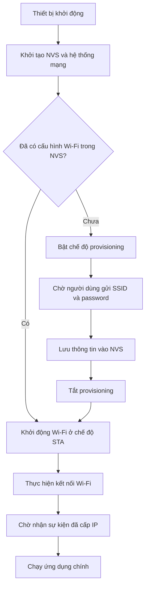

## Mục lục

- [Tổng quan](#1-tổng-quan)
- [Security models](#2-security-models)
- [SoftAP provisioning](#3-softap-provisioning)
- [Captive portal](#4-captive-portal)
- [BLE provisioning](#5-ble-provisioning)
- [Re-provisioning](#6-re-provisioning)

## 1. Tổng quan

Wi-Fi provisioning là quy trình cung cấp thông tin xác thực mạng (network credentials) bao gồm SSID và password cho thiết bị nhúng không có giao diện người dùng đầy đủ (headless device) để thiết bị có thể kết nối vào mạng WLAN và truy cập internet.

Đây là bước khởi tạo bắt buộc đối với hầu hết các thiết bị IoT trước khi chúng có thể kết nối với cloud server hoặc mạng cục bộ.

**Ví dụ thực tế:** Người dùng mua một thiết bị smart thermostat (bộ điều nhiệt thông minh). Ban đầu, thiết bị chưa được cấu hình, không có thông tin về mạng Wi-Fi tại nhà người dùng. Thiết bị không có bàn phím hay màn hình cảm ứng để nhập thông tin. Lúc này, người dùng sử dụng ứng dụng di động của nhà sản xuất để truyền thông tin mạng (ví dụ: SSID: `Home_WiFi`, Password: `12345678`) sang thiết bị. Kết quả: Thiết bị nhận thông tin, xác thực và kết nối thành công vào internet.

### 1.1. Các phương thức provisioning phổ biến

- **SoftAP provisioning**: Thiết bị đóng vai trò là Access Point và phát ra Wi-Fi riêng, điện thoại kết nối vào đó để thực hiện cấu hình.
- **BLE provisioning**: Sử dụng kết nối Bluetooth Low Energy để truyền thông tin Wi-Fi.
- **SmartConfig**: Sử dụng gói tin UDP broadcast mã hóa độ dài. Phương thức này ít được sử dụng do độ ổn định thấp với router 5GHz.

### 1.2. Luồng hoạt động chung

## 2. Security models

Trước khi triển khai giải pháp, cần hiểu các mối đe dọa bảo mật chính:

### 2.1. Các mối đe dọa

- **Passive sniffing**: Kẻ tấn công sử dụng thiết bị nghe lén để bắt gói tin BLE/Wi-Fi trong không khí nhằm lấy trộm SSID và password.
- **Man-in-the-Middle (MITM)**: Kẻ tấn công giả mạo thiết bị để lừa ứng dụng gửi password, hoặc giả mạo ứng dụng để lừa thiết bị kết nối vào mạng giả mạo.
- **Replay attack**: Kẻ tấn công ghi lại gói tin hợp lệ và phát lại sau đó để chiếm quyền điều khiển.

Để chống lại các mối đe dọa này, security model được xây dựng dựa trên ba yếu tố: Proof of Possession (PoP), key exchange (ECDH), và data encryption (AES).

### 2.2. Key exchange & data encryption

Thông tin provisioning không được truyền dưới dạng raw data. Thay vào đó, một kênh truyền mã hóa giữa điện thoại và thiết bị (secure session) được thiết lập.

Quy trình sử dụng thuật toán ECDH (Elliptic Curve Diffie-Hellman) để tạo ra shared secret key. Sau đó, sử dụng khóa này để mã hóa dữ liệu trước khi truyền tải SSID/Password.

### 2.3. Proof of Possession (PoP)

Để đảm bảo ứng dụng di động đang cấu hình đúng thiết bị mục tiêu và ngăn chặn giả mạo (MITM), thiết bị sở hữu một mã định danh bí mật là PoP string/PIN code được in trên nhãn thiết bị hoặc QR Code.

**Quy trình:** Ứng dụng di động yêu cầu người dùng nhập mã này hoặc quét QR. Dữ liệu này được sử dụng làm đầu vào cho quá trình bắt tay bảo mật. Nếu kẻ tấn công không có mã PoP, họ không thể giải mã gói tin provisioning.

### 2.4. Các cấp độ bảo mật

Bảng dưới đây tóm tắt các cấp độ bảo mật được ESP-IDF provisioning hỗ trợ:

| Level | Tên gọi | Mô tả | Khuyến nghị |
| :--- | :--- | :--- | :--- |
| **0** | No Security | - Gửi dữ liệu dạng plaintext, không mã hóa. - Dễ bị nghe lén và tấn công MITM. | - Chỉ sử dụng cho debug hoặc trong giai đoạn phát triển. - Tuyệt đối không sử dụng cho firmware sản phẩm thương mại. |
| **1** | PoP-based Security | - Trao đổi khóa dựa trên ECDH. - Sử dụng chuỗi PoP để xác thực quyền sở hữu. - Sử dụng shared key để mã hóa dữ liệu bằng AES-CTR. | Chuẩn công nghiệp. Cân bằng tốt nhất giữa bảo mật, hiệu năng và độ tương thích với ứng dụng di động. |
| **2** | SRP-based Security | - Sử dụng giao thức Secure Remote Password. - Không cần gửi mật khẩu qua mạng kể cả dạng mã hóa. - Sử dụng các tính toán toán học dựa trên Salt và Verifier để chứng minh cả hai bên đều biết mật khẩu mà không cần lộ mật khẩu. | Bảo mật cao nhưng tốn tài nguyên tính toán. Yêu cầu triển khai phía ứng dụng phức tạp hơn. |

## 3. SoftAP provisioning

Đây là phương thức kinh điển, hoạt động trên hầu hết các chip Wi-Fi kể cả chip cũ chỉ có Wi-Fi mà không có Bluetooth.

### 3.1. Nguyên lý hoạt động

Thiết bị nhúng hoạt động ở chế độ Access Point, tạo ra một mạng Wi-Fi cục bộ. Ứng dụng di động đóng vai trò là station kết nối trực tiếp vào mạng này để gửi dữ liệu cấu hình thông qua giao thức HTTP hoặc TCP/UDP socket.

### 3.2. Quy trình từng bước

**1. Device Initialization**

Khi thiết bị khởi động, nếu không tìm thấy cấu hình Wi-Fi trong NVS, thiết bị chuyển sang chế độ SoftAP. Thiết bị phát ra một Wi-Fi có tên định danh, ví dụ: `SmartPlug_A1B2`. Sau đó, khởi chạy DHCP server để cấp IP cho client và HTTP server hoặc socket server để lắng nghe request từ client.

**2. User Connection**

Người dùng mở cài đặt Wi-Fi trên điện thoại, ngắt kết nối khỏi Wi-Fi nhà, và kết nối thủ công vào Wi-Fi `SmartPlug_A1B2`.

Khi kết nối thành công, điện thoại và thiết bị sẽ nằm trong cùng một mạng LAN. Ví dụ:
- IP của ESP32 (gateway): `192.168.4.1`
- IP của ứng dụng di động: `192.168.4.3`

**3. Handshake**

Thực hiện bắt tay security handshake để thiết lập secret key.

**4. Payload Transfer**

- Người dùng mở ứng dụng di động, nhập SSID và password, sau đó bấm submit.
- Khi người dùng submit, ứng dụng di động sẽ gửi gói tin JSON chứa SSID và password đã được mã hóa qua HTTP POST.

**5. Validation**

Thiết bị thực hiện giải mã và lưu thông tin vào NVS. Sau đó, thiết bị chuyển sang chế độ station mode và thử kết nối tới router.

**6. Feedback**

Nếu kết nối thành công, thiết bị thông báo lại cho ứng dụng di động (nếu kết nối socket vẫn được duy trì) hoặc thông báo qua cloud.

Người dùng kết nối điện thoại lại vào Wi-Fi nhà để điều khiển thiết bị.

### 3.3. Đánh giá

**Ưu điểm**

- Hoạt động trên mọi chip Wi-Fi, không yêu cầu phần cứng Bluetooth.
- Phù hợp nếu cần truyền thêm dữ liệu lớn như OTA update, giao diện web cấu hình (captive portal) trong quá trình provisioning.

**Nhược điểm**

- Trải nghiệm người dùng kém: Người dùng phải thoát Wi-Fi nhà và kết nối vào Wi-Fi thiết bị.
- Vấn đề hệ điều hành (Android/iOS): Các hệ điều hành hiện đại thường tự động ngắt kết nối khỏi các Wi-Fi không có internet như SoftAP của thiết bị để chuyển sang 4G, làm gián đoạn quá trình provisioning.
- Latency: Quá trình chuyển đổi mode Wi-Fi mất thời gian.

## 4. Captive portal

Captive portal là mảnh ghép quan trọng trong phương thức SoftAP provisioning. Đây là kỹ thuật giúp điện thoại tự động mở một trang web đăng nhập/cấu hình ngay khi vừa kết nối vào Wi-Fi của thiết bị, mà không cần người dùng phải mở trình duyệt và nhập địa chỉ IP thủ công.

### 4.1. Khái niệm

Captive portal là một trang web được thiết kế để redirect mọi truy cập mạng của người dùng đến một trang cấu hình nội bộ ngay khi họ kết nối vào mạng Wi-Fi, buộc họ phải xem và tương tác với trang web này trước khi được cấp quyền truy cập internet.

**Ví dụ:** Wi-Fi ở sân bay, quán cafe, khách sạn. Khi kết nối vào Wi-Fi, một trang web hiện lên yêu cầu nhập số điện thoại hoặc đồng ý điều khoản.

### 4.2. Nguyên lý hoạt động

Làm sao thiết bị có thể buộc điện thoại hiển thị trang web của mình dù người dùng đang cố truy cập `google.com` hay `facebook.com`? Bí mật nằm ở DNS hijacking.

**Cơ chế hoạt động:**
- Khi thiết bị chạy chế độ SoftAP, nó chạy một DNS server cục bộ.
- Với mọi yêu cầu phân giải domain (DNS query) từ điện thoại (ví dụ: `https://www.facebook.com/`), thiết bị đều trả về cùng một địa chỉ IP của chính nó là `192.168.4.1`.
- Kết quả là trình duyệt điện thoại nghĩ rằng `facebook.com` chính là `192.168.4.1`. Nó gửi HTTP GET đến IP đó, và web server trên thiết bị sẽ trả về trang cấu hình.

**Cơ chế thăm dò tự động:**

Các hệ điều hành hiện đại có cơ chế thăm dò ngay khi kết nối Wi-Fi để tự động bật popup captive portal:

1. **Kết nối Wi-Fi**: Điện thoại nhận IP từ DHCP Server của thiết bị.

2. **Gửi gói tin thăm dò (Probe Request)**:
   - iOS: Gửi request đến `http://captive.apple.com/hotspot-detect.html`
   - Android: Gửi request đến `http://connectivitycheck.gstatic.com/generate_204`
   - Windows: Gửi request đến `http://www.msftncsi.com/ncsi.txt`

3. **Phân tích phản hồi**:
   - **Có internet**: Server trả về mã HTTP 204 No Content hoặc nội dung mong đợi (ví dụ: chữ "Success"). Hệ điều hành hiểu là có mạng, không làm gì cả.
   - **Captive portal**: Request trỏ về thiết bị nhúng. Thiết bị nhúng trả về HTTP 302 Redirect hoặc một trang HTML bất kỳ. Hệ điều hành hiểu là đang bị chặn, lập tức kích hoạt trình duyệt Captive Network Assistant (CNA) để hiển thị trang đó.

## 5. BLE Provisioning

Đây là phương thức hiện đại, được ưa chuộng nhất hiện nay cho các sản phẩm IoT cao cấp như các dòng chip ESP32, nRF7002, STM32WB.

BLE provisioning sử dụng BLE làm kênh điều khiển để truyền tải thông tin cấu hình Wi-Fi. Mô hình dựa trên kiến trúc GATT (Generic Attribute Profile).

### 5.1. Các khái niệm cốt lõi

Trước khi đi vào quy trình provisioning, cần nắm rõ kiến trúc GATT - cách BLE tổ chức và trao đổi dữ liệu.

Hãy tưởng tượng thiết bị là một cuốn thực đơn trong nhà hàng, và ứng dụng là khách hàng.

**Vai trò**

- **Device (Peripheral)**: Bên cung cấp dịch vụ. Nó quảng cáo sự hiện diện và chứa dữ liệu.
- **App (Central)**: Bên chủ động. Nó quét, kết nối và gửi yêu cầu đọc/ghi dữ liệu.

**Cấu trúc GATT**

Dữ liệu trong BLE được tổ chức theo tầng:
- **Profile**: Tập hợp các chức năng. Ví dụ: Profile đo nhịp tim, Profile provisioning.
- **Service**: Tương đương với một "trang" trong menu (ví dụ: trang món khai vị, trang đồ uống). Mỗi service được định danh bằng UUID (ví dụ: `0xFF00`).
- **Characteristic**: Tương đương với từng "món ăn" cụ thể trên trang đó. Đây là nơi chứa dữ liệu thực tế (SSID, Password). Mỗi Characteristic có UUID riêng.

**Các operation**

Ứng dụng tương tác với thiết bị qua các operation:
- **Write**: Ứng dụng gửi dữ liệu xuống thiết bị. Ví dụ: Gửi chuỗi `"Home_WiFi"` vào Characteristic SSID.
- **Read**: Ứng dụng lấy dữ liệu từ thiết bị. Ví dụ: Đọc trạng thái kết nối.
- **Notify**: Thiết bị chủ động báo lên ứng dụng khi có thay đổi. Ví dụ: "Đã kết nối thành công!". Đây là cơ chế quan trọng để tránh phải polling liên tục.

### 5.2. Thiết kế kiến trúc

Để thực hiện provisioning, cần định nghĩa một **custom service**.

Giả sử thiết kế một service có UUID là `0000FFFF-0000-1000-8000-00805F9B34FB`. Bên trong service này có các characteristic sau:

| Characteristic name | Quyền | Chức năng |
| ------------------- | ----- | --------- |
| SSID Char | Write | Nơi ứng dụng ghi tên Wi-Fi. |
| Password Char | Write (Encrypted) | Nơi ứng dụng ghi mật khẩu Wi-Fi. |
| Control Char | Write | Nơi ứng dụng gửi lệnh điều khiển. Ví dụ: `0x01` = Bắt đầu kết nối, `0x02` = Hủy. |
| Status Char | Read / Notify | Nơi thiết bị báo cáo kết quả. Ví dụ: `0x00` = Đang kết nối, `0x01` = Thành công, `0x02` = Sai password. |

### 5.3. Quy trình từng bước

**1. Advertising**

Khi thiết bị khởi động, nếu không tìm thấy thông tin Wi-Fi trong NVS, thiết bị bật BLE và bắt đầu phát gói tin quảng cáo (Advertising packet).

Nội dung gói tin: "Tôi là thiết bị SmartHome, tôi hỗ trợ service provisioning với UUID là FFFF".

**2. Scan & Connect**

Người dùng mở ứng dụng và ứng dụng tự động quét môi trường xung quanh. Khi phát hiện UUID của thiết bị, ứng dụng thực hiện kết nối BLE và gửi yêu cầu kết nối. Thiết bị chấp nhận kết nối và dừng quảng cáo.

:::warning Lưu ý
Người dùng không cần vào cài đặt Bluetooth để ghép đôi, ứng dụng sẽ xử lý tự động.
:::

**3. Discovery**

Ứng dụng thực hiện service discovery để tìm hiểu cấu trúc service và characteristic của thiết bị.

**4. Security Handshake**

Mặc dù kết nối BLE đã thiết lập, dữ liệu vẫn chưa an toàn.
- **App**: Gửi public key của ứng dụng xuống.
- **Device**: Tính toán và gửi public key của thiết bị lên.

Cả hai bên sử dụng thuật toán ECDH để tạo ra shared key. Từ đây, mọi dữ liệu SSID/Password sẽ được mã hóa bằng khóa này trước khi ghi vào Characteristic.

**5. Scan Wi-Fi (Optional)**

Ứng dụng có thể yêu cầu thiết bị quét các mạng Wi-Fi xung quanh và gửi danh sách về ứng dụng để người dùng chọn (thay vì phải nhập tên mạng thủ công).

**6. Provisioning**

Ứng dụng thực hiện:
- Mã hóa chuỗi SSID → Ghi vào SSID Char.
- Mã hóa chuỗi Password → Ghi vào Password Char.
- Ghi lệnh `START_CONNECT` vào Control Char.

**7. Execution & Feedback**

Thiết bị thực hiện:
- Nhận tín hiệu từ Control Char.
- Đọc dữ liệu từ SSID/Password Char, giải mã bằng shared key.
- Bật Wi-Fi station và thực hiện kết nối.
- Cập nhật trạng thái vào Status Char là "Connecting...".

**Tình huống A - Kết nối thành công:**
- **Device**: Cập nhật Status Char thành "Success". Gửi notify lên App.
- **App**: Nhận notify "Success" → Hiển thị "Đã cài đặt xong" → Ngắt kết nối BLE.

**Tình huống B - Sai mật khẩu:**
- **Device**: Wi-Fi báo lỗi sai password. Cập nhật Status Char thành "Wrong Password". Gửi notify.
- **App**: Nhận notify → Hiển thị popup "Sai mật khẩu, vui lòng nhập lại" ngay lập tức. (Đây là điểm mạnh của BLE so với SoftAP).

### 5.4. Đánh giá

**Ưu điểm**
- **Trải nghiệm người dùng tốt**: Người dùng không cần thao tác chuyển mạng thủ công. Mọi thứ diễn ra trong suốt trên ứng dụng.
- **Dễ dàng phát hiện lỗi**: Vì kết nối BLE độc lập với Wi-Fi, nếu thiết bị kết nối Wi-Fi thất bại, thiết bị có thể báo ngay lỗi về ứng dụng qua đường BLE để người dùng nhập lại.
- **Tiết kiệm năng lượng**: BLE tiêu thụ ít điện năng hơn SoftAP trong quá trình chờ cấu hình.

**Nhược điểm**
- **Chi phí phần cứng**: Yêu cầu vi điều khiển phải hỗ trợ cả Wi-Fi và BLE.
- **Phức tạp về firmware**: Phải duy trì cả stack Wi-Fi và Bluetooth, tốn tài nguyên RAM/Flash của vi điều khiển.
- **Tốc độ thấp**: Băng thông BLE thấp hơn Wi-Fi, không phù hợp nếu muốn truyền các cấu hình lớn như certificate file.

## 6. Re-provisioning

Trong vòng đời sản phẩm IoT, thiết bị thường xuyên gặp tình trạng mất kết nối mạng do thay đổi môi trường mạng. Các nguyên nhân phổ biến:
- Người dùng đổi tên Wi-Fi hoặc mật khẩu.
- Thay thế router mới (SSID cũ không còn tồn tại).
- Di chuyển thiết bị sang vị trí mới.

Trong các trường hợp này, thiết bị rơi vào trạng thái mồ côi (orphaned), tức là đang cố kết nối vào một mạng Wi-Fi không còn tồn tại hoặc có thông tin xác thực không đúng. Lúc này, cần có cơ chế để người dùng cập nhật thông tin mạng mới mà không yêu cầu factory reset hoàn toàn.

### 6.1. Các phương pháp re-provisioning

**1. Nút nhấn vật lý (Physical button)**

- **Hành vi**: Người dùng nhấn giữ button trong khoảng 5-10 giây.
- **Xử lý firmware**:
  1. Phát hiện sự kiện `LONG_PRESS`.
  2. Xóa thông tin Wi-Fi cũ trong Flash/NVS.
  3. Kích hoạt BLE hoặc SoftAP provisioning.
  4. Blink đèn LED để báo hiệu.

**2. Bật/tắt nguồn liên tục (Power cycle)**

Phù hợp cho bóng đèn thông minh hoặc thiết bị treo tường không có nút bấm.

- **Hành vi**: Người dùng bật - tắt công tắc nguồn 3 đến 5 lần liên tiếp.
- **Xử lý firmware**:
  1. Khi khởi động, ghi một biến đếm vào RTC Memory hoặc Flash.
  2. Nếu số lần khởi động tăng nhanh trong thời gian ngắn (< 2s) → Tăng biến đếm.
  3. Nếu biến đếm ≥ 5 → Thực hiện factory reset hoặc reset Wi-Fi.
  4. Blink đèn LED để báo hiệu đã vào chế độ provisioning.