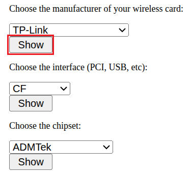
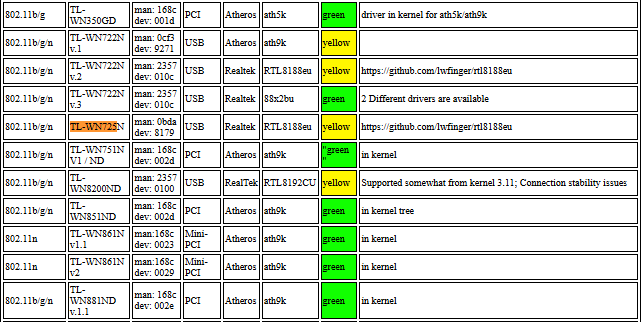

# Thêm driver USB WiFi vào Yocto

Với các board không có sẵn module wifi như Beaglebone Black hay Licheepi Nano thì việc dùng 1 usb wifi là rất tiện so với việc cắm dây Ethernet. Ở bài này ta dùng mẫu USB wifi từ TP-Link WN725 khá phổ biến ở các shop Việt Nam.

## 1. Xác định phần cứng

Trước khi viết bất cứ dòng code nào, ta cần phải biết con chip bên trong dongle là gì. Tên thương mại không đáng tin vì nhà sản xuất thường đổi chip mà vẫn giữ nguyên tên model.

### 1.1. Kiểm tra độ tương thích

Ta hoàn toàn có thể dùng 1 usb wifi khác sẵn có và thực hiện cách làm khá tương tự.

Để kiểm tra độ tương thích của usb wifi, ta vào trang web [Linux wireless LAN support](https://linux-wless.passys.nl/).

Chọn hãng của usb wifi rồi bấm show:



Search tên của usb wifi TL-WN725N:



Ở đây, màu vàng là mức giữa xếp từ thấp đến cao về độ tương thích: Xám – Vàng – Xanh lá. Vàng có nghĩa là có thể chạy luôn được nhưng cũng có thể phải cấu hình đôi chút.

### 1.2. Lấy USB ID

Cắm usb wifi vào máy Linux và chạy `lsusb`:

```bash
$ lsusb
Bus 001 Device 005: ID 0bda:8179 Realtek Semiconductor Corp. RTL8188EUS 802.11n Wireless Network Adapter
```

- `0bda`: vendor ID của Realtek
- `8179`: product ID của chip RTL8188EUS

Ở cột Comment trên trang [Linux wireless LAN support](https://linux-wless.passys.nl/), ta cũng thấy được link driver tương ứng là [lwfinger/rtl8188eu](https://github.com/lwfinger/rtl8188eu).

Đến đây, ta đã biết chip là RTL8188EU, USB ID `0bda:8179` và có link source driver. Câu hỏi tiếp theo: chỉ cần build driver này là xong chưa? Câu trả lời là chưa và phần 2 giải thích vì sao.

## 2. Kiến trúc tổng thể

Rất nhiều người đến đây sẽ bắt tay vào viết recipe luôn và build nhưng khi boot lên thì không thấy `wlan0` đâu cả. Lý do là driver chỉ là một trong bốn tầng cần phải hoạt động đúng.

```
+-------------------------------+
|                               |
|  Tầng 4: Userspace            |
|  wpa_supplicant, iw, udhcpc   |  Xác thực, lấy IP
|                               |
+-------------------------------+
|                               |
|  Tầng 3: Driver               |
|  8188eu.ko                    |  Bind vào USB ID 0bda:8179
|                               |
+-------------------------------+
|                               |
|  Tầng 2: Wireless core        |
|  cfg80211                     |  API driver <-> userspace
|                               |
+-------------------------------+
|                               |
|  Tầng 1: USB host             |
|  MUSB + PHY + host mode       |  Để board nhìn thấy dongle
|                               |
+-------------------------------+
```

## 3. Tầng 1: USB host

Mục tiêu của tầng này: khi cắm dongle vào thì `dmesg` phải in ra thông tin thiết bị. Chưa cần wifi gì cả, chỉ cần board nhận ra có một thiết bị USB là đủ.

### 3.1. Kernel config cho MUSB và PHY

**File:** `recipes-kernel/linux/licheepi-nano/defconfig`

| Symbol | Ý nghĩa |
|---|---|
| `CONFIG_USB=y` | Bật USB core.<br><br>Không có symbol này thì dòng `usbcore: registered new interface driver` sẽ không bao giờ xuất hiện trong `dmesg`. |
| `CONFIG_USB_ANNOUNCE_NEW_DEVICES=y` | In thông tin thiết bị mỗi khi có USB device được cắm vào.<br><br>Không bắt buộc, nhưng nên bật khi dev: đây là cách nhanh nhất để biết dongle đã enumerate hay chưa. |
| `CONFIG_USB_MUSB_HDRC=y` | Driver cho IP MUSB (Mentor Graphics Highspeed Dual Role Controller).<br><br>F1C100s dùng MUSB, không phải EHCI/OHCI. Bật nhầm `CONFIG_USB_EHCI_HCD` sẽ hoàn toàn không có tác dụng. |
| `CONFIG_USB_MUSB_HOST=y` | Chọn MUSB chạy ở chế độ host only.<br><br>Đi kèm với device tree `dr_mode = "host"` ở [mục 3.3](#33-giải-pháp). Nếu giữ `dr_mode = "otg"` thì phải đổi sang `CONFIG_USB_MUSB_DUAL_ROLE=y` kèm `CONFIG_USB_GADGET=y` vì nhánh `USB_DR_MODE_OTG` trong `sunxi.c` chỉ được biên dịch khi có `DUAL_ROLE`. |
| `CONFIG_USB_MUSB_SUNXI=y` | Glue layer nối MUSB core với SoC Allwinner.<br><br>Phần code riêng cho Allwinner: quản lý clock, reset và VBUS. |
| `CONFIG_NOP_USB_XCEIV=y` | Transceiver "rỗng" (no-operation).<br><br>Bắt buộc vì `USB_MUSB_SUNXI` khai báo `depends on NOP_USB_XCEIV` trong Kconfig. |
| `CONFIG_EXTCON=y` | Framework external connector.<br><br>Cả `PHY_SUN4I_USB` lẫn `USB_MUSB_SUNXI` đều `depends on EXTCON`. Đây chính là cơ chế để PHY báo cho MUSB biết trạng thái chân ID. |
| `CONFIG_GENERIC_PHY=y` | Framework PHY chung của kernel.<br><br>Được `PHY_SUN4I_USB` select. |
| `CONFIG_PHY_SUN4I_USB=y` | Driver USB PHY của Allwinner.<br><br>Tương ứng node `&usbphy` trong device tree. Thiếu nó thì MUSB probe fail vì không lấy được PHY. |

Bật các symbol trên, build kernel và boot, `dmesg` sẽ có:

```
musb-hdrc musb-hdrc.1.auto: MUSB HDRC host driver
musb-hdrc musb-hdrc.1.auto: new USB bus registered, assigned bus number 1
```

Controller đã lên. Nhưng cắm dongle vào thì vẫn không có gì xảy ra và đây là chỗ mất nhiều thời gian nhất.

### 3.2. Vì sao cắm dongle vào vẫn không nhận

LicheePi Nano chỉ có một cổng micro-USB và device tree mainline khai báo:

```dts
&usb_otg {
	dr_mode = "otg";
	status = "okay";
};

&usbphy {
	usb0_id_det-gpios = <&pio 4 2 GPIO_ACTIVE_HIGH>; /* PE2 */
	status = "okay";
};
```

`dr_mode = "otg"` nghĩa là vai trò host hay device do chân PE2 quyết định. Với cable micro-USB thông thường thì chân PE2 không được nối GND, dẫn tới chuỗi sự kiện:

```
Chân ID không nối GND
    -> PHY luôn báo peripheral
    -> MUSB đứng ở trạng thái b_idle
    -> không cấp VBUS
    -> dongle không bao giờ enumerate
```

Triệu chứng trên board:

```bash
root@licheepi-nano:~# cat /sys/devices/platform/soc/*.usb/musb-hdrc*/mode
b_idle

root@licheepi-nano:~# ls /sys/bus/usb/devices/
1-0:1.0  usb1          # chỉ có root hub, không có thiết bị nào
```

Trực giác đầu tiên là ghi vào sysfs, nhưng cách này không chạy:

```bash
echo host > /sys/devices/platform/soc/*.usb/musb-hdrc*/mode
```

Lệnh này không báo lỗi nhưng cũng không có tác dụng gì. Đọc `drivers/usb/musb/sunxi.c` sẽ rõ:

```c
static int sunxi_musb_set_mode(struct musb *musb, u8 mode)
{
	...
	glue->phy_mode = new_mode;
	set_bit(SUNXI_MUSB_FL_PHY_MODE_PEND, &glue->flags);
	schedule_work(&glue->work);      // chỉ đặt flag rồi hẹn work, trả về 0
	return 0;
}

static void sunxi_musb_work(struct work_struct *work)
{
	if (!test_bit(SUNXI_MUSB_FL_ENABLED, &glue->flags))
		return;                       // <- thoát ngay tại đây
	...
	if (test_and_clear_bit(SUNXI_MUSB_FL_PHY_MODE_PEND, &glue->flags))
		phy_set_mode(glue->phy, glue->phy_mode);
}
```

`FL_ENABLED` chỉ được set trong `sunxi_musb_enable()`, mà hàm đó chỉ chạy sau `musb_start()`. Ở trạng thái `b_idle` thì `musb_start()` chưa hề chạy, nên work thoát ở dòng đầu và `phy_set_mode()` không bao giờ được gọi.

Đây là một vòng luẩn quẩn: phải enabled mới đổi được mode, mà phải đổi mode mới enabled. Vì `set_mode()` trả về `0` nên shell không in ra lỗi nào, rất dễ tưởng là đã thành công.

Kết luận: phải đặt vai trò host ngay từ lúc probe $\rightarrow$ cần sửa device tree.

### 3.3. Giải pháp

Thêm patch sau vào recipe kernel:

```diff
--- a/arch/arm/boot/dts/allwinner/suniv-f1c100s-licheepi-nano.dts
+++ b/arch/arm/boot/dts/allwinner/suniv-f1c100s-licheepi-nano.dts
@@ -63,7 +63,7 @@
 };

 &usb_otg {
-	dr_mode = "otg";
+	dr_mode = "host";
 	status = "okay";
 };
```

```bitbake
FILESEXTRAPATHS:prepend := "${THISDIR}/licheepi-nano:"

SRC_URI = "\
    git://git.kernel.org/pub/scm/linux/kernel/git/stable/linux.git;protocol=https;branch=linux-6.6.y \
    file://defconfig \
    file://0001-ARM-dts-licheepi-nano-force-USB-host-mode.patch \
"
```

> **Traceoff:** cổng micro-USB không còn dùng làm USB device (gadget) được nữa, tức là mất `g_ether`, `g_serial`, mass storage.

Xong tầng 1, cắm dongle vào sẽ thấy `dmesg` in ra `New USB device found, idVendor=0bda, idProduct=8179`. Board đã nhìn thấy dongle, nhưng kernel chưa có API nào để một driver wifi nói chuyện với userspace. Đó là việc của tầng 2.

## 4. Tầng 2: Wireless core trong kernel

Tầng này không tạo ra thứ gì nhìn thấy được, nhưng thiếu nó thì tầng 3 không build nổi. Vẫn cùng file `defconfig` như tầng 1.

### 4.1. cfg80211

| Symbol | Ý nghĩa |
|---|---|
| `CONFIG_CFG80211=y` | API cấu hình wifi hiện đại của kernel. Thiếu cfg80211 là lỗi ngay lúc build. |
| `CONFIG_CFG80211_WEXT=y` | Lớp tương thích Wireless Extensions đời cũ.<br><br>Cho phép `iwconfig` và các tool cũ hoạt động. Không bắt buộc nếu bạn chỉ dùng `iw`. |

Không cần `CONFIG_MAC80211`. Đây là điểm rất hay nhầm và nhầm ở đây làm kernel phình thêm vài trăm KB vô ích. Có hai loại driver wifi:

| Loại | Đặc điểm |
|---|---|
| SoftMAC | Cần `mac80211`. Kernel lo phần MLME, tức là quét, associate, quản lý state machine 802.11.<br><br>Driver mainline `rtl8xxxu` thuộc loại này. |
| FullMAC | Chỉ cần `cfg80211`. Firmware/driver tự lo toàn bộ MLME.<br><br>Driver vendor `rtl8188eu` của lwfinger thuộc loại này. |

### 4.2. AF_PACKET

| Symbol | Ý nghĩa |
|---|---|
| `CONFIG_PACKET=y` | Bật socket `AF_PACKET`.<br><br>`wpa_supplicant` dùng `AF_PACKET` trong quá trình bắt tay 4 bước của WPA2. |

Đây là cái bẫy khó lần ra nhất trong toàn bộ bài, vì nó không gây lỗi build và không gây lỗi load driver. Mọi thứ trông như hoạt động bình thường: `wlan0` xuất hiện, `iw scan` thấy đầy đủ AP, nhưng `wpa_supplicant` sẽ không bao giờ associate thành công và chỉ lặp vô hạn thông báo timeout.

### 4.3. Kiểm tra defconfig trước khi build

Đến đây defconfig đã có đủ symbol của cả tầng 1 và tầng 2. Trước khi chạy `bitbake` mất hàng chục phút, hãy verify bằng `olddefconfig` chỉ mất vài giây:

```bash
cd <kernel-source>
mkdir -p /tmp/kbuild
cp <path>/defconfig /tmp/kbuild/.config
make ARCH=arm O=/tmp/kbuild olddefconfig

# Xem symbol nào được bật, symbol nào bị Kconfig loại vì thiếu phụ thuộc
grep -E "^CONFIG_(USB_MUSB_SUNXI|PHY_SUN4I_USB|CFG80211|PACKET)=" /tmp/kbuild/.config
```

Nếu một symbol ta đặt `=y` mà sau `olddefconfig` lại biến mất hoặc chuyển thành `is not set`, nghĩa là nó còn một `depends on` chưa được thoả mãn. Lúc này, ta cần quay lại đọc `Kconfig` của symbol.

Kernel đã có đủ hạ tầng. Giờ mới đến lượt build driver.

## 5. Tầng 3: Driver và bitbake recipe

Nhiệm vụ của recipe: clone source về, build thành driver và thêm driver vào image dưới dạng kernel module.

### 5.1. Cấu trúc thư mục

```
recipes-wifi
└── rtl8188eu
    └── rtl8188eu.bb
```

### 5.2. Nội dung recipe

```bitbake
SUMMARY = "Realtek RTL8188EU USB WiFi driver"
DESCRIPTION = "Realtek RTL8188EU USB WiFi driver"
SECTION = "kernel/modules"
LICENSE = "GPL-2.0-only"

LIC_FILES_CHKSUM = "file://COPYING;md5=d7810fab7487fb0aad327b76f1be7cd7"

SRC_URI = "git://github.com/lwfinger/rtl8188eu.git;branch=v5.2.2.4;protocol=https"
SRCREV = "f42fc9c45d2086c415dce70d3018031b54a7beef"

PV = "5.2.2.4+git"
S = "${WORKDIR}/git"

inherit module

COMPATIBLE_MACHINE = "licheepi-nano"

KERNEL_MODULE_AUTOLOAD += "8188eu"

do_install() {
    install -d ${D}${nonarch_base_libdir}/modules/${KERNEL_VERSION}/kernel/drivers/net/wireless
    install -m 0644 ${B}/8188eu.ko ${D}${nonarch_base_libdir}/modules/${KERNEL_VERSION}/kernel/drivers/net/wireless/
}
```

Giải thích từng dòng:

| Dòng | Ý nghĩa |
|---|---|
| `SUMMARY`<br>`DESCRIPTION` | Mô tả recipe, hiển thị trong `bitbake-layers show-recipes` và trong metadata của package. |
| `SECTION = "kernel/modules"` | Phân loại package. |
| `LICENSE = "GPL-2.0-only"` | License của source. |
| `LIC_FILES_CHKSUM` | Checksum MD5 của file license trong source.<br><br>Yocto bắt buộc phải có. Nếu upstream sửa file license, checksum lệch và build fail. Đây là cơ chế cố ý, buộc ta xem lại license mỗi khi nó thay đổi. |
| `SRC_URI` | Nơi lấy source.<br><br>`git://` kèm `protocol=https` là cú pháp bắt buộc từ Yocto 3.x, khi URL scheme và protocol được tách riêng.<br><br>Nên luôn ghi `branch=`. Thiếu nó bitbake cảnh báo *"does not set any branch parameter"*. |
| `SRCREV` | Pin đúng một commit cụ thể.<br><br>Không nên dùng `${AUTOREV}` vì build sẽ mất tính tái lập: hôm nay build ra một kết quả, ngày mai ra kết quả khác. |
| `PV = "5.2.2.4+git"` | Package version.<br><br>Tránh dùng `${SRCPV}`, biến này đã bị vô hiệu hoá trong scarthgap, `meta/conf/bitbake.conf` gán thẳng `SRCPV = ""`. Bitbake tự nối short SRCREV vào `PKGV`, nên version cuối cùng sẽ là `5.2.2.4+git0+f42fc9c45d`. |
| `S = "${WORKDIR}/git"` | Thư mục source sau khi unpack. |
| `inherit module` | Kéo class xử lý kernel module. Nó giúp:<br>- Tự động chèn cờ biên dịch phù hợp với kernel.<br>- Đảm bảo dùng đúng kernel headers trong quá trình build.<br>- Gắn module vào hệ thống Yocto. |
| `COMPATIBLE_MACHINE` | Chỉ cho phép build với machine được liệt kê. Machine khác sẽ bị skip để tránh sinh lỗi |
| `KERNEL_MODULE_AUTOLOAD` | Chỉ định rằng module `8188eu.ko` cần tự động được load khi hệ thống boot.<br><br> Điều này tạo file `/etc/modules-load.d/8188eu.conf`, giúp driver WiFi hoạt động ngay khi boot, không cần modprobe thủ công. |
| `do_install()` | Cài file `.ko` vào đúng vị trí trong rootfs.|

## 6. Tầng 4: Userspace

```bitbake
IMAGE_INSTALL:append = " rtl8188eu wpa-supplicant iw"
EXTRA_IMAGE_FEATURES ?= "debug-tweaks ssh-server-dropbear"
```

| Package | Ý nghĩa |
|---|---|
| `rtl8188eu` | Driver, cung cấp `8188eu.ko`. |
| `wpa-supplicant` | Daemon thực hiện bắt tay WPA/WPA2. Bắt buộc với mọi mạng có mật khẩu.<br><br>Cung cấp 3 binary:<br>- `wpa_supplicant`: daemon chính<br>- `wpa_passphrase`: sinh file config từ SSID và mật khẩu, có hash PSK<br>- `wpa_cli`: client điều khiển daemon lúc chạy: xem trạng thái, đổi mạng, quét |
| `iw` | Công cụ nl80211 để quét và xem thông tin interface.<br><br>`iw` không làm được xác thực WPA2, nên một mình nó không kết nối được mạng có mật khẩu. |
| `busybox` | Cung cấp `udhcpc`, là DHCP client dùng để xin IP sau khi associate xong.<br><br>Đã có sẵn trong image, không cần khai báo thêm. |
| `dropbear` | SSH server và client, gói chung trong một binary `dropbearmulti`.<br><br>Nhẹ hơn openssh rất nhiều nên hợp với board 32MB. Cài qua image feature `ssh-server-dropbear`, không phải qua `IMAGE_INSTALL`. |
| `openssh-sftp-server` | Được `packagegroup-core-ssh-dropbear` kéo vào tự động qua `RRECOMMENDS`.<br><br>Cần cho `scp` từ máy PC xuống board, vì OpenSSH đời mới dùng giao thức SFTP cho `scp`. |

Giờ build và kiểm tra xem từng tầng có thật sự chạy không.

## 7. Build và kiểm thử

### 7.1. Build và flash

```bash
bitbake core-image-minimal
sudo dd if=tmp/deploy/images/licheepi-nano/core-image-minimal-licheepi-nano.rootfs.wic of=/dev/sdX bs=1M status=progress conv=fsync
```

### 7.2. Kiểm tra USB host đã lên chưa

```bash
root@licheepi-nano:~# dmesg | grep -i musb
[    0.952164] musb-hdrc musb-hdrc.1.auto: MUSB HDRC host driver
[    0.958187] musb-hdrc musb-hdrc.1.auto: new USB bus registered, assigned bus number 1
```

Không có dòng nào nghĩa là thiếu symbol ở [mục 3.1](#31-kernel-config-cho-musb-và-phy).

Tiếp theo, dongle đã được nhận chưa:

```bash
root@licheepi-nano:~# dmesg | grep -i "new usb device"
[   27.217142] usb 1-1: New USB device found, idVendor=0bda, idProduct=8179, bcdDevice= 0.00
[   27.232669] usb 1-1: Product: 802.11n NIC
[   27.236762] usb 1-1: Manufacturer: Realtek

root@licheepi-nano:~# ls /sys/bus/usb/devices/
1-0:1.0  1-1  1-1:1.0  usb1
```

`1-1` chính là dongle. Nếu chỉ thấy `usb1` và `1-0:1.0` thì đó là root hub rỗng, dongle chưa enumerate, quay lại [mục 3.2](#32-vì-sao-cắm-dongle-vào-vẫn-không-nhận).

### 7.3. Module đã load chưa

```bash
root@licheepi-nano:~# lsmod | grep 8188
8188eu               1486848  0

root@licheepi-nano:~# dmesg | grep RTW
[   27.286161] RTW: rtl8188eu v5.2.2.4_25483.20171222
[   27.294390] RTW: Invalid Channel 114 of Band 1 in phy_GetChannelIndexOfTxPowerLimit
[   27.315400] RTW: unsupported channel: 114 at 5G
```

Module load được nghĩa là tầng 2 cũng ổn, vì nếu thiếu `CONFIG_CFG80211` thì driver đã không build nổi từ đầu.

:::tip Về các log `Invalid Channel ... at 5G`

Đây là noise vô hại, không phải lỗi. RTL8188EU là chip 2.4GHz-only, nhưng code `phydm` được dùng chung với các chip khác nên nó duyệt qua cả bảng TX power limit của băng tần 5G rồi log mỗi kênh không hợp lệ.

Muốn tắt bớt, thêm vào recipe:

```bitbake
EXTRA_OEMAKE += "CONFIG_RTW_DEBUG=n"
```
:::

### 7.4. Kiểm tra interface và tool

```bash
root@licheepi-nano:~# ls /sys/class/net
lo sit0 wlan0
```

Đã có interface `wlan0`.

```bash
root@licheepi-nano:~# iw wlan0 scan | grep SSID
command failed: Network is down (-100)
```

Interface vẫn ở trạng thái down, cần up nó lên rồi chạy lại scan:

```bash
root@licheepi-nano:~# ip link set wlan0 up
root@licheepi-nano:~# iw dev wlan0 scan | grep SSID
	SSID: <tên mạng của bạn>
```

Quét được AP nghĩa là cả bốn tầng đã thông.

## 8. Kết nối mạng

Quét thấy AP không có nghĩa là vào được mạng. `iw` chỉ nói chuyện với cfg80211 để quét, nó không làm được xác thực WPA2. Việc đó là của `wpa_supplicant`.

### 8.1. Kết nối thủ công

Làm thủ công trước để xác nhận cấu hình đúng, rồi mới tự động hoá ở mục sau.

```bash
wpa_passphrase "TenWifi" "matkhau" > /etc/wpa_supplicant.conf
wpa_supplicant -B -i wlan0 -c /etc/wpa_supplicant.conf -D nl80211
udhcpc -i wlan0
```

Kiểm tra kết quả:

```bash
wpa_cli -i wlan0 status      # mong đợi wpa_state=COMPLETED
ip addr show wlan0
ping -c 3 8.8.8.8
```

Nếu `wpa_supplicant` cứ timeout mãi mà không bao giờ `COMPLETED`, khả năng cao nhất là thiếu `CONFIG_PACKET` ở [mục 4.2](#42-af_packet).

### 8.2. Tự kết nối khi boot

Kết nối thủ công đã chạy, giờ làm cho nó tự động thì ta cần sửa file `/etc/network/interfaces` thành:

```
auto wlan0
iface wlan0 inet dhcp
	wpa-driver nl80211
	wpa-conf /etc/wpa_supplicant.conf
```

Sửa tay trên board sẽ mất khi flash lại. Để lưu vĩnh viễn, làm qua layer bằng một bbappend:

```
recipes-core/init-ifupdown/
├── init-ifupdown_%.bbappend
└── files/licheepi-nano/interfaces
```

```bitbake
# init-ifupdown_%.bbappend
FILESEXTRAPATHS:prepend := "${THISDIR}/files:"
```

Vì `interfaces` đặt trong thư mục con `licheepi-nano/` nên nó sẽ tự được chọn theo `MACHINE` mà không cần khai báo gì thêm. Yocto tìm file theo `FILESOVERRIDES`, trong đó có tên machine.

### 8.3. Kết nối SSH

Board đã có IP, giờ mới SSH vào được. Ta thêm image feature:

```bitbake
EXTRA_IMAGE_FEATURES ?= "debug-tweaks ssh-server-dropbear"
```

Từ laptop:

```bash
$ ssh root@<ip-cua-board>
# Enter khi được hỏi password
```

## 9. Tham khảo

**Tài liệu**

- [Linux wireless LAN support](https://linux-wless.passys.nl/): tra độ tương thích USB wifi
- [Yocto: Incorporating Out-of-Tree Modules](https://docs.yoctoproject.org/kernel-dev/common.html#incorporating-out-of-tree-modules)

**Source**

- [lwfinger/rtl8188eu](https://github.com/lwfinger/rtl8188eu): source driver

**File nên đọc khi debug**

| Tầng | File |
|---|---|
| 1 | `linux/drivers/usb/musb/sunxi.c`<br>`linux/drivers/phy/allwinner/phy-sun4i-usb.c` |
| 3 | `poky/meta/classes-recipe/module.bbclass`<br>`poky/meta/classes-recipe/module-base.bbclass`<br>`poky/meta/classes-recipe/kernel-module-split.bbclass` |
