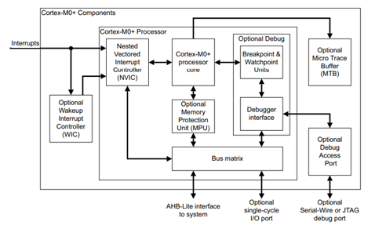
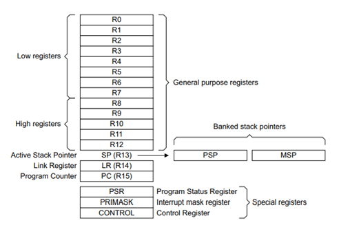
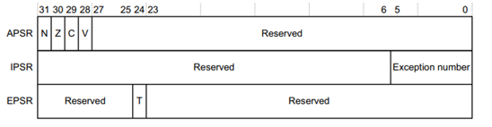

# Cortex Mx Overview

## Mở đầu

Bộ xử lý Cortex-M0+ là bộ xử lý ARM Cortex 32-bit cơ bản được thiết kế theo kiến trúc ARMv6-M cho các ứng dụng nhúng. Xây dựng theo kiến trúc von Neumann.

Bộ xử lý sử dụng Descending Stack, nghĩa là Stack Pointer chỉ item cuối cùng trong bộ nhớ ngăn xếp. Tức là khi bộ xử lý push một item mới vào stack, Stack Pointer giảm và sau đó ghi item vào vị trí mới.

Bộ xử lý thực hiện hai stack là: Main Stack và Process Stack.
- Chế độ Thread: Main Stack và Process Stack.
- Chế độ Handler: Main Stack.

## Core register

- `R0-R12`: là các thanh ghi 32 bit General Purpose Register cho các hoạt động xử lý, tính toán dữ liệu.
- `Stack Pointer - SP`: là thanh ghi R13. Ở chế độ Thread, bit[1] của thanh ghi Control quy định SP dùng để
  - 0 = Main Stack Pointer – MSP: Khi reset, giá trị của MSP được gán với giá trị của địa chỉ 0x00000000.
  - 1 = Process Stack Pointer – PSP.
- `Link Register - LR`: là thanh ghi R14, chứa địa chỉ trả về của các lệnh rẽ nhánh như call function. Khi reset, giá trị thanh ghi LR là Unknown.
- `Program Counter– PC`: là thanh ghi R15, chứa địa chỉ câu lệnh tiếp theo. Khi reset, giá trị của thanh ghi PC được gán với giá trị của Reset Vector, có địa chỉ 0x00000004. Bit[0] của giá trị này được gán vào bit T EPSR khi reset và phải là 1.
- `Program Status Register – PSR`: gồm
  - Application Program Status Register (APSR): chứa trạng thái hiện tại của các cờ điều kiện từ lệnh thực thi trước đó.
    - `N`:  Negative flag
    - `Z`: Zero flag
    - `C`: Carry or borrow flag
    - `V`: Overflow flag

  - Interrupt Program Status Register (IPSR): chứa exception number của ISR hiện tại.
    - 0 = Thread mode.
    - 1 = Reserved.
    - 2 = NMI.
    - 3 = HardFault.
    - 4-10 = Reserved.
    - 11 = SVCall.
    - 12, 13 = Reserved.
    - 14 = PendSV.
    - 15 = SysTick, if implemented.

  - Execution Program Status Register (EPSR): chứa bit trạng thái thumb, dùng để xác định tập lệnh mà bộ xử lý đang sử dụng.
    -	`T = 1`: Tập lệnh Thumb ISA
    - `T = 0`: Tập lệnh Arm ISA

  

- `CONTROL`: kiểm soát Stack được sử dụng và optional privilege level để thực thi phần mềm khi processor ở chế độ Thread Mode.

## Processor mode

Thread mode: Khi khởi động, vi xử lý đều bắt đầu ở Thread mode, ở chế độ này, code của chương trình được thực hiện tuần tự trong hàm `main`. Bất cứ khi nào xảy ra ngắt hay exception, vi xử lý sẽ chuyển sang chế độ handler mode. Ở chế độ này, thanh ghi SP được sử dụng có thể là MSP hoặc PSP (thường ứng dụng trong RTOS).

Handler mode: Bất cứ khi nào xảy ra ngắt hay exception, vi xử lý sẽ nhảy vào ISR (Interrupt Service Routine) tương ứng, tức là chuyển sang chế độ handler mode. Ở chế độ này, chỉ có MSP được phép sử dụng.

Để phân biệt 2 chế độ này, vi xử lý chỉ thị bằng 9 bit LSB của thanh ghi IPSR:
- IPSR = 0 thì vi xử lý hoạt động ở chế độ thread mode.
- IPSR khác 0 thì vi xử lý hoạt động ở chế độ handler mode.   

## Access level

**Unprivileged:** Hạn chế quyền truy cập vào các thanh ghi hệ thống và vùng nhớ được bảo vệ.
- Không thể truy cập các timer SysTick, NVIC hoặc SCB.
- Hạn chế truy cập vào memory hoặc peripherals.

=> Nếu cố gắng truy cập các thanh ghi và vùng nhớ này sẽ gây ra Hardfault.

**Privileged:** Có quyền truy cập vào tất cả các thanh ghi hệ thống và vùng nhớ.

Để phân biệt 2 chế độ này, vi xử lý chỉ thị bằng bit[0] của thanh ghi CONTROL.

- Mặc định, bit[0] = 0, chương trình chạy với chế độ PRIV. 
- Trong chế độ thread mode, chương trình có thể chuyển sang chế độ unprivileged bằng cách set bit[0] = 1. Nhưng không thể chuyển ngược lại từ unprivileged sang chế độ privileged.
- Việc chuyển từ unprivileged sang chế độ privileged chỉ có thể được thực hiện trong Handler Mode.
- Ở chế độ handler mode, chương trình luôn thực thi với privileged.