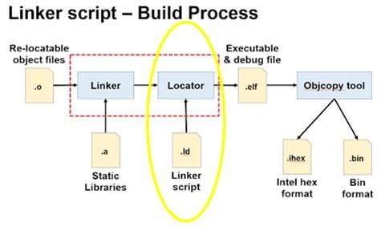

Build Process: Về cơ bản tương tự một chương trình C trên window tuy nhiên có một vài điểm khác biệt:
- Compiler không compile ra file ASM của máy tính nữa, mà ở đây là Cross Compiler.
- Các file object vẫn được link với thư viện tĩnh, nhưng cần trải qua một bước nữa đó là `Locator`, bước này dùng một file Linker Script để phân bố vùng nhớ cho vi điều khiển.
- File đích tạo ra không còn là `.exe` mà là các file như `.elf` (dùng để execute & debug), các file định dạng khác như `.hex`/`.bin` để nạp code.

Một Linker Script File (`.ld`) là một file text trong quá trình locator nhằm phân vùng địa chỉ trên vi điều khiển, do các vi điều khiển có vùng địa chỉ tuyệt đối trên flash, ram (không giống như máy tính).

Dữ liệu trong Data Section được lưu trên cả Flash và Ram để có đặc tính Non - Volatile của Flash (dữ liệu không bị mất khi reset) và được copy sang RAM sau khi reset, đặc tính Ramdom Access Memory của RAM để thay đổi dữ liệu.

Khi microcontroller được boot thì nó sẽ chạy startup code bên trong flash memory trước khi vào hàm main. Và startup code này sẽ khởi tạo các biến global => được lưu trữ trong cả flash memory và data section trong RAM.

Có hai loại bộ nhớ Flash và RAM:
Flash: Non volatile, not ramdom và được sử dụng để lưu trữ code.
RAM: volatile, ramdom access memory và được sử dung để lưu trữ data.