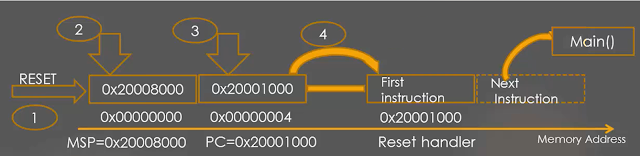

# Reset sequence

Khi reset, CPU sẽ thực hiện theo sequence sau:
- CPU sẽ đọc thanh ghi `SCB_VTOR` -> tìm bảng vector table nằm trên bộ nhớ. Đối với dòng arm, khi reset thì `SCB_VTOR = 0` -> CPU sẽ tìm đến địa chỉ `0x00000000`.
- Gán giá trị của địa chỉ này vào MSP để quy định vùng nhớ stack
- Tiếp theo, CPU lấy giá trị được đặt trong ô nhớ thứ 2 của Vector Table và gán vào PC để thực hiện hàm `Reset_Handler`
- Sau khi nhảy đến Reset Handler, CPU thực hiện các lệnh trong Reset Handler. Reset Handler được viết ở startup file như đã nói ở trên.
- Bước cuối cùng của Reset Handler là gọi đến hàm main.

