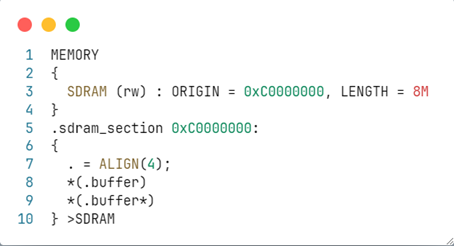

# Linker script

## Khái niệm cơ bản

Linker là một chương trình có tác dụng liên kết các file object (file `*.o`) và static library (file `*.a`) thành một file binary duy nhất và có thể thực thi được. Linker Script là một file chứa các mã giúp cho Linker biết được vùng nào của các file đầu vào (object file, library file) phải được liên kết như thế nào để tạo file binary thực thi. Ví dụ, khi khai báo một vùng nhớ trong linker Script đại diện cho một vùng nhớ trên bộ nhớ. Tại mã chương trình ứng dụng, nếu một biến được khai báo với thuộc tính vùng đó thì Linker sẽ biết được cần phải sắp xếp biến vào vùng nhớ nào trong file đầu ra (`.bin`/`.elf`).

Dưới đây là ví dụ về cấu trúc một đoạn linker script của STM32:

```asm
/* Specify the memory areas */
MEMORY
{
FLASH (rx)      : ORIGIN = 0x8000000, LENGTH = 512K
RAM (xrw)      : ORIGIN = 0x20000000, LENGTH = 128K
}
/* Define output sections */
SECTIONS
{
 /* The program code and other data goes into FLASH */
 .text :
 {
   *(.text)           /* .text sections (code) */
   *(.text*)          /* .text* sections (code) */
   . = ALIGN(4);
   _etext = .;        /* define a global symbols at end of code */
 } >FLASH
/* Constant data goes into FLASH */
 .rodata :
 {
   *(.rodata)         /* .rodata sections (constants, strings, etc.) */
   *(.rodata*)        /* .rodata* sections (constants, strings, etc.) */
   . = ALIGN(4);
 } >FLASH
 /* used by the startup to initialize data */
 _sidata = LOADADDR(.data);
 /* Initialized data sections goes into RAM, load LMA copy after code */
 .data :
 {
   _sdata = .;        /* create a global symbol at data start */
   *(.data)           /* .data sections */
   *(.data*)          /* .data* sections */
   . = ALIGN(4);
   _edata = .;        /* define a global symbol at data end */
 } >RAM AT> FLASH

 /* Uninitialized data section */
 . = ALIGN(4);
 .bss :
 {
   /* This is used by the startup in order to initialize the .bss section */
   _sbss = .;         /* define a global symbol at bss start */
   *(.bss)
   *(.bss*)
   *(COMMON)
   . = ALIGN(32);
   _ebss = .;         /* define a global symbol at bss end */
 } >RAM
 .ARM.attributes 0 : { *(.ARM.attributes) }
}
```

## Khai báo một vùng nhớ trong linker script

Để khai báo một vùng nhớ trong linker script, ta viết đoạn mã như sau:



Trong vùng `MEMORY`:
- `SDRAM`: tên đại diện cho bộ nhớ cần khai báo ví dụ như SDRAM đại diện cho bộ nhớ RAM ngoài trong trường hợp này.
- `rw`: Thể hiện các quyền hạn của vùng nhớ; r là đọc (read), w là ghi (write), x (execution) có nghĩa là có thể thực thi lệnh từ bộ nhớ. Ví dụ: xrw nghĩa là có thể đọc ghi và thực thi lệnh từ bộ nhớ đó ví dụ như SRAM nội.
- `ORIGIN`: địa chỉ base của bộ nhớ. Ví dụ như RAM nội là 0x20000000, bộ nhớ Flash nội là 0x08000000, bộ nhớ SDRAM là 0xC0000000
- `LENGTH`: không gian của bộ nhớ mà người dùng có thể sử dụng ví dụ 8M (bytes) như trường hợp trên.
 
Trong vùng `.sdram_section 0xC0000000`:
- `.sdram_section`: Tên vùng nhớ khai báo.
- `.` là location counter – nó theo dõi vị trí hiện tại trong bộ nhớ khi linker đặt các section.
- `0xC0000000`: Khai báo địa chỉ bắt đầu của vùng nhớ.
- `. = ALIGN(4)`: Khai báo về việc căn chỉnh sắp xếp bộ nhớ mà cụ thể ở đây là 4 byte; Việc hiệu chỉnh con số trong align sẽ ảnh hưởng đến tốc độ và dung lượng lưu trữ của vùng nhớ
- `*(.buffer)`: Tên các vùng nhớ dùng trong khai báo biến.
- `>SDRAM`: Vùng nhớ này được đưa vào bộ nhớ SDRAM khai báo ở trên
