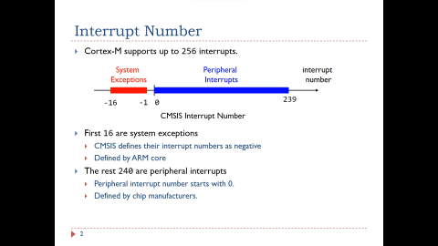
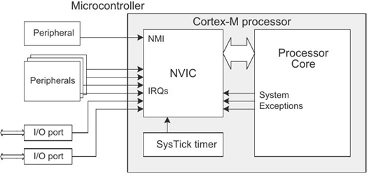
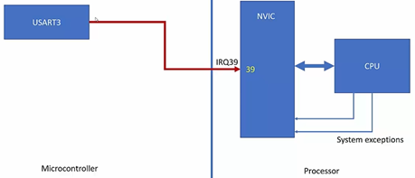
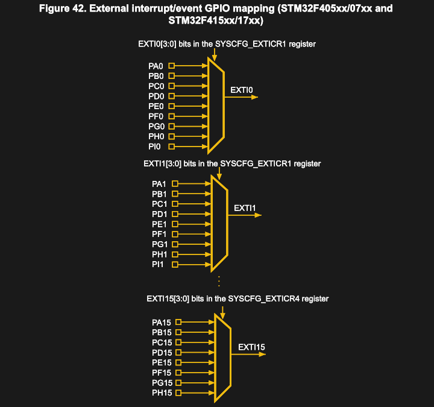

# Interrupt & Exception

## Khái niệm cơ bản

Một bộ vi điều khiển cortex M hỗ trợ tới 256 ngắt, trong đó có 15 ngắt **system exceptions** là các ngắt đến từ core.

CMSIS sử dụng giá trị âm cho các **system exceptions**. Các ngắt còn lại là các **ngắt ngoại vi hay peripheral interrupt** được bắt đầu bằng 0.



Kích hoạt system Exception khác với kích hoạt peripheral interrupt:
- Một số system exception như reset và hard fault luôn được kích hoạt. Một số system exception có thể được bật hoặc tắt bởi module tương ứng của chúng chẳng hạn như Systick timer.
- Bật/tắt tất cả các Peripheral Interrupt được thực hiện bằng cách sửa đổi hai bộ thanh ghi: thanh ghi `ISER` và thanh ghi `ICER`.
  - Thanh ghi Interrupt Set Enable Registers (ISER) được sử dụng để kích hoạt các peripheral interrupt. Ghi 1 vào một bit trong ISER để kích hoạt ngắt tương ứng. Tuy nhiên, ghi 0 vào một bit trong thanh ghi không vô hiệu hoá ngắt tương ứng.
  - Thanh ghi Interrupt Clear-Enable Registers (ICER) được sử dụng để vô hiệu hoá các peripheral interrupt. Ghi 1 vào một bit trong ICER sẽ vô hiệu hoá ngắt tương ứng. Ghi 0 vào một bit trong `ICER` không có tác động.

## Exception states

- **Pending:** Exception đang chờ bộ xử lý phục vụ, yêu cầu ngắt từ thiết bị ngoại vi hoặc từ phần mềm có thể thay đổi trạng thái của ngắt tương ứng để chờ xử lý.
- **Active:** Exception đang được bộ xử lý phục vụ nhưng chưa hoàn thành.
- **Inactive:** Exception không active và không pending.

## Exception type

**Reset**

Xảy ra khi bật nguồn hoặc warm reset. Đây là tín hiệu exception đặc biệt nhất, sẽ đưa hệ thống trở về trạng thái reset, và đưa processor trở về thread mode (các exception khác xảy ra đưa processor vào handler mode). Đây cũng là Exception có mức ưu tiên cao nhất (-3).

**NMI (NonMaskable Interrupt)**

Là tín hiệu exception được thiết kế đến từ các peripheral hoặc Software, có mức ưu tiên cao thứ hai (-2) chỉ sau Reset. Vì vậy, một số dòng vi điều khiển sẽ thiết kế để liên kết các ngoại vi gửi tín hiệu NMI đến Core, thường là một số ngoại vi liên quan đến Safety (Ví dụ Watchdog trong chip của TI, Toshiba, Low-Voltage Detection trong dòng FM3 của Cypress, FCCU của một số chip NXP).

**HardFault**

Exception được tạo ra khi có một số lỗi trong quá trình xử lý exception khác, hoặc các lỗi mà không có exception nào đảm nhiệm đều gây ra Hardfault. Ví dụ: Access thanh ghi ngoại vi mà chưa được cấp Clock, Stack Overflow,...HardFault có độ ưu tiên cố định cao thứ ba (-1).

**MemManage**

Exception xảy ra bởi một truy cập trái phép vào bộ nhớ. Ví dụ như truy cập vào vùng nhớ được MPU - Memory Protection Unit bảo vệ.

**BusFault**

Exception xảy ra khi có một lỗi xảy ra với transaction trên instruction bus hoặc data bus.

**UsageFault**

Exception xảy ra khi thực thi lệnh (undefined instruction, illegal unaligned access, invalid state on instruction execution, an error on exception return), hoặc các lỗi như phép chia cho số 0 (division by zero).

**SVCall (Supervisor Call)**

Exception được tạo ra bởi lệnh SVC. Trong môi trường OS, lệnh SVC cho phép application truy cập vào OS kernel và device tree.

**PendSV**

PendSV là một interrupt-driven request, sử dụng cho việc Context Switch trong môi trường OS.

**Systick**

Exception gây ra bởi bộ System Timer, bộ timer nội trong Processor khi nó đếm tràn về 0.

## NVIC

NVIC - Nested Vector Interrupt Controller, là bộ điều khiển vector ngắt lồng nhau, nó là một ngoại vi của Core Cortex Mx.

- Sử dụng bộ thanh ghi NVIC để Enable/Disable/Pend các ngắt khác nhau và đọc trạng thái các hoạt động & pending interrupts.
- Tên gọi "Nested" – Tức là các ngắt lồng nhau xảy ra, bộ xử lý sẽ tạm thời dừng việc thực thi interrupt handler có mức ưu tiên thấp hơn khi một interrupt handler có mức độ ưu tiên cao hơn xảy ra.
- Có thể cấu hình mức độ ưu tiên và phân nhóm ưu tiên.



**Cách hoạt động của NVIC**

- Khi có sự kiện ngắt xảy ra, ngoại vi sẽ kích hoạt một tín hiệu ngắt trên đường IRQ.
- NVIC sẽ đặt nó thành trạng thái pending. 
- Bộ NVIC sẽ lần lượt thực hiện các pending interrupts, tùy thuộc vào mức ưu tiên. 
- Khi đến lượt của một interrupt, NVIC sẽ gửi tín hiệu ngắt đến CPU. 
- CPU tiếp nhận tín hiệu ngắt từ NVIC nếu ngắt tới có mức độ ưu tiên cao hơn ISR đang hoạt động. 
- Khi ngắt tới được CPU chấp nhận, CPU sẽ lấy địa chỉ chương trình con phục vụ ngắt - ISR tương ứng với IRQ number từ bảng vector ngắt hay vector table. Sau đó thực thi ISR đó.



:::warning Điều kiện để CPU nhận được tín hiệu ngắt
Enable ngoại vi, Enable NVIC, Enable Core => interrupt mới được thực hiện.
:::

**Cách tính địa chỉ thanh ghi NVIC**

Để enable một ngắt cụ thể, ta cần biết IRQ number của nó và tính toán thanh ghi ISER tương ứng.

Ví dụ: Enable EXTI0 interrupt (IRQ6 trên STM32F1)

```c
#define EXTI0_IRQn  6

// Tính toán thanh ghi ISER và bit position
uint8_t iser_reg = EXTI0_IRQn / 32;  // = 0 (NVIC_ISER0)
uint8_t bit_pos  = EXTI0_IRQn % 32;  // = 6

// Enable interrupt
NVIC->ISER[iser_reg] = (1 << bit_pos);
```

Hoặc sử dụng CMSIS function

```c
NVIC_EnableIRQ(EXTI0_IRQn);
```

**Cấu hình Priority cho ngắt**

Mỗi ngắt có một trường priority 8-bit, nhưng không phải tất cả 8 bit đều được sử dụng. STM32F1 chỉ sử dụng 4 bit cao nhất (bit [7:4]):

```c
// Cấu hình priority cho EXTI0
// Priority value: 0 = highest, 15 = lowest (với 4 bits)
#define EXTI0_PRIORITY  5

// Cách 1: Truy cập trực tiếp thanh ghi IPR
NVIC->IP[EXTI0_IRQn] = (EXTI0_PRIORITY << 4);

// Cách 2: Sử dụng CMSIS function
NVIC_SetPriority(EXTI0_IRQn, EXTI0_PRIORITY);

// Đọc priority hiện tại
uint32_t current_priority = NVIC_GetPriority(EXTI0_IRQn);
```

**Kiểm tra trạng thái ngắt**

```c
// Kiểm tra xem ngắt có được enable không
uint32_t is_enabled = NVIC->ISER[EXTI0_IRQn / 32] & (1 << (EXTI0_IRQn % 32));

// Kiểm tra pending status
uint32_t is_pending = NVIC->ISPR[EXTI0_IRQn / 32] & (1 << (EXTI0_IRQn % 32));

// Kiểm tra active status
uint32_t is_active = NVIC->IABR[EXTI0_IRQn / 32] & (1 << (EXTI0_IRQn % 32));

// Set pending bit bằng software (trigger ngắt)
NVIC->ISPR[EXTI0_IRQn / 32] = (1 << (EXTI0_IRQn % 32));

// Clear pending bit
NVIC->ICPR[EXTI0_IRQn / 32] = (1 << (EXTI0_IRQn % 32));
```

**Lưu ý**

:::warning Một số điều cần lưu ý
- Giữ ISR ngắn gọn: Chỉ làm những việc cần thiết, xử lý phức tạp trong main loop.
- Sử dụng từ khóa `volatile`: Cho tất cả biến được truy cập từ cả ISR và main.
- Clear pending bit: Luôn clear pending bit ở cuối ISR.
- Cấu hình priority hợp lý: Ngắt quan trọng/thời gian thực có priority cao hơn.
- Tránh blocking operations: Không dùng delay, printf, malloc trong ISR.
- Kiểm tra pending bit: Trước khi xử lý, kiểm tra xem ngắt có thực sự xảy ra không.
:::

## Interrupt Priority

Mức độ ưu tiên - Priority được coi là mức độ khẩn cấp của ngắt, tức là quy định ngắt nào cần được thực hiện trước.

Giá trị mức độ ưu tiên – priority value là thước đo mức độ khẩn cấp của ngắt, còn gọi là mức độ ưu tiên – priority levels. 

Với Cortex M, giá trị ưu tiên này càng nhỏ thì mức độ ưu tiên càng lớn. Chẳng hạn, các Exception System đa số có mức ưu tiên nhỏ hơn 0 và được cố định (trong đó Reset Handler có priority value nhỏ nhất, tương đương với mức độ ưu tiên lớn nhất). 

Nếu hai ngắt xảy ra cùng lúc thì NVIC sẽ tiếp nhận thực thi ngắt có mức độ ưu tiên cao hơn (priority value thấp hơn), và đưa ngắt còn lại vào trạng thái chờ - Pending.


Ví dụ trên đây cho thấy 2 ngắt cùng xảy ra đó là ADC (Priority Value = 5) và Timer (Priority Value = 4). Vì vậy Timer Interrupt có mức độ ưu tiên cao hơn so với ADC Interrupt. Timer Interrupt sẽ được thực thi, trong khi đó ADC Interrupt sẽ được đưa vào hàng chờ Pending.

## Pre-empt Priority & Sub Priority

Câu hỏi đặt ra là điều gì sẽ xảy ra nếu hai ngắt có cùng một mức độ ưu tiên xảy ra cùng một lúc? Xung đột có thể xảy ra, vì vậy, cần có một mức độ ưu tiên phụ (Sub Priority) để giải quyết vấn đề này.

- Pre-Empt Priority: Khi bộ xử lý đang chạy một trình xử lý ngắt và một ngắt khác xảy ra, thì các giá trị ưu tiên trước – preempt priority sẽ được so sánh và ngắt với mức độ preempt priority cao hơn (giá trị nhỏ hơn) sẽ được cho phép chạy.
- Sub Priority: Giá trị này chỉ được sử dụng khi hai ngắt có cùng giá trị pre-empty priority xảy ra cùng thời điểm. Trong trường hợp này, ngắt có mức ưu tiên phụ cao hơn sẽ được xử lý trước.

## External Interrupt Controller

Bộ External Interrupt Controller (EXTI) có nhiệm vụ giám sát sự thay đổi mức điện áp trên các chân GPIO và tạo ra yêu cầu ngắt, sau đó chuyển yêu cầu này đến NVIC để CPU xử lý.

Bộ EXTI cung cấp 16 đường external interrupt từ EXTI0 đến EXTI15 dùng để kết hợp với các chân GPIO. Mỗi đường EXTI không gắn với một port cụ thể, mà được gắn với số thứ tự của chân (pin number).

Do vi điều khiển thường có nhiều hơn 16 chân GPIO, nên mỗi đường EXTI được trang bị một bộ ghép kênh (MUX) để lựa chọn một trong các chân GPIO có cùng số pin làm nguồn ngắt.

Ví dụ, đối với stm32, nguồn EXTI3 có thể nhận tín hiệu từ PA3, PB3, PC3, PD3,…



Do mỗi EXTI line chỉ có một đầu vào, nên không thể đồng thời sử dụng nhiều chân GPIO có cùng số pin làm nguồn ngắt.

Ví dụ, nếu PA3 đã được chọn làm nguồn cho EXTI3, thì PB3 hoặc PC3 không thể đồng thời được cấu hình làm nguồn cho EXTI3.

Việc lựa chọn chân GPIO nào được kết nối đến một đường EXTI cụ thể được thực hiện thông qua thanh ghi External Interrupt Configuration Register.

Ví dụ với STM32F1:

```c
#define AFIO_EXTICR1   (*(volatile unsigned int*)0x40010008)

/* EXTI0 source = PA0
 * EXTICR1[3:0] = 0000 → PA0
 */
AFIO_EXTICR1 &= ~(0xF << 0);
AFIO_EXTICR1 |=  (0x0 << 0);
```