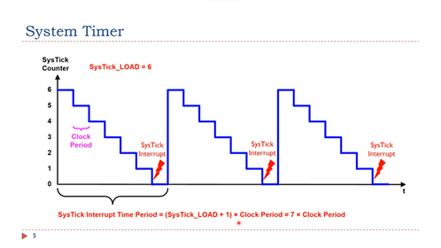
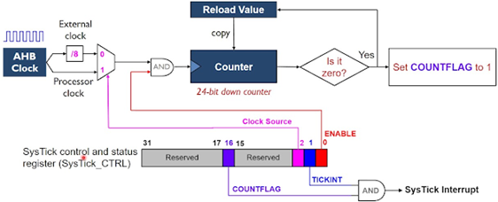

# Systick timer

Systick Timer là một timer đếm ngược 24 bit, nằm độc lập trong core. Xảy ra ngắt Systick khi giá trị thanh ghi counter về 0 và tự nạp lại giá trị được lưu trong reload value register.

SysTick Timer bao gồm:
- Một bộ đếm counter để đếm xuống.
- Một thanh ghi chứa giá trị nạp lại.
- Một cờ báo tràn Timer.
- Một bộ phận để cấu hình xung clock đầu vào.

System Timer hay SysTick được điều khiển bởi 4 thanh ghi bao gồm:
- Thanh ghi SysTick Control and Status Register(SYST_CSR): Chỉ có 4 bit được sử dụng
  - `COUNTFLAG`: bit status
    - Khi thanh ghi counter xuống 0 => `COUNTFLAG` đặt thành 1.
  - `CLKSOURCE`: bit chọn nguồn cấp clock cho systick timer
    - `CLKSOURCE = 1`: Chọn processor clock
    - `CLKSOURCE = 0`: Chọn external clock
  - `TICKINT`: bit bật ngắt
  - `ENABLE`: bit bật counter.
- Thanh ghi SysTick Reload Value (SYST_RVR): Thanh ghi này chứa giá trị reload để bắt đầu đếm, chỉ sử dụng 24 bit thấp. Khi counter về 0 thì giá trị trong thanh ghi này sẽ được tự động nạp vào thanh ghi SYST_CVR.
- Thanh ghi SysTick Current Value (SYST_CVR): Thanh ghi này lưu giá trị hiện tại của counter, bắt đầu từ giá trị trong thanh ghi SYST_RVR và đếm ngược về 0.
- Thanh ghi SysTick Calibration Value(SYST_CALIB): Thanh ghi này dùng để hiệu chỉnh systick timer.

::: tip
Khoảng thời gian giữa hai lần ngắt SysTick là:
Interval = (RELOAD + 1) * Source_Clock_Period.

Ví dụ: Nếu giữa hai lần ngắt SysTick là 100 chu kỳ clock thì reload value sẽ là 99.
:::

::: warning Chú ý
- Thanh ghi SYST_CVR có một giá trị ngẫu nhiên khi reset => Phải luôn xóa về 0 trước khi enable.
- Thanh ghi SYST_CALIB là thanh ghi only – read.
:::