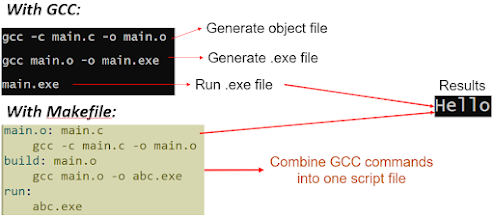
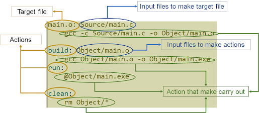

# Giới thiệu tổng quan về Makefile

## Khái niệm cơ bản

Makefile là một dạng script file chứa các thông tin:
- Project Structure (File, Dependencies).
- Các lệnh để tạo files (Object files, elf/bin/hex files, ...).
- Lệnh make để đọc nội dung makefile, hiểu cấu trúc project, và thực thi các lệnh.

::: tip
Để học Makefile thì cần có kiến thức về GCC và command line.
:::

Ví dụ **Helloworld**:

```c
#include <stdio.h>

void main()
{
    printf("Hello world\r\n");
}
```

Công việc cần làm:

```
main.c -> main.o -> main.exe
```

Nếu sử dụng GCC, một cách đơn giản là tuân thủ 3 bước: Tạo object file, sau đó tạo file `.exe`, rồi chạy file `.exe` này. Tuy nhiên, nếu project lớn, nhiều file, cần sửa đổi nhiều, thì sẽ phải chạy đi chạy lại các lệnh như vậy nhiều lần => dùng Makefile.



Để chạy makefile trên, ta có thể mở cmd lên, `cd` đến thư mục chứa makefile, và chạy lệnh make (lệnh này sẽ chạy cả 3 dòng màu xanh `main.o`, `build`, `run`) => Kết quả sẽ là "Hello".

Hoặc có thể chạy riêng từng dòng (từng option): `make main.o`, `make build`, `make run`

Mỗi option và câu lệnh tương ứng như vậy gọi là một **Rule**.

:::tip
Trên thực tế makefile còn rất nhiều công dụng, makefile cung cấp một số function để có thể tổng quát hóa makefile khi triển khai một project lớn. Ngoài ra, nó còn cung cấp khả năng hiểu project, tạo các file dependency để khi có một sự thay đổi nhỏ trong project, thì chúng ta chỉ cần build lại những file bị thay đổi, từ đó giúp giảm thời gian compile của toàn chương trình.
:::

## Cấu trúc một Rule đơn giản trong Makefile


- target: Action hoặc file mà make tạo ra.
- prerequisites: File mà target phụ thuộc hay còn gọi là dependence.
- recipe: Lệnh shell để tạo target từ prerequisites.

Ví dụ:



## Dependency-based build system

Make là một công cụ xây dựng dependency, và hoạt động theo nguyên tắc: **Một target chỉ được build lại nếu ít nhất một trong các dependency của nó mới hơn target đó.**

Khi Make chạy, nó sẽ:
- Kiểm tra tồn tại của target (file đầu ra).
- Nếu không tồn tại, Make chạy command để build.
- Nếu tồn tại, nó so sánh thời gian sửa đổi (timestamp) giữa target và các dependency.
- Nếu bất kỳ dependency nào mới hơn, Make cho rằng target đã cũ → rebuild.
- Nếu không có gì mới hơn → Make bỏ qua, không làm lại.

Có thể sử dụng đặc tính này để chỉ biên dịch những file source thay đổi. Ví dụ:

```bash
SRC := main.c uart.c
OBJ := $(SRC:.c=.o)

%.o: %.c
	$(CC) -c $< -o $@

app.elf: $(OBJ)
	$(CC) $^ -o $@
```

=> Make sẽ chỉ build `uart.o` nếu `uart.c` (hoặc dependency liên quan như `uart.h`) bị thay đổi.

**Nhưng làm sao để biết .h có thay đổi?**

Ta cần tạo dependency file (`.d`) để Make biết `.o` phụ thuộc vào `.h`. Ví dụ:

```bash
SRC := main.c uart.c
OBJ := $(SRC:.c=.o)

%.o: %.c
	$(CC) -MMD -MP -c $< -o $@

app.elf: $(OBJ)
	$(CC) $^ -o $@

-include $(OBJ:.o=.d)
```

Với Makefile này:
- Nếu `main.c`, `uart.c` hoặc bất kỳ `.h` mà chúng `#include` bị thay đổi, make sẽ chỉ biên dịch lại những file đó.
- Những file không thay đổi thì make bỏ qua.