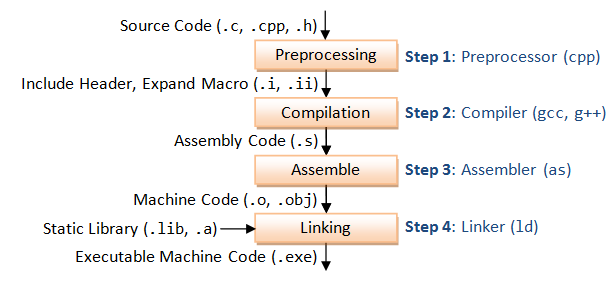
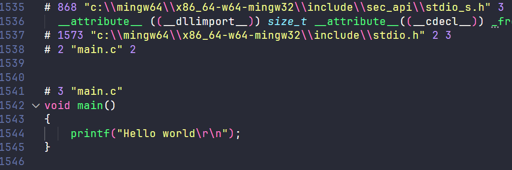

## Build process

Build Process là một quá trình xử lý với đầu vào là các file source code (`.c`, `.cpp`, `.h`, `.s`, ...) và đầu ra là các file nhị phân để xử dụng (`.exe`, `.elf`, `.hex`, `.bin`, ...).

Build Process trong một chương trình C sẽ trải qua các bước sau:



Sử dụng gcc command để giải quyết các công việc trong process trên.

Ví dụ, ta có một file source code `main.c` đơn giản như sau:

```c
#include <stdio.h>

void main()
{
    printf("Hello world\r\n");
}
```

## Preprocessor

Step này sẽ gộp các file source với file thư viện tương ứng (ở đây là `stdio.h`), cùng với đó là xử lý các chỉ thị tiền xử lý, ở đây là `#define`.

Câu lệnh:

```bash
gcc -E main.c -o main.i
```

Output của step này là **extended file** - `main.i` như sau:



File này rất nhiều nội dung, chủ yếu là nội dung của thư viện `stdio.h`. Cái chúng ta quan tâm là phần dưới cùng của file, phần tiền xử lý `#define` đã được thay thế.

## Compilation

Quá trình này sẽ biến file `main.i` trên thành file mã máy - assembly.

Câu lệnh:

```bash
gcc -S main.i -o main.s
```

Output là file main.s như này, các bạn có kiến thức về ngôn ngữ assembly thì có thể đọc hiểu được:

```asm
	.file	"main.c"
	.text
	.def	__main;	.scl	2;	.type	32;	.endef
	.section .rdata,"dr"
.LC0:
	.ascii "Hello world\15\0"
	.text
	.globl	main
	.def	main;	.scl	2;	.type	32;	.endef
	.seh_proc	main
main:
	pushq	%rbp
	.seh_pushreg	%rbp
	movq	%rsp, %rbp
	.seh_setframe	%rbp, 0
	subq	$32, %rsp
	.seh_stackalloc	32
	.seh_endprologue
	call	__main
	leaq	.LC0(%rip), %rax
	movq	%rax, %rcx
	call	puts
	nop
	addq	$32, %rsp
	popq	%rbp
	ret
	.seh_endproc
	.ident	"GCC: (MinGW-W64 x86_64-ucrt-posix-seh, built by Brecht Sanders) 12.2.0"
	.def	puts;	.scl	2;	.type	32;	.endef
```

## Assembler

Step này sử dụng trình assembler thay thì compiler, nó gộp các file `.s` vừa tạo với các file `.s` có sẵn (nếu có) tạo thành các file object.

Câu lệnh:

```bash
as main.s -o main.o
```

Output là file `main.o`, với nội dung ở định dạng binary.

## Linking

Sau khi có các file object, ta sẽ được link cùng với các static library (nếu có).

Câu lệnh:

```bash
gcc -v -o main main.o
```

Output của quá trình này là file `main.exe` dùng để run. Bây giờ chỉ cần gõ main, hoặc `main.exe` + Enter là chương trình sẽ chạy ra kết quả.