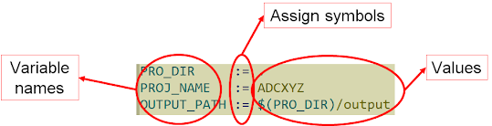
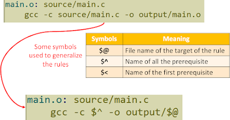

## Khái niệm cơ bản

Một makefile có thể dùng để quản lý một project lớn, có thể bao gồm các folders: source files, header files, object files, output files,...Các folder này có thể cố định, nhưng không điều gì đảm bảo các file source trong đó không thay đổi.

-> Vì vậy, cần tổng quát hóa makefile qua các folders thay vì các files đơn lẻ. 

-> Người ta sử dụng Variable để tổng quát hóa Makefile, tránh sử dụng những tên file cụ thể.

Ví dụ về variable, nó khai báo khá giống như biến trong C, nhưng không có kiểu dữ liệu:



Để truy xuất đến giá trị của một variable, ta sử dụng cú pháp `${VAR_NAME}`:


## Variable assignment

Trong Makefile, phép gán biến hay variable assignment không chỉ có một kiểu như trong C/C++ mà có nhiều toán tử gán khác nhau, mỗi loại có thời điểm mở rộng (expansion time) và hành vi khác nhau. Đây là điểm rất hay gây nhầm lẫn.

### Recursive assignment

- Biến này được định nghĩa bằng cách sử dụng toán từ `=`.
- Giá trị của biến không được expand tại thời điểm gán.
- Chỉ expand mỗi khi biến được sử dụng.
- Việc expand có thể diễn ra nhiều lần.
- Biến phụ thuộc thay đổi, kết quả có thể thay đổi theo.

Ví dụ:

```bash
CC = gcc
CFLAGS = -O2
CMD = $(CC) $(CFLAGS)

CFLAGS = -g
```

-> `CMD` sẽ thành `gcc -g`, chứ không phải `gcc -O2`.

:::warning Chú ý
Biến có thể vòng lặp vô tận, ví dụ như sau:

```bash
A = $(B)
B = $(A)
```
:::

### Simple Assignment

- Biến này được định nghĩa bằng cách sử dụng toán tử `:=`.
- Giá trị của biến được expand ngay tại thời điểm gán.
- Không bị ảnh hưởng bởi thay đổi sau này.

Ví dụ:

```bash
CC = gcc
CFLAGS = -O2
CMD = $(CC) $(CFLAGS)

CFLAGS = -g
```

-> `CMD` vẫn là `gcc -O2`

### Append assignment

- Biến này được định nghĩa bằng cách sử dụng toán tử `+=`.
- Nối thêm giá trị mới vào biến hiện có, mà không ghi đè giá trị cũ.
- Cách nối phụ thuộc vào kiểu biến gốc (`=` hay `:=`)

**Cách Make xử lý**

```bash
CFLAGS += -Wall
```

Make kiểm tra:
- CFLAGS đã tồn tại chưa?
- Nếu có:
  - Là recursive → nối theo kiểu recursive
  - Là simple → nối theo kiểu immediate
Nếu chưa → tạo mới (recursive)

### Conditional assignment

- Biến này được định nghĩa bằng cách sử dụng toán tử `?=`.
- Chỉ gán giá trị nếu biến chưa tồn tại.
- Nếu đã tồn tại → bỏ qua hoàn toàn.

:::tip “Đã tồn tại” nghĩa là:
- Đã được gán trong Makefile
- Hoặc đến từ command line
- Hoặc đến từ environment
:::

## Automatic variables

Automatic Variables là các biến đặc biệt đại diện cho mà make tự gán giá trị đúng trong rule như target, prerequisites hay file nguồn đang được xử lý.

=> Giúp viết makefile ngắn gọn, tổng quát và không cần hardcode tên file.

| Symbol | Meaning |
| ------ | ------- |
| `$@`	 | Biểu thị cho tên của targe thuộc rule |
| `$^`	 | Biểu thị cho tất cả các prerequisites |
| `$+`	 | Giống $^ nhưng giữ lại thứ tự và phần tử trùng lặp |
| `$<`	 | Biểu thị cho tên của prerequisites đầu tiên |

Ví dụ:



## Variable VPATH

Biến `VPATH` được dùng để chỉ định danh sách các thư mục mà make sẽ tìm kiếm nếu không tìm thấy file nằm trong thư mục hiện tại.

`VPATH` được dùng cho mọi file nếu không được tìm thấy trong thư mục hiện tại.

Cú pháp:

```bash
VPATH = dir1:dir2:dir3
```

Ví dụ: Giả sử file `foo.c` không tồn tại trong folder hiện tại nhưng được tìm thấy trong folder `src`

```bash
VPATH = src

foo.o: foo.c
	$(CC) -c $< -o $@
```

=> Dù `foo.c` nằm trong thư mục src, ta chỉ cần ghi `foo.c` mà không cần `src/foo.c`, vì make sẽ tìm trong `VPATH`.

## Pattern rules

Trong Makefile, Pattern rules là cơ chế cho phép định nghĩa một quy tắc tổng quát để make có thể tự suy luận cách tạo ra target từ prerequisite dựa trên mẫu tên file, thay vì phải viết từng rule cụ thể cho mỗi file.

Nói ngắn gọn:

**Pattern Rules là một tính năng mạnh mẽ giúp viết makefile ngắn gọn và linh hoạt, bằng cách trừu tượng hoá quy tắc build cho nhiều file có cấu trúc tương tự**.

Giả sử có nhiều file `.c` cần biên dịch thành `.o`:

```bash
main.o: main.c
	gcc -c main.c

uart.o: uart.c
	gcc -c uart.c

spi.o: spi.c
	gcc -c spi.c
```

Các rule này giống nhau hoàn toàn, chỉ khác tên file → dư thừa.

Pattern rule dùng ký hiệu `%` để đại diện cho phần thay đổi trong tên file.

Ví dụ cơ bản:

```bash
%.o: %.c
	gcc -c $< -o $@
```

Ý nghĩa:
- `%.o` : target dạng bất kỳ kết thúc bằng `.o`
- `%.c` : prerequisite tương ứng có cùng tên, kết thúc bằng `.c`

Khi make thấy cần `main.o`, nó sẽ:
- So khớp `%` = `main`
- Suy ra cần `main.c`
- Thực thi lệnh compile