## Khái niệm cơ bản

Giống như công việc thường ngày của chúng ta, vi điều khiển thực thi những nhiệm vụ riêng của nó, trong RTOS, các công việc đó gọi là task. Như vậy, đối với vi điều khiển, task là một tập hợp các câu lệnh, được lưu trong bộ nhớ vi điều khiển, để thực hiện một nhiệm vụ nào đó.

Giả sử có 3 task:
- Task 1: Nháy LED với chu kỳ 1s.
- Task 2: Đọc giá trị cảm biến và cảnh báo khi cần.
- Task 3: Đọc nút bấm để thay đổi chu kỳ nháy led.

Với chương trình bình thường, ta chạy lần lượt các task trong một vòng `while(1)` được gọi là Super Loop, và có thể dùng ngắt khi cần.

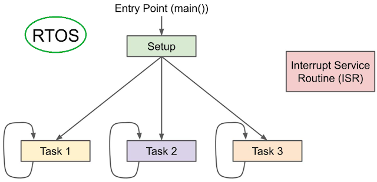

Còn đối với RTOS, các task này sẽ cần được thực hiện gần như "song song". Vì vậy, mỗi task cần có một "chương trình riêng", ở đây là một function để thực hiện chức năng của chúng. Việc thực hiện đa task trên cùng một chương trình vi điều khiển gọi là multi-task.

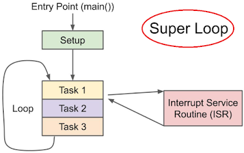

:::warning Kết luận
Task là một hàm thực thi một công việc và nó có phần khởi tạo và loop riêng bên trong nó.
:::

Mỗi task được cấp phát bộ nhớ ở phân vùng heap trong memory và chia làm hai phần:
- Task Control blocked hay TCB: đây là nơi lưu thông tin và context của một task như: tên task, mức ưu tiên, context của stack,...
- Stack: Một stack riêng của từng stack và sử dụng một con trỏ ngăn xếp là PSP.

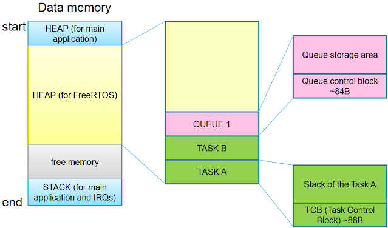

## Tạo và xoá task

### Task trong FreeRTOS

Trong FreeRTOS, một task là một hàm có prototype như sau:

```c
void ATaskFunction( void *pvParameters )
```

Điều quan trọng cần lưu ý là:
- Hàm này không có giá trị trả về.
- Cùng một hàm có thể được sử dụng để tạo ra nhiều task, nói cách khác, nhiều task có thể chạy cùng một hàm. Tuy nhiên, sẽ có sự khác biệt như sau:
  - Mỗi task có stack riêng
    - Các biến cục bộ của task A được lưu trên stack của task A và các biến cục bộ của task B được lưu trên stack của task B.
    - Các biến cục bộ cho các task khác nhau có bản sao riêng của nó.
  - Tham số `pvParameters` truyền vào mỗi task.
- Nếu hàm có sử dụng biến toàn cục hoặc biến static thì cần phải tránh race condition xảy ra.

Đây là một ví dụ:

```c
void ATaskFunction( void *pvParameters )
{
    int32_t lVariableExample = 0;

    for( ;; )
    {
        /* Do something */
    }

    /* Nếu thoát khỏi vòng lặp, sử dụng vTaskDelete để xoá chính nó.
     * NULL: cho biết xoá chính nó.
     */
    vTaskDelete( NULL );
    
    /* Đến đây, chương trình sẽ không thực thi. Nếu thực thi thì sẽ có lỗi. */
}
```

### Tạo task

Các hàm được sử dụng để tạo task như sau:

```c
BaseType_t xTaskCreate( TaskFunction_t pxTaskCode,
                        const char * const pcName,
                        const configSTACK_DEPTH_TYPE usStackDepth,
                        void * const pvParameters,
                        UBaseType_t uxPriority,
                        TaskHandle_t * const pxCreatedTask );
```

Mô tả tham số:

| Tham số | Mô tả |
| ------- | ----- |
| `pxTaskCode` | Con trỏ hàm |
| `pcName` | Tên của task, được dùng để debug. <br> Độ dài tối đa là: `configMAX_TASK_NAME_LEN`. |
| `usStackDepth` | Mỗi task có stack riêng và kích thước của stack được chỉ định theo tham số này. <br> Đơn vị là word (4 byte), ví dụ truyền vào 100 có nghĩa là kích thước stack là 100 word, tương ứng với 100 byte. <br> Giá trị tối đa là giá trị tối đa của kiểu dữ liệu `uint16_t`. |
| `pvParameters` | Con trỏ tới tham số cần truyền vào task khi được gọi. |
| `uxPriority` | Độ ưu tiên, giá trị càng nhỏ thì độ ưu tiên càng thấp. <br> Phạm vị: 0 đến `configMAX_PRIORITIES – 1`. <br> Nếu giá trị truyền vào quá lớn, `xTaskCreate` sẽ tự điều chỉnh thành `(configMAX_PRIORITIES – 1)`. |
| `pxCreatedTask` | Tham số này lưu kết quả của hàm `xTaskCreate` hay còn gọi là task handle. <br> Ta có thể thông qua task handle này để thao tác với task, chẳng hạn như thay độ ưu tiên. <br> Truyền NULl nếu không muốn sử dụng tham số này. |
| Giá trị trả về | Thành công: `pdPass`. <br> Thất bại: `errCOULD_NOT_ALLOCATE_REQUIRED_MEMORY` (Không đủ bộ nhớ). |

Quá trình hoạt động của hàm `xTaskCreate`:
- Cấp phát TCB và stack, cấp phát cái nào trước tuỳ thuộc vào kiến trúc **stack grow up** hay **stack grow down**.
- Nếu không cấp phát thành công thì trả về -1.
- Tìm địa chỉ Top of Stack.
- Lưu task name, độ ưu tiên vào TCB.
- Lưu con trỏ tới PCB vào `xStateListItem` và `xEventListItem`.
- Lưu độ ưu tiên vào `xEventListItem`.
- Mô phỏng các thanh ghi trong stack frame: R0 -> R12, PC, LR, XPSR.
- Lưu địa chỉ Top of Stack vào TCB.
- Trả về con trỏ tới TCB thông qua `pxCreatedTask`.
- Disable interrupt.
- Nếu không có task nào khác thì đặt new task làm current task. Ngược lại, nếu có task khác và scheduler chưa chạy thì nó sẽ lấy task có độ ưu tiên cao giữa new task và current task. (current task là task sẽ được running).
- Add new task vào cuối danh sách liên kết ready list.
- Enable interrupt.
- Nếu khởi tạo thành công trả về -1.

### Ví dụ 1: tạo hai task dùng chung một hàm

Ta tạo hai task sử dụng cùng một hàm như được hiển thị trong đoạn mã bên dưới:

```c
void vTaskFunction( void *pvParameters )
{
    const char *pcTaskText = pvParameters;
    volatile uint32_t ul;

    for( ;; )
    {
        printf(pcTaskText);
        
        for( ul = 0; ul < mainDELAY_LOOP_COUNT; ul++ )
        {
        }
    }
}
```

Tham số `pcTaskText` trong đoạn mã trên đến từ đâu? Chúng được truyền vào khi task được tạo như sau:

```c
static const char *pcTextForTask1 = "T1 run\r\n";
static const char *pcTextForTask2 = "T2 run\r\n";

int main( void )
{
    prvSetupHardware();

    xTaskCreate(vTaskFunction, "Task 1", 1000, (void *)pcTextForTask1, 1, NULL);
    xTaskCreate(vTaskFunction, "Task 2", 1000, (void *)pcTextForTask2, 1, NULL);

    /* Khởi động bộ lập lịch */
    vTaskStartScheduler();

    /* Nếu chương trình đến đây thì có nghĩa là lỗi, thường là thiếu bộ nhớ */
    return 0;
}
```

Kết quả như sau:

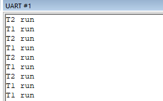

### Xoá task

Hàm dùng để xóa một task như sau:

```c
void vTaskDelete( TaskHandle_t xTaskToDelete );
```

Mô tả tham số:

| Tham số | Mô tả |
| ------- | ----- |
| `xTaskToDelete` | Đây là task handle, có thể lấy được khi tạo task bằng hàm `xTaskCreate`. <br> Giá trị `NULL` cũng có thể truyền vào để cho biết xoá chính task đó. |

`vTaskDelete` sẽ không xóa đi vùng nhớ trong heap của task ngay lập tức mà chỉ đánh dấu là task đó đã được xóa.

Vậy có thể xóa vùng nhớ này trong heap khi task đã được xóa không? Câu trả lời ở IdleTask.

### Ví dụ 2: Xoá task

Ta cần làm những việc sau:
- Tạo task 1: Trong vòng lặp chính của task 1, tạo task 2, sau đó delay trong một khoảng thời gian.
- Task 2: In một câu, sau đó tự xoá chính mình đi.

Mã cho task 1 như sau:

```c
void vTask1( void *pvParameters )
{
    const TickType_t xDelay100ms = pdMS_TO_TICKS( 100UL );		
    BaseType_t ret;

    for( ;; )
    {
        printf("Task1 is running\r\n");
        
        ret = xTaskCreate( vTask2, "Task 2", 1000, NULL, 2, &xTask2Handle );
        if (ret != pdPASS)
            printf("Create Task2 Failed\r\n");
        
        vTaskDelay( xDelay100ms );
    }
}
```

Mã cho task 2 như sau:

```c
void vTask2( void *pvParameters )
{
    printf("Task2 is running and about to delete itself\r\n");

    vTaskDelete(xTask2Handle);
}
```

Đoạn mã cho hàm main như sau:

```c
int main( void )
{
    prvSetupHardware();

    xTaskCreate(vTask1, "Task 1", 1000, NULL, 1, NULL);

    /* Khởi động bộ lập lịch */
    vTaskStartScheduler();

    /* Nếu chương trình đến đây thì có nghĩa là lỗi, thường là thiếu bộ nhớ */
    return 0;
}
```

Kết quả như sau:

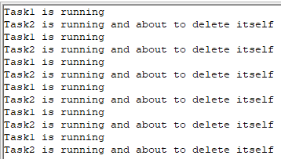

Sơ đồ thực thi nhiệm vụ:
- Hàm main tạo ra task 1 có độ ưu tiên là 1. Khi task 1 chạy, nó sẽ tạo ra task 2 có độ ưu tiên là 2.
- Task 2 có độ ưu tiên cao nhất và sẽ được thực hiện ngay lập tức.
- Sau khi in xong một câu, Task 2 tự xóa chính nó.
- Sau khi task 2 bị xóa thì task 1 sẽ có độ ưu tiên cao nhất, được phép tiếp tục chạy. Sau đó, nó `vTaskDelay()` chuyển sang trạng thái blocked.
- Trong khoảng thời gian task 1 delay, thì task Idle sẽ được thực thi: nó giải phóng bộ nhớ (TCB, ngăn xếp) của task 2.
- Khi hết thời gian delay, Task 1 trở thành task ưu tiên cao nhất và tiếp tục được thực thi.
- Và cứ thế tiếp diễn.

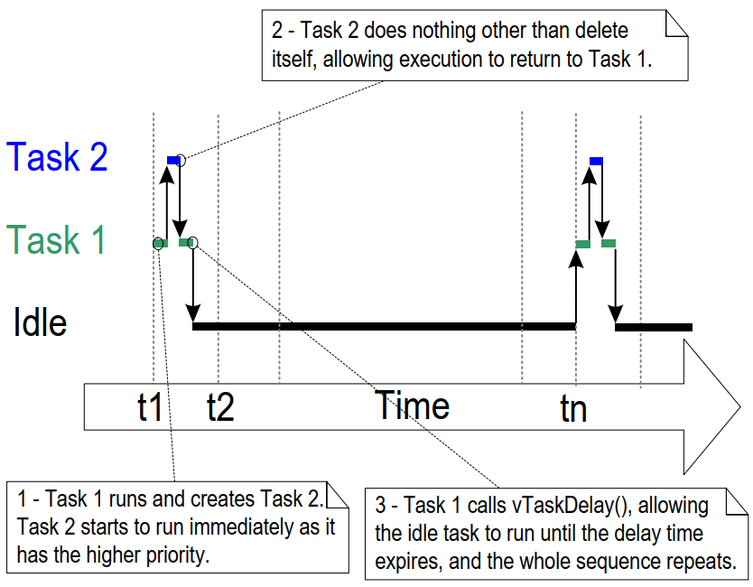

Ở task 1, nếu `vTaskDelay` không được gọi thì task Idle sẽ không có được thực thi và sẽ không thể giải phóng bộ nhớ đã được cấp phát khi Task 2 được tạo.

Lúc này, task 1 sẽ liên tục tạo các task khác và tiêu tốn bộ nhớ, cuối cùng dẫn đến hết bộ nhớ và không thể tạo ra các task mới nữa.

Hiện tượng này có thể diễn ra như sau:

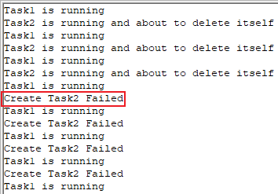

## Trạng thái của task

Trước đây, ta chỉ đơn giản chia trạng thái của một task thành hai loại: running và not running.

Trạng thái not running có thể được chia nhỏ hơn nữa:
- Trạng thái ready
- Trạng thái blocked
- Trạng thái suspended

Sơ đồ state machine các trạng thái của task như sau:

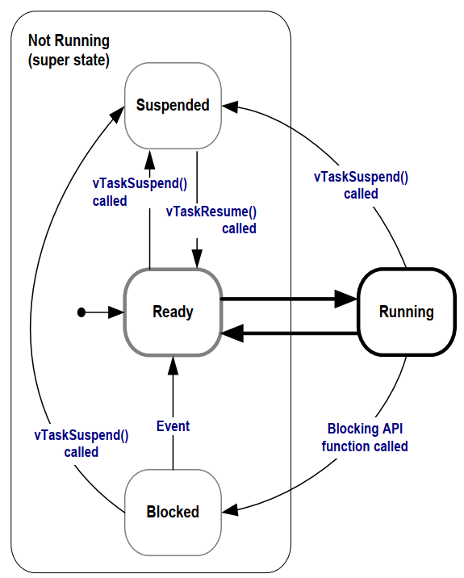

Tuy nhiên, tại một thời điểm, chỉ có một task ở trạng thái running chạy trên CPU.

### Trạng thái ready

Task này đã sẵn sàng và có thể được chạy bất cứ lúc nào.

Nhiểu task có thể ở trạng thái ready cùng một lúc. Lúc này, bộ lập lịch sẽ là đứa chọn task ở trạng thái ready nào được phép chạy.

### Trạng thái blocked

Trong các sản phẩm thực tế, ta không nên để một task chạy liên tục mà thay vào đó, ta sử dụng phương pháp event driven để thực thi nó:
- Một task phải chờ một sự kiện nhất định trước khi nó có thể được thực thi.
- Nó không tiêu tốn tài nguyên CPU trong khi chờ đợi các sự kiện.
- Trong khi chờ đợi một sự kiện, task sẽ ở trạng thái blocked.

Một task ở trạng thái blocked có thể chờ hai loại sự kiện:
- Các sự kiện liên quan đến thời gian
  - Khi gọi hàm `vTaskDelay`,...
- Sự kiện đồng bộ: Sự kiện này được tạo ra bởi một task khác hoặc một ISR.
  - Ví dụ 1: Task A chờ task B gửi dữ liệu cho nó.
  - Ví dụ 2: Task A chờ người dùng nhấn phím.

### Trạng thái suspended

Trong FreeRTOS, các task có thể chuyển sang trạng thái suspended, cách duy nhất là thông qua hàm `vTaskSuspend`. Prototype của hàm như sau:

```c
void vTaskSuspend( TaskHandle_t xTaskToSuspend );
```

Tham số `xTaskToSuspend` biểu thị task cần suspended; nếu nó là NULL, điều đó có nghĩa là task đang tự suspended.

Để thoát khỏi trạng thái suspended, chỉ task khác hoặc ISR mới có thể thực hiện được:
- Task khác: `vTaskResume`
- ISR: `xTaskResumeFromISR`

## Tick

Con người có nhịp tim, và khoảng thời gian giữa các nhịp tim về cơ bản là không đổi.

RTOS cũng có cơ chế nhịp tim, sử dụng systick timer để tạo ra các ngắt theo các khoảng thời gian cố định. Điều này được gọi là một "tick", ví dụ, ngắt tick xảy ra cứ sau 10ms.

Như hình ảnh bên dưới cho thấy:
- Giả sử các ngắt tick xảy ra tại các thời điểm t1, t2 và t3.
- Khoảng thời gian giữa hai lần gián đoạn được gọi là một time slice.
- Độ dài của time slice được xác định bởi `configTICK_RATE_HZ`. Giả sử `configTICK_RATE_HZ` là 100, thì độ dài time slice là 10ms.

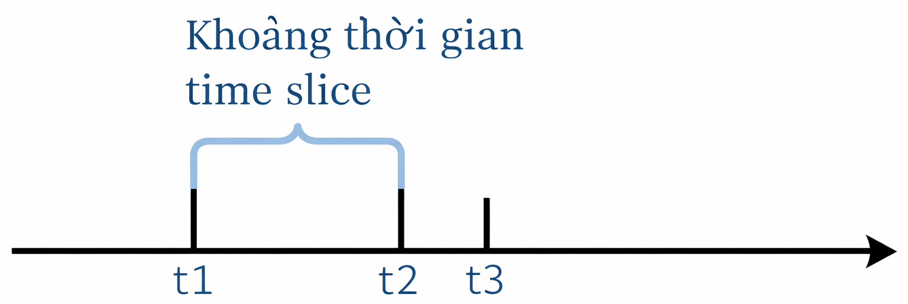

Làm thế nào để chuyển đổi giữa các task có cùng mức độ ưu tiên? Vui lòng xem hình ảnh bên dưới:
- Task 2 được thực hiện từ t1 đến t2.
- Một ngắt tick xảy ra tại thời điểm t2, và hàm xử lý ngắt tick được gọi:
  - Chọn task tiếp theo để thực hiện.
  - Sau khi ISR được thực thi, hãy chuyển sang task mới: Task 1
- Task 1 được thực hiện từ t2 đến t3.

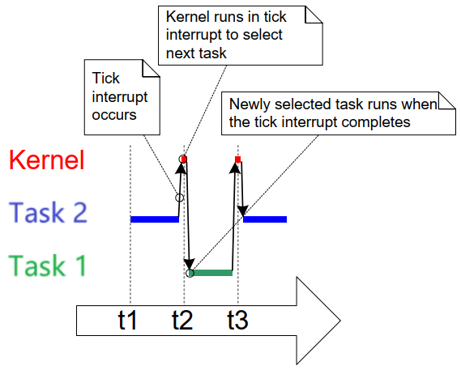

Ta có thể sử dụng các tick này để đo thời gian, ví dụ:

```c
vTaskDelay(2);  // Chờ 2 tick，Giả sử configTICK_RATE_HZ=100 -> tick=10ms -> chờ 20ms

// Sử dụng macro pdMS_TO_TICKS để chuyển ms sang tick
vTaskDelay(pdMS_TO_TICKS(100));	 // Chờ 100ms
```

:::warning Lưu ý
Delay dựa trên tick không chính xác. Ví dụ, nếu `vTaskDelay(2)` dự định delay 2 tick, nó có thể trả về sau hơn 1 tick.
:::

Như hình ảnh bên dưới cho thấy:

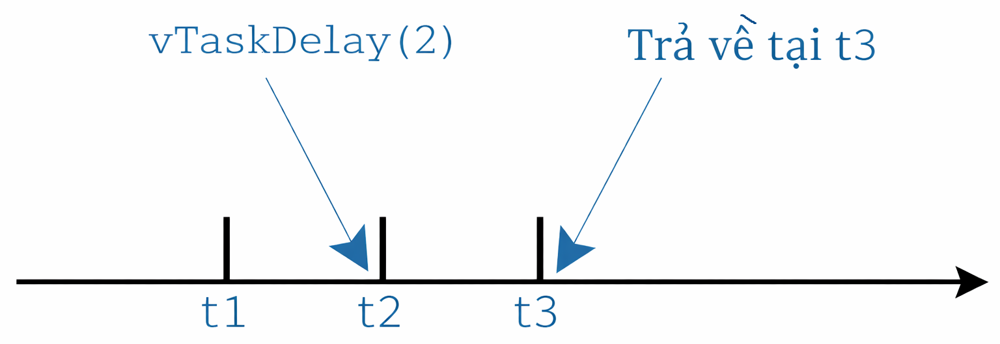

Khi sử dụng hàm `vTaskDelay`, nên sử dụng ms làm đơn vị và dùng macro `pdMS_TO_TICKS` để chuyển đổi ms sang tick.

## Hàm delay

Có hai hàm delay:
- `vTaskDelay`: Chờ ít nhất một số lượng ngắt tick trước khi sẵn sàng.
- `vTaskDelayUntil`: Chờ đến thời gian tuyệt đối được chỉ định trước khi sẵn sàng.

Nguyên mẫu của hai hàm này như sau:

```c
void vTaskDelay( const TickType_t xTicksToDelay );

/* pxPreviousWakeTime: Thời điểm wake cuối cùng
 * Thời điểm kế tiếp: pxPreviousWakeTime + xTimeIncrement
 * Đơn vị: Tick
 */
BaseType_t xTaskDelayUntil( TickType_t * const pxPreviousWakeTime,
                            const TickType_t xTimeIncrement );
```

Sơ đồ sau đây minh họa điều này:

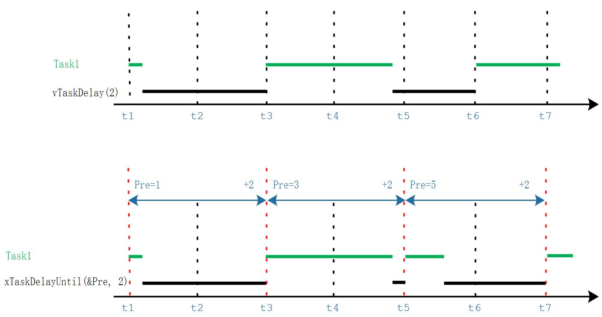

Sử dụng `vTaskDelay` hoặc `xTaskDelayUntil` để cho bộ lập lịch biết rằng task này đang rảnh trong khoảng thời gian này và từ đó nó có thể trao quyền điều khiển cho các task có mức ưu tiên thấp hơn trong khoảng thời gian đó.

## Task idle

Task idle được tạo ra bởi bộ lập lịch trong hàm `vTaskStartScheduler` để đảm bảo trong một thời điểm luôn có một task đang chạy, nghĩa là khi các task khác vào trạng thái blocked hoặc suspended. Đặc điểm của nó:
- Task idle sẽ có mức ưu tiên thấp nhất - 0.
- Task idle có nhiệm vụ giải phóng bộ nhớ khi có một task bị xóa.

Task idle có độ ưu tiên là 0, điều này có nghĩa là khi task của người dùng sẵn sàng, task idle sẽ ngay lập tức nhường tài nguyên để cho phép task của người dùng đó chạy. Trong trường hợp này, chúng ta nói rằng task của người dùng đã "chiếm quyền" task nhàn rỗi, điều này được thực hiện bởi bộ lập lịch.

Ngoài ra, ta có thể thêm một hàm hook cho task idle, hàm này sẽ được gọi một lần mỗi khi vòng lặp task idle thực thi. Hàm hook này có các chức năng sau:
- Thực thi các chức năng background có mức độ ưu tiên thấp cần được chạy liên tục.
- Đo thời gian idle của hệ thống: Các task idle có thể được thực thi nếu tất cả các task ưu tiên cao đã nhường quyền, vì vậy việc đo thời gian task idle chiếm dụng có thể được sử dụng để tính toán mức độ sử dụng bộ xử lý.
- Đưa CPU vào trạng thái low power. Nếu các task idle vẫn có thể thực hiện được, điều đó có nghĩa là không có việc gì quan trọng cần làm, vì vậy ta có thể đưa nó vào chế độ low power.

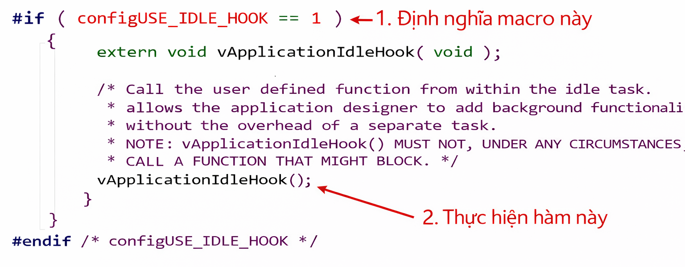

Những điểm hạn chế của hàm hook đối với các task idle:
- Nó không thể khiến một task đang ở trạng thái ready chuyển sang trạng thái blocked hoặc suspended.
- Nếu sử dụng nó với `vTaskDelete` để xóa các task, thì hàm hook cần phải được xử lý rất hiệu quả. Nếu task idle bị kẹt trong hàm hook, nó sẽ không thể giải phóng bộ nhớ.

## Tham khảo

https://rtos.100ask.net/zh/FreeRTOS/simulator/chapter3.html

https://www.laptrinhdientu.com/2021/09/Core11.html