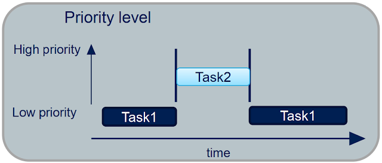
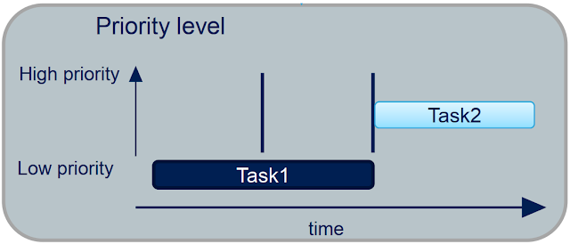
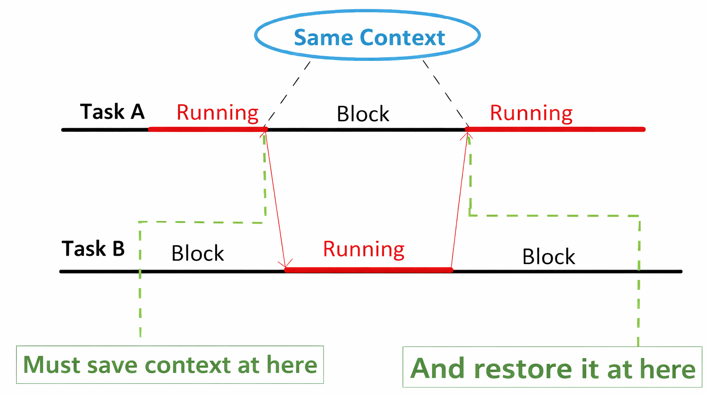
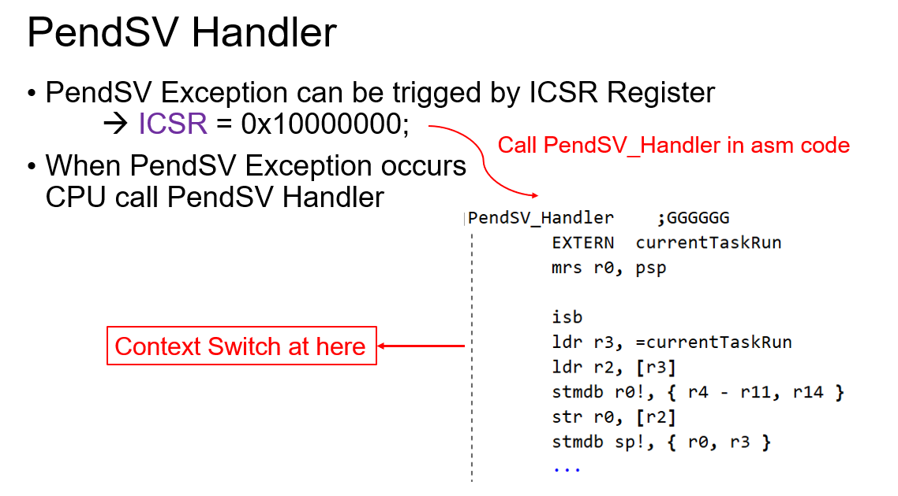
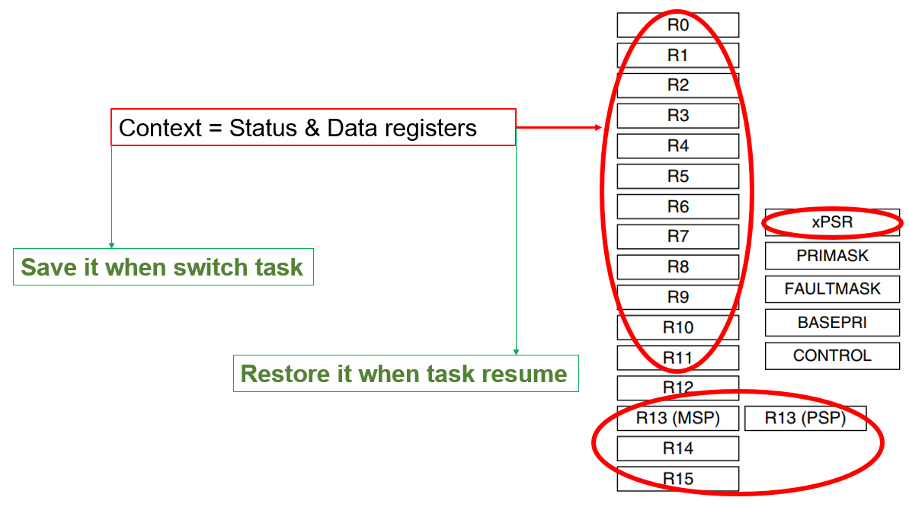

# Thuật toán lập lịch

## Khái niệm quan trọng

Trong hệ thống đơn core, tại một thời điểm thì chỉ có một task ở trạng thái running.

Một task not running sẽ ở một trong ba trạng thái: blocked, suspended hoặc ready. Bộ lập lịch có thể chọn một task ở trạng thái ready để chuyển sang trạng thái running. Bộ lập lịch luôn chọn task ở trạng thái ready có độ ưu tiên cao nhất và đưa nó vào trạng thái running.

Một task bị blocked sẽ chờ một "sự kiện" và chuyển sang trạng thái ready khi sự kiện xảy ra. Các sự kiện được chia thành hai loại: sự kiện liên quan đến thời gian và sự kiện đồng bộ.

Sự kiện liên quan đến thời gian bao gồm việc thiết lập thời gian chờ:
- Task bị chặn trong một khoảng thời gian xác định và chuyển sang trạng thái sẵn sàng sau khi hết thời gian chờ.
- Sự kiện liên quan đến thời gian có thể được sử dụng để thực hiện các chức năng định kỳ và chức năng hẹn giờ.

Sự kiện đồng bộ xảy ra khi một task đang chờ một thông tin nhất định, và các task khác hoặc các ISR gửi thông tin cho nó. Thông tin được gửi như thế nào? Có nhiều phương pháp, bao gồm task notification, queue, event group, semaphore và mutex. Các phương pháp này được sử dụng để gửi thông tin đồng bộ hóa, chẳng hạn như cho biết thiết bị ngoại vi đã nhận được dữ liệu.

## Các thuật toán lập lịch

Thuật toán lập lịch là một cơ chế để xác định task nào đang ở trạng thái ready và có thể được chuyển sang trạng thái running.

Trong RTOS, thuật toán lập lịch được cấu hình thông qua hai macro trong file config `FreeRTOSConfig.h`: `configUSE_PREEMPTION` và `configUSE_TIME_SLICING`.

Ngoài ra, có một tuỳ chọn thứ ba là `configUSE_TICKLESS_IDLE`. Đây là một tùy chọn nâng cao được sử dụng để vô hiệu hóa các ngắt tick nhằm tiết kiệm năng lượng, điều này sẽ được giải thích riêng sau. Hiện tại, ta hãy giả định `configUSE_TICKLESS_IDLE` được đặt thành 0 và chúng ta sẽ không sử dụng tính năng này.`

Hành vi của các thuật toán lập lịch chủ yếu được thể hiện ở hai khía cạnh:
- Các task có độ ưu tiên cao hơn có thể được thực thi trước không.
  - Nếu có -> đây được gọi là lập lịch ưu tiên hay **preemptive**.
    
    

    Task 1 bị chiếm quyền sẽ được đưa vào trạng thái chờ, cho đến khi task 2 (có độ ưu tiên cao hơn vừa chiếm quyền) thực thi xong.

  - Nếu không và phải cần thương lượng -> đây được gọi là lập lịch hợp tác hay **cooperative**.

    

    Có thể thấy ở đây mặc dù có độ ưu tiên cao hơn, nhưng task 2 cũng không thể chiếm quyền điều khiển của task 1, mà phải đợi task 1 chủ động nhường quyền.

- Đảm bảo rằng các task ở trạng thái sẵn sàng có cùng độ ưu tiên được thực thi theo kiểu "luân phiên" -> Đây được gọi là lập lịch luân phiên hay **round-robin**.
  
  

Danh sách cấu hình như sau:

| Config                    | A | B | C | D | E |
| ------------------------- | - | - | - | - | - | 
| `configUSE_PREEMPTION`    | 1 | 1 | 1 | 1 | 0 |
| `configUSE_TIME_SLICING`  | 1 | 1 | 0 | 0 | x |
| `configIDLE_SHOULD_YIELD` | 1 | 0 | 1 | 0 | x |

Ghi chú:
- A: Ưu tiên + Luân phiên time slice + Task idle nhường quyền
- B: Có thể bị gián đoạn + Luân phiên time slice + Task idle không nhường quyền
- C: Có thể bị gián đoạn + Luân phiên không theo time slice + Task idle nhường quyền
- D: Có thể bị gián đoạn + Luân phiên không theo time slice + Task idle không nhường quyền
- E: Lập lịch theo cooperative

## Ví dụ

Giả sử có ba task: task 1 và task 2 đều có độ ưu tiên là 0, cùng độ ưu tiên với task idle, trong khi task 3 có độ ưu tiên cao nhất là 2. Định nghĩa bốn biến toàn cục: khi một task được thực thi, biến tương ứng sẽ được đặt thành 1. Việc chuyển đổi task có thể được quan sát bằng logic alalysis trên KeilC.

```c
static volatile int flagIdleTaskrun = 0;  // Khi task idle chạy: lagIdleTaskrun=1
static volatile int flagTask1run = 0;     // Khi task 1 chạy: flagTask1run=1
static volatile int flagTask2run = 0;     // Khi task 2 chạy: flagTask2run=1
static volatile int flagTask3run = 0;     // Khi task 3 chạy:
```

Đoạn code cho hàm main như sau:

```c
int main( void )
{
    prvSetupHardware();

    xTaskCreate(vTask1, "Task 1", 1000, NULL, 0, NULL);
    xTaskCreate(vTask2, "Task 2", 1000, NULL, 0, NULL);
    xTaskCreate(vTask3, "Task 3", 1000, NULL, 2, NULL);

    vTaskStartScheduler();

    return 0;
}
```

Đoạn code cho task 1 và task 2 như sau:

```c
void vTask1( void *pvParameters )
{
    for( ;; )
    {
        flagIdleTaskrun = 0;
        flagTask1run = 1;
        flagTask2run = 0;
        flagTask3run = 0;
        
        printf("Task 1\r\n");				
    }
}

void vTask2( void *pvParameters )
{	
    for( ;; )
    {
        flagIdleTaskrun = 0;
        flagTask1run = 0;
        flagTask2run = 1;
        flagTask3run = 0;
        
        printf("Task 2\r\n");				
    }
}
```

Đoạn code cho task 3 như sau, nó sẽ gọi `vTaskDelay` để các task khác có thể chạy:

```c
void vTask3( void *pvParameters )
{	
    const TickType_t xDelay5ms = pdMS_TO_TICKS( 5UL );		

    for( ;; )
    {
        flagIdleTaskrun = 0;
        flagTask1run = 0;
        flagTask2run = 0;
        flagTask3run = 1;
        
        printf("Task 3\r\n");				

        vTaskDelay( xDelay5ms );
    }
}
```

Hàm hook cho task idle như sau:

```c
void vApplicationIdleHook(void)
{
    flagIdleTaskrun = 1;
    flagTask1run = 0;
    flagTask2run = 0;
    flagTask3run = 0;	

    printf("Idle task\r\n");				
}
```

Trong file `FreeRTOSConfig.h`, ta định nghĩa các marco như sau và quan sát bằng logic analysis trên KeilC để nhận rõ sự khác biệt của từng trường hợp:
- Có hoặc không có preemptive

  ```c
  // Trường hợp 1: preemptive
  #define configUSE_PREEMPTION      1
  #define configUSE_TIME_SLICING    1
  #define configIDLE_SHOULD_YIELD   1

  // Trường hợp 2: Không preemptive
  #define configUSE_PREEMPTION      0
  #define configUSE_TIME_SLICING    1
  #define configIDLE_SHOULD_YIELD   1
  ```

- Có hoặc không có time slice

  ```c
  // Trường hợp 1: time slice
  #define configUSE_PREEMPTION      1
  #define configUSE_TIME_SLICING    1
  #define configIDLE_SHOULD_YIELD   1

  // Trường hợp 2: Không có time slice
  #define configUSE_PREEMPTION      1
  #define configUSE_TIME_SLICING    0
  #define configIDLE_SHOULD_YIELD   1
  ```

- Task idle nhường quyền hoặc không nhường quyền

  ```c
  // Trường hợp 1: task idle nhường quyền
  #define configUSE_PREEMPTION      1
  #define configUSE_TIME_SLICING    1
  #define configIDLE_SHOULD_YIELD   1

  // Trường hợp 2: task idle không nhường quyền
  #define configUSE_PREEMPTION      1
  #define configUSE_TIME_SLICING    1
  #define configIDLE_SHOULD_YIELD   0
  ```

## Context switch

Khi bộ lập lịch được gọi, nó sẽ làm những việc gì? Tại sao một task đang chạy phải dừng lại và nhường quyền cho task khác, sau đó khi task này trở lại hoạt động mà nó vẫn có thể tiếp tục được công việc cũ một cách trơn tru? -> Cơ chế context switch.

Khi một ngắt tick xảy ra, bộ lập lịch sẽ xác định xem task nào cần được chạy tiếp theo và thực hiện context switch. Cơ chế này được mô tả đơn giản như sau:



Context switch sinh ra với hai mục đích chính:
- Lưu lại context của task đang thực thi trước khi chuyển qua task khác, context này sẽ được lưu vào vùng nhớ TCB của task đó.
- Lấy lại context cũ của task chuẩn bị được thực thi để tiếp tục task đó. Việc này ngược lại với việc trên, đó là lấy dữ liệu từ vùng nhớ TCB của task tương ứng.

Thực thi context switch sẽ dựa trên hai exceptions đó là **PendSV** và **SVC**.

PendSV là một loại exception đặc biệt trên vi điều khiển lõi ARM Cortex-M, được thiết kế để hỗ trợ context switching trong RTOS, giúp chuyển đổi giữa các task hiệu quả và đơn giản.

PendSV chỉ được kích hoạt bằng software, bằng cách ghi vào thanh ghi SCB_ICSR (Interrupt Control and State Register).



Trong hàm ISR `PendSV_Handler` cần lưu context của task cũ và khôi phục context của task mới, context nói đến ở đây chính là các thanh ghi của core, các thanh ghi tính toán, thanh ghi status, thanh ghi chức năng đặc biệt.



Bởi vì ta cần truy cập vào các thanh ghi core để lấy thông tin context hiện tại đang thực thi và lưu lại nên `PendSV_Handler` sẽ thường được viết bằng mã asm.

## Tham khảo

https://rtos.100ask.net/zh/FreeRTOS/simulator/chapter3.html#_3-7-%E8%B0%83%E5%BA%A6%E7%AE%97%E6%B3%95

https://docs.google.com/presentation/d/1zRrCRD-5Hnr0PqewqokbCbSyp_00Y_0T/edit#slide=id.p1

https://www.laptrinhdientu.com/2021/09/Core15.html
