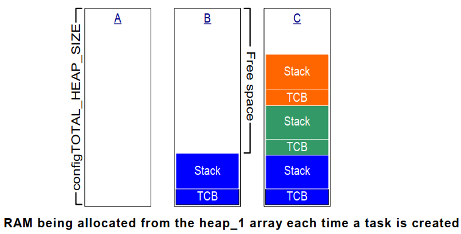
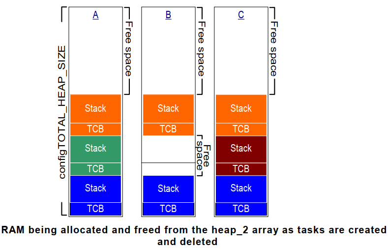
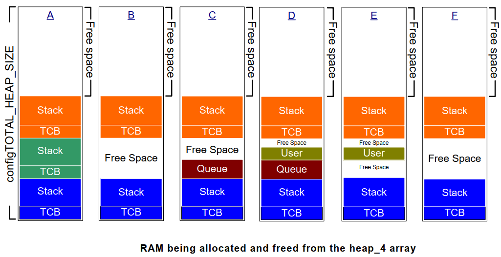

# Memory management

## Tại sao cần tự triển khai hệ thống quản lý bộ nhớ riêng?

Một hệ điều hành RTOS cần các thành phần như task, queue, semaphore và mutex. Các thành phần này sẽ có hai chiến lực cấp pháp bộ nhớ:
- Cấp phát tĩnh: Bộ nhớ được cấp phát trước tại thời điểm biên dịch. Từ đó kích thước sẽ cố định và không phụ thuộc vào runtime, không gây phân mảnh bộ nhớ. Tuy nhiên thì tính linh hoạt của nó kém, nếu dùng ít hơn so với cấp phát thì lãng phí bộ nhớ, nếu dùng nhiều hơn so với cấp phát thì có thể gây ra lỗi.
- Cấp phát động: Bộ nhớ được cấp phát trong runtime từ heap. Ưu điểm là linh hoạt, dễ dàng cấp phát và giải phóng bộ nhớ khi cần thiết.

Ta thường sử dụng cấp phát động giúp cấp phát khi cần thiết và giải phóng khi không cần sử dụng. Vì điều này giúp giảm sự phức tạp của chương trình như cần phải tính toán cẩn thận việc cấp pháp từng thành phần và làm giảm tiêu thụ bộ nhớ không cần thiết.

Ta có thể sử dụng các hàm như `malloc` và `free` trong thư viện C để thực hiện cấp phát động, tuy nhiên:
- Không cố định về thời gian thực thi hàm.
- Không đảm bảo Thread-Safe.
- Phức tạp và chiếm nhiều kích thước phân vùng `.code`.
- Compiler khác nhau đòi hỏi cấu hình phải khác nhau -> phức tạp.

Do đó, ta cần phải triển khai các hàm cấp phát bộ nhớ thay thế. 

## Phương pháp quản lý bộ nhớ trong FreeRTOS

### Heap_1

Đây là cách cấp phát cơ bản nhất, nó chỉ cho phép cấp pháp bộ nhớ và không thể giải phóng bộ nhớ được.

Nếu ứng dụng không cần xoá các thành phần như Task, queue,...thì ta có thể sử dụng heap_1.

Nguyên tắc thực hiện của nó rất đơn giản. Đầu tiên, hãy cấp pháp một mảng tĩnh lớn:

```c
/* Allocate the memory for the heap. */
#if ( configAPPLICATION_ALLOCATED_HEAP == 1 )

/* The application writer has already defined the array used for the RTOS
* heap - probably so it can be placed in a special segment or address. */
    extern uint8_t ucHeap[ configTOTAL_HEAP_SIZE ];
#else
    static uint8_t ucHeap[ configTOTAL_HEAP_SIZE ];
#endif /* configAPPLICATION_ALLOCATED_HEAP */
```

Sau đó, ta có thể thực hiện cấp pháp bộ nhớ trong mảng này.

Khi sử dụng heap_1, quá trình cấp phát bộ nhớ được thể hiện trong sơ đồ sau:
- A: Toàn bộ mảng đều trống trước khi tác vụ được tạo.
- B: Sau khi tác vụ đầu tiên được tạo, vùng màu xanh lam sẽ được cấp pháp.
- C: Sử dụng mảng sau khi tạo 3 tác vụ



### Heap_2

Heap_2 chỉ được giữ lại để tương thích với mã nguồn cũ. Việc sử dụng nó không còn được khuyến khích trong thiết kế mới. Heap_4 được đề xuất như một sự thay thế hiệu quả hơn cho Heap_2.

Heap_2 cũng cấp phát bộ nhớ trên một mảng tĩnh, nhưng nó khác với Heap_1 ở chỗ:
- Heap_2 sử dụng thuật toán phù hợp nhất để cấp pháp bộ nhớ.
- Nó hỗ trợ giải phóng bố nhớ.

Thuật toán của heap_2 như sau:
- Giả sử vùng nhớ heap có 3 khối bộ nhớ trống: 5 byte, 25 byte và 100 byte.
- Chẳng hạn, ta muốn cấp pháp 20 byte
- Tìm vùng nhớ nhỏ nhất thỏa mãn -> 25 byte
- Chia vùng nhớ tìm được thành 20 byte và 5 byte
  - Trả về địa chỉ của 20 byte này.
  - 5 byte còn lại vẫn còn trống, được dành riêng cho các lần cấp pháp tiếp theo.

-> head_2 không hợp nhất các bộ nhớ trống liền kề, điều này có thể dẫn đến các vấn đề như phân mảnh bộ nhớ.

Tuy nhiên, nếu kích thước cấp pháp bộ nhớ và kích thước yêu cầu luôn giống nhau, heap_2 sẽ không gặp vấn đề phân mảnh trong trường hợp này. Do đó, nó phù hợp với các trường hợp mà các task được tạo và xóa thường xuyên, nhưng kích thước stack của các tác vụ luôn giống nhau.

Khi sử dụng heap_2, quá trình cấp phát bộ nhớ được thể hiện trong sơ đồ sau:
- A: Ba task đã được cấp pháp.
- B: Sau khi giải phóng một task, bộ nhớ trống được chia thành ba phần: không gian trên cùng, không gian TCB của task giải phóng và không gian stack của task giải phóng.
- C: Một task mới được cấp pháp. Vì TCB và kích thước stack của nó giống với task đã giải phóng trước đó, nên nó được cấp phát cùng một lượng bộ nhớ như trước.



### Heap_3

Heap_3 sử dụng các hàm `malloc` và `free` từ thư viện chuẩn C để cấp pháp và giải phóng bộ nhớ. Do đó, vi điều khiển cần xác định vùng nhớ heap bằng Linker script.

Các hàm `malloc` và `free` trong thư viện C không đảm bảo tính Thread-Safe. Do đó, Heap_3 sẽ tạm dừng bộ lập lịch trước khi gọi các hàm này, do đó đạt được tính Thread-Safe.

### Heap_4

Heap_4 sử dụng thuật toán **first-fit** để cấp pháp bộ nhớ. Nó cũng merge các vùng nhớ trống liền kề thành một vùng nhớ trống lớn hơn, giúp giảm thiểu sự phân mảnh bộ nhớ. Nó phù hợp với các trường hợp mà bộ nhớ có kích thước khác nhau được cấp phát và giải phóng thường xuyên.

Khi sử dụng heap_4, quá trình cấp phát bộ nhớ được thể hiện trong sơ đồ sau:
- A: Ba nhiệm vụ đã được tạo ra.
- B: Một tác vụ đã bị xóa, để lại hai phần bộ nhớ trống:
  - Không gian trên cùng
  - Không gian TCB và không gian stack của task giải phóng được merge.
- C: Một queue được cấp phát, và không gian được cấp pháp từ khối trống đầu tiên.
- D: Một dữ liệu user được cấp phát từ khối trống sau Queue.
- E: Queue được giải phóng -> có một khối bộ nhớ trống trước và sau user.
- F: Giải phóng dữ liệu user -> bộ nhớ trước và sau user, và bộ nhớ do chính user chiếm dụng, merge chúng thành một vùng bộ nhớ trống lớn.



### Heap_5

Thuật toán cấp pháp và giải phóng bộ nhớ trong heap_5 giống như trong heap_4. Tuy nhiên, head5 không bị giới hạn cấp pháp bộ nhớ từ một mảng tĩnh duy nhất. heap-5 cho phép cấp pháp từ nhiều bộ nhớ riêng biệt.

Làm thế nào để chỉ định một khối bộ nhớ? Hãy sử dụng cấu trúc sau:

```c
typedef struct HeapRegion
{
    uint8_t * pucStartAddress;
    size_t xSizeInBytes;
} HeapRegion_t;
```

Làm thế nào để chỉ định nhiều khối bộ nhớ? Sử dụng mảng `HeapRegion_t`, trong đó địa chỉ bộ nhớ thấp đứng đầu và địa chỉ bộ nhớ cao đứng cuối.

```c
HeapRegion_t xHeapRegions[] =
{
  { ( uint8_t * ) 0x80000000UL, 0x10000 }, // Địa chỉ bắt đầu: 0x80000000，kích thước: 0x10000
  { ( uint8_t * ) 0x90000000UL, 0xa0000 }, // Địa chỉ bắt đầu: 0x90000000，kích thước: 0xa0000
  { NULL, 0 } // Cho biết vị trí cuối cùng của mảng
 };
```

Prototype của hàm `vPortDefineHeapRegions` như sau:

```c
void vPortDefineHeapRegions( const HeapRegion_t * const pxHeapRegions );
```

Truyền mảng `xHeapRegions` vào hàm `vPortDefineHeapRegions` sẽ khởi tạo heap_5.

## Các hàm liên quan đến heap

**`pvPortMalloc/vPortFree`**

Prototype:

```c
void * pvPortMalloc( size_t xWantedSize );
void vPortFree( void * pv );
```

Chức năng: cấp pháp bộ nhớ và giải phóng bộ nhớ. Nếu việc cấp pháp thất bại, trả về NULL.

**`xPortGetFreeHeapSize`**

Prototype:

```c
size_t xPortGetFreeHeapSize( void );
```

Hàm này hiển thị lượng bộ nhớ trống hiện có và có thể được sử dụng để tối ưu hóa việc sử dụng bộ nhớ. Ví dụ, nếu hàm này trả về 2000 sau khi tất cả các đối tượng kernel đã được cấp phát, thì `configTOTAL_HEAP_SIZE` sẽ giảm đi 2000.

::: warning Chú ý
Hàm này không thể sử dụng trong heap_3.
:::

**`xPortGetMinimumEverFreeHeapSize`**

Prototype:

```c
size_t xPortGetMinimumEverFreeHeapSize( void );
```

Hàm này trả về lượng bộ nhớ trống tối thiếu trong suốt quá trình thực thi chương trình.

::: warning Chú ý
Hàm này chỉ hỗ trợ cho heap_4 và heap_5
:::

**Hàm hook xử lý lỗi malloc**

Bên trong hàm `pvPortMalloc`:

```c
void * pvPortMalloc( size_t xWantedSize )
{
    ......
    #if ( configUSE_MALLOC_FAILED_HOOK == 1 )
        {
            if( pvReturn == NULL )
            {
                extern void vApplicationMallocFailedHook( void );
                vApplicationMallocFailedHook();
            }
        }
    #endif
    
    return pvReturn;        
}
```

Nếu muốn sử dụng hàm hook này, thì:
- Trong `FreeRTOSConfig.h`, `configUSE_MALLOC_FAILED_HOOK` được định nghĩa là 1.
- Cung cấp hàm `vApplicationMallocFailedHook`.
- Hàm này chỉ được gọi nếu `pvPortMalloc` thất bại.