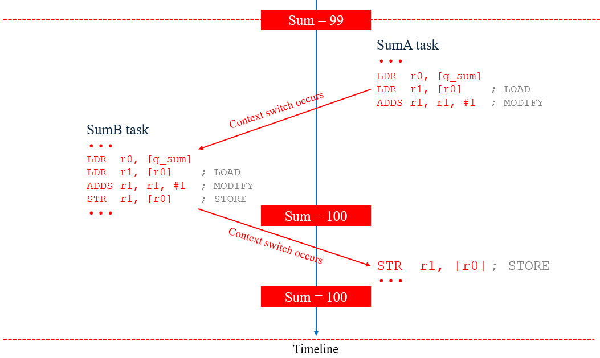

# Đồng bộ hoá và mutual exclusion

## Khái niệm

Để hiểu khái niệm đồng bộ hóa và mutual exclusion thì ta có một ví dụ nhỏ: Giả sử một phòng trọ có hai bạn sinh viên A và B. Một buổi sáng sớm, hai người đều thực dậy và muốn đi vệ sinh. Tuy nhiên, A đến trước và "chiếm dụng" nhà vệ sinh. B đến sau một tí nên đánh lên giường ngủ tiếp. Khi A dùng xong nhà vệ sinh thì anh ta "đánh thức" B dậy, lúc này B đi vào sử dụng nhà vệ sinh. Trong quá trình này, cả A và B sử dụng nhà vệ sinh một cách độc lập và nhà vệ sinh được gọi là một nguồn tài nguyên dùng chung.

Lúc này, việc B ngủ sau đó A gọi dậy sử dụng nhà vệ sinh được gọi là đồng bộ hoá. A đang sử dụng nhà vệ sinh nên B không thể sử dụng được nữa gọi là mutual exclusion.

-> Đồng bộ hoá và mutual exclusion có một quan hệ chặt chẽ với nhau.

Ví dụ khác, nếu có hai task A và B đều cần sử dụng cổng UART để in, thì cổng UART là một tài nguyên quan trọng. Nếu A và B sử dụng cổng UART đồng thời, thông tin được in ra sẽ là sự kết hợp giữa cả A và B, khiến việc phân biệt giữa chúng trở nên khó khăn. Do đó, khi sử dụng cổng UART, cần thực hiện theo trình tự sau: A sử dụng xong, sau đó B sử dụng; B sử dụng xong, sau đó A sử dụng.


## Đồng bộ bằng biến toàn cục

Khi các task sử dụng chung một loại tài nguyên, ta cần phải đồng bộ giữa các task để không xảy ra xung đột. Để thực hiện điều này ta sẽ nghĩ đến cách tiếp cận đơn giản là sử dụng biến toàn cục. Đối với các chương trình đơn giản sử dụng polling thì điều này khả thi khi ta muốn giao tiếp giữa task và ISR. Nhưng với các chương trình sử dụng RTOS, khi có rất nhiều task cần truyền dữ liệu cho nhau thì cách làm này sẽ phát sinh rất nhiều vấn đề.

### Vấn đề 1: Race condition

Ví dụ: Task A và task B cùng thực hiện phép cộng dồn vào một biến toàn cục `g_sum`. Đoạn code như sau:

```c
/* Biến toàn cục dùng chung */
volatile uint32_t g_sum = 0;

static void vSumTask(void *pvParameters)
{
    (void)pvParameters;

    for (uint32_t i = 0; i < 100000; i++)
    {
        g_sum++;
    }

    /* Task hoàn thành thì tự xoá */
    vTaskDelete(NULL);
}

static void vPrintResultTask(void *pvParameters)
{
    (void)pvParameters;
    
    for (;;)
    {
        vTaskDelay(pdMS_TO_TICKS(5000));
        printf("Sum : %lu\r\n", g_sum);
    }
}

int main( void )
{
    prvSetupHardware();

    xTaskCreate(vSumTask, "SumA", 2048, NULL, 1, NULL);
    xTaskCreate(vSumTask, "SumB", 2048, NULL, 1, NULL);
    xTaskCreate(vPrintResultTask, "Print", 2048, NULL, 1, NULL);

    /* Khởi động bộ lập lịch */
    vTaskStartScheduler();

    /* Nếu chương trình đến đây thì có nghĩa là lỗi, thường là thiếu bộ nhớ */
    return 0;
}
```

Kết quả `sum` cuối cùng của trường hợp này ta có thể nghĩ là 200000. Tuy nhiên, kết quả thực tế khi chạy tuỳ vào mỗi vi điều khiển mà có thể có các kết quả khác nhau, điều này ta không lường trước được.

Mặc dù trong C, `g_sum++` trông như một phép toán đơn giản, nhưng với CPU, nó không thể trực tiếp tăng dữ liệu trong bộ nhớ mà thực hiện theo ba bước cơ bản:
- Load: CPU đọc giá trị `g_sum` từ bộ nhớ RAM vào một thanh ghi core.
- Modify: CPU tăng giá trị trong thanh ghi đó lên 1.
- Store: CPU ghi giá trị mới từ thanh ghi trở lại bộ nhớ.

Giả sử compiler sẽ sinh ra đoạn mã assembly cho `g_sum++` như sau:

```asm
LDR   r0, =g_sum     ; r0 = địa chỉ của g_sum
LDR   r1, [r0]       ; LOAD:  r1 = g_sum
ADDS  r1, r1, #1     ; MODIFY: r1 = r1 + 1
STR   r1, [r0]       ; STORE: g_sum = r1
```

Context switch có thể xảy ra bất kỳ lúc nào trong quá trình này, từ đó, nó hoàn toàn có thể xảy ra vào lúc trước khi modify như sau:



Quá trình như sau:
- Task `SumA` đang trong quá trình load giá trị biến toàn cục `g_sum` và chuẩn bị thực hiện modify.
- Context switch xảy ra và task `SumB` thực hiện `g_sum++` từ đó giá trị của `g_sum` sẽ thành 100.
- Khi quay lại task `SumA` thì nó tiếp tục thực hiện modify và lưu giá trị mới về biến `g_sum`, bỏ qua thay đổi từ task `SumB` -> giá trị của `g_sum` vẫn là 100.

Như vậy, trong RTOS, việc nhiều task hoặc nhiều ISR xảy ra liên tiếp, thì race condition xảy ra là việc không thể tránh khỏi. Điều này gây "hỗn loạn" chương trình, và có thể gây sai lệch chương trình khi mà các task hoặc ISR sử dụng chung các tài nguyên.

### Vấn đề 2: Critical section

Ta có thể ngăn race condition xảy ra khi các task truy cập vào cùng tài nguyên bằng cách sử dụng critical section.

Critical section có thể được triển khai bằng cách tạm thời vô hiệu hóa ngắt hoặc lập lịch, hoặc sử dụng các lệnh đặc biệt của phần cứng (nếu được hỗ trợ) để bảo vệ tài nguyên dùng chung tránh bị gián đoạn.

Với đoạn code trong ví dụ trên, ta có thể thêm critical section vào như sau:

```c
static void vSumTask(void *pvParameters)
{
    (void)pvParameters;

    for (uint32_t i = 0; i < 1000000; i++)
    {
        taskENTER_CRITICAL();   // enter critical
        g_sum++;                // critical section
        taskEXIT_CRITICAL();    // exit critical
    }

    /* Task hoàn thành thì tự xoá */
    vTaskDelete(NULL);
}
```

-> Kết quả `sum` đã đúng bằng 20000.

Tuy nhiên, sử dụng critical section cũng chỉ đảm bảo tính toàn vẹn dữ liệu. Nó không cung cấp các tính năng như:
- Block task khi truy cập vào một tài nguyên.
- Wake task đang chờ truy cập vào tài nguyên.
- Thông tin cho bộ lập lịch về trạng thái task.
- ...

Những điều này là rất cần thiết cho một hệ thống RTOS ổn định => Do đó biến toàn cục dù kết hợp với critical section cũng không thể đáp ứng được.

## Tham khảo

https://www.laptrinhdientu.com/2021/10/Core19.html

https://www.laptrinhdientu.com/2025/03/embedded-RTOS-critical-section.html