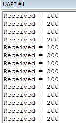
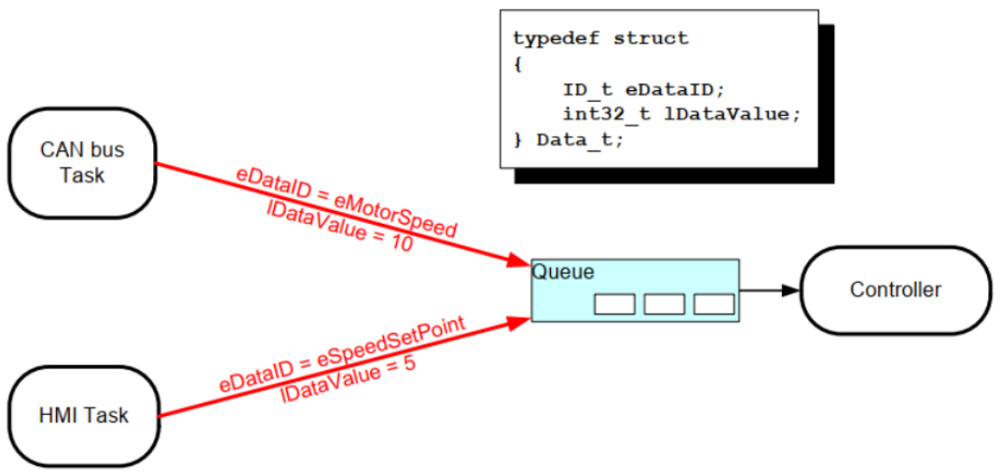
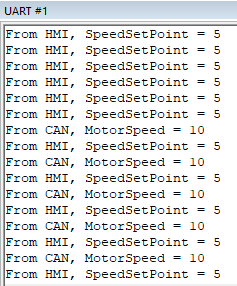

Như đã nói trong các bài trước, ta đã biết được rằng các task là các chương trình nhỏ độc lập với nhau và được chạy khi bộ lập lịch gọi. Vậy một câu hỏi đặt ra là các task này muốn giao tiếp với nhau thì như thế nào? Trong bài này, ta sẽ làm rõ hơn về điều này.

## Giao tiếp bằng biến toàn cục?

Khi muốn giao tiếp giữa các task thường ta sẽ nghĩ đến cách tiếp cận đơn giản là biến toàn cục. Đối với các chương trình bình thường sử dụng polling thì điều này khả thi. Nhưng với các chương trình sử dụng RTOS, khi có rất nhiều task cần truyền dữ liệu cho nhau thì cách làm này sẽ phát sinh rất nhiều vấn đề.

Ví dụ nếu task A muốn truyền một giá trị là 5 sang task B bằng biến global X. Thì task B chưa kịp nhận được thì task C chen ngang và cướp mất biến này, thay đổi nó thành X = 4, sau đó task B nhận được giá trị X = 4 -> Sai lệch dữ liệu.

Nhìn chung biến toàn cục có quá nhiều vấn đề ở đây, vì vậy người ta mới sử dụng queue để truyền nhận dữ liệu giữa các Task.

## Queue

### Đặc điểm của queue

Trong RTOS, queue là một công cụ quan trọng được sử dụng để giao tiếp và chia sẻ dữ liệu giữa các task hoặc giữa một task và ISR. Queue đảm bảo rằng dữ liệu được truyền an toàn và có trình tự ngay cả khi các task hoặc ISR chạy không đồng bộ.

Sơ đồ hoạt động đơn giản của queue được thể hiện trong hình dưới đây. Từ hình này, ta có thể thấy rằng:
- Queue chứa các dữ liệu gọi là data item: số lượng data item trong queue được gọi là **độ dài** của nó.
- Kích thước của data item là cố định.
- Khi tạo queue, ta cần chỉ định độ dài và kích thước data item của nó.
- Queue hoạt động theo cơ chế FIFO - First In First Out, tức là dữ liệu nào đi vào queue trước sẽ được sử dụng trước.


### Block vào queue

Khi một task đọc và ghi vào queue:
- Nếu thao tác đọc hoặc ghi thất bại, task sẽ chuyển sang trạng thái blocked cho đến khi hết thời gian timeout.
- Nếu thao tác đọc hoặc ghi thành công, task sẽ ngay lập tức chuyển sang trạng thái ready.

:::tip
Task ở trạng thái blocked, sẽ không được bộ lập lịch thực thi (tức là các mã lệnh của task sẽ không được thực hiện) cho đến khi được task khác wakeup hoặc hết thời gian timeout.
:::

Vì không có giới hạn về số lượng task có thể đọc từ queue, nên khi nhiều task cùng đọc từ một queue trống, tất cả chúng sẽ rơi vào trạng thái blocked: nhiều task đang chờ dữ liệu từ cùng một queue. Vậy khi có dữ liệu trong queue, task nào sẽ chuyển sang trạng thái ready?
- Task có độ ưu tiên cao nhất.
- Nếu tất cả các task có cùng mức độ ưu tiên, task có thời gian timeout lâu nhất sẽ chuyển sang trạng thái ready.

Đây là ví dụ khi một task đọc dữ liệu từ queue:
- Ban đầu, task B đang ở trạng thái ready, nó sẽ được đặt trong `readyList`.
- Khi chạy nó yêu cầu đọc queue trong một khoảng thời gian chờ `xTicksToWait`.
- Giả sử queue rỗng thì task B sẽ bị block, `readyList` sẽ xóa task này, sau đó đẩy vào `receiveiList` và `delayList`.
- Lúc này sẽ có hai tình huống xảy ra:
  - Khi task A ghi vào queue, nó sẽ xem trong `receiveiList` có rỗng không, nếu không nó sẽ wakeup task đầu tiên trong danh sách `receiveList`, ở đây giả sử là B, nó sẽ xóa B ra khỏi danh sách liên kết `receiveList` và `delayList`. Sau đó, task B sẽ được đẩy về `readyList`.
  - Khi vượt quá `xTicksToWait` mà không có task nào wakeup task B thì nó sẽ xóa B ra khỏi danh sách liên kết `receiveList` và `delayList`. Sau đó, task B sẽ được đẩy về `readyList`.

Tương tự với đọc dữ liệu từ queue thì khi nhiều task cùng ghi vào queue, tất cả các task này sẽ rơi vào trạng thái block: nhiều task đang chờ chỗ trống trong cùng một queue. Khi có chỗ trống trong queue, task nào sẽ chuyển sang trạng thái ready?
- Task có độ ưu tiên cao nhất.
- Nếu tất cả các task có cùng mức độ ưu tiên, task có thời gian timeout lâu nhất sẽ chuyển sang trạng thái ready.

## Các hàm queue trong FreeRTOS

### Create

Hai phương pháp để tạo queue đó là cấp pháp động và cấp pháp tĩnh.

- Cấp pháp động: `xQueueCreate`
  
Prototype hàm như sau:

```c
QueueHandle_t xQueueCreate( UBaseType_t uxQueueLength, UBaseType_t uxItemSize );
```

Các tham số được giải thích bên dưới:

| Tham số | Mô tả |
|---------|-------|
| `uxQueueLength` | Độ dài queue, số lượng tối đa các data item mà nó có thể chứa. |
| `uxItemSize`    | Kích thước của mỗi data item: tính bằng byte. |
| Giá trị trả về  | Giá trị khác `NULL`: Thành công, trả về một handle có thể được sử dụng để thao tác với queue sau này. <br> `NULL`: Thất bại, do không đủ bộ nhớ. |

- Cấp pháp tĩnh: `xQueueCreateStatic`

Prototype hàm như sau:

```c
QueueHandle_t xQueueCreateStatic(
                        UBaseType_t uxQueueLength,
                        UBaseType_t uxItemSize,
                        uint8_t *pucQueueStorageBuffer,
                        StaticQueue_t *pxQueueBuffer
                    );
```

Các tham số được giải thích bên dưới:

| Tham số | Mô tả |
|---------|-------|
| `uxQueueLength` | Độ dài queue, số lượng tối đa các data item mà nó có thể chứa. |
| `uxItemSize`    | Kích thước của mỗi data item: tính bằng byte. |
| `pucQueueStorageBuffer` | `pucQueueStorageBuffer` phải trỏ đến một mảng `uint8_t`, có kích thước ít nhất bằng `uxQueueLength * uxItemSize`. |
| `pxQueueBuffer` | Cần phải sử dụng struct `StaticQueue_t` để lưu trữ cấu trúc dữ liệu của queue. |
| Giá trị trả về  | Giá trị khác `NULL`: Thành công, trả về một handle có thể được sử dụng để thao tác với queue sau này. <br> `NULL`: Thất bại, vì `pxQueueBuffer` là `NULL`. |

Code ví dụ:

```c
#define QUEUE_LENGTH 10
#define ITEM_SIZE sizeof( uint32_t )

StaticQueue_t xQueueBuffer;

uint8_t ucQueueStorage[ QUEUE_LENGTH * ITEM_SIZE ];

void vATask( void *pvParameters )
{
    QueueHandle_t xQueue1;

    xQueue1 = xQueueCreateStatic( QUEUE_LENGTH,
                            ITEM_SIZE,
                            ucQueueStorage,
                            &xQueueBuffer ); 
}
```

### Reset

Khi queue được tạo lần đầu, nó không chứa dữ liệu nào. Trong quá trình sử dụng, một hàm có thể được gọi `xQueueReset` để khôi phục queue về trạng thái ban đầu.

Prototype của hàm như sau:

```c
BaseType_t xQueueReset( QueueHandle_t pxQueue);
```

### Delete

Hàm xóa queue `vQueueDelete` chỉ có thể xóa các queue được cấp pháp động.

Prototype của hàm như sau:

```c
void vQueueDelete( QueueHandle_t xQueue );
```

### Ghi vào queue

Dữ liệu có thể được ghi vào đầu hoặc cuối queue. Các hàm này có hai version:
- Một version dùng trong các task.
- Một version dùng trong các hàm ISR.

Prototyte các hàm ghi vào queue như sau:

```c
/*
 * Tương đương với hàm xQueueSendToBack
 */
BaseType_t xQueueSend( QueueHandle_t    xQueue,
                       const void       *pvItemToQueue,
                       TickType_t       xTicksToWait );

/*
 * Ghi vào cuối queue
 */
BaseType_t xQueueSendToBack( QueueHandle_t    xQueue,
                             const void       *pvItemToQueue,
                             TickType_t       xTicksToWait );

/*
 * Ghi vào cuối queue và được sử dụng trong các hàm ISR.
 */
BaseType_t xQueueSendToBackFromISR( QueueHandle_t xQueue,
                                    const void *pvItemToQueue,
                                    BaseType_t *pxHigherPriorityTaskWoken );

/*
 * Ghi vào đầu queue
 */
BaseType_t xQueueSendToFront( QueueHandle_t    xQueue,
                              const void       *pvItemToQueue,
                              TickType_t       xTicksToWait );

/*
 * Ghi vào đầu queue và được sử dụng trong các hàm ISR.
 */
BaseType_t xQueueSendToFrontFromISR( QueueHandle_t xQueue,
                                     const void *pvItemToQueue,
                                     BaseType_t *pxHigherPriorityTaskWoken );
```

Các hàm này sử dụng các tham số tương tự, được giải thích thống nhất như sau:

| Tham số         | Mô tả |
|-----------------|-------|
| `xQueue`        | Queue handle: xác định queue nào cần ghi. |
| `pvItemToQueue` | Con trỏ tới dữ liệu cần đẩy vào queue. |
| `xTicksToWait`  | Nếu queue đầy, dữ liệu mới không thể được ghi, khiến task bị block. <br> `xTicksToWait`: thời gian block tối đa (số lần tick). <br> Nếu được đặt thành 0, hàm sẽ trả về ngay lập tức khi không thể ghi dữ liệu; nếu được đặt thành `portMAX_DELAY`, nó sẽ bị block cho đến khi có chỗ trống để ghi dữ liệu. |
| Giá trị trả về  | `pdPASS`: Dữ liệu đã được ghi vào queue thành công. <br> `errQUEUE_FULL`: Ghi dữ liệu thất bại do queue đầy. |

### Đọc từ queue

Hàm `xQueueReceive` đọc dữ liệu từ queue; sau khi dữ liệu được đọc xong, nó sẽ được xóa khỏi queue. Có hai version của hàm này:
- Một version dùng trong các task.
- Một version dùng trong các hàm ISR.

Prototype các hàm đọc từ queue như sau:

```c
BaseType_t xQueueReceive( QueueHandle_t xQueue,
                          void * const pvBuffer,
                          TickType_t xTicksToWait );

BaseType_t xQueueReceiveFromISR( QueueHandle_t    xQueue,
                                 void             *pvBuffer,
                                 BaseType_t       *pxTaskWoken );
```

Các tham số được giải thích bên dưới:

| Tham số         | Mô tả |
|-----------------|-------|
| `xQueue`        | Queue handle: xác định queue nào cần đọc. |
| `pvBuffer`      | Con trỏ buffer cho biết dữ liệu được lấy từ queue. |
| `xTicksToWait`  | Nếu queue trống, không thể đọc được dữ liệu, khiến task bị block. <br> `xTicksToWait`: thời gian block tối đa (số lần tick). <br> Nếu được đặt thành 0, hàm sẽ trả về ngay lập tức khi không thể đọc dữ liệu; nếu được đặt thành `portMAX_DELAY`, nó sẽ bị block cho đến khi có dữ liệu trong queue. |
| Giá trị trả về  | `pdPASS`: Dữ liệu đã được đọc từ queue thành công. <br> `errQUEUE_FULL`: Đọc dữ liệu thất bại do queue trống. |

### Trace

Hàm này có thể trace số lượng data item trong queue và dung lượng chỗ trống còn lại.

Prototype của hàm như sau:

```c
/*
 * Trả về số lượng data item trong queue
 */
UBaseType_t uxQueueMessagesWaiting( const QueueHandle_t xQueue );

/*
 * Trả về dung lượng còn lại trong queue
 */
UBaseType_t uxQueueSpacesAvailable( const QueueHandle_t xQueue );
```

### Ví dụ cơ bản sử dụng queue

Ví dụ này sẽ tạo một queue, sau đó tạo hai task gửi và một task nhận:
- Độ ưu tiên của task gửi là 1, và các giá trị 100 và 200 được ghi vào queue tương ứng.
- Độ ưu tiên của task nhận là 2: đọc từ queue và in ra giá trị.

Queue, task gửi và task nhận được tạo trong hàm `main`, như được hiển thị trong đoạn code dưới đây:

```c
QueueHandle_t xQueue;

int main( void )
{
    prvSetupHardware();

    /* Tạo queue có độ dài là 5, kích thước mỗi dữ liệu là 4 byte. */
    xQueue = xQueueCreate( 5, sizeof( int32_t ) );

    if( xQueue != NULL )
    {
        /* Tạo hai task để ghi vào queue */
        xTaskCreate( vSenderTask, "Sender1", 1000, ( void * ) 100, 1, NULL );
        xTaskCreate( vSenderTask, "Sender2", 1000, ( void * ) 200, 1, NULL );

        /* Tạo một task để đọc */
        xTaskCreate( vReceiverTask, "Receiver", 1000, NULL, 2, NULL );

        vTaskStartScheduler();
    }
    else
    {
        
    }

    return 0;
}
```

Trong task gửi, các giá trị được ghi liên tục vào queue, như được thể hiện trong đoạn code bên dưới:

```c
static void vSenderTask( void *pvParameters )
{
    int32_t lValueToSend;
    BaseType_t xStatus;

    lValueToSend = ( int32_t ) pvParameters;

    for( ;; )
    {
        xStatus = xQueueSendToBack( xQueue, &lValueToSend, 0 );

        if( xStatus != pdPASS )
        {
            printf( "Could not send to the queue.\r\n" );
        }
    }
}
```

Task nhận sẽ đọc queue, kiểm tra giá trị trả về và in ra, như được hiển thị trong đoạn code bên dưới:

```c
static void vReceiverTask( void *pvParameters )
{
    int32_t lReceivedValue;
    BaseType_t xStatus;
    const TickType_t xTicksToWait = pdMS_TO_TICKS( 100UL );

    for( ;; )
    {
        xStatus = xQueueReceive( xQueue, &lReceivedValue, xTicksToWait );

        if( xStatus == pdPASS )
        {
            printf( "Received = %d\r\n", lReceivedValue );
        }
        else
        {
            printf( "Could not receive from the queue.\r\n" );
        }
    }
}
```

Kết quả đầu ra như sau:



### Ví dụ xác định task gửi dữ liệu

Khi nhiều task gửi dữ liệu vào một queue, làm thế nào task nhận có thể phân biệt được dữ liệu do task nào gửi? Bản thân dữ liệu có thể mang thông tin task gửi dữ liệu. Ví dụ, dữ liệu được ghi vào queue là một struct, và `lDataSouceID` trong struct được sử dụng để chỉ ra task gửi dữ liệu.

```c
typedef struct {
    ID_t eDataID;
    int32_t lDataValue;
}Data_t;
```

Các task gửi khác nhau trước tiên xây dựng một struct, ghi giá trị `eDataID` riêng của chúng, rồi ghi vào queue; sau khi task nhận đọc dữ liệu, nó có thể đọc `eDataID` để xác định nguồn gốc của dữ liệu, như hình dưới đây:
- Dữ liệu được gửi bởi task CAN: `eDataID=eMotorSpeed`
- Dữ liệu được gửi bởi task HMI: `eDataID=eSpeedSetPoint`



Đoạn code mô tả cho ví dụ này như sau:

```c
typedef enum
{
    eMotorSpeed,
    eSpeedSetPoint
} ID_t;

typedef struct {
    ID_t eDataID;
    int32_t lDataValue;
}Data_t;

static const Data_t xStructsToSend[ 2 ] =
{
    { eMotorSpeed,    10 }, /* CAN */
    { eSpeedSetPoint, 5 }   /* HMI */
};

static void vSenderTask( void *pvParameters );
static void vReceiverTask( void *pvParameters );

/*-----------------------------------------------------------*/

QueueHandle_t xQueue;

int main( void )
{
    prvSetupHardware();

    xQueue = xQueueCreate( 5, sizeof( Data_t ) );

    if( xQueue != NULL )
    {
        xTaskCreate(vSenderTask, "CAN Task", 1000, (void *) &(xStructsToSend[0]), 2, NULL);
        xTaskCreate(vSenderTask, "HMI Task", 1000, (void *) &( xStructsToSend[1]), 2, NULL);
        xTaskCreate( vReceiverTask, "Receiver", 1000, NULL, 1, NULL );

        vTaskStartScheduler();
    }

    return 0;
}

static void vSenderTask( void *pvParameters )
{
    BaseType_t xStatus;
    const TickType_t xTicksToWait = pdMS_TO_TICKS( 100UL );

    for( ;; )
    {
        xStatus = xQueueSendToBack( xQueue, pvParameters, xTicksToWait );

        if( xStatus != pdPASS )
        {
            printf( "Could not send to the queue.\r\n" );
        }
    }
}

static void vReceiverTask( void *pvParameters )
{
    Data_t xReceivedStructure;
    BaseType_t xStatus;

    for( ;; )
    {
        xStatus = xQueueReceive( xQueue, &xReceivedStructure, 0 );

        if( xStatus == pdPASS )
        {
            if( xReceivedStructure.eDataID == eMotorSpeed )
            {
                printf( "From CAN, MotorSpeed = %d\r\n", xReceivedStructure.lDataValue );
            }
            else if( xReceivedStructure.eDataID == eSpeedSetPoint )
            {
                printf( "From HMI, SpeedSetPoint = %d\r\n", xReceivedStructure.lDataValue );
            }
        }
        else
        {
            printf( "Could not receive from the queue.\r\n" );
        }
    }
}
```

Kết quả như sau:



## Tham khảo

https://rtos.100ask.net/zh/FreeRTOS/simulator/chapter5.html