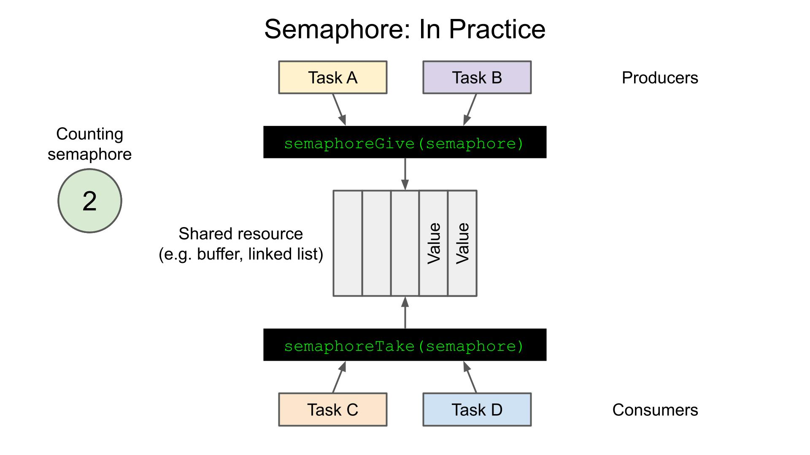
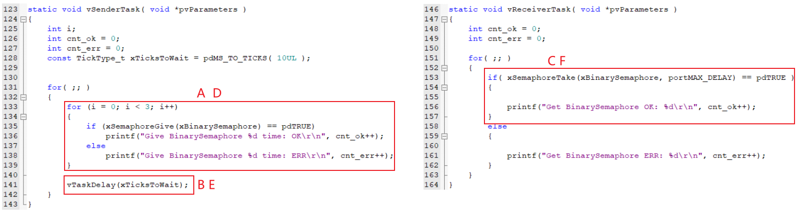
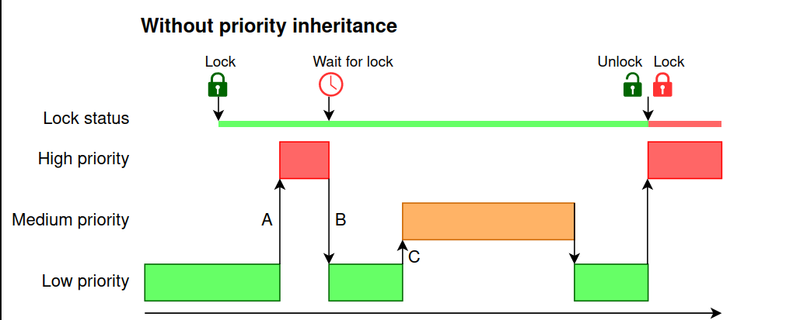
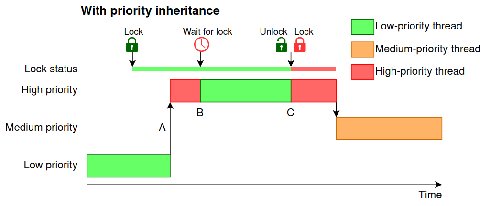
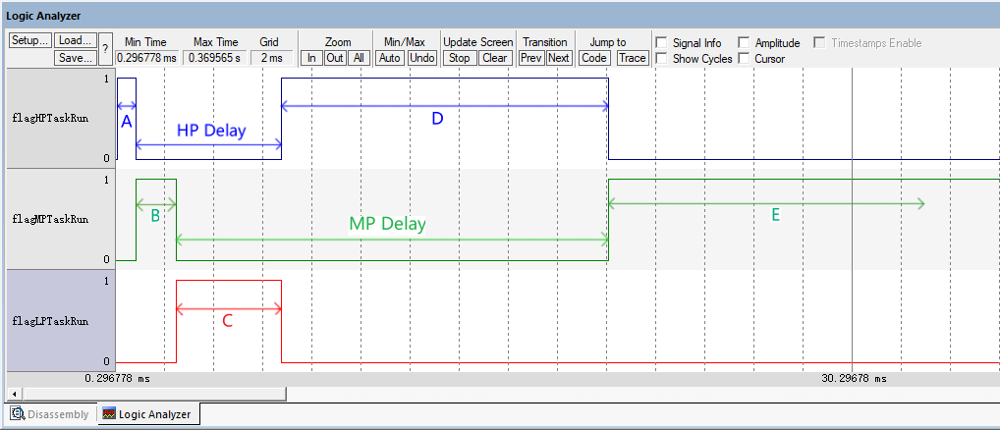

# Semaphore

## Khái niệm

Queue được giới thiệu trước đó có thể được sử dụng để truyền dữ liệu: giữa các task, và giữa các task và các ngắt.

Đôi khi ta chỉ muốn truyền đạt trạng thái, chứ không cần biết thông tin cụ thể, ví dụ:
- Tôi đã hoàn thành công việc rồi, chỉ muốn thông báo cho bạn biết thôi.
- Tao đang dùng phòng vệ sinh rồi, mày cần chờ một chút.

Trong trường hợp này, ta có thể sử dụng semaphore, phương pháp này tiết kiệm bộ nhớ hơn.

Semaphore là một queue đặc biệt nhưng nó không liên quan đến việc truyền dữ liệu. Semaphore hoạt động giống như một biến counter:
- Counting Event - Đếm sự kiện
  - Mỗi lần có sự kiện xảy ra, semaphore sẽ được "give", tăng giá trị counter.
  - Mỗi lần sự kiện được xử lý, semaphore sẽ được "take", giảm giá trị counter.
- Resource Management - quản lý tài nguyên:
  - Để có thể sử dụng tài nguyên, task cần "take" semaphore, giảm counter đi 1.
  - Sau khi dùng xong, task này sẽ phải "give" semaphore, tăng counter đi 1.

  -> Điều này có nghĩa là:
    - Khi counter khác 0: Tài nguyên sẵn sàng hoặc không có task nào sử dụng tài nguyên.
    - Khi counter bằng 0: Tài nguyên bận hoặc có một task đang sử dụng tài nguyên.



Semaphore được chia ra làm hai loại là:
- Binary semaphore
- Counting semaphore

Sự khác biệt duy nhất giữa binary semaphore và counting semaphore là số lượng counter tối đa của binary semaphore là 1.

## Các hàm semaphore

Trước khi sử dụng semaphore, ta cần phải tạo nó và lấy một handle. Khi sử dụng semaphore, ta sẽ sử dụng handle để thao tác với semaphore cần sử dụng.

Các hàm tạo binary semaphore và counting semaphore khác nhau:

- Prototype để tạo binary semaphore như sau:

```c
/* Hàm này sử dụng cấp phát động */ 
SemaphoreHandle_t xSemaphoreCreateBinary( void );

/* Hàm này sử dụng cấp phát tĩnh, nên ta phải cần phải truyền một con trỏ `StaticSemaphore_t`*/ 
SemaphoreHandle_t xSemaphoreCreateBinaryStatic( StaticSemaphore_t *pxSemaphoreBuffer );
```

- Prototype để tạo counting semaphore như sau:

```c
/* Hàm này sử dụng cấp phát động */ 
SemaphoreHandle_t xSemaphoreCreateCounting(UBaseType_t uxMaxCount, UBaseType_t uxInitialCount);

/* Hàm này sử dụng cấp phát tĩnh, nên ta phải cần phải truyền một con trỏ `StaticSemaphore_t`*/
SemaphoreHandle_t xSemaphoreCreateCountingStatic( UBaseType_t uxMaxCount, 
                                                  UBaseType_t uxInitialCount, 
                                                  StaticSemaphore_t *pxSemaphoreBuffer );
```

Đối với các hàm tạo semaphore sử dụng cấp phát động, ta cần phải giải phóng nó khi không còn sử dụng nữa. Ta sử dụng hàm giải phóng với nguyên mẫu như sau:

```c
void vSemaphoreDelete( SemaphoreHandle_t xSemaphore );
```

Hàm `vSemaphoreDelete` có thể được sử dụng để xóa các binary semaphore và counting semaphore.

Các thao tác `give` và `take` đối với binary semaphore và counting semaphore là như nhau. Các hàm này cũng có hai phiên bản: một phiên bản dành cho task và một phiên bản dành cho ISR.

|        | Sử dụng trong task | Sử dụng trong ISR       |
|--------|--------------------|-------------------------|
| `give` | `xSemaphoreGive`   | `xSemaphoreGiveFromISR` |
| `take` | `xSemaphoreTake`	  | `xSemaphoreTakeFromISR` |

Prototype cho các hàm này như sau:

```c
BaseType_t xSemaphoreGive( SemaphoreHandle_t xSemaphore );

BaseType_t xSemaphoreGiveFromISR( SemaphoreHandle_t xSemaphore,
                                  BaseType_t *pxHigherPriorityTaskWoken );

BaseType_t xSemaphoreTake( SemaphoreHandle_t xSemaphore, 
                           TickType_t xTicksToWait );

BaseType_t xSemaphoreTakeFromISR( SemaphoreHandle_t xSemaphore,
                                  BaseType_t *pxHigherPriorityTaskWoken );
```

## Ví dụ cơ bản

Chương trình ví dụ đồng bộ bằng cách sử dụng binary semaphore như trong đoạn mã bên dưới:

```c
SemaphoreHandle_t xBinarySemaphore;

int main( void )
{
    prvSetupHardware();

    xBinarySemaphore = xSemaphoreCreateBinary( );

    if( xBinarySemaphore != NULL )
    {
        xTaskCreate( vSenderTask, "Sender", 1000, NULL, 2, NULL );
        xTaskCreate( vReceiverTask, "Receiver", 1000, NULL, 1, NULL );

        vTaskStartScheduler();
    }

    return 0;
}
```

Quy trình thực thi cho các task gửi và nhận như sau:
- A: Task gửi có độ ưu tiên cao hơn sẽ được thực hiện trước. Nó cố gắng release semaphore 3 lần liên tiếp nhưng chỉ có lần đầu tiên thành công.
B: Sau đó, task gửi bị block do `vTaskDelay`
C: Task nhận chạy, semaphore được acquire và "OK" được in ra; khi cố gắng acquire semaphore lần nữa, nó sẽ chuyển sang trạng thái blocked.
Trước khi `vTaskDelay` của task gửi kết thúc, task idle đang chạy: lúc này cả task gửi và task nhận đều bị block.
D: Task gửi được chạy lại, release ba lần liên tiếp, chỉ có lần thử đầu tiên thành công.
E: Task bị block.
F: Task nhận chạy, acquire semaphore và in ra "OK"; khi cố gắng acquire semaphore, nó sẽ chuyển sang trạng thái blocked.



## Priority inversion

### Khái niệm

Priority inversion là hiện tượng trong hệ thống RTOS khi một task có độ ưu tiên thấp giữ tài nguyên dùng chung, khiến task có độ ưu tiên cao phải đợi. Điều này làm đảo ngược thứ tự ưu tiên thực tế so với thiết kế, dẫn đến trì hoãn không mong muốn.

Priority inversion thường xảy ra khi sử dụng cơ chế đồng bộ hóa semaphore.

Ta có một trường hợp như sau:
- Đầu tiên, task L có độ ưu tiên thấp give semaphore để truy cập vào tài nguyên.
- Task M có độ ưu tiên trung bình sẽ chiếm quyền điều khiển của task 1 cho đến khi nó chủ động nhường quyền điều khiển.
- Task H có độ ưu tiên cao cũng cần truy cập cùng tài nguyên nên muốn give semaphore, tuy nhiên semaphore đang được task L giữ => Task 3 bị block cho đến khi task 1 take semaphore.
- Giả sử task M có một công việc nào đó cần xử lý khá lâu cho đến khi nó nhường quyền điểu khiển cho task 1 thì lúc này, nếu task H có một sự kiện quan trọng cần được xử lý nhưng nó vẫn phải đợi task 1 take semaphore -> điều này sẽ dẫn đến hậu quả không muốn.



Priority inversion có thể gây ra những hậu quả nghiêm trọng trong hệ thống nhúng:
- Trì hoãn task quan trọng: Task ưu tiên cao không chạy kịp thời, ảnh hưởng đến tính real-time.
- Nếu nhiều task trung gian chen vào, thời gian chờ của task ưu tiên cao có thể kéo dài vô hạn.
- Trong các ứng dụng như điều khiển y tế hoặc hàng không, priority inversion có thể dẫn đến sự cố nghiêm trọng.

Để giải quyết vẫn đề đảo ngược độ ưu tiên thì ta cần sử dụng priority inheritance hay kế thừa độ ưu tiên.



Tư tưởng của nó là: khi task H có độ ưu tiên cao bị chặn bởi task L có độ ưu tiên thấp, thì task L có thể được tạm thời nâng độ ưu tiên lên bằng task H. Điều này ngăn task trung gian chen ngang, giúp L hoàn thành nhanh và unlock tài nguyên.

### Ví dụ

Chương trình ví dụ priority inversion như trong đoạn code bên dưới:

```c
SemaphoreHandle_t xLock;

uint8_t flagLPTaskRun = 0;
uint8_t flagMPTaskRun = 0;
uint8_t flagHPTaskRun = 0;

static void vLPTask(void *pvParameters);
static void vMPTask(void *pvParameters);
static void vHPTask(void *pvParameters)

int main(void)
{
    prvSetupHardware();

    xLock = xSemaphoreCreateBinary();

    if(xLock != NULL)
    {
        xSemaphoreGive(xLock);

        xTaskCreate(vLPTask, "LPTask", 1000, NULL, 1, NULL);
        xTaskCreate(vMPTask, "MPTask", 1000, NULL, 2, NULL);
        xTaskCreate(vHPTask, "HPTask", 1000, NULL, 3, NULL);

        vTaskStartScheduler();
    }

    return 0;
}
```

Đoạn code và quy trình thực thi của ba task LPTask/MPTask/HPTask được thể hiện trong hình sau:


Sơ đồ thời gian thực thi chương trình như sau:



## Tham khảo

https://rtos.100ask.net/zh/FreeRTOS/simulator/chapter6.html