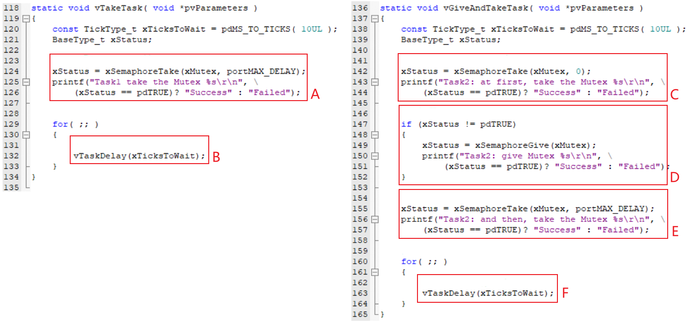
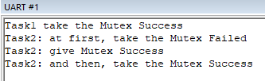

# Mutex

## Khái niệm

Mutex là viết tắt của mutial exclusion, tức là loại trừ lẫn nhau, nó là một binary semaphore đặc biệt nhằm đảm bảo chỉ có **một task duy nhất được quyền truy cập vào tài nguyên tại một thời điểm**.

Cách sử dụng mutex cũng khá đơn giản, nó hoạt động theo cơ chế looking.
- Task A muốn sử dụng tài nguyên quan trọng thì nó sẽ require mutex sau đó mới bắt đầu truy cập.
- Task B cũng muốn sử dụng tài nguyên quan trọng này, nó cũng require mutex nhưng mutex đang được task A giữ nên task B sẽ bị block.
- Task A sử dụng xong tài nguyên quan trọng, nó thực hiện release mutex.
- Sau đó, task B sẽ wakeup và require mutex và bắt đầu truy cập tài nguyên quan trọng.
- Khi task B sử dụng xong, nó sẽ thực hiện release mutex.

Nhìn qua thì quá trình hoạt động của mutex khá tương tự với cách hoạt động của semaphore. Tuy nhiên, mutex có hai điểm khác biệt rõ ràng với semaphore là:
- Ownership: chỉ task nào giữ mutex mới có thể nhả mutex.
- Priority inheritance: mutex có thể kế thừa độ ưu tiên nên nó có thể giải quyết vấn đề priority inversion như đã nói ở bài semaphore.

## Các hàm mutex

Để có thể sử dụng mutex trong FreeRTOS, ta cần định nghĩa trong tệp `FreeRTOSConfig.h`:

```c
#define configUSE_MUTEXES 1
```

Có hai loại hàm tạo mutex: sử dụng bộ nhớ cấp phát động hoặc bộ nhớ cấp phát tĩnh. Prototype của chúng như sau:

```c
SemaphoreHandle_t xSemaphoreCreateMutex( void );
SemaphoreHandle_t xSemaphoreCreateMutexStatic( StaticSemaphore_t *pxMutexBuffer );
```

Các hàm thao tác khác như delete, give/take thì đều giống như các hàm semaphore:

```c
void vSemaphoreDelete( SemaphoreHandle_t xSemaphore );

BaseType_t xSemaphoreGive( SemaphoreHandle_t xSemaphore );

BaseType_t xSemaphoreGiveFromISR( SemaphoreHandle_t xSemaphore,
                                  BaseType_t *pxHigherPriorityTaskWoken );

BaseType_t xSemaphoreTake( SemaphoreHandle_t xSemaphore,
                           TickType_t xTicksToWait );

BaseType_t xSemaphoreGiveFromISR( SemaphoreHandle_t xSemaphore,
                                  BaseType_t *pxHigherPriorityTaskWoken );
```

:::warning Lưu ý
Hàm give/take mutex không được dùng trong hàm ISR vì mutex có cơ chế kế thừa độ ưu tiên và tính chất owner task, điều này chỉ hợp lệ trong context của task, không phải của ISR.
:::

## Ví dụ cơ bản

Chương trình ví dụ sử dụng mutex để đồng bộ như trong đoạn mã bên dưới:

```c
int main( void )
{
    prvSetupHardware();

    xMutex = xSemaphoreCreateMutex( );

    if( xMutex != NULL )
    {
        xTaskCreate( vTakeTask, "Task1", 1000, NULL, 2, NULL );
        xTaskCreate( vGiveAndTakeTask, "Task2", 1000, NULL, 1, NULL );

        vTaskStartScheduler();
    }

    return 0;
}
```

Đoạn code và quy trình thực thi của hai task được thể hiện trong hình sau:



Kết quả đầu ra của chương trình được hiển thị trong hình sau:



## Deadlock

Tình huống khó xử thường gặp: Chúng tôi chỉ tuyển dụng người có kinh nghiệm làm việc! Nếu tôi không có kinh nghiệm làm việc thì sao? Vậy thì hãy đi tìm việc đi!

Giả sử có hai mutex M1 và M2, và hai task A và B:
- A giữ mutex M1, B giữ mutex M2
- A cần giành quyền truy cập vào mutex M2 để hoạt động => A bị block do M2 đang được B giữ.
- B cần giành quyền truy cập vào mutex M1 để hoạt động => B bị block do M1 đang được A giữ.
- Cả A và B đều bị block => Không thể nhả mutex mà chúng đang giữ nữa.

Trường hợp này được gọi là deadlock, có thể hiểu đơn giản là hai task đợi nhau và bị mắc kẹt trong vòng lặp.

Một tình huống khác mà deadlock cũng xảy ra:
- Task A đã giành quyền truy cập vào mutex M.
- Sau đó, nó gọi một hàm trong thư viện.
- Hàm thư viện cần giành quyền truy cập vào cùng một mutex M, vì vậy nó bị block và chờ task A giải phóng mutex

Làm thế nào để giải quyết loại vấn đề này? Có thể sử dụng recursive mutexes. Đặc điểm của nó như sau:
- Khi task A giành được mutex M, nó có thể cố gắng giành lại mutex nhiều lần.
- Mutex sẽ chỉ được nhả sau khi lệnh "take" được gọi N lần và lệnh "give" được gọi N lần.

Tên của các hàm recursive mutexes khác với các hàm của mutex thông thường, nhưng tham số thì giống nhau. Danh sách được hiển thị như bên dưới:

|        | Recursive mutexes                | Mutex                   |
| ------ | -------------------------------- | ----------------------- |
| Create | `xSemaphoreCreateRecursiveMutex` | `xSemaphoreCreateMutex` |
| Take	 | `xSemaphoreTakeRecursive`        | `xSemaphoreTake`        |
| Give	 | `xSemaphoreGiveRecursive`        | `xSemaphoreGive`        |

Prototype của hàm như sau:

```c
SemaphoreHandle_t xSemaphoreCreateRecursiveMutex( void );

BaseType_t xSemaphoreGiveRecursive( SemaphoreHandle_t xSemaphore );

BaseType_t xSemaphoreTakeRecursive( SemaphoreHandle_t xSemaphore,
                                    TickType_t xTicksToWait );
```

## Tham khảo

https://rtos.100ask.net/zh/FreeRTOS/simulator/chapter7.html