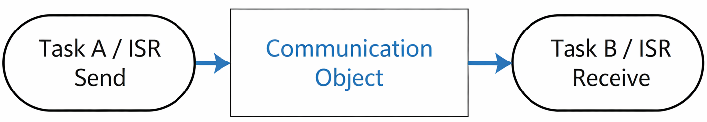
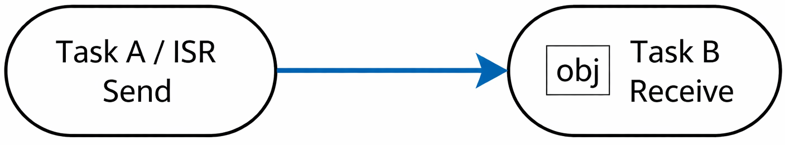

# Task nofification

Thuật ngữ task notification có thể được hiểu là "nofity task" hay thông báo cho task.

Khi sử dụng các phương pháp như queue, semaphore và event group, ta không biết bên kia là ai. Khi sử dụng task notification, ta có thể chỉ định rõ ràng task nào cần được thông báo.

Khi sử dụng queue, semaphore và event group, ta cần tự tạo trước các struct trung gian, và hai bên giao tiếp thông qua struct này:



Khi sử dụng task notification, struct TCB của task sẽ chứa các object nội bộ có thể trực tiếp nhận "thông báo" do task khác gửi:



## Đặc điểm của task notification

### Ưu điểm và hạn chế

Ưu điểm của task notification:

- Sử dụng task notification để gửi sự kiện và dữ liệu đến một task sẽ hiệu quả hơn. Phương pháp này có những ưu điểm vượt trội so với queue, semaphore và event group.
- Khi sử dụng các phương pháp khác, phải tự tạo một struct chứa thông tin của task, nhưng khi sử dụng task notification, không cần tạo thêm struct nào.

Hạn chế của task notification:
- Không thể gửi dữ liệu đến ISR: ISR không có TCB, do đó không thể sử dụng task notification để gửi dữ liệu đến ISR. Tuy nhiên, ISR có thể sử dụng task notification để gửi dữ liệu đến task.
- Khi sử dụng queue để lưu dữ liệu, giả sử độ dài của hàng đợi là N, nó có thể chứa N data item. Khi sử dụng task notification, TCB chỉ chứa một giá trị task notification và chỉ có thể chứa một data item.
- Không thể emit sự kiện đến nhiều task cùng một lúc. Sử dụng event group cho phép gửi sự kiện đến nhiều task đồng thời. Sử dụng task notification, ta chỉ có thể gửi sự kiện đến một task tại một thời điểm.
- Nếu quá trình truyền bị block, sender không thể chuyển sang trạng thái blocked để chờ. Giả sử queue đầy, khi gửi dữ liệu vào queue, task có thể chuyển sang trạng thái blocked để chờ quá trình truyền hoàn tất. Tuy nhiên, khi sử dụng task notification, ngay cả khi receiver không nhận dữ liệu, sender cũng không thể block và phải trả về lỗi ngay lập tức.

### Notification status and notification value

Mỗi task có một struct TCB, trong struct sẽ có hai hai thành viên:
- Một kiểu `uint8_t`, được sử dụng để biểu thị notification status.
- Một kiểu `uint32_t`, được sử dụng để biểu thị notification value.

```c
typedef struct tskTaskControlBlock
{
    ......
    /* configTASK_NOTIFICATION_ARRAY_ENTRIES = 1 */
    volatile uint32_t ulNotifiedValue[ configTASK_NOTIFICATION_ARRAY_ENTRIES ];
    volatile uint8_t ucNotifyState[ configTASK_NOTIFICATION_ARRAY_ENTRIES ];
    ......
} tskTCB;
```

Notification status có ba trạng thái:
- `taskNOT_WAITING_NOTIFICATION`: task không chờ thông báo.
- `taskWAITING_NOTIFICATION`: task đang chờ thông báo.
- `taskNOTIFICATION_RECEIVED`: task đã nhận được thông báo, còn được gọi là trạng thái pending (dữ liệu đã có, đang chờ xử lý).

```c
#define taskNOT_WAITING_NOTIFICATION              ( ( uint8_t ) 0 )
#define taskWAITING_NOTIFICATION                  ( ( uint8_t ) 1 )
#define taskNOTIFICATION_RECEIVED                 ( ( uint8_t ) 2 )
```

Notification value có thể thuộc nhiều loại:
- Giá trị count
- Bit (tương tự event group)
- Hoặc bất kỳ giá trị nào