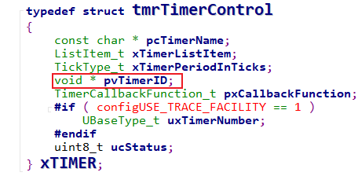
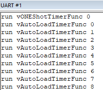

Software timer có thể được ví như một "đồng hồ báo thức" trong hệ thống phần mềm.

Trong đời sống hằng ngày, ta có thể đặt báo thức để:
- Sau 30 phút thì thức dậy làm việc
- Mỗi 1 giờ kiểm tra tình trạng vận hành của máy móc

Software timer cũng thực hiện hai loại công việc tương tự:
- Thực thi một callback function tại một thời điểm xác định trong tương lai.
- Thực thi một callback function theo chu kỳ.

## Đặc điểm của software timer

Khi thêm một báo thức trên ứng dụng điện thoại, ta cần chỉ định:
- Thời gian
- Loại báo thức (một lần hay lặp lại)
- Công việc cần thực hiện

Việc sử dụng software timer cũng tương tự như vậy:
- Period: khoảng thời gian từ lúc timer start cho đến khi callback function thực thi.
- Timer gồm hai loại:
  - One-shot timer: sau khi start, callback function chỉ được gọi một lần và sau đó timer không tự động chạy lại.
  - Auto-reload timer: sau khi start, khi hết thời gian thì timer sẽ tự động reload và callback function được gọi định kỳ.
- Callback function: hàm sẽ được thực thi khi timeout.

Software timer có hai trạng thái:
- Running (Active): timer đang hoạt động, khi đến thời điểm timeout thì callback function sẽ được gọi.
- Dormant: timer vẫn tồn tại và có thể được truy cập thông qua handle, nhưng không chạy và callback function sẽ không được gọi.

## Daemon task

### Khái niệm

RTOS có tick interrupt, và software timer được xây dựng dựa trên tick này. Vậy các hàm callback function của timer được thực thi ở đâu? Có thể suy nghĩ đến là bên trong ngắt tick:
- Kiểm tra timer timeout trong ISR
- Gọi callback function ngay trong ISR

Tuy nhiên RTOS không cho phép thực thi các đoạn code có thời gian chạy không xác định trong ISR, vì điều này có thể ảnh hưởng đến toàn bộ hệ thống. Do đó, RTOS không thực thi callback function của timer trong Tick ISR.

Thay vào đó, RTOS sử dụng một task chuyên dụng gọi là RTOS daemon task (trước đây gọi là timer server). Task này không chỉ xử lý timer mà còn đảm nhiệm các công việc nền khác của RTOS.

Khi định nghĩa macro trong file cấu hình `FreeRTOSConfig.h`:

```c
#define configUSE_TIMERS 1
```

Daemon task sẽ được tự động tạo khi bộ lập lịch được khởi động.

### Timer command queue

Các task do người dùng viết không thao tác trực tiếp với timer, mà thông qua timer command queue để gửi yêu cầu đến daemon task.

Daemon task sẽ:
- Nhận command từ queue
- Xử lý command (start, stop, reset, change period)
- Thực thi callback function khi timer timeout

Độ ưu tiên của daemon task được cấu hình bởi `configTIMER_TASK_PRIORITY`, và độ dài queue được cấu hình bởi `configTIMER_QUEUE_LENGTH`.

### Lập lịch cho daemon task

Daemon task được lập lịch giống như các task bình thường khác. Nó chỉ được chạy khi là task có độ ưu tiên cao nhất trong trạng thái ready.

Công việc của daemon task gồm hai loại:
- Xử lý command trong timer command queue
- Gọi callback function của timer

Khả năng xử lý các timer command và thực thi các hàm callback function một cách nhanh chóng phụ thuộc rất nhiều vào độ ưu tiên của daemon task.

:::warning Lưu ý
Thời điểm timeout của timer được tính từ lúc gọi hàm `xTimerStart()`, không phải từ lúc daemon task xử lý command.
:::

## Các API của software timer

### Create timer

Để sử dụng software timer, trước tiên cần tạo timer và lấy `TimerHandle_t`.

FreeRTOS hỗ trợ hai cách tạo timer là cấp phát động và cấp pháp tĩnh

**Prototype tạo timer bằng cấp pháp động**

```c
/* 
 * pcTimerName: tên timer (chủ yếu dùng cho debug)
 * xTimerPeriodInTicks: chu kỳ timer (đơn vị tick)
 * uxAutoReload: pdTRUE = auto-reload, pdFALSE = one-shot
 * pvTimerID: ID do user quản lý
 * pxCallbackFunction: callback function
 * Giá trị trả về: TimerHandle_t nếu thành công, NULL nếu thất bại
 */
TimerHandle_t xTimerCreate( const char * const pcTimerName, 
                            const TickType_t xTimerPeriodInTicks,
                            const UBaseType_t uxAutoReload,
                            void * const pvTimerID,
                            TimerCallbackFunction_t pxCallbackFunction );
```

**Prototype tạo timer bằng cấp pháp tĩnh**

```c
/* 
 * pxTimerBuffer: bộ nhớ do user cung cấp (StaticTimer_t)
 */
TimerHandle_t xTimerCreateStatic(const char * const pcTimerName,
                                 TickType_t xTimerPeriodInTicks,
                                 UBaseType_t uxAutoReload,
                                 void * pvTimerID,
                                 TimerCallbackFunction_t pxCallbackFunction,
                                 StaticTimer_t *pxTimerBuffer );
```

Callback function có prototype như sau:

```c
void ATimerCallback( TimerHandle_t xTimer );
typedef void (* TimerCallbackFunction_t)( TimerHandle_t xTimer );
```

:::warning Chú ý
- Callback function phải thực thi nhanh và tránh rơi vào trạng thái blocked.
- Tránh gọi các hàm API làm block như `vTaskDelay()`
- Có thể gọi các API như `xQueueReceive()` nhưng timeout phải bằng 0, trả về ngay lập tức không bị block.
:::

### Delete timer

Các timer được tạo bằng cấp pháp động cần phải được giải phóng khi không sử dụng bằng hàm có prototype như sau:

```c
/*
 * xTimer: handle của timer cần xóa
 * xTicksToWait: thời gian chờ ghi vào command queue
 * Giá trị trả về:
 * - pdPASS: thành công
 * - pdFAIL: không thể ghi vào command queue trong thời gian xTicksToWait
 */
BaseType_t xTimerDelete( TimerHandle_t xTimer, TickType_t xTicksToWait );
```

### Start/stop timer

Start timer có nghĩa là thiết lập trạng thái của nó thành active.

Stop timer có nghĩa là đặt trạng thái của nó thành dormant, ngăn không cho nó hoạt động.

Prototype các hàm start/stop timer như sau:

```c
BaseType_t xTimerStart( TimerHandle_t xTimer, TickType_t xTicksToWait );

BaseType_t xTimerStartFromISR(   TimerHandle_t xTimer,
                                 BaseType_t *pxHigherPriorityTaskWoken );
BaseType_t xTimerStop( TimerHandle_t xTimer, TickType_t xTicksToWait );

BaseType_t xTimerStopFromISR(    TimerHandle_t xTimer,
                                 BaseType_t *pxHigherPriorityTaskWoken );
```

Tham số `xTicksToWait` trong các hàm thể hiện khoảng thời gian chờ để ghi lệnh vào command queue. Command queue có thể bị đầy và không thể ghi lệnh ngay lập tức mà cần chờ một khoảng thời gian.

### Reset timer

Reset timer được dùng để:
- Đưa timer từ trạng thái dormant sang trạng thái running
- Hoặc reset lại thời điểm timeout nếu timer đang running

Prototype của hàm reset timer như sau:

```c
BaseType_t xTimerReset( TimerHandle_t xTimer, TickType_t xTicksToWait );

BaseType_t xTimerResetFromISR( TimerHandle_t xTimer,
                               BaseType_t *pxHigherPriorityTaskWoken );
```

### Change period

Thay đổi chu kỳ của timer và đồng thời đưa timer từ trạng thái dormant sang trạng thái running.

```c
BaseType_t xTimerChangePeriod(   TimerHandle_t xTimer,
                                 TickType_t xNewPeriod,
                                 TickType_t xTicksToWait );

BaseType_t xTimerChangePeriodFromISR( TimerHandle_t xTimer,
                                      TickType_t xNewPeriod,
                                      BaseType_t *pxHigherPriorityTaskWoken );
```

### Timer ID

Mỗi timer có một trường `pvTimerID` do user quản lý.



Cách sử dụng timer id hoàn toàn phụ thuộc vào chương trình:
- Phân biệt các timer
- Lưu context cho callback function

Giá trị ban đầu của timer id được truyền vào hàm `xTimerCreate()` khi timer được tạo và có thể được điều chỉnh bằng các hàm có prototype như sau:

```c
void *pvTimerGetTimerID( TimerHandle_t xTimer );

void vTimerSetTimerID( TimerHandle_t xTimer, void *pvNewID );
```

Các API này không thông qua timer command queue, mà truy cập trực tiếp timer object.

## Ví dụ đơn giản

Để sử dụng software timer, ta cần phải định nghĩa các macro sau trong file config `FreeRTOSConfig.h`:

```c
#define configUSE_TIMERS			 1 
#define configTIMER_TASK_PRIORITY    31
#define configTIMER_QUEUE_LENGTH     5
#define configTIMER_TASK_STACK_DEPTH 32
```

Hàm main tạo và khởi động hai timer: one-shot timer và auto-reload timer.

```c
static volatile uint8_t flagONEShotTimerRun = 0;
static volatile uint8_t flagAutoLoadTimerRun = 0;

static void vONEShotTimerFunc( TimerHandle_t xTimer );
static void vAutoLoadTimerFunc( TimerHandle_t xTimer );

/*-----------------------------------------------------------*/

#define mainONE_SHOT_TIMER_PERIOD pdMS_TO_TICKS( 10 )
#define mainAUTO_RELOAD_TIMER_PERIOD pdMS_TO_TICKS( 20 )

int main( void )
{
    TimerHandle_t xOneShotTimer;
    TimerHandle_t xAutoReloadTimer;

    prvSetupHardware();

    xOneShotTimer = xTimerCreate(	
        "OneShot",
        mainONE_SHOT_TIMER_PERIOD,
        pdFALSE,
        0,
        vONEShotTimerFunc
    );	

    xAutoReloadTimer = xTimerCreate(	
        "AutoReload",
        mainAUTO_RELOAD_TIMER_PERIOD,
        pdTRUE,
        0,
        vAutoLoadTimerFunc
    );	

    if (xOneShotTimer && xAutoReloadTimer)
    {
        xTimerStart(xOneShotTimer, 0);
        xTimerStart(xAutoReloadTimer, 0);
        
        vTaskStartScheduler();
    }

    return 0;
}
```

Các hàm callback function cho hai timer này tương đối đơn giản:

```c
static void vONEShotTimerFunc( TimerHandle_t xTimer )
{
    static int cnt = 0;
    flagONEShotTimerRun = !flagONEShotTimerRun;
    printf("run vONEShotTimerFunc %d\r\n", cnt++);
}

static void vAutoLoadTimerFunc( TimerHandle_t xTimer )
{
    static int cnt = 0;
    flagAutoLoadTimerRun = !flagAutoLoadTimerRun;
    printf("run vAutoLoadTimerFunc %d\r\n", cnt++);
}
```

Kết quả được thể hiện trong hình sau:



## Tham khảo

https://rtos.100ask.net/zh/FreeRTOS/simulator/chapter10.html