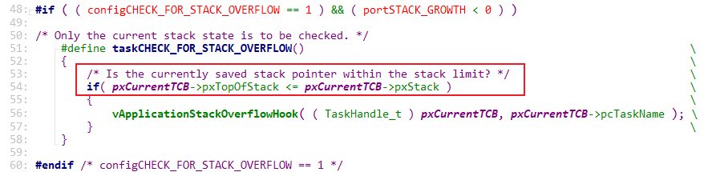

# Các phương pháp debug

Ngoài việc lấy log bằng printf hoặc assert, FreeRTOS cũng hỗ trợ một số phương pháp để debug. Các phương pháp này sẽ được nói trong bài này.

## Trace

FreeRTOS định nghĩa nhiều macro bắt đầu bằng "trace", và các macro này được đặt ở những vị trí quan trọng trong hệ thống.

Đây thường là các macro rỗng, không ảnh hưởng đến mã nguồn: không ảnh hưởng đến kích thước của chương trình đang được xử lý, cũng như không ảnh hưởng đến thời gian chạy.

Khi cần debug một số hàm nhất định, chúng ta có thể sửa macro: sửa các biến cờ, in thông tin, v.v.

| Macro | mô tả |
|-------|-------|
| `traceTASK_INCREMENT_TICK(xTickCount)` | Hàm macro này được gọi trước khi tick counter tăng. Tham số `xTickCount` là giá trị tick hiện tại, chưa được tăng lên. |
| `traceTASK_SWITCHED_OUT()` | Trong `vTaskSwitchContext`, macro này được gọi trước khi context switch. |
| `traceTASK_SWITCHED_IN()`	| Trong `vTaskSwitchContext`, macro này được gọi khi một task mới được switch in. |
| `traceBLOCKING_ON_QUEUE_RECEIVE(pxQueue)` | Hàm này được gọi ngay lập tức khi task đang thực thi bị block do cố gắng đọc từ một queue, semaphore hoặc mutex trống. Tham số `pxQueue` lưu handle đến queue, semaphore hoặc mutex đang cố gắng đọc. |
| `traceBLOCKING_ON_QUEUE_SEND(pxQueue)` | Hàm này được gọi ngay lập tức khi task đang thực thi bị block do cố gắng ghi vào queue, semaphore hoặc mutex đã đầy. Tham số `pxQueue` lưu handle đến queue, semaphore hoặc mutex đang cố gắng ghi. |
| `traceQUEUE_SEND(pxQueue)` | Khi một queue hoặc semaphore được gửi thành công, hàm macro này sẽ được gọi trong các hàm `xQueueSend`, `xQueueSendToFront`, `xQueueSendToBack` và tất cả các hàm gửi semaphore. Tham số `pxQueue` là lưu handle của queue hoặc semaphore cần được gửi. |
| `traceQUEUE_SEND_FAILED(pxQueue)` | Khi một queue hoặc semaphore không được gửi đi thành công, hàm macro này sẽ được gọi trong các hàm `xQueueSend`, `xQueueSendToFront`, `xQueueSendToBack` và tất cả các hàm gửi semaphore. Tham số `pxQueue` là handle của queue hoặc semaphore cần được gửi. |
| `traceQUEUE_RECEIVE(pxQueue)` | Khi một queue được đọc thành công hoặc một semaphore được nhận thành công, hàm macro này sẽ được gọi trong hàm `xQueueReceive` và tất cả các hàm nhận semaphore. Tham số `pxQueue` là handle của queue hoặc semaphore cần được nhận. |
| `traceQUEUE_RECEIVE_FAILED(pxQueue)` | Hàm macro này được gọi trong hàm `xQueueReceive` và tất cả các hàm nhận semaphore khi việc đọc từ queue hoặc nhận semaphore thất bại. Tham số `pxQueue` là handle đến queue hoặc semaphore cần được nhận. |
| `traceQUEUE_SEND_FROM_ISR(pxQueue)` | Hàm này được gọi trong `xQueueSendFromISR` khi một queue được gửi thành công trong quá trình xử lý ngắt. Tham số `pxQueue` là handle đến queue cần được gửi. |
| `traceQUEUE_SEND_FROM_ISR_FAILED(pxQueue)` | Hàm này được gọi trong `xQueueSendFromISR` khi việc gửi queue thất bại trong quá trình xử lý ngắt. Tham số `pxQueue` là handle đến queue cần được gửi. |
| `traceQUEUE_RECEIVE_FROM_ISR(pxQueue)` | Hàm này được gọi trong `xQueueReceiveFromISR` khi một queue được đọc thành công trong quá trình xử lý ngắt. Tham số `pxQueue` là handle đến queue cần được gửi. |
| `traceQUEUE_RECEIVE_FROM_ISR_FAILED(pxQueue)` | Hàm này được gọi trong `xQueueReceiveFromISR` khi việc đọc từ queue thất bại trong quá trình xử lý ngắt. Tham số `pxQueue` là handle đến queue cần được gửi. |
| `traceTASK_DELAY_UNTIL()` | Hàm macro này sẽ được gọi ngay lập tức trong `vTaskDelayUntil` ngay trước khi một task chuyển sang trạng thái blocked do lệnh gọi đến `vTaskDelayUntil`. |
| `traceTASK_DELAY()` | Hàm macro này sẽ được gọi ngay lập tức trong `vTaskDelay` ngay trước khi một task chuyển sang trạng thái blocked do lệnh gọi đến `vTaskDelay`. |

## Hook malloc

Khi lập trình, hầu hết các lỗi logic đều dễ giải quyết. Khó xử lý là các lỗi liên quan đến truy cập bộ nhớ out-of-bounds, stack overflow và những lỗi tương tự.

Lỗi truy cập bộ nhớ out-of-bounds thường xảy ra khi sử dụng heap: heap là vùng nhớ được cấp phát bằng lệnh `malloc`.

Không có cách nào hiệu quả để phát hiện lỗi truy cập bộ nhớ memory out-of-bounds, nhưng có thể cung cấp một số hàm hook:

  - Nếu `pvPortMalloc` thất bại và nó được cấu hình `configUSE_MALLOC_FAILED_HOOK` là 1 trong `FreeRTOSConfig.h`, hàm sau sẽ được gọi:

  ```c
  void vApplicationMallocFailedHook(void);
  ```

## Hook stack overflow

Khi chuyển đổi giữa các task (vTaskSwitchContext), hàm `taskCHECK_FOR_STACK_OVERFLOW` được gọi để kiểm tra stack overflow. Nếu xảy ra stack overflow, hàm hook sau sẽ được gọi:

```c
void vApplicationStackOverflowHook(TaskHandle_t xTask, char * pcTaskName);
```

Làm thế nào để phát hiện lỗi stack overflow? Có hai phương pháp:

- Phương pháp 1:
  - Trước khi task hiện tại được switch, toàn bộ môi trường thực thi của nó được lưu vào stack, và đây có thể là lúc stack đạt đỉnh điểm.
  - Phương pháp này hiệu quả nhưng không chính xác.
  - Ví dụ, một task có thể gọi hàm A trong quá trình thực thi, nó sử dụng nhiều stack, và chỉ được thực hiện khi hàm A kết thúc.

  

- Phương pháp 2:
  - Khi một task được tạo, stack của nó sẽ được điền một giá trị cố định, chẳng hạn như 0xa5.
  - Nếu 16 byte dữ liệu cuối cùng trong stack không phải là 0xa5, điều đó có nghĩa là stack sắp hết hoặc đã hết bộ nhớ.
  - Phương pháp này không nhanh bằng phương pháp 1, nhưng cũng đủ nhanh rồi. Nó có thể bắt được hầu hết các lỗi stack overflow.
  - Tại sao lại là hầu hết tất cả? Có thể một số hàm sử dụng stack và trùng hợp ngẫu nhiên, thiết lập stack về 0xa5: điều này gần như không thể xảy ra.

  

## Task statistics

Trong Windows, khi hệ thống bị chậm, ta có thể kiểm tra task manager để tìm chương trình tiêu thụ nhiều tài nguyên CPU nhất.

Trong FreeRTOS, ta cũng có thể xem mức sử dụng CPU và mức sử dụng stack của một task, sau đó thực hiện các tối ưu hóa có mục đích.

-> Điều này được thực hiện thông qua ba hàm: `uxTaskGetSystemState`, `vTaskList` và `vTaskGetRunTimeStats`.

Chúng có tác dụng chụp ảnh (snapshot) trạng thái hệ thống RTOS tại thời điểm được gọi.

Để sử dụng ba hàm này thì ta cần định nghĩa các macro sau trong file cấu hình `FreeRTOSConfig.h`:

```c
#define configGENERATE_RUN_TIME_STATS 1
#define configUSE_TRACE_FACILITY    1
#define configUSE_STATS_FORMATTING_FUNCTIONS  
```

Chức năng từng hàm:

- `uxTaskGetSystemState`: lấy thông tin của toàn bộ của toàn bộ task.

  ```c
  UBaseType_t uxTaskGetSystemState( TaskStatus_t * const pxTaskStatusArray,
                                    const UBaseType_t uxArraySize,
                                    uint32_t * const pulTotalRunTime );
  ```
  
  Thông tin từng tham số:
  
  | Tham số | Mô tả |
  |---------|-------|
  | `pxTaskStatusArray` | Trỏ đến một mảng các struct `TaskStatus_t` được sử dụng để lưu trữ số liệu thống kê của task. |
  | `uxArraySize` | Kích thước mảng và số lượng phần tử trong mảng phải lớn hơn hoặc bằng 1. |
  | `pulTotalRunTime` | Dùng để lưu tổng thời gian chạy hiện tại đối với các faster timer, có thể truyền vào giá trị `NULL`. |
  
  Với struct `TaskStatus_t` có cấu trúc như sau:
  
  ```c
  typedef struct
  {
      TaskHandle_t xHandle;
      const char *pcTaskName;
      UBaseType_t uxCurrentPriority;
      UBaseType_t uxBasePriority;
      eTaskState eCurrentState;
      uint32_t ulRunTimeCounter;
      uint16_t usStackHighWaterMark;
  } TaskStatus_t;
  ```

- `vTaskList`: Xem trạng thái hiện tại của tất cả task.

  Nó trả lời câu hỏi:
  - Task nào đang chạy.
  - Task nào đang block.
  - Task nào suspended.
  - Task nào sắp tràn stack.
  
  Protype của hàm như sau:
  
  ```c
  void vTaskList( signed char *pcWriteBuffer );
  ```
  
  Output `pcWriteBuffer` sẽ có định dạng như sau:

  ```
  Name     State  Prio  Stack  Num
  HPTask   R      3     180    3
  MPTask   B      2     150    2
  LPTask   R      1     200    1
  ```

  Trong đó:
  - `Name`: tên task.
  - `State`: trạng thái của task
    - R = Running
    - B = Blocked
    - S = Suspended
    - Rdy = Ready
  - `Prio`: độ ưu tiên hiện tại của task.
  - `Stack`: Stack high water mark, đơn vị là `word` (càng nhỏ càng nguy hiểm).
  - `Num`: Task number/ID nội bộ do kernel cấp.

- `vTaskGetRunTimeStats`: phân tích CPU load từng task.

  Nó trả lời:
  - Task nào chiếm CPU nhiều nhất.
  - Idle task còn bao nhiêu %.
  - Có task nào chạy quá lâu không yield không.
  
  Protype của hàm như sau:
  
  ```c
  void vTaskGetRunTimeStats( signed char *pcWriteBuffer );
  ```

  Output `pcWriteBuffer` sẽ có định dạng như sau:
  
  ```
  Task           Time      %
  Idle           5000      50%
  WiFi           3000      30%
  AppTask        2000      20%
  ```

  Với:
  - `Task`: tên task.
  - `Time`: Tổng thời gian task đã chạy trên CPU. Đơn vị: tick của runtime timer (Không phải systick timer).
  - `%`: phần trăm task chiếm CPU.

  Task idle có phần trăm chiếm CPU càng nhỏ thì CPU càng quá tải.

## Tham khảo

https://rtos.100ask.net/zh/FreeRTOS/simulator/chapter13.html