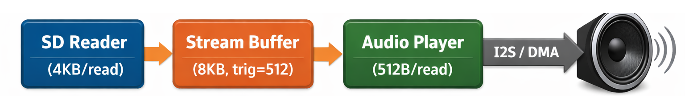

Trong phần queue đã giới thiệu ở bài trước, ta thấy rằng queue truyền dữ liệu theo data item có kích thước cố định. Cơ chế này rất phù hợp khi truyền các dữ liệu nhỏ như event, command hoặc struct.

Tuy nhiên trong các hệ thống embedded thực tế, đặc biệt là các hệ thống xử lý dữ liệu liên tục như audio streaming, đọc file từ sdcard, truyền dữ liệu từ DMA hoặc giao tiếp network, dữ liệu thường có những đặc điểm sau:
- Kích thước dữ liệu không cố định.
- Dữ liệu có thể rất lớn (hàng KB hoặc nhiều hơn).
- Producer và consumer hoạt động với tốc độ khác nhau.
- Dữ liệu cần được truyền theo dạng stream thay vì từng item rời rạc.

### Ví dụ cụ thể: Hạn chế của queue khi truyền audio data

Để hiểu rõ hơn tại sao queue không phù hợp cho dữ liệu dạng stream, hãy xem xét ví dụ sau.

Giả sử ta có một hệ thống phát audio từ SDCard qua I2S. Hệ thống gồm hai task:

- **Producer (SD Reader):** đọc dữ liệu từ SDCard, mỗi lần đọc **4KB** để tận dụng tốc độ đọc tuần tự của SDCard.
- **Consumer (Audio Player):** lấy dữ liệu và gửi sang I2S DMA, mỗi lần cần **512 byte** vì DMA buffer có kích thước cố định 512 byte.

Đây là tình huống rất phổ biến trong embedded: producer và consumer xử lý dữ liệu với kích thước hoàn toàn khác nhau. Và đặc điểm cốt lõi của queue là **item size phải được cố định ngay từ lúc tạo** — mọi lần gửi và nhận đều phải tuân theo đúng kích thước này. Vậy chọn item size bằng bao nhiêu khi producer cần gửi 4KB còn consumer chỉ cần nhận 512 byte?

**Nếu chọn item size = 512 byte (theo consumer):**

```c
QueueHandle_t audio_queue = xQueueCreate(8, 512);
```

Consumer lấy dữ liệu rất thuận tiện — mỗi lần `xQueueReceive` nhận đúng 512 byte, gửi thẳng sang DMA. Nhưng phía producer thì phải tự chia 4KB thành 8 item 512 byte rồi gọi `xQueueSend` 8 lần liên tiếp. Code producer trở nên phức tạp hơn vì phải quản lý vòng lặp chia nhỏ dữ liệu. Và nếu lần đọc SDCard cuối file chỉ còn 2000 byte (không chia hết cho 512), producer phải xử lý riêng phần dư 464 byte — hoặc padding thêm 48 byte rác, hoặc viết logic gửi item cuối không đầy đủ rồi consumer phải biết cách bỏ phần thừa.

**Nếu chọn item size = 4096 byte (theo producer):**

```c
QueueHandle_t audio_queue = xQueueCreate(2, 4096);
```

Producer gửi rất gọn — mỗi lần `xQueueSend` đẩy cả 4KB vào queue một phát. Nhưng bây giờ consumer gặp vấn đề: nó chỉ cần 512 byte cho mỗi lần DMA transfer, nhưng `xQueueReceive` bắt buộc phải nhận 4096 byte. Consumer phải cấp phát buffer 4KB để nhận, rồi tự chia nhỏ thành 8 phần 512 byte, tự quản lý offset đọc đến đâu rồi. Thay vì code đơn giản "nhận dữ liệu → gửi DMA", consumer giờ phải có thêm logic quản lý buffer nội bộ.

Ngoài ra, mỗi lần `xQueueSend` kernel copy toàn bộ 4096 byte vào vùng nhớ nội bộ của queue, rồi `xQueueReceive` lại copy 4096 byte ra. Tổng cộng 8KB bị copy cho mỗi block, rất tốn CPU. Queue 2 item × 4096 byte cũng ngốn 8KB RAM chỉ riêng cho vùng nhớ nội bộ.

**Chọn size nào cũng sai:**

Đây chính là thế khó xử cốt lõi. Chọn theo producer thì consumer phải tự chia nhỏ. Chọn theo consumer thì producer phải tự chia nhỏ. Chọn size trung gian thì cả hai đều phải xử lý. Bất kể chọn thế nào, một hoặc cả hai phía đều phải viết thêm logic chia nhỏ/ghép lại dữ liệu — logic mà đáng ra không nên tồn tại.

Vấn đề gốc rễ không nằm ở việc chọn item size bao nhiêu, mà nằm ở chỗ **queue bắt buộc producer và consumer phải thống nhất một kích thước item chung** — điều không thể đáp ứng khi hai bên có nhu cầu kích thước khác nhau.

Chính vì vậy FreeRTOS cung cấp một cơ chế chuyên biệt cho các trường hợp truyền dữ liệu dạng stream, đó là **stream buffer**.

## Khái niệm Stream Buffer

Stream buffer là một vùng nhớ FIFO dạng circular buffer được kernel quản lý, dùng để truyền stream byte liên tục từ task này sang task khác hoặc giữa interrupt và task.

Khác với queue, stream buffer không làm việc theo data item mà làm việc trực tiếp trên byte stream. Producer có thể ghi 4KB trong một lần gọi, consumer có thể đọc 512 byte trong một lần gọi — mỗi bên làm việc với kích thước phù hợp nhất với mình mà không cần quan tâm bên kia đang dùng bao nhiêu. Không còn phải chia nhỏ, ghép lại, hay padding.

Một số đặc điểm quan trọng:
- Dữ liệu được truyền theo dạng byte liên tục.
- Không yêu cầu kích thước cố định.
- Hoạt động theo cơ chế FIFO.
- Tối ưu cho truyền dữ liệu lớn.
- Chỉ hỗ trợ một producer và một consumer.

:::warning Chú ý
Nếu có nhiều task cùng ghi hoặc cùng đọc, dev phải tự bảo vệ bằng mutex hoặc sử dụng cơ chế khác phù hợp hơn.
:::

## Cơ chế hoạt động của stream buffer

Bên trong kernel, stream buffer được triển khai như một ring buffer với hai con trỏ chính:
- Con trỏ ghi (write index).
- Con trỏ đọc (read index).

Dữ liệu luôn được ghi và đọc theo thứ tự FIFO.

### Hoạt động khi ghi dữ liệu

Khi một task hoặc ISR ghi dữ liệu vào stream buffer:
- Nếu buffer còn đủ chỗ trống, dữ liệu sẽ được ghi ngay vào vùng nhớ.
- Nếu buffer không đủ chỗ, task ghi có thể bị chuyển sang trạng thái blocked và chờ cho đến khi consumer đọc bớt dữ liệu.
- Khi consumer đọc dữ liệu và giải phóng chỗ trống, task ghi sẽ được đánh thức và chuyển về trạng thái ready.

### Hoạt động khi đọc dữ liệu

Khi một task đọc dữ liệu từ stream buffer:
- Nếu buffer đang có dữ liệu, dữ liệu sẽ được copy ra buffer người dùng.
- Nếu buffer rỗng, task đọc có thể bị chuyển sang trạng thái blocked và chờ dữ liệu mới.
- Khi producer ghi thêm dữ liệu, task đọc sẽ được đánh thức.

Tuy nhiên, có một câu hỏi quan trọng: **task đọc nên được đánh thức khi nào?** Nếu producer mới ghi 1 byte mà đã đánh thức consumer, consumer sẽ chạy nhưng chỉ nhận được rất ít dữ liệu, rồi lại phải block chờ tiếp. Điều này gây lãng phí context switch. Đây chính là lý do stream buffer cung cấp cơ chế **trigger level**.

### Trigger Level

Trigger level là ngưỡng (tính bằng byte) để kernel quyết định khi nào đánh thức task đọc đang bị blocked.

**Quy tắc:** Task đọc chỉ được đánh thức khi số byte có sẵn trong buffer **≥ trigger level**.

Hãy xem ví dụ cụ thể để hiểu rõ hơn:

```c
StreamBufferHandle_t stream = xStreamBufferCreate(8192, 512);
```

Với cấu hình này:

1. Consumer gọi `xStreamBufferReceive()` khi buffer rỗng → consumer bị blocked.
2. Producer ghi 100 byte vào buffer → buffer có 100 byte, nhưng 100 < 512 → **consumer vẫn tiếp tục blocked**, kernel không đánh thức.
3. Producer ghi thêm 200 byte → buffer có 300 byte, nhưng 300 < 512 → **consumer vẫn blocked**.
4. Producer ghi thêm 300 byte → buffer có 600 byte, 600 ≥ 512 → **kernel đánh thức consumer**.
5. Consumer chạy và đọc dữ liệu từ buffer.

**Nếu trigger level = 1 (mặc định):**

Mỗi lần producer ghi bất kỳ dữ liệu nào, consumer đều bị đánh thức ngay. Điều này có thể dẫn đến consumer bị wakeup quá nhiều lần khi producer ghi dữ liệu rải rác.

**Chọn trigger level như thế nào?**

Trigger level nên được đặt dựa trên đơn vị xử lý nhỏ nhất có ý nghĩa của consumer. Ví dụ:

- Audio streaming qua I2S với DMA buffer 512 byte → trigger level = 512. Consumer chỉ cần thức khi có đủ dữ liệu cho một lần DMA transfer.
- Network packet processing với MTU 1500 byte → trigger level = 1500.
- Log system ghi theo dòng (trung bình 80 byte/dòng) → trigger level = 80.

:::warning Lưu ý
Trigger level chỉ có tác dụng khi task đọc **đang bị blocked** (tức là task gọi `xStreamBufferReceive()` lúc buffer rỗng và đang nằm chờ). Khi đó, kernel sẽ không đánh thức task cho đến khi buffer tích lũy đủ số byte ≥ trigger level.

Nhưng nếu task gọi `xStreamBufferReceive()` vào thời điểm buffer **đã có sẵn dữ liệu** thì trigger level không có ý nghĩa gì — hàm trả về ngay lập tức với bao nhiêu byte đang có, kể cả khi số byte đó ít hơn trigger level. Ví dụ: trigger level = 512, buffer đang chứa 100 byte, task gọi `xStreamBufferReceive()` → hàm trả về ngay 100 byte, không block.

Nói cách khác, trigger level là điều kiện để **đánh thức**, không phải điều kiện để **đọc**.
:::

## So sánh queue và stream buffer

Sau khi đã hiểu cách hoạt động của stream buffer, ta có thể so sánh trực tiếp với queue:

| Đặc điểm                  | Queue          | Stream buffer        |
| ------------------------- | -------------- | -------------------- |
| Đơn vị truyền             | Data item      | Byte stream          |
| Kích thước dữ liệu        | Cố định        | Linh hoạt            |
| Hỗ trợ nhiều producer     | Có             | Không                |
| Hiệu năng với dữ liệu lớn | Thấp           | Cao                  |
| Phù hợp                   | Event, command | Audio, file, network |
| Overhead                  | Cao            | Thấp                 |

**Nguyên tắc chọn đơn giản:**
- Dữ liệu nhỏ, rời rạc, nhiều nguồn gửi → **Queue**.
- Dữ liệu lớn, liên tục, một nguồn gửi → **Stream buffer**.

## Các API chính của stream buffer

### Tạo stream buffer

```c
StreamBufferHandle_t xStreamBufferCreate(
    size_t xBufferSizeBytes,
    size_t xTriggerLevelBytes
);
```

Tham số:
- `xBufferSizeBytes`: tổng dung lượng của buffer.
- `xTriggerLevelBytes`: số byte tối thiểu cần có để đánh thức task đọc.

Hàm trả về handle của stream buffer hoặc NULL nếu cấp phát thất bại.

### Ghi dữ liệu vào stream buffer

```c
size_t xStreamBufferSend(
    StreamBufferHandle_t xStreamBuffer,
    const void *pvTxData,
    size_t xDataLengthBytes,
    TickType_t xTicksToWait
);
```

Ý nghĩa:
- Ghi một chuỗi byte vào buffer.
- Trả về số byte thực tế đã được ghi.

Nếu buffer không đủ chỗ:
- Task có thể bị block trong thời gian `xTicksToWait`.
- Nếu timeout bằng 0, hàm trả về ngay.

**Lưu ý quan trọng:** Hàm có thể trả về ít hơn `xDataLengthBytes` nếu buffer chỉ còn một phần chỗ trống khi hết timeout. Producer cần kiểm tra giá trị trả về để biết đã ghi được bao nhiêu byte.

### Đọc dữ liệu từ stream buffer

```c
size_t xStreamBufferReceive(
    StreamBufferHandle_t xStreamBuffer,
    void *pvRxData,
    size_t xBufferLengthBytes,
    TickType_t xTicksToWait
);
```

Ý nghĩa:
- Đọc tối đa `xBufferLengthBytes` byte từ buffer.
- Trả về số byte thực tế đã đọc.

Nếu buffer rỗng:
- Task có thể bị block chờ dữ liệu mới.
- Task sẽ được đánh thức khi số byte trong buffer ≥ trigger level hoặc khi hết timeout.

## Ví dụ thực tế: Hệ thống phát audio từ SDCard

Bây giờ hãy xem cách stream buffer giải quyết bài toán audio streaming mà ta đã phân tích ở phần đầu.

### Kiến trúc hệ thống

Hệ thống gồm hai task hoạt động song song:

- **SD Reader Task (Producer):** Đọc dữ liệu từ SDCard theo block lớn (4KB mỗi lần) và ghi vào stream buffer.
- **Audio Player Task (Consumer):** Đọc dữ liệu từ stream buffer theo block nhỏ hơn (512 byte) và gửi sang I2S DMA để phát ra loa.



### Code minh họa

```c
#define STREAM_BUFFER_SIZE   8192
#define TRIGGER_LEVEL        512
#define SD_READ_SIZE         4096
#define AUDIO_CHUNK_SIZE     512

StreamBufferHandle_t audio_stream;

void sd_reader_task(void *param) {
    uint8_t read_buf[SD_READ_SIZE];
    size_t bytes_read;
    size_t bytes_sent;

    while (1) {
        bytes_read = fread(read_buf, 1, SD_READ_SIZE, audio_file);
        if (bytes_read == 0) break;

        size_t offset = 0;
        while (offset < bytes_read) {
            bytes_sent = xStreamBufferSend(
                audio_stream,
                &read_buf[offset],
                bytes_read - offset,
                pdMS_TO_TICKS(100)
            );
            offset += bytes_sent;
        }
    }
}

void audio_player_task(void *param) {
    uint8_t audio_buf[AUDIO_CHUNK_SIZE];
    size_t bytes_received;

    while (1) {
        bytes_received = xStreamBufferReceive(
            audio_stream,
            audio_buf,
            AUDIO_CHUNK_SIZE,
            pdMS_TO_TICKS(200)
        );

        if (bytes_received > 0) {
            i2s_write(I2S_NUM_0, audio_buf, bytes_received, &bytes_written, portMAX_DELAY);
        }
    }
}

void app_main(void) {
    audio_stream = xStreamBufferCreate(STREAM_BUFFER_SIZE, TRIGGER_LEVEL);

    xTaskCreatePinnedToCore(sd_reader_task, "sd_reader", 4096, NULL, 5, NULL, 0);
    xTaskCreatePinnedToCore(audio_player_task, "audio_player", 4096, NULL, 6, NULL, 1);
}
```

Luồng hoạt động của hệ thống:

- `sd_reader_task` đọc 4KB từ SDCard mỗi lần rồi ghi vào stream buffer. Số byte đọc được từ SDCard không nhất thiết phải là bội số nào cả — stream buffer chấp nhận bất kỳ kích thước nào. Vòng `while (offset < bytes_read)` đảm bảo ghi hết dữ liệu ngay cả khi buffer đang gần đầy và chỉ ghi được một phần.

- `audio_player_task` đọc 512 byte từ stream buffer rồi gửi sang I2S DMA. Vì trigger level = 512, task này chỉ được đánh thức khi buffer có đủ 512 byte, tránh wakeup thừa.

So sánh lại với cách dùng queue ở phần đầu: thay vì phải chia dữ liệu thành các item cố định và gọi API hàng nghìn lần, stream buffer cho phép ghi/đọc bất kỳ số byte nào trong một lần gọi duy nhất.

## Message buffer

Ở phần trên ta đã thấy stream buffer rất mạnh khi truyền dữ liệu dạng byte liên tục. Tuy nhiên, stream buffer có một hạn chế quan trọng: **nó không biết đâu là ranh giới giữa các message**.

Hãy xem ví dụ cụ thể:

```c
uint8_t cmd1[] = {0x01, 0x02, 0x03};
uint8_t cmd2[] = {0x04, 0x05, 0x06, 0x07};

xStreamBufferSend(stream, cmd1, 3, portMAX_DELAY);
xStreamBufferSend(stream, cmd2, 4, portMAX_DELAY);

uint8_t rx_buf[10];
size_t received = xStreamBufferReceive(stream, rx_buf, 10, portMAX_DELAY);
```

Ở đây producer ghi cmd1 (3 byte) và cmd2 (4 byte) liên tiếp. Consumer đọc ra sẽ nhận được 7 byte liên tục `{0x01, 0x02, 0x03, 0x04, 0x05, 0x06, 0x07}` mà không biết đâu là ranh giới giữa hai command.

Trong nhiều hệ thống, việc giữ nguyên ranh giới giữa các message là rất quan trọng. Ví dụ:

- Truyền packet network: mỗi packet cần được xử lý riêng.
- Truyền frame dữ liệu từ sensor: mỗi frame là một đơn vị hoàn chỉnh.
- Truyền command giữa các task: mỗi command cần được đọc trọn vẹn.

Để giải quyết vấn đề này, FreeRTOS cung cấp **message buffer** — một biến thể của stream buffer có thêm cơ chế quản lý ranh giới message.

### Nguyên lý hoạt động của message buffer

Message buffer vẫn được triển khai dựa trên ring buffer, tương tự stream buffer. Tuy nhiên mỗi message khi ghi vào buffer sẽ được lưu kèm theo một thông tin bổ sung: **độ dài của message** (size field, thường 4 byte trên hệ thống 32-bit).

Cụ thể, khi ghi một message 3 byte vào message buffer:

```
Buffer nội bộ:
┌────────────┬───────────────┬────────────┬───────────────┐
│ size = 3   │ 0x01 0x02 0x03│ size = 4   │ 0x04 ... 0x07 │
│ (4 byte)   │ (3 byte data) │ (4 byte)   │ (4 byte data) │
└────────────┴───────────────┴────────────┴───────────────┘
```

Bên phía reader:
- Kernel sẽ đọc trước size field → biết message dài 3 byte.
- Sau đó đọc đúng 3 byte → reader nhận được trọn vẹn cmd1.
- Lần đọc tiếp theo, kernel đọc size field tiếp → biết message dài 4 byte → đọc đúng 4 byte.

Nhờ cơ chế này, message buffer luôn đảm bảo:
- Không bị trộn lẫn message.
- Không cần người dùng tự quản lý boundary.

:::warning Lưu ý về dung lượng
Vì mỗi message cần thêm 4 byte cho size field, dung lượng thực tế khả dụng sẽ nhỏ hơn `xBufferSizeBytes`. Ví dụ: buffer 100 byte chứa 10 message 6 byte sẽ cần `10 × (4 + 6) = 100 byte`, vừa khít. Nhưng nếu message dài 7 byte thì chỉ chứa được `100 / (4 + 7) = 9` message.
:::

### Cơ chế blocking của message buffer

Cơ chế blocking của message buffer tương tự stream buffer nhưng có thêm một điểm quan trọng:

Task đọc chỉ được đánh thức khi có đủ dữ liệu để đọc **trọn vẹn một message**.

Điều này khác với stream buffer, nơi reader có thể được đánh thức khi số byte đạt trigger level (dù có thể chỉ là một phần dữ liệu không hoàn chỉnh).

### Các API chính của Message Buffer

#### Tạo Message Buffer

```c
MessageBufferHandle_t xMessageBufferCreate(
    size_t xBufferSizeBytes
);
```

Hàm tạo một message buffer với kích thước cho trước. Lưu ý không cần tham số trigger level vì message buffer luôn đánh thức reader khi có đủ một message hoàn chỉnh.

#### Ghi Message

```c
size_t xMessageBufferSend(
    MessageBufferHandle_t xMessageBuffer,
    const void *pvTxData,
    size_t xDataLengthBytes,
    TickType_t xTicksToWait
);
```

Hàm ghi một message hoàn chỉnh vào buffer. Khác với `xStreamBufferSend` có thể ghi một phần dữ liệu, `xMessageBufferSend` hoạt động theo nguyên tắc **tất cả hoặc không gì cả**: hoặc ghi toàn bộ message, hoặc không ghi gì.

Nếu không đủ chỗ để chứa toàn bộ message (bao gồm cả 4 byte size field):
* Task ghi có thể bị block.
* Hoặc hàm trả về 0 nếu timeout.

#### Đọc Message

```c
size_t xMessageBufferReceive(
    MessageBufferHandle_t xMessageBuffer,
    void *pvRxData,
    size_t xBufferLengthBytes,
    TickType_t xTicksToWait
);
```

Hàm đọc một message hoàn chỉnh từ buffer.

Reader phải cung cấp buffer đủ lớn để chứa message. Nếu buffer nhỏ hơn message tiếp theo trong hàng đợi, hàm sẽ trả về 0 và message **không bị mất** — nó vẫn nằm trong buffer để đọc lại với buffer lớn hơn.

### Ví dụ thực tế: Truyền command giữa các task

Giả sử hệ thống có nhiều loại command với kích thước khác nhau:

```c
typedef struct {
    uint8_t type;
    int16_t speed;
    uint8_t direction;
} motor_cmd_t;

typedef struct {
    uint8_t type;
    uint32_t param_id;
    float value;
    char name[16];
} config_cmd_t;

MessageBufferHandle_t cmd_buffer;

void ui_task(void *param) {
    motor_cmd_t motor = { .type = MOTOR_CMD, .speed = 1000, .direction = 1 };
    config_cmd_t config = { .type = CONFIG_CMD, .param_id = 42, .value = 3.14 };

    xMessageBufferSend(cmd_buffer, &motor, sizeof(motor), portMAX_DELAY);
    xMessageBufferSend(cmd_buffer, &config, sizeof(config), portMAX_DELAY);
}

void controller_task(void *param) {
    uint8_t rx_buf[64];

    while (1) {
        size_t received = xMessageBufferReceive(cmd_buffer, rx_buf, sizeof(rx_buf), portMAX_DELAY);

        if (received > 0) {
            uint8_t cmd_type = rx_buf[0];
            switch (cmd_type) {
                case MOTOR_CMD: {
                    motor_cmd_t *cmd = (motor_cmd_t *)rx_buf;
                    set_motor(cmd->speed, cmd->direction);
                    break;
                }
                case CONFIG_CMD: {
                    config_cmd_t *cmd = (config_cmd_t *)rx_buf;
                    apply_config(cmd->param_id, cmd->value);
                    break;
                }
            }
        }
    }
}
```

Hai struct `motor_cmd_t` (4 byte) và `config_cmd_t` (25 byte) có kích thước khác nhau, nhưng message buffer xử lý tự động. Task `ui_task` gửi command với kích thước tùy ý, task `controller_task` luôn nhận được trọn vẹn một command mỗi lần đọc mà không bao giờ bị thiếu byte hay trộn lẫn.

Nếu dùng stream buffer cho bài toán này, ta sẽ phải tự thêm header chứa kích thước trước mỗi command và tự parse ở consumer — dễ lỗi và phức tạp. Message buffer xử lý tất cả điều đó tự động.

### Khi nào nên sử dụng Message Buffer?

Nên sử dụng khi:
* Cần truyền message có kích thước thay đổi.
* Cần giữ nguyên ranh giới giữa các message.
* Truyền packet network.
* Truyền command giữa các task.

Không nên sử dụng khi:
* Truyền dữ liệu stream liên tục (dùng stream buffer).
* Dữ liệu rất lớn và liên tục như audio hoặc DMA (dùng stream buffer).

## Tổng kết: Queue vs Stream Buffer vs Message Buffer

| Tiêu chí                   | Queue             | Stream Buffer     | Message Buffer        |
| -------------------------- | ----------------- | ----------------- | --------------------- |
| Đơn vị truyền              | Data item cố định | Byte stream       | Message có ranh giới  |
| Kích thước linh hoạt       | Không             | Có                | Có                    |
| Nhiều producer             | Có                | Không             | Không                 |
| Hiệu năng dữ liệu lớn    | Thấp              | Cao               | Trung bình            |
| Giữ ranh giới dữ liệu     | Có (theo item)    | Không             | Có (theo message)     |
| Trigger level              | Không              | Có                | Không (tự động)       |
| Use case điển hình         | Event, flag, struct nhỏ | Audio, DMA, file I/O | Command, packet, frame |