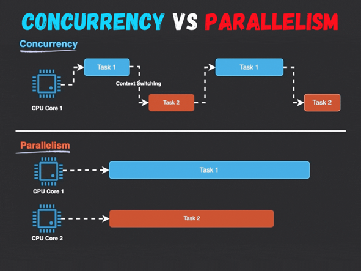

# Multicore overview

Trong nhiều thập kỷ, hiệu năng của bộ xử lý đơn nhân (single core) được nâng cao chủ yếu thông qua tăng xung nhịp và tối ưu kiến trúc. Tuy nhiên, các giới hạn vật lý về tiêu thụ điện năng và tản nhiệt đặt ra “bức tường hiệu năng” đối với các bộ xử lý đơn nhân. Để vượt qua những giới hạn này, ngành công nghiệp bán dẫn đã chuyển sang thiết kế bộ xử lý đa nhân (multicore), nơi nhiều nhân xử lý (core) được tích hợp lên cùng một bộ xử lý nhằm xử lý song song nhiều tác vụ cùng lúc.

## Concurrency vs parallelism

Concurrency hay đồng thời: là khả năng xử lý nhiều công việc và tác vụ xen kẽ một cách nhanh chóng, gây ảo giác về sự đồng thời.

Parallelism: là khả năng thực thi đồng thời nhiều tác vụ trong cùng thời gian thực. Điều này chỉ được hỗ trợ trong các hệ thống có nhiều CPU hoặc nhiều core trong CPU, mỗi CPU hoặc lõi có thể xử lý một tác vụ riêng biệt cùng một lúc.



## AMP & SMP

### AMP – Asymmetric Multi Processing

AMP là kiến trúc đa xử lý bất đối xứng, trong đó mỗi core hoạt động độc lập với nhau.

Đặc điểm:
- Mỗi core có thể chạy cùng hệ điều hành hoặc hệ điều hành riêng biệt hoặc không có hệ điều hành. Ví dụ: một core chạy linux, một core chạy RTOS.
- Mỗi core có scheduler riêng.
- Mỗi thread được gán cố định vào từng core cụ thể -> không đảm bảo load balancing.
- Các tài nguyên phần cứng như thiết bị ngoại vi, bộ nhớ vật lý cũng như interrupt handling phải được phân chia giữa các core -> cô lập tài nguyên.
- Yêu cầu cơ chế IPC phức tạp để giao tiếp giữa các core

Ví dụ chip tiêu biểu: STM32H745 / STM32H755
- Dual core: Cortex-M7 và Cortex-M4
- Thường sử dụng:
  - M7 chạy FreeRTOS/bare-metal
  - M4 xử lý motor, ADC,...

### SMP – Symmetric Multi Processing

Khác với AMP, SMP là kiến trúc đa xử lý đối xứng, trong đó các core sẽ chia sẻ không gian bộ nhớ, và chạy một hệ điều hành duy nhất quản lý và phân chia công việc giữa các core.

Đặc điểm:
- Các core sẽ dùng cùng một scheduler.
- Scheduler có thể quyết định thread sẽ được gán vào core nào -> đảm bảo load balancing.
- Có thể cố định gán vào core, tuy nhiên điều này là không bắt buộc như AMP.
- Có thể migrate một thread từ core đang bị overload sang core khác idle hơn.

Ví dụ chip tiêu biểu: ESP32
- Dual core: 2 × Xtensa LX6
- FreeRTOS SMP:
  - Thread chạy core nào cũng được
  - Hoặc pin vào core 0 hoặc core 1

## Load balancing

Load balancing là cơ chế giám sát các thread đang chạy trên mỗi core:
- Khi một core rảnh và có thread sẵn sàng thực thi, scheduler sẽ lập lịch thread đó chạy trên core rảnh
= Nếu không có core nào rảnh và có thread mới sẵn sàng, scheduler sử dụng độ ưu tiên của thread để lập lịch: nếu đọ ưu tiên cao hơn bất kỳ thread nào đang chạy, thread mới sẽ preempt thread đang chạy.

Nói đơn giản: Load balancing là việc phân phối đều công việc lên các core để tránh tình trạng:
- Một số core thì quá tải (overloaded)
- Một số core thì nhàn rỗi (idle) trong khi cores khác đang bận.

Vấn đề nếu không có load balancing:
- Core 0: chạy 5 thread nặng → CPU 100%
- Core 1: chạy 1 thread nhẹ → CPU 20%
- Core 2: không có thread → CPU 0%
→ Hiệu suất hệ thống kém, thời gian phản hồi tăng

Khi một core overload, scheduler có thể chuyển thread sang core rảnh hơn -> điều này được gọi là **migration**.

## Task affinity

Task affinity, còn gọi là CPU affinity, nó cho phép gán (bind) hoặc tháo gán (unbind) một thread vào một core cụ thể hoặc một nhóm core cụ thể, sao cho thread chỉ được thực thi trên core được chỉ định thay vì core nào khác.

-> Nói đơn giản thì task affinity giúp trả lời câu hỏi: thread này “được phép” chạy trên core nào?

Có hai loại task affinity:
- Soft affinity: Scheduler có xu hướng cố gắng giữ thread trên cùng một core càng lâu càng tốt. Tuy nhiên, scheduler vẫn có thể migrate thread sang task khác khi cần thiết -> sử dụng khi muốn tối ưu cache nhưng vẫn đảm bảo load balancing.
- Hard affinity: Thread bắt buộc phải chạy trên core được chỉ định và không được migrate sang core khác -> sử dụng khi cần tính read-time cao.

Ngoải ra, nếu không chỉ định thread chạy trên core cụ thể, tức là thread không được bind vào một core cụ thể nào thì được gọi là no affinity.

Trong các kiến trúc có nhiều core, có thể sử dụng affinity mask để cho biết thread được phép chạy trên core nào. Ví dụ:

```
11111111111111111111111111111111 = 0xFFFFFFFF
→ Task có thể chạy trên bất ký core nào

00000000000000000000000000000001 = 0x00000001 = bit 0 set
→ Task chỉ chạy trên core 0

00000000000000000000000000000010 = 0x00000002 = bit 1 set
→ Task chỉ chạy trên core 1

00000000000000000000000000000011 = 0x00000003 = bit 0,1 set
→ Task có thể chạy trên core 0 HOẶC core 1

10000000000000000000000000000000 = 0x80000000 = bit 31 set
→ Task chỉ chạy trên core 31
```

**Task affinity dùng để giải quyết vấn đề gì?**

- Cache performance

  Khi một thread bị ngắt bởi scheduler, nếu sau đó thread được thực thi lại vào cùng core đã chạy trước đó, nó có thể còn dữ liệu trong cache để tái sử dụng, giúp giảm cache miss.

  -> Task affinity có thể giúp thread tối ưu dữ liệu nằm trong cache thay vì chuyển qua lại giữa các core gây ra cache miss liên tục làm giảm performance.

- Real time
  
  Task migration → cache miss → timing không dự đoán được

  -> Đối với các ứng dụng cần tính real time cao thì có thể cần gán thread cố định vào core cụ thể.