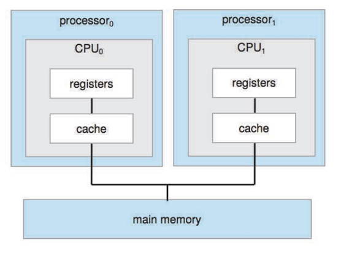
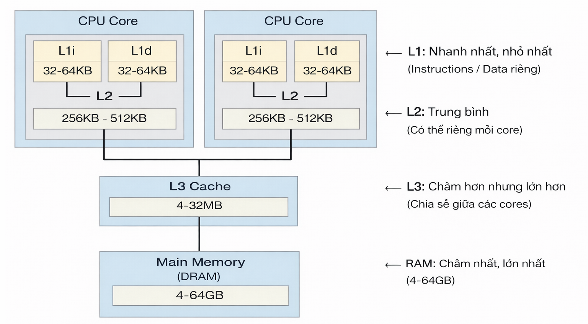
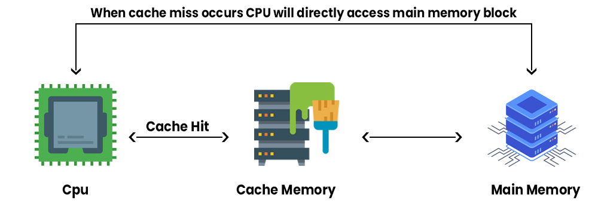
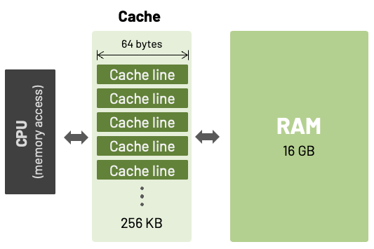
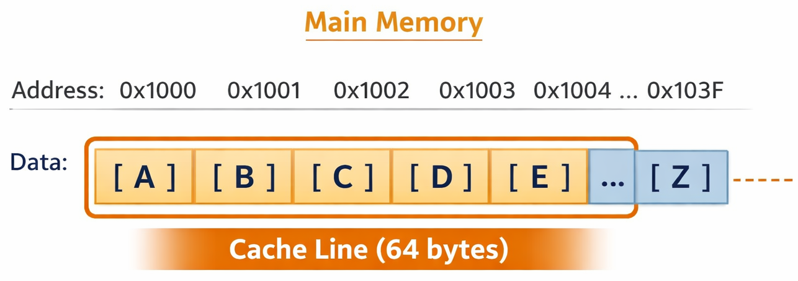

Ta thấy phần lớn vi điều khiển là đơn core, nó thường không sử dụng cache, ví dụ như các dòng vi xử lý cortex-m0, cortex-m3,...Tại sao lại vậy? vì tốc độ của core chưa đến mức phải dùng đến cache.

Core trong các vi điều khiển hầu hết đều có tốc độ clock thấp khoảng vài chục MHz, độ trễ khi truy cập vào RAM là không đáng kể. Từ đó, core chưa đủ nhanh để gặp hiện tượng "đói dữ liệu" khi phải chờ đợi RAM.

Trong topic này ta sẽ đi sâu hơn về các vấn đề liên quan đến cache.

## Đặc điểm

Cache là bộ nhớ nhỏ với tốc độ truy cập rất nhanh nằm gần core.

Hãy tưởng tượng ta đang làm bài tập:
- RAM: Kệ sách ở phòng khác.
- Cache: Vài cuốn sách để ngay trên bàn làm việc.
- Core: tương ứng với ta - người đang làm việc.

Kịch bạn:
- Nếu quyển sách ta cần nằm ngay trên bàn thì ta có thể tiện tay lấy ngay sử dụng.
- Nếu quyển sách không nằm trên bàn, ta phải di chuyển đến kệ sách để lấy mất rất nhiều thời gian.

**=> Cache giúp CPU không phải liên tục "đi xa" để lấy dữ liệu từ RAM => Làm tăng hiệu năng của CPU.**

Đối với các hệ thống đa core thì mỗi core sẽ có register và cache riêng. Chúng cùng truy cập vào main memory thông qua system bus.



Bộ nhớ cache cũng được phân loại theo level mô tả mức độ gần và khả năng truy cập đến core, có 3 level chính:
- L1 cache: tốc độ cực nhanh và gần core nhất, nhưng dung lượng bộ nhớ nhỏ khoảng vài KB. Mỗi core thường sẽ có 2 L1 cache riêng là i-cache và d-cache:
  - i-cache: instruction cache.
  - d-cache: data cache.
- L2 cache: tốc độ chậm hơn L1 và dung lượng bộ nhớ lớn hơn L1, nằm trong core hoặc có thể được dùng làm shared cache giữa hai core.
- L3 cache: tốc độ chậm hơn L2 và dung lượng bộ nhớ lớn hơn L2, dùng làm shared cache giữa các core.



## Hoạt động

### Cache hit vs Cache miss

**Cache hit:** Core tìm thấy dữ liệu hoặc lệnh cần dùng ngay trong cache -> hiệu năng rất cao.

Ví dụ:
- Core muốn đọc biến X
- Kiểm tra cache → có X trong cache
- Lấy ngay từ cache (1-3 cycles, nhanh!)

**Cache miss:** Core không tìm thấy dữ liệu hoặc lệnh trong cache, phải truy cập vào main memory -> làm giảm hiệu năng.

Ví dụ:
- Core muốn đọc biến Y
- Kiểm tra cache → Không có Y trong cache
- Phải đi lấy từ RAM (100-200 cycles, chậm!)
- Đồng thời copy Y vào cache cho lần sau

-> Do đó, thời gian chạy của cùng một đoạn code có thể dao động mạnh.



Kết quả ước tính hit và miss khi tần số hoạt động của core là 1ns:

| Loại          | Latence |
| ------------- | ------- |
| L1 cache hit  | ~1 ns   |
| L2 cache hit  | ~4 ns   |
| L3 cache hit  | ~10 ns  |
| RAM access    | ~100 ns |
| SSD access    | ~100,000 ns |

### Cache line

Cache line là đơn vị dữ liệu nhỏ nhất mà cache có thể quản lý, nạp, ghi và thay thế. Core không bao giờ cache từng byte riêng lẻ mà luôn cache theo từng cache line.

**=> Cache line là block dữ liệu mà cache làm việc cùng lúc.**



Cache được chia thành nhiều cache line. Mỗi cache line gồm:
- Data: với kích thước khoảng 32/64/128 byte
- Tag: địa chỉ
- State bits: valid, dirty, shared,…

Ví dụ:
- Cache line size là 64 byte
- Khi CPU đọc địa chỉ 0x1000
- Cache sẽ nạp cả 64 byte liên tiếp (0x1000 - 0x103F) vào cache
- Lần sau đọc 0x1001, 0x1002... → Cache hit



Cache line giúp tận dụng tính spatial locality, tức là khi cần byte này thì rất có thể sẽ cần các byte kế tiếp.

Do đó, ta cần cố gắng sử dụng bộ nhớ liên tiếp nhất có thể để tăng thời gian thực thi, ví dụ hai đoạn code dưới đây:

- Code A

```c
int sum = 0;
for(int i = 0; i < 1000; i++) {
    sum += array[i];  // Sequential access → Cache hit cao
}
```

Thời gian: ~1000 cycles (hầu hết hit)

- Code B

```c
int sum = 0;
for(int i = 0; i < 1000; i += 64) {
    sum += array[i];  // Jump 64 elements → Cache miss nhiều
}
```

Thời gian: ~10,000 cycles (nhiều miss)

-> cùng logic, nhưng code B chậm gấp 10 lần vì cache miss.

### Write through vs Write back

Write through và write back là hai chính sách ghi (write policy) của cache, quyết định khi core ghi dữ liệu thì main memory được cập nhật lúc nào.

**Write through:** Mỗi lần ghi, data được ghi đồng thời vào main memory và cache giúp dữ liệu trong cache và main memory luôn đồng bộ. Tuy nhiên, nó làm giảm hiệu năng vì mỗi lần ghi đều phải chờ main memory.

Ví dụ:
- Khi core ghi X = 100 vào cache
- Đồng thời ghi vào main memory (chậm)
- CPU phải chờ main memory ghi xong

**Write back:** Mỗi lần ghi, data chỉ được ghi vào cache, main memory sẽ được cập nhật sau.

Ví dụ:
- Khi CPU ghi X = 100 vào cache
- Đánh dấu cache line là **dirty**
- Core tiếp tục và không ghi xuống main memory ngay.
- Main memory chỉ được cập nhập khi:
  - cache line bị thay thế.
  - hoặc có lệnh flush.

**Dirty bit**

Dirty bit là một cờ trạng thái gắn vào mỗi cache line, nó cho biết cache line này đã được core ghi và dữ liệu không đồng bộ với main memory nữa.

Dirty bit giúp cache controller quyết định có cần ghi cache line này về main memory hay không:
- Nếu dirty = 0: Cache line có thể bị ignore mà không cần ghi vào main memory.
- Nếu dirty = 1: Cache line phải ghi về main memory trước khi bị thay thế bởi cache line khác hoặc có thể được force ghi về main memory.

## Cache coherence

Giả sử có biến `x = 10` nằm trong RAM và có 2 core cùng đọc biến này.

Cả hai core đều có bản sao `x = 10` nằm trong cache như sau:

```
┌──────────┐      ┌──────────┐
│ Core 0   │      │ Core 1   │
│ Cache:   │      │ Cache:   │
│ x = 10   │      │ x = 10   │
└────┬─────┘      └────┬─────┘
     └─────┬───────────┘
         ┌─┴──────┐
         │  RAM   │
         │ x = 10 │
         └────────┘
```

Vấn đề xảy ra đối với chính sách ghi write back, khi core 0 thực hiện modify biến `x` thành 99 thì biến `x` trong RAM không được cập nhập ngay:

```
┌──────────┐      ┌──────────┐
│ Core 0   │      │ Core 1   │
│ Cache:   │      │ Cache:   │
│ x = 99   │      │ x = 10   │
└────┬─────┘      └────┬─────┘
     └─────┬───────────┘
         ┌─┴──────┐
         │  RAM   │
         │ x = 10 │
         └────────┘
```

Ta có thể thấy bản sao của biến `x` nằm trong cache 0 và cache 1 không đồng bộ với nhau, đấy chính là vấn đề mà cache coherence giải quyết.

Ngoài ra vấn đề này cũng có thể gặp đối với cache và DMA. Điều này thì có thể xảy ra ở cả đơn core và đa core sử dụng cache.
- Core ghi dữ liệu vào buffer → dữ liệu có thể chỉ nằm trong cache, chưa được flush ra RAM.
- DMA đọc trực tiếp từ RAM, không thông qua cache → DMA thấy dữ liệu cũ.
- Hoặc DMA vừa ghi dữ liệu mới vào RAM, nhưng core vẫn đọc dữ liệu cũ trong cache.

Cache coherence là cơ chế đảm bảo rằng bản sao của cùng một dữ liệu nằm trong cache của các core đều nhất quán về giá trị.

Một hệ thống được coi là cache coherence nếu nó thoả mãn hai điều kiện:
- Write propagation: Khi bất kỳ một cache nằm trong core nào thay đổi dữ liệu thì các cache khác phải thấy giá trị mới. Ví dụ:   
  - Khi core 0 ghi `x = 99`
  - Thì core 1, core 2, core 3...phải biết được sự thay đổi này
  - Không để core 1 còn giữ giá trị cũ `x = 10`.
- Write serialization: Tất cả các core phải nhìn thấy cùng một thứ tự các lần ghi vào một địa chỉ nhớ. Ví dụ:
  - Tại thời điểm t1, core 0 ghi `x = 99`.
  - Tại thời điểm t2 sau t1, core 1 ghi `x = 50`.
  - Tất cả các core khác phải nhìn thấy thứ tự: `x = 99 → x = 50`.

### MESI

MESI là một cache coherence protocol rất phổ biến trong các hệ thống đa core.

Mỗi cache line sẽ 4 trạng thái:
- M – Modified: Cache line chỉ tồn tại ở một core, dữ liệu trong cache line không đồng bộ với RAM.
- E – Exclusive: Cache line chỉ tồn tại ở một core, dữ liệu trong cache line đồng bộ với RAM.
- S – Shared: Cache line tồn tại ở nhiều core, dữ liệu trong cache line đồng bộ với RAM.
- I – Invalid: Cache line không hợp lệ.

MESI protocol có một state machine chuyển từ state này sang state khác, ví dụ như sau:

**Đọc lần đầu**
- Core 0 đọc biến `x` lần đầu.
- Nếu không core nào khác có → Exclusive (E).
- Nếu core khác đang có → Shared (S).

**Ghi vào Exclusive**
- Core 0 đang có `x` (Exclusive).
- Core 0 ghi `x = 99`.
- Chuyển sang Modified (M).
- Không cần broadcast (vì chỉ mình nó có).

**Ghi vào Shared**
- Core 0 đang có biến `x` (Shared), core 1 cũng có.
- Core 0 ghi `x = 99`.
- Broadcast "Invalidate x" → Core 1 chuyển sang Invalid (I)
- Core 0 chuyển sang Modified (M)

**Core khác đọc Modified data**
- Core 0 có `x = 99` (Modified).
- Core 1 muốn đọc `x`.
- Core 0 phải write back `x = 99` về RAM.
- Core 0 chuyển sang Shared (S).
- Core 1 đọc được `x = 99`, chuyển sang Shared (S).