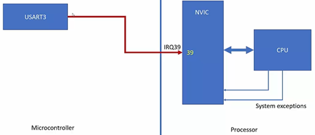

Như đã nói trong bài [interrupt](#/docs/embedded/essential/interrupt) thì luồng xử lý ngắt sẽ như sau:
- Khi có sự kiện ngắt xảy ra, ngoại vi sẽ kích hoạt một IRQ signal trên đường IRQ.
- Interrupt controller (NVIC trên Cortex-M, PIC trên x86) sẽ nhận IRQ signal này.
- Controller sẽ gửi IRQ signal đến core.
- Core lưu context (PC, registers vào stack)
- Sau đó, core tra cứu vector table theo IRQ number.
- Thực hiện jump đến ISR tương ứng.
- ISR thực thi.
- Restore context và trở về chương trình chính

Ta thấy rằng trong các hệ thống đơn core thì do chỉ có 1 core duy nhất nên các interrupt sẽ đều hội tụ đến một core để xử lý.

Tuy nhiên, trong các hệ thông đa core thì khác khi có sự kiện ngắt xảy ra thì IRQ signal phải được xử lý ở core nào. Điều này sẽ được nói rõ ở bài này.

## Generic Interrupt Controller - GIC

Trong các hệ thống đa core thuộc kiến trúc ARM, thì sẽ có một interrupt controller được gọi là generic interrupt controller, controller này có nhiệm vụ nhận các IRQ signal được gửi từ ngoại vi và quyết định routing IRQ signal này tới core nào.

Khi controller thực hiện routing interrupt tới core, nó có thể được chia ra làm 4 loại:

**Software Generated Interrupt - SGI (ID 0–15)**

SGI là một loại interrupt do một core tạo ra để gửi tới một hoặc nhiều core khác trong cùng một SoC. Nói cách khác, SGI là cơ chế để core A đánh thức hoặc ra lệnh core B bằng interrupt. Ngoài ra, SGI có thể được gọi là Inter-Processor Interrupt - IPI.

Đặc điểm:
- Không đến từ peripheral
- Không phụ thuộc tín hiệu vật lý (edge/level)
- Được tạo bằng phần mềm
- Nhưng được xử lý như interrupt thật bởi phần cứng

Ví dụ sử dụng: Scheduler yêu cầu core khác reschedule.

**Private Peripheral Interrupt - PPI (ID 16–31)**

PPI là interrupt đến từ peripheral gắn riêng với từng core.

Ví dụ: timer riêng của từng core, watchdog riêng của từng core,...

**Shared Peripheral Interrupt - SPI (ID 32–1019)**

SPI là interrupt từ peripheral dùng chung toàn hệ thống, có nghĩa là controller có thể routing IRQ signal tới một core hoặc một nhóm core tuỳ cấu hình.

Ví dụ: UART, SPI controller, Ethernet, PCIe, GPU…

**Locality-specific Peripheral Interrupt - LPI (ID ≥ 8192)**

LPI là interrupt là mở rộng của SPI, nó được dùng trong các hệ thống lớn như server,...
