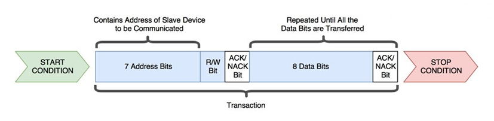
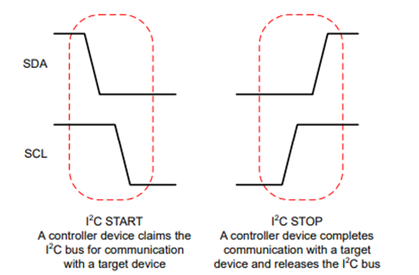
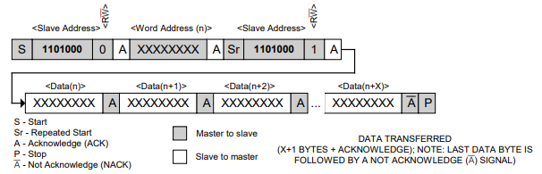
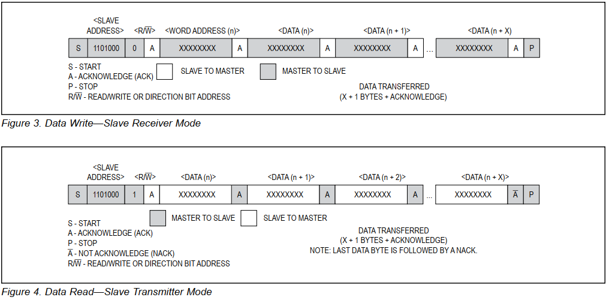

## Mục lục
- [Tổng quan](#1-overview)
- [Lớp vật lý](#2-lớp-vật-lý-physical-layer)
- [Giao thức truyền thông](#3-giao-thức-truyền-thông-protocol)
- [Các cơ chế nâng cao](#4-các-cơ-chế-nâng-cao)
- [Debug và xử lý lỗi](#5-debug-và-xử-lý-lỗi)

## 1. Overview

I2C (Inter-Integrated Circuit) là giao thức truyền thông nối tiếp được phát triển bởi Philips (nay là NXP Semiconductors), được sử dụng rộng rãi trong các hệ thống nhúng để kết nối Vi điều khiển (MCU) với các thiết bị ngoại vi.

### 1.1. Ứng dụng phổ biến

I2C thường được sử dụng để giao tiếp với:
- Cảm biến môi trường: DHT, SHT, BME280 (nhiệt độ, độ ẩm, áp suất)
- Cảm biến chuyển động: MPU6050, LSM6DS3 (gia tốc, con quay hồi chuyển)
- Bộ nhớ: AT24C series (EEPROM)
- Đồng hồ thời gian thực: DS1307, DS3231 (RTC)
- Màn hình: OLED, LCD với module I2C
- Bộ chuyển đổi: ADC/DAC ngoài, GPIO expander

### 1.2. Đặc điểm kỹ thuật

#### 1.2.1. Kiểu truyền thông
- Đồng bộ (Synchronous): Sử dụng xung clock chung để đồng bộ dữ liệu
- Bán song công (Half-duplex): Dữ liệu chỉ truyền một chiều tại một thời điểm trên cùng một dây dẫn

#### 1.2.2. Kiến trúc
- Multi master: Cho phép nhiều master điều khiển bus (có cơ chế arbitration để tránh xung đột)
- Multi slave: Một master có thể giao tiếp với nhiều slave khác nhau
- Địa chỉ: 
  - 7-bit: Tối đa 128 địa chỉ (thực tế ~112 do một số địa chỉ được dành riêng)
  - 10-bit: Tối đa 1024 địa chỉ (ít phổ biến hơn)

#### 1.2.3. Tốc độ truyền

| Mode | Tốc độ | Ứng dụng |
|------|--------|----------|
| **Standard Mode (Sm)** | 100 kbit/s | Phổ biến nhất, đủ cho hầu hết thiết bị |
| **Fast Mode (Fm)** | 400 kbit/s | IMU, OLED, các sensor yêu cầu tốc độ cao hơn |
| **Fast Mode Plus (Fm+)** | 1 Mbit/s | Ứng dụng đặc biệt, ít phổ biến |
| **High Speed Mode (Hs)** | 3.4 Mbit/s | Rất hiếm, yêu cầu phần cứng đặc biệt |

## 2. Lớp vật lý (Physical Layer)

I2C chỉ yêu cầu 2 dây tín hiệu để kết nối nhiều thiết bị:

| Tín hiệu | Tên đầy đủ | Chức năng |
|----------|------------|-----------|
| **SDA** | Serial Data | Dây truyền dữ liệu hai chiều (bidirectional) |
| **SCL** | Serial Clock | Dây xung nhịp clock, luôn được tạo bởi Master |

Khác với UART hoặc SPI, các chân I2C được cấu hình theo kiểu **open-drain** (hay open-collector):
- Chân GPIO **chỉ có thể kéo xuống thấp (GND)** hoặc **thả nổi (floating)**
- Chân **không thể đẩy lên mức cao (VCC)** một cách chủ động
- Khi thả nổi, điện trở pull-up sẽ kéo dây lên mức cao

Do đặc tính open drain này, ta bắt buộc phải có điện trở pullup trên cả hai đường SDA và SCL. Khi không có thiết bị nào truyền dữ liệu, điện trở pullup (idle state) này kéo đường dây lên mức cao.

Giá trị điện trở pullup thông dụng: **2.2kΩ - 10kΩ** (tùy thuộc tốc độ bus và số lượng thiết bị)

**Tại sao lại thiết kế như vậy?** Tránh ngắn mạch vì I2C là giao thức multi-master/multi-slave cho nên sẽ có nhiều thiết bị cùng hoạt động trên bus.

**Kịch bản vấn đề nếu dùng push pull:**

- Master A gửi bit 1 → Đẩy SDA lên VCC
- Master B gửi bit 0 cùng lúc → Kéo SDA xuống GND
- Kết quả: Ngắn mạch VCC-GND → Hỏng chip

**Với open drain:**

- Thiết bị muốn gửi 0 → Kéo SDA xuống GND (mức thấp)
- Thiết bị muốn gửi 1 → Thả nổi SDA, để pull-up kéo lên VCC
- Nếu có xung đột → Mức thấp luôn thắng (wired-AND logic)
- Không có ngắn mạch

## 3. Giao thức truyền thông (Protocol)

Dữ liệu trên I2C được truyền theo từng frame 8 bit. Quá trình truyền tin diễn ra theo trình tự như sau:

### 3.1. Các tín hiệu điều khiển

#### 3.1.1. Start Condition (S)

**Định nghĩa:** Tín hiệu báo hiệu bắt đầu một giao dịch I2C.

**Cách thực hiện:**

- Đảm bảo bus đang ở trạng thái Idle (SDA = HIGH, SCL = HIGH)
- Master kéo SDA từ HIGH xuống LOW (trong khi SCL vẫn HIGH)
- Sau đó kéo SCL xuống LOW

**Ý nghĩa:** 
- Báo cho tất cả Slave: "Chú ý! Giao dịch mới bắt đầu"
- Chiếm quyền điều khiển bus

#### 3.1.2. Stop Condition (P)

**Định nghĩa:** Tín hiệu báo hiệu kết thúc một giao dịch I2C

**Cách thực hiện:**

- Kéo SCL từ LOW lên HIGH
- Sau đó kéo SDA từ LOW lên HIGH (trong khi SCL đang HIGH)

**Ý nghĩa:**

- Báo cho tất cả slave: "Giao dịch kết thúc"
- Giải phóng bus về trạng thái idle

#### 3.1.3. Repeated Start (Sr)

**Định nghĩa:** Gửi tín hiệu Start mới mà không cần Stop trước đó

**Mục đích:**

- Chuyển hướng đọc/ghi mà không mất quyền điều khiển bus
- Ngăn các master khác chen ngang vào giữa giao dịch
- Thường dùng khi đọc dữ liệu từ thanh ghi cụ thể của Slave

**Ví dụ:**

### 3.2. Địa chỉ Slave (Address Frame)

Master gửi 7-bit hoặc 10-bit địa chỉ của slave mà nó muốn giao tiếp.

**Cấu trúc 10-bit (hiếm):**
- Frame 1: `11110XX` + R/W (XX là 2 bit cao của địa chỉ)
- Frame 2: 8 bit thấp của địa chỉ

### 3.3. Bit Read/Write (R/W)

**Vị trí:** Bit thứ 8 sau 7-bit địa chỉ

**Giá trị:**

- 0 (write): Master ghi dữ liệu vào slave
- 1 (read): Master đọc dữ liệu từ slave

**Lưu ý quan trọng về địa chỉ:**

- Datasheet thường ghi địa chỉ 8 bit (đã bao gồm bit R/W). Ví dụ: `0xA0` (write), `0xA1` (read).
- Thư viện code thường yêu cầu địa chỉ 7 bit (không bao gồm R/W). Ta cần shift: `0xA0 >> 1 = 0x50`.

### 3.4. Bit ACK/NACK (Acknowledge)

**Vị trí:** Xung clock thứ 9 sau mỗi byte dữ liệu.

**ACK (Acknowledge - Bit 0):**

- Thiết bị nhận kéo SDA xuống LOW
- Nghĩa: "Tôi đã nhận được dữ liệu, sẵn sàng cho byte tiếp theo"

**NACK (Not Acknowledge - Bit 1):**

- Thiết bị nhận để SDA ở HIGH (pull-up kéo lên)
- Nghĩa: "Không nhận được dữ liệu" hoặc "Đây là byte cuối cùng, ngừng gửi"

**Các trường hợp:**
- **Sau Address Frame:**
  - ACK: Slave có địa chỉ khớp và sẵn sàng giao tiếp
  - NACK: Không có Slave nào trả lời (lỗi)
- **Sau Data Frame (write):**
  - ACK: Slave nhận thành công
  - NACK: Slave không nhận được (buffer đầy, lỗi...)
- **Sau Data Frame (read):**
  - ACK từ Master: "Gửi byte tiếp theo"
  - NACK từ Master: "Đã đủ, dừng gửi"

### 3.5. Luồng giao tiếp tổng quát

### 3.6. Tóm tắt quy trình

Trong I2C, khi master muốn giao tiếp với một slave, nó sẽ kéo chân SDA, SCL xuống mức thấp, sau đó gửi địa chỉ của slave muốn giao tiếp, lúc này, các slave trong cùng một bus sẽ tự kiểm tra với địa chỉ của chính nó, nếu có một slave thấy khớp địa chỉ nó sẽ gửi về master một tín hiệu ACK, lúc này master sẽ bắt được tín hiệu này và bắt đầu truyền/nhận dữ liệu. Khi truyền/nhận dữ liệu kết thúc, master sẽ kéo chân SDA, SCL lên mức cao để kết thúc quá trình truyền tin.

## 4. Các cơ chế nâng cao

### 4.1. Clock Stretching

**Định nghĩa:** Slave giữ chân SCL ở mức LOW để bắt master tạm dừng và chờ đợi.

**Khi nào xảy ra?**

- Slave đang xử lý dữ liệu và cần thêm thời gian
- CPU của Slave đang bận với nhiệm vụ khác
- ADC đang thực hiện chuyển đổi
- Slave đang ghi dữ liệu vào EEPROM (quá trình chậm)

**Cơ chế hoạt động:**

- Master gửi xung clock (kéo SCL lên HIGH)
- Slave giữ SCL ở LOW (do open-drain, mức thấp thắng)
- Master phát hiện SCL vẫn LOW → Chờ đợi
- Slave hoàn thành xử lý → Thả SCL (pull-up kéo lên HIGH)
- Master tiếp tục giao tiếp

**Yêu cầu:**

- Master phải kiểm tra trạng thái SCL sau khi đẩy lên HIGH
- Không phải tất cả master đều hỗ trợ slock stretching (cần kiểm tra datasheet)

### 4.2. Arbitration (Phân xử multi master)

**Vấn đề:** Khi có nhiều master cùng muốn điều khiển bus tại một thời điểm, làm sao tránh xung đột?

**Nguyên tắc phân xử:** *"Mức thấp luôn thắng"* (Logic 0 wins)

**Cơ chế hoạt động:**

- Hai master cùng gửi start condition (cả hai muốn chiếm bus)

- Gửi bit-by-bit và so sánh:
  - Mỗi master gửi một bit và đồng thời đọc lại giá trị trên bus
  - Nếu master gửi bit 1 (thả nổi → HIGH) nhưng đọc lại thấy 0 (LOW)
    → Có master khác đang kéo xuống
    → Master này biết mình thua
    → Ngừng truyền ngay lập tức
    → Chuyển sang chế độ chờ

- Master thắng tiếp tục giao tiếp cho đến khi gửi stop condition

- Master thua thử lại sau khi bus được giải phóng

## 5. Debug và xử lý lỗi

### 5.1. Bus stuck low hay treo bus

Tình huống: Master đang đọc dữ liệu từ Slave. Slave gửi bit 0 (kéo SDA xuống thấp). Đột nhiên Master bị reset (do Watchdog, Brown-out, hoặc Bug).

Hậu quả:
- Master khởi động lại, thấy SDA đang thấp -> Nghĩ là bus đang bận.
- Slave thì đang đợi xung SCL tiếp theo từ master để gửi bit kế tiếp, nên nó cứ giữ chặt SDA ở mức thấp mãi mãi.
- Kết quả: Deadlock. Hệ thống treo.

Giải pháp (Bus Recovery Sequence)::
- Master cấu hình SCL, SDA làm GPIO.
- Kiểm tra nếu SDA Low -> Bắt đầu cứu.
- Cấu hình chân SCL là GPIO output.
- Gửi 9 xung clock thủ công trên chân SCL. Điều này lừa slave rằng master vẫn đang chạy, slave sẽ gửi nốt các bit còn lại. Khi slave gửi xong, nó sẽ nhả SDA ra.
- Gửi tín hiệu STOP.
- Cấu hình lại SCL sang chế độ I2C Peripheral.

### 5.2. Address NACK (Không tìm thấy thiết bị)

Tình huống: Master gửi Start + address, nhưng nhận về NACK.

Debug: Dùng Logic analyzer để xem khung truyền.

Nguyên nhân & Fix:

- Sai địa chỉ 7-bit và 8-bit: Slave datasheet ghi 0xA0 (8-bit) đã gồm bit R/W, code thư viện cần 0x50 (7-bit).
- Thiết bị chưa khởi động kịp: Thiết bị cần thời gian để reset -> Thêm `delay_ms(100)` trước khi gọi lệnh I2C đầu tiên.
- Sai chân (Pin muxing): Config sai chân GPIO trong code.

### 5.3. Clock stretching Timeout

Tình huống: Master đợi mãi không thấy SCL lên mức cao.

Nguyên nhân: Slave (thường là vi điều khiển khác đóng vai slave) đang bận xử lý interrupt hoặc task khác nên nó giữ SCL ở mức thấp để xin thêm thời gian.

Giải pháp: Master phải hỗ trợ clock stretching. Không dùng vòng lặp `while(SCL == 0);` vô tận mà phải có timeout để thoát ra và báo lỗi nếu slave giữ quá lâu.

:::tip
Đối với smbus (đây là một giao thức được pháp triển từ i2c) thì thời gian clock stretching của slave là 20ms.
:::

### 5.4. Công cụ debug

**5.4.1. Logic Analyzer**

Sử dụng thiết bị như Saleae để quan sát:
- Tín hiệu SDA, SCL có đúng không
- Start/stop condition có chính xác không
- Địa chỉ được gửi là gì
- ACK/NACK từ slave
- Timing có đúng theo spec không

**5.4.2. Oscilloscope**

Kiểm tra chất lượng tín hiệu:
- Rise time của SDA/SCL (phụ thuộc vào pull-up và capacitance)
- Có nhiễu không
- Mức điện áp HIGH/LOW có đúng không

## Tóm tắt

**Ưu điểm của I2C:**

- ✅ Chỉ cần 2 dây (SDA, SCL) → Tiết kiệm chân GPIO
- ✅ Hỗ trợ nhiều thiết bị trên cùng bus
- ✅ Hỗ trợ multi master (có cơ chế arbitration)
- ✅ Được hỗ trợ rộng rãi bởi hầu hết MCU và sensor
- ✅ Tốc độ đủ cho hầu hết ứng dụng sensor

**Nhược điểm:**

- ❌ Tốc độ chậm hơn SPI (tối đa 3.4 Mbps so với 50+ Mbps của SPI)
- ❌ Cần điện trở pull-up (tăng chi phí BOM)
- ❌ Khoảng cách truyền ngắn (~1-2m)
- ❌ Dễ bị lỗi bus stuck nếu không xử lý cẩn thận
- ❌ Overhead cao (địa chỉ + ACK/NACK cho mỗi byte)

**Khi nào nên dùng I2C?**

- Giao tiếp với sensor tốc độ vừa phải
- Cần tiết kiệm chân GPIO
- Nhiều thiết bị cùng loại trên một board
- Khoảng cách ngắn, trong cùng một PCB

**Khi nào không nên dùng I2C?**

- Cần tốc độ cao (dùng SPI)
- Truyền dữ liệu liên tục, khối lượng lớn (dùng SPI hoặc UART)
- Khoảng cách xa (dùng RS485, CAN)
- Yêu cầu real-time nghiêm ngặt

## Tài liệu tham khảo

- [I2C Specification (NXP)](https://www.nxp.com/docs/en/user-guide/UM10204.pdf)
- [Understanding the I2C Bus - Texas Instruments](https://www.ti.com/lit/an/slva704/slva704.pdf)