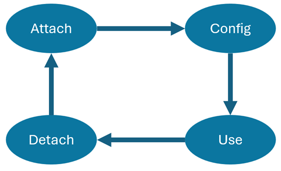
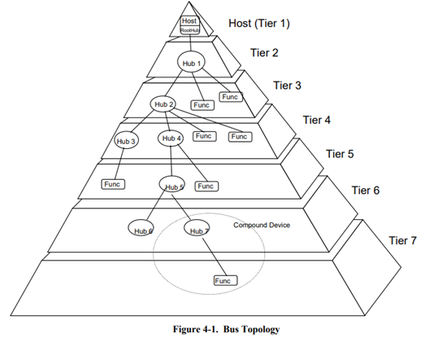

## USB là gì?

USB (Universal Serial Bus) là chuẩn giao tiếp nối tiếp phổ biến dùng để kết nối host (máy tính, vi điều khiển, SoC) với thiết bị ngoại vi (keyboard, mouse, storage, camera, module IoT,...).

Mục tiêu của USB là cung cấp một bus giao tiếp đơn giản, chuẩn hóa, hot‑plug, hỗ trợ nhiều loại thiết bị khác nhau với chi phí thấp.

## Tại sao cần có USB?

USB ra đời để giải quyết các vấn đề của các chuẩn giao tiếp cũ (RS232, PS/2, parallel,...):
- Chuẩn hóa cổng kết nối: Một chuẩn duy nhất thay cho nhiều cổng khác nhau.
- Hot-plug & Plug-and-play: Cắm/rút khi đang hoạt động, tự nhận dạng thiết bị.
- Cấp nguồn trực tiếp: Thiết bị nhỏ có thể lấy nguồn từ bus.
- Tốc độ cao: Phù hợp cho truyền dữ liệu lớn.
- Mở rộng dễ dàng qua hub: Hỗ trợ nhiều thiết bị trên cùng bus.
- Tương thích rộng rãi: Từ PC đến vi điều khiển nhúng.

Trong hệ thống nhúng, USB cho phép:
- Giao tiếp PC ↔ thiết bị nhúng
- Firmware update (DFU, CDC, MSC)
- Debug và logging

## Tổng quan kiến trúc USB

USB là một cable bus hỗ trợ giao tiếp giữa host và các thiết bị ngoại vi khác.

Vòng đời của một device khi kết nối với host được tóm tắt như sau:

Cấu trúc topology của USB được thiết kế phân tầng theo kiểu hình cây. Trong đó:
- Cây bắt đầu từ host và chỉ có một host trong hệ thống. Host tương ứng với root hub.
- Mỗi hub tương ứng với một node.
- Mỗi func tướng ứng với một leaf. 
- Mỗi cạnh là một kết nối point-to-point giữa host và device, hoặc hub kết nối tới một device. Device ở đây có thể là hub hoặc function.

:::tip
Do giới hạn thời gian trong quá trình truyền giữa hub và cable nên số lượng tầng tối đa cho phép là 7, đã bao gồm cả root. Ngoài ra, chỉ có thể kích hoạt func tại tầng 7.
:::

## Speed identification

USB có 3 loại tốc độ truyền data:
- USB high speed với tốc độ 480Mb/s
- USB full speed với tốc độ 12Mb/s
- USB low speed với tốc độ 1.5Mb/s

Thiết bị báo tốc độ của nó bằng điện trở pull‑up:
- Pull‑up tại D+ → Full Speed
- Pull‑up tại D- → Low Speed
- Không pull‑up → chưa kết nối

:::tip
High speed device ban đầu kết nối ở full speed, sau đó chuyển sang high speed qua quá trình handshake.
:::

## Định nghĩa chân cổng USB

### USB2.0

| Pin   | Tên   | Mô tả |
| ----- | ----- | ----- |
| 1     | VBUS	| Nguồn +5V từ host |
| 2     | D-	| Data- |
| 3     | D+	| Data+ |
| 4     | GND	| Mass  |

Đặc điểm:

- Truyền dữ liệu vi sai trên D+/D-
- Mức logic 3.3V
- Cáp xoắn đôi chống nhiễu

### USB3.0

USB 3.0 giữ nguyên 4 chân USB 2.0 và bổ sung thêm cặp SuperSpeed:

| Pin   | Tên   | Mô tả |
| ----- | ----- | ----- |
| 1	    | VBUS  | +5V |
| 2	    | D-    | USB 2.0 Data- |
| 3	    | D+    | USB 2.0 Data+ |
| 4	    | GND   | Mass |
| 5	    | SSTX- | SuperSpeed TX- |
| 6	    | SSTX+ | SuperSpeed TX+ |
| 7	    | GND   | Mass |
| 8	    | SSRX- | SuperSpeed RX- |
| 9	    | SSRX+ | SuperSpeed RX+ |

Đặc điểm:
- Kênh SuperSpeed độc lập với USB2
- Tốc độ 5 Gb/s (USB 3.0) hoặc cao hơn

## Thông số kỹ thuật

### Định nghĩa mức điện áp

- Data line sử dụng tín hiệu vi sai D+ / D-
- Mức logic danh định: 0V và 3.3V
- Điện trở pull‑up tại thiết bị: ~1.5 kΩ
- Điện trở termination phía host: 45 Ω mỗi line

### Rise/Fall Time

Output rise time và fall time được đo trong khoảng từ 10% đến 90% tín hiệu và nằm trong khoảng 4ns đến 20ns.

### Line states

| State | Electrical |
| ----- | ---------- |
| Idle  | - Low speed: D- high, D+ low  - Full speed: D+ high, D- low |
| J     | Cùng trạng thái Idle |
| K     | Ngược trạng thái J |
| SE0   | D+ low, D- low |
| SE1   | D+ high, D- high |

### Bus Events

| Event     | Mô tả |
| --------- | ----- |   
| Start of Packet - SOP       | Data line chuyển từ trạng thái IDLE sang trạng thái K state |
| End Of Packet - EOP	    | Data line chuyển sang trạng thái SE0 trong khoảng 2 bit, sau đó, chuyển sang trạng thái J state trong khoảng 1 bit. |
| Attach	| Data line chuyển từ trạng thái SE0 sang trạng thái IDLE trong khoảng 2.5μs. |
| Detach	| Data line ở trạng thái SE0 trong khoảng 2.5μs. |
| Reset	    | Host giữ data line ở trạng thái SE0 ≥ 10 ms. |
| Suspend	| Data line ở trạng thái IDLE trong khoảng ít nhất 3ms. |
| Resume	| Data line ở trạng thái K state trong khoảng 20ms. |
| Sync pattern | Chuỗi tín hiệu KJKJKJKK. |