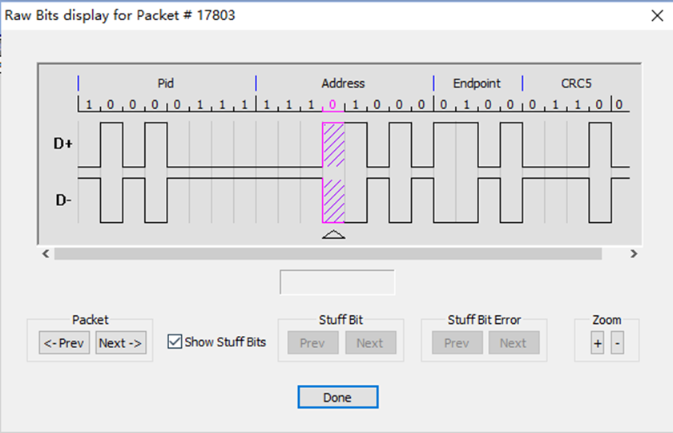

USB sử dụng chuẩn giao tiếp nối tiếp giống như UART, I2C, SPI,...Tuy nhiên, khi receiver và transmitter hoạt động ở hai tần số khác nhau thì dẫn đến vấn đề về đồng bộ tín hiệu.

Một giải pháp là thêm tín hiệu clock trong khi truyền nhận tín hiệu để đồng bộ quá trình truyền nhận. Một ví dụ điển hình là I2C, SDA được sử dụng để truyền dữ liệu và SCL được sử dụng để truyền tín hiệu clock:

Mặc dù cách này giải quyết được vấn đề nhưng cần thêm một đường tín hiệu clock. Có cách nào để đồng bộ mà không cần thêm tín hiệu clock không?

Câu trả lời ở đây là sử dụng NRZI.

NRZI là viết tắt của Non-Return to Zero Inverted – là một phương pháp mã hóa tín hiệu nhị phân thành dao động điện áp để truyền trên đường dây vật lý.

Hoạt động của NRZI dựa trên sự thay đổi hoặc không thay đổi của tín hiệu. Tức là, dòng tín hiệu chỉ đảo chiều khi gặp bit 0, còn lại giữ nguyên.

| Bit dữ liệu | Trạng thái tín hiệu NRZI |
|-------------|--------------------------|
| 1           | Không thay đổi tín hiệu  |
| 0           | Đảo trạng thái tín hiệu  |

Cách này giúp giảm số lần chuyển mạch khi dữ liệu chứa nhiều bit 1 từ đó giúp tiết kiệm năng lượng và ít gây nhiễu.

Đến đây thì vẫn chưa thể kết luận được rằng NRZI có khả năng đồng bộ được, ta cần phải kết hợp thêm một phương pháp đặc biệt. Đối với USB, trong mỗi packet đều có một trường SYNC ở đầu. Sau khi trường này được mã hóa bởi NRZI, nó trở thành một chuỗi sóng vuông. Từ đó, receiver có thể tính toán tần số của transmitter ban đầu thông qua trường SYNC này để đồng bộ các dữ liệu tiếp theo.

Tuy nhiên, vẫn còn một vấn đề. Mặc dù receiver  có thể bắt kịp tần số của transmitter nhưng vẫn luôn có khả năng sai số giữa hai bên. Giả sử, nếu dữ liệu được gửi đi là một chuỗi 1000 bit logic 1, sau khi mã hóa NRZI thì sẽ có một khoảng thời gian dài tín hiệu không có sự thay đổi. Trong trường hợp này, receiver không có mốc để tính toán thời gian, từ đó không biết có bao nhiêu bit đã qua đi → mất đồng bộ. 

Giải pháp của USB cho vấn đề này là chèn số 0, hay còn gọi là stuff bit. Nếu có 7 số 1 liên tiếp trong dữ liệu được truyền, một số 0 sẽ được stuff sau số 1 thứ 6 trước khi gửi đi, do đó tín hiệu được truyền đi sẽ bị toggle, do đó buộc receiver phải điều chỉnh tần số. Receiver có thể khôi phục dữ liệu gốc bằng cách xóa số 0 sau 6 số 1 liên tiếp.

Lúc này ta có một câu hỏi, nếu truyền đi 11111101 thì người nhận có xóa số 0 không? Câu trả lời là không. Sau khi receiver nhận được 6 bit 1, chắc chắn nó sẽ nhận được bit 0 ngay sau đó. Lý do ở đây là vì nếu bit thứ 7 là 1, 0 sẽ được chèn vào hoặc nếu bit thứ 7 được truyền là 0 thì vẫn sẽ nhận được bit 0. Việc có nên xóa số 0 này hay không đòi hỏi phải kiểm tra bit tiếp theo của số 0. Nếu bit tiếp theo là số 1, thì transmitter thực sự đã gửi 7 số 1 liên tiếp và số 0 nhận được trước đó thực sự đã được stuff và cần phải xóa. Nếu bit tiếp theo là 0, thì transmitter chỉ gửi 6 bit 1, và bit 0 nhận được trước đó là dữ liệu do transmitter gửi đi và không thể xóa được.

→ Kết luận: Trường Sync giúp đồng bộ tín hiệu lúc bắt đầu gói tin, tuy nhiên, trong quá trình truyền vẫn có khả năng mất đồng bộ như đã nói ở trên, nên cần bit stuffing xuyên suốt khi truyền packet để bổ trợ, từ đó duy trì đồng bộ chính xác hơn.