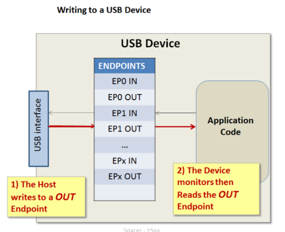
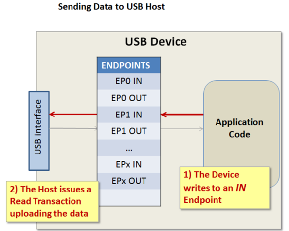

Cơ chế truyền dữ liệu liên quan đến việc host đọc và ghi vào các bộ nhớ đặc biệt trên mỗi device. Các bộ nhớ này được gọi là endpoint. Về cơ bản, có thể hiểu các endpoint là các buffer in và out. Endpoint là khái niệm nằm ở device, host không có khái niệm endpoint.

Endpoint có tính chất đơn hướng, tức là mỗi endpoint được thiết kế để truyền dữ liệu theo một hướng: endpoint IN hoặc endpoint OUT. Trong đó:
- Endpoint IN chứa dữ liệu được gửi từ device tới Host.
- Endpoint OUT chứa dữ liệu được nhận từ Host tới device.

Mỗi endpoint tại thời điểm thiết kế được gán một ID duy nhất được gọi là endpoint number.

Endpoint zero (EP0IN và EP0OUT) là endpoint mặc định trong mọi device nhằm mục đích control device trong quá trình enumeration và trong suốt quá trình device hoạt động trên bus. Trong đó:
- EP0 IN chứa mô tả về USB device, được máy chủ đọc trong quá trình enumeration.
- EP0 OUT cung cấp cho host khả năng gửi các control command đến device.

*Quá trình enumeration được hiểu là quá trình mà khi một device được attach tới host thì host sẽ gửi một loạt các descriptor tới cho device và device phải có trách nhiệm gửi các thông tin liên quan đến device cho host, sau khi host nhận được đủ thông tin liên quan đến device thì nó sẽ cấp cho device đó một địa chỉ. Lúc này, quá trình enumeration mới được coi là hoàn thành.*

Một USB device có thể có tối đa 32 endpoint trong đó có 16 endpoint OUT và 16 endpoint IN. Trong đó, EP0 IN và EP0 OUT là endpoint mặc định nên số lượng endpoint mà một nhà thiết kế USB device có thể làm để truyền dữ liệu là 30.

Khi host muốn gửi data đến một device, data được lưu tại endpoint OUT của device và thông qua việc sử dụng WRITE transaction thì dữ liệu sẽ được gửi đến device.

Khi device muốn gửi dữ liệu tới host, data được lưu tại endpoint IN. Tuy nhiên. data sẽ vẫn nằm tại endpoint IN này cho đến khi host thực hiện READ transaction khiến data của endpoint IN được gửi đến host.

Giao tiếp giữa host và device là không đồng bộ qua USB. Device không được thông báo khi quá trình truyền dữ liệu do host khởi tạo bắt đầu. Device phải chủ động kiểm tra xem có nhận được gói dữ liệu từ host hay không. Nếu device đọc hoặc ghi vào endpoint trong khi giao dịch host đang truy cập endpoint thì có thể làm hỏng dữ liệu.
