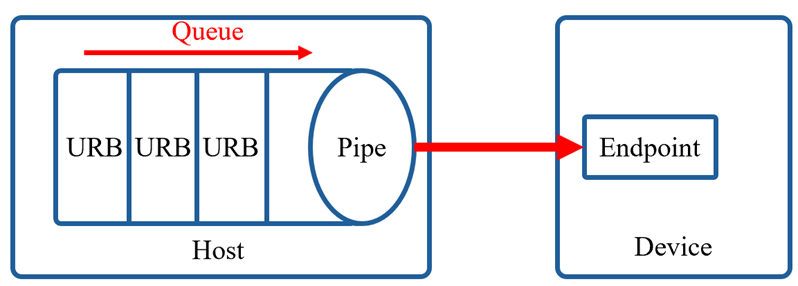

Trong USB, pipe là khái niệm dùng để mô tả một kênh logic kết nối giữa host và một endpoint cụ thể trên thiết bị. Pipe không phải là đường truyền vật lý mà là một khái niệm trừu tượng, đại diện cho luồng dữ liệu riêng biệt mà host sử dụng để giao tiếp với thiết bị. Mỗi pipe gắn liền với một endpoint cố định trên thiết bị, và endpoint này đã được mô tả rõ ràng trong endpoint descriptor.

Tóm lại, mỗi pipe sẽ chứa thông tin như endpoint address, transfer type, hướng truyền, tốc độ, dung lượng tối đa mỗi packet.

Hai loại pipe cơ bản:
- Control pipe
- Steam pipe

Khi một thiết bị USB được attach vào host, quá trình đầu tiên diễn ra là enumeration. Trong quá trình này, host gửi các control request qua default control pipe để lấy các descriptors như Device Descriptor, Configuration Descriptor, Interface Descriptor, và Endpoint Descriptor. Dựa trên các Endpoint Descriptor mà thiết bị trả về, host sẽ biết có bao nhiêu endpoint, mỗi endpoint hỗ trợ loại truyền nào (bulk, interrupt, isochronous), hướng truyền (IN hay OUT), và các thuộc tính liên quan như MaxPacketSize. Với mỗi endpoint mà thiết bị khai báo, host sẽ thiết lập một pipe tương ứng, nghĩa là tạo ra một đối tượng quản lý luồng giao tiếp giữa host và endpoint đó.

Khi cần truyền hoặc nhận dữ liệu từ một endpoint thuộc device, host sẽ gửi một yêu cầu đến hàng đợi queue thuộc pipe tương ứng, yêu cầu này được đóng gói thành một cấu trúc gọi là USB Request Block. URB chính là đơn vị quản lý truyền tải cơ bản trong USB.

Mỗi URB sẽ chứa các thành phần:
- Transfer direction: gửi dữ liệu (OUT) hay nhận dữ liệu (IN).
- Transfer type: bulk, interrupt, isochronous.
- Transfer Buffer: con trỏ đến vùng nhớ chứa dữ liệu cần truyền đi, hoặc vùng nhớ trống để chứa dữ liệu nhận về.
- Buffer Length: kích thước của buffer (bao nhiêu byte cần truyền hoặc nhận).
- Interval: Đối với interrupt và isochronous, cho biết chu kỳ polling.
- Completion Callback: một hàm callback sẽ được gọi khi URB hoàn thành, thành công hay thất bại.

Lý do cần hàng đợi URB là vì kích thước tối đa của mỗi packet tùy thuộc vào giá trị wMaxPacketSize trong endpoint descriptor, cụ thể ở đây là ở phía device.

Đối với các ứng dụng đưa ra rất nhiều yêu cầu truyền tải một lúc, ví dụ như in một tài liệu dài, đọc liên tục dữ liệu từ chuột,...Mỗi yêu cầu như vậy được đóng gói thành một URB. Mà mỗi yêu cầu URB lại xử lý theo thời gian truyền khác nhau nên cần một cơ chế lập lịch để quản lý và điều phối dữ liệu tới các endpoint.

Cơ chế này sẽ được thực hiện thông qua Host Controller Device, nó sẽ định kỳ duyệt qua danh sách các pipe và kiểm tra hàng đợi URB của từng pipe. Tùy vào mức độ ưu tiên của từng pipe, HCD sẽ quyết định pipe nào được phép truyền URB tiếp theo.
