# USB protocol

## Kiến trúc giao thức USB

USB là một giao thức truyền thông nối tiếp theo mô hình host–centric. Trong hệ thống USB thì toàn bộ bus được điều khiển bởi host; mọi hoạt động truyền dữ liệu đều do host khởi tạo và lập lịch. Thiết bị ngoại vi (device) chỉ phản hồi theo yêu cầu từ host, không bao giờ tự ý phát dữ liệu lên bus.

Dữ liệu trên bus USB được tổ chức theo ba lớp logic: packet, transaction, và frame. Trong đó:
- Packet là đơn vị vật lý nhỏ nhất trên đường truyền.
- Transaction là chuỗi các packet thực hiện một hành động hoàn chỉnh.
- Frame là khoảng thời gian mà host dùng để lập lịch các transaction.

Mối quan hệ giữa ba lớp này được mô tả như sau:

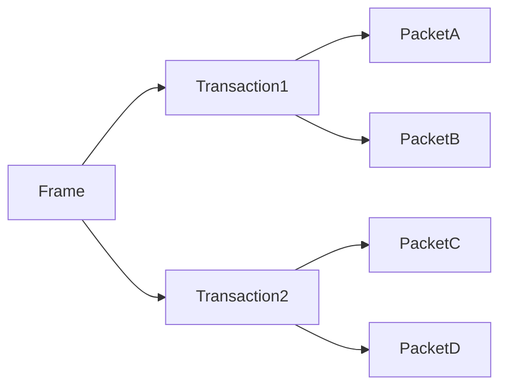

## Transaction

Một USB transaction được chia thành ba phase:
- Token Packet: Do host gửi, xác định loại transaction và endpoint đích.
- Data Packet (Optional): Chứa payload dữ liệu, do host hoặc device gửi tùy hướng.
- Status Packet: Gói phản hồi trạng thái (ACK / NAK / STALL) nhằm xác nhận transaction thành công hay thất bại.

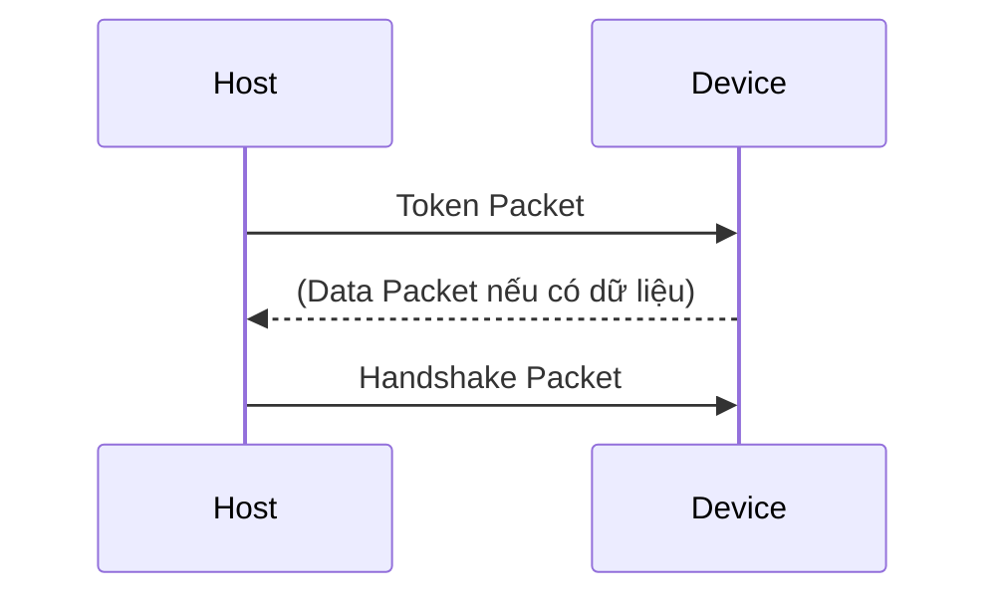

Cách tổ chức này đảm bảo mọi giao tiếp đều được kiểm soát chặt chẽ, tránh xung đột trên bus và cho phép host chủ động quản lý băng thông.

## Định dạng Packet

Mọi packet đều tuân theo cấu trúc chung như sau:

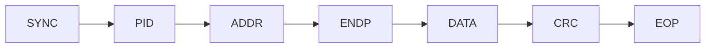

Trong đó:

- **Sync field**: Tất cả các packet phải được bắt đầu bằng trường Sync. Trường này dài 8 bit đối với full/low speed hoặc 32 bit đối với high speed, được sử dụng để đồng bộ clock giữa receiver và transmitter. Trong đó, hai bit cuối cho biết nơi bắt đầu của trường PID.

- **Packet Identifier Field - PID**: Trường này xác định loại gói sẽ được gửi, từ đó biết được packet dùng để làm gì, hướng dữ liệu của packet,..., nếu là Handshake packet, chúng sẽ cho biết đã truyền nhận thành công hay chưa.

  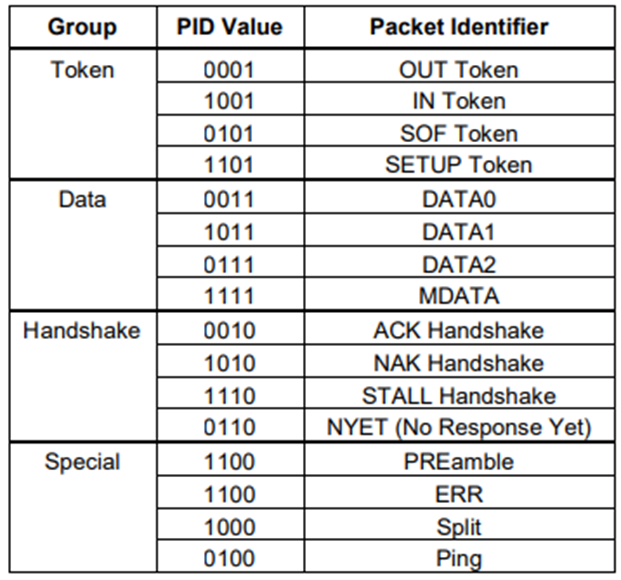

  PID gồm 4 bit cao cho biết packet type field và 4 bit thấp dùng để check field. 4 bit check field là phần bù của 4 bit packet type field, nhằm đảm bảo dữ liệu được truyền chính xác.

  

- **Address field**: Cho biết địa chỉ của device. Trường này có độ dài 7 bit cho phép hỗ trợ 127 device. Address 0 không hợp lệ vì nó được dùng làm default address.

- **Endpoint field**: Độ dài 4 bit cho phép hỗ trợ 16 endpoint. Tuy nhiên, đối với low speed device chỉ có tối đa là 3 endpoint.

- **Data field**: Trường dữ liệu có độ dài nằm trong khoảng 0 đến 1024 byte. Các bit trong mỗi byte được dịch từ LSB đầu tiên. Kích thước của data field tuỳ thuộc vào transfer type.

- **Cyclic Redundancy Checks - CRC**: được sử dụng để verify tất cả các trường không phải là PID trong token và data packet. Các token packet có 5 bit CRC, trong khi data packets có 16 bit CRC.

- **End Of Packet - EOP**: cho biết packet kết thúc.

:::tip
Cần phải hiểu rõ rằng mỗi một packet sẽ được bắt đầu bằng SYNC và kết thúc bằng EOP.
:::

## Phân loại packet

### Token packet

Đối với OUT và SETUP transaction, trường address và endpoint cho biết endpoint nào sẽ được nhận Data packet.

Đối với IN transaction, các trường này sẽ xác định endpoint sẽ truyền Data packet.

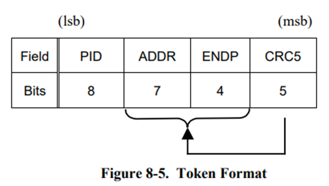

### Data packet

Data Packet: Có hai loại data packet gồm DATA0 hoặc DATA1, mỗi loại có khả năng truyền từ 1 đến 1024 byte dữ liệu.

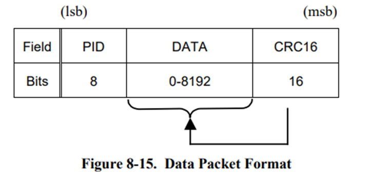

USB cung cấp một cơ chế động bộ hoá dữ liệu giữa transmitter và receiver. Cơ chế này nhằm đảm bảo rằng việc bắt tay giữa các transaction được chính xác. Cơ chế này được sử dụng thông qua DATA0 và DATA1.

Cơ chế hoạt động như sau:
- Một endpoint duy trì một trạng thái toggle bit: 0 hoặc 1.
- Data packet gửi đi sẽ được đánh dấu là DATA0 hoặc DATA1, tương ứng với trạng thái toggle hiện tại.
- Sau mỗi lần truyền thành công, host và device sẽ đảo trạng thái toggle, tức là từ 0 → 1 hoặc 1 → 0.
- Nếu host hoặc device nhận được data packet với toggle bit không đúng với mong đợi, nó sẽ ignore và yêu cầu gửi lại.

Giả sử host gửi dữ liệu tới device:
- Lần đầu: Host gửi gói DATA0, device nhận và phản hồi ACK.
- Lần sau: Host gửi DATA1, device phản hồi ACK.
- Nếu host không nhận được ACK, nó sẽ gửi lại DATA1.
- Device kiểm tra toggle bit. Nếu nó trùng với lần trước, device biết là gói cũ, và có thể bỏ qua.

### Handshake packet

Handshake Packets: Các Handshake Packet được phân cách bằng EOP. Có 3 loại handshake packets chính:
- ACK: cho biết data packet đã được nhận thành công.
- NAK: cho biết function không nhận data từ host (OUT) hoặc function không có data để truyền đến host (IN).
- STALL: cho biết function không thể truyền hoặc nhận data.

## Các loại transfer

Các phần trước đã mô tả cách USB truyền dữ liệu ở mức packet và cách các packet được ghép lại thành transaction. Tuy nhiên, người thiết kế firmware không làm việc với từng transaction riêng lẻ, mà làm việc với khái niệm transfer.

Một transfer là một chuỗi nhiều transaction liên tiếp, được host lập lịch để thực hiện một mục đích truyền dữ liệu hoàn chỉnh, ví dụ: đọc một descriptor, truyền một khối dữ liệu lớn, hay stream audio thời gian thực.

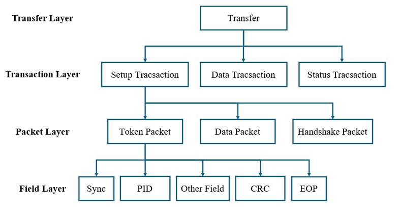

### Control Transfers

Control transfer là loại truyền dữ liệu cơ bản và bắt buộc trong USB protocol, dùng để quản lý và cấu hình thiết bị USB thông qua host. Protocol này sử dụng endpoint 0 để giao tiếp, bắt buộc phải có ở mọi thiết bị USB.

Kích thước tối đa của data payload đối với full speed device là 8, 16, 32 hoặc 64 byte; đối với high speed device là 64 bytes và đối với low speed device là 8 byte. Điều này được áp dụng cho các data packet sau khi Setup. Setup packet luôn có kích thước là 8 byte.

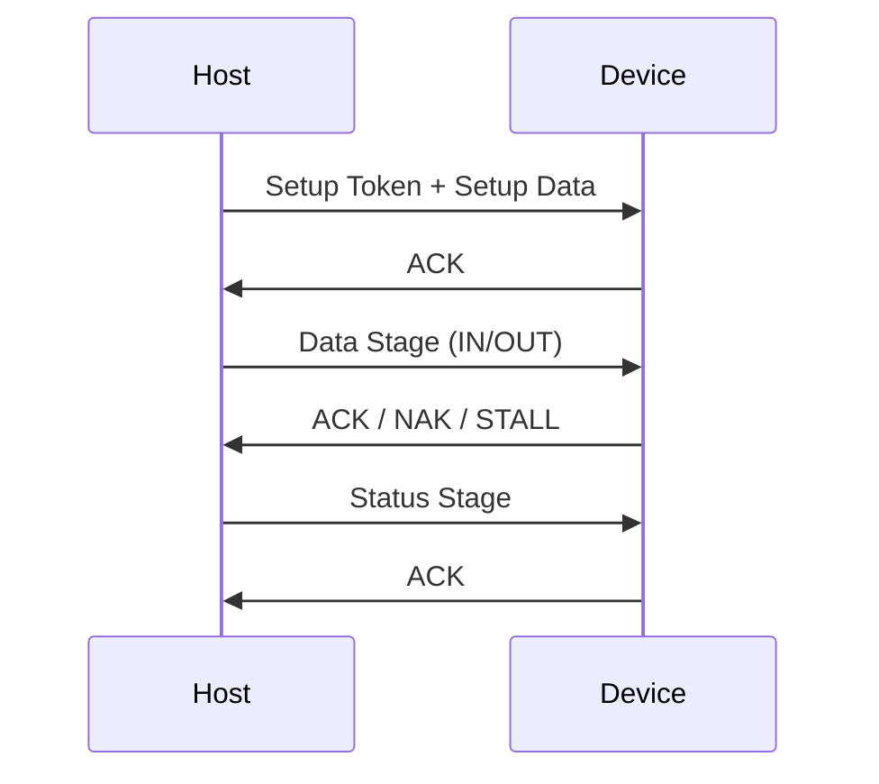

**Setup stage**

- Setup token chứa address và endpoint number.
- Data packet 
- Handshake Packet: cho biết nhận thành công hoặc báo lỗi. Nếu nhận dữ liệu thành công, nó sẽ trả về ACK, ngược lại, nó sẽ bỏ qua dữ liệu và không gửi Handshake packet. Các function không thể trả về NAK hoặc STALL để phản hồi setup packet

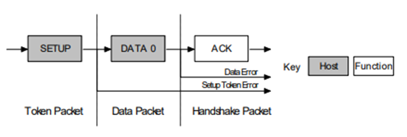

**Data stage**

Gồm một hoặc nhiều lần transfer IN hoặc OUT. Setup stage cho biết kích thước data được truyền trong stage. Nếu nó vượt quá kích thước packet tối đa, data sẽ được truyền nhiều lần với mỗi lần là độ dài packet tối đa, ngoài trừ last packet.

Data stage có hai cách thực hiện khác nhau tùy thuộc vào hướng của data transfer:

- IN: Khi host muốn nhận control data, nó sẽ release một IN Token, nếu function nhận được cái IN Token này mà bị lỗi thì nó sẽ bỏ qua packet. Nếu token được nhận chính xác thì device sẽ response bằng DATA packet chứa control data sẽ được gửi, stall packet cho biết endpoint đã có lỗi hoặc NAK packet cho host biết rằng endpoint đang hoạt động, nhưng tạm thời chưa có dữ liệu được gửi.

- OUT: Khi host cần gửi control data packet tới device, nó sẽ release một OUT token theo sau là một data packet chứa control data. Nếu OUT token hoặc data packet này bị hỏng thì function sẽ ignore packet. Nếu endpoint buffer của function là rỗng và nó nhận data control được gửi vào endpoint buffer thì device sẽ release một ACK để thông báo với Host rằng nó đã nhận dữ liệu thành công. Nếu endpoint buffer là không rỗng do vẫn đang xử lý packet trước đấy thì function sẽ trả về NAK. Tuy nhiên, nếu endpoint bị lỗi và bit halt của nó là được set thì nó sẽ trả về STALL.

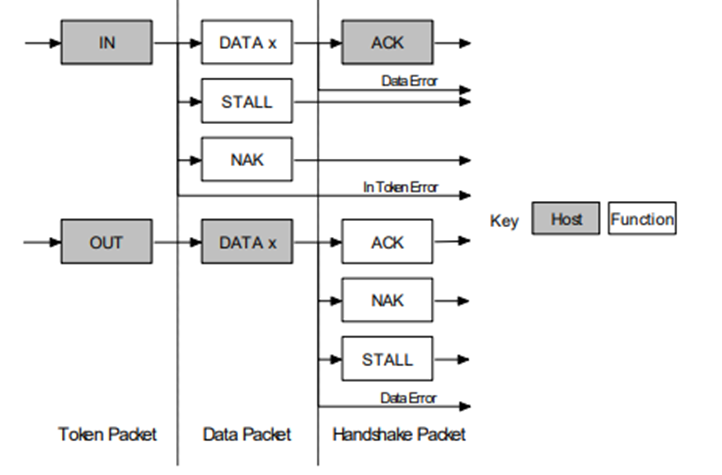

**Status stage**

Cho biết status của yêu cầu vừa được nhận từ host. Status stage luôn được thực hiện bởi function.

- IN: Nếu host gửi IN Token trong khi data stage nhận data thì host sẽ xác nhận dữ liệu được nhận thành công. Điều này được thực hiện bằng cách host sẽ gửi một OUT token theo sau là data packet có độ dài bằng 0. Lúc này, function có thể thông báo về status của nó tại handshaking stage. Một ACK cho biết một function đã hoàn thành command và giờ nó sẵn sàng để nhận một command khác. Nếu lỗi xảy ra trong khi xử lý command thì function sẽ release STALL. Tuy nhiên, nếu function là vẫn đang trong quá trình xử lý thì nó sẽ trả về NAK để báo cho host biết repeat status stage lần sau.
 
  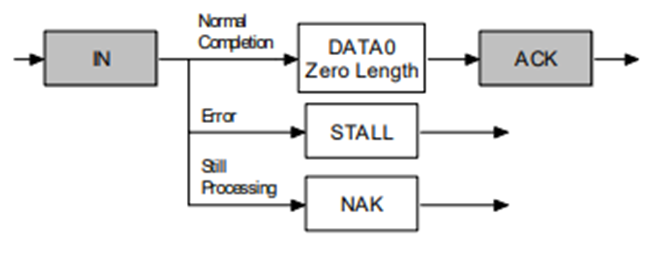

- OUT: Nếu host gửi OUT token trong khi data stage đang truyền data, function sẽ xác nhận data được nhận thành công bằng cách gửi một zero length packet để response In token. Tuy nhiên, nếu lỗi xảy ra, function sẽ release một STALL hoặc nếu nó đang bận xử lý thì nó sẽ release NAK để yêu cầu host thử lại status stage.

  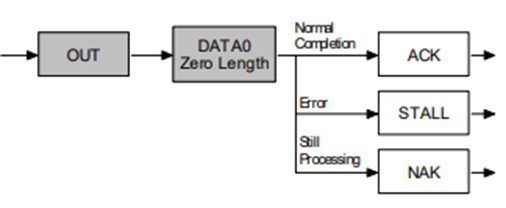

### Interrupt Transfer

Interrupt transfer được sử dụng để truyền dữ liệu nhỏ, quan trọng, cần phản hồi nhanh, ví dụ như bàn phím, chuột,...

Cơ chế hoạt động: Host sẽ định kỳ thăm dò endpoint theo khoảng thời gian được lập trình trong endpoint descriptor. Nếu device có dữ liệu, host sẽ nhận được ngay khi polling. Nếu không có dữ liệu, host nhận được gói NAK. Khi xảy ra lỗi, host tự động retry để đảm bảo dữ liệu truyền và nhận chính xác.

Kích thước tối đa của data packet:
- Đối với low speed là 8 byte.
- Đối với full speed là 64 byte.
- Đối với high speed là 1024 byte.

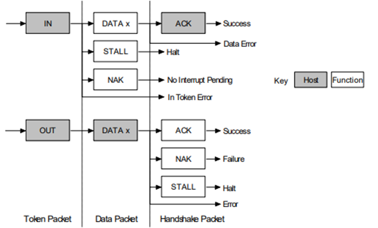

### Bulk Transfer

Bulk transfer được dùng để truyền dữ liệu lớn, không yêu cầu real-time. Dùng khi cần độ tin cậy cao, ví dụ như USB Flash Drive, Printer, UART qua USB (CDC/ACM).

Cơ chế hoạt động: Host chỉ truyền data khi bus rảnh và nhận data khi nó ready. Nếu xảy ra lỗi, host sẽ tự retry cho đến khi thành công → độ tin cậy cực cao. Nhưng không có băng thông hay thời gian đảm bảo → có thể bị chậm nếu USB bận.

Đối với full speed, kích thước tối đa của data packet là 8,16, 32 và 64 byte. Đối với high speed, kích thước tối đa của data packet là 512 byte.

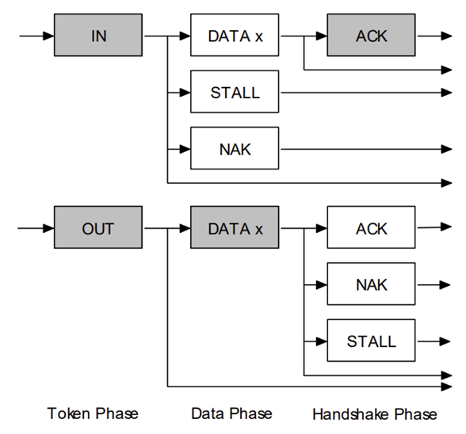

### Isochronous Transfer

Isochronous transfer được dùng trong các ứng dụng yêu cầu thời gian thực, cần truyền đều đặn, ví dụ như Microphone, webcam USB, audio USB. Isochronous Transfer không hỗ trợ low speed.

Cơ chế hoạt động: Host cấp phát băng thông cố định cho device ở mỗi frame. Data packet được gửi hoặc nhận tại mỗi frame, tức là sau 1 ms đối với full speed hoặc 125μs đối với High Speed. Packet có thể bị lỗi mà không cần retry, vì ưu tiên thời gian hơn độ chính xác => không có handshake (ACK/NAK).

Kích thước tối đa của data packet là 1023 đối với full speed và 1024 đối với high speed.
 
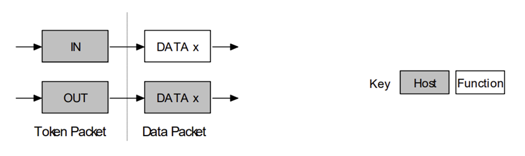