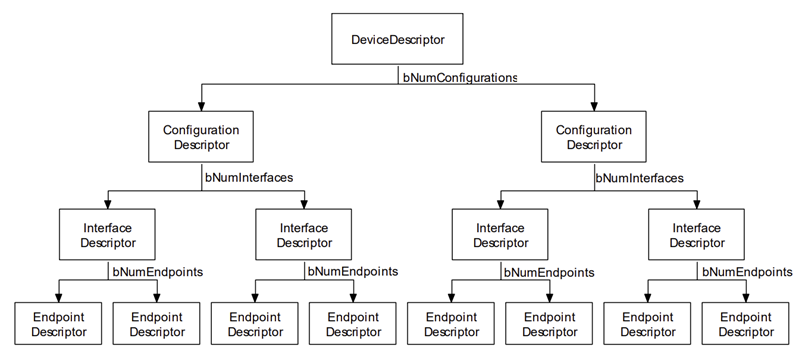
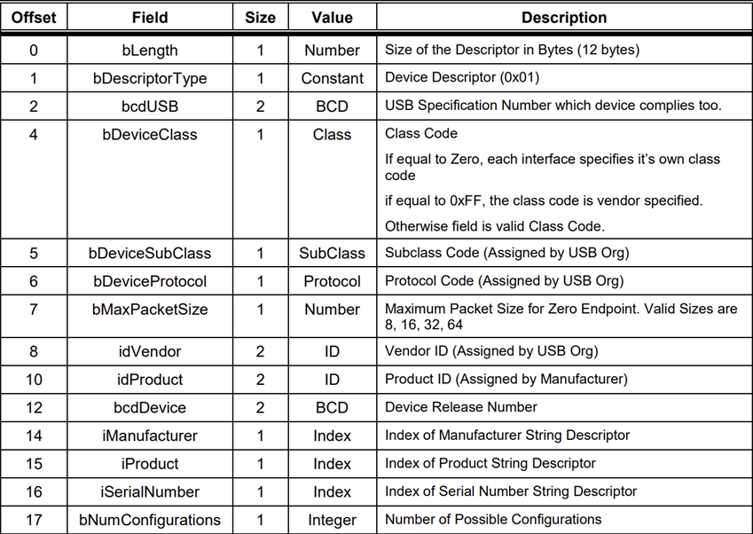
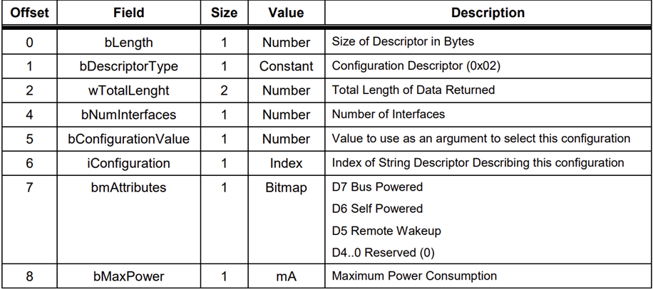
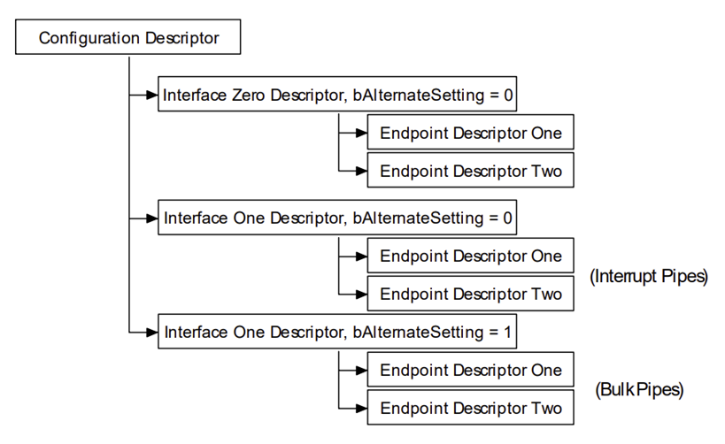
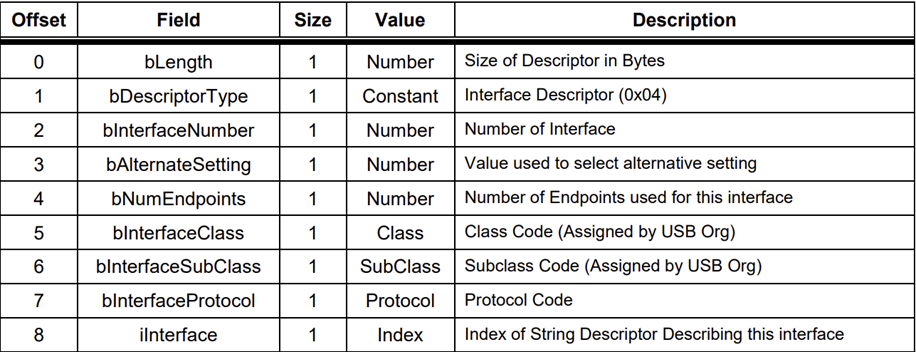
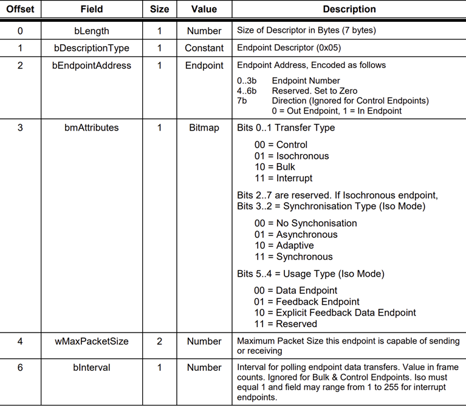

Tất cả thiết bị USB đều cần có hệ thống descriptor để mô tả cho host thông tin về:
Loại thiết bị
Nhà sản xuất
Phiên bản USB hỗ trợ
Số configuration, số interface, số endpoint và kiểu của chúng...

Cây hệ thống USB descriptor mà một device cần có được minh họa như hình sau:

## Device descriptor

Mỗi USB device chỉ có một device descriptor gồm các thông tin liên quan đến device như USB version, vendor ID, product ID, số lượng configuration có thể có. Thông tin chi tiết cấu trúc của device descriptor như sau:

Trường bcdUSB cho biết phiên bản USB cao nhất mà device hỗ trợ. Giá trị này ở dạng BCD với định dạng 0xJJMN, trong đó:
- `JJ`: major version
- `M`: minor version
- `N`: sub minor version

Ví dụ: USB 2.0 là 0x0200, USB 1.1 là 0x0110, USB 1.0 là 0x0100.

`idVendor` và `idProduct` được OS dùng để tìm driver phù hợp. Vendor ID được cấp bởi USB-IF.

bcdDevice` có cùng định dạng với bcdUSB và được dùng để biểu thị version của device.

Các trường `bDeviceClass`, `bDeviceSubClass` và `bDeviceProtocol` được OS sử dụng để tìm driver theo class cho device. Thông thường, chỉ trường `bDeviceClass` được thiết lập ở device level. Đa số các chuẩn class chọn cách xác định class ở cấp interface, nên thường sẽ đặt `bDeviceClass` = 0x00. Điều này giúp một thiết bị có thể hỗ trợ nhiều class khác nhau.

Trường `bNumConfigurations` cho biết số lượng cấu hình mà thiết bị hỗ trợ.

## Configuration descriptor

Mỗi device có thể có nhiều configuration descriptors, nhưng chỉ có một cấu hình được kích hoạt tại một thời điểm. Tuy nhiên, phần lớn các device chỉ có một configuration descriptors.

Mỗi configuration sẽ:
- Xác định lượng điện tiêu thụ (mA)
- Cho biết device là bus-powered hay self-powered
- Liệt kê số lượng interface có trong cấu hình

Host chọn cấu hình mong muốn bằng cách gửi lệnh `SetConfiguration`.

Ví dụ: Một thiết bị có thể có 2 cấu hình:
- Cấu hình 1: dùng bus power, 500mA
- Cấu hình 2: dùng nguồn ngoài (self-powered)

Thông tin chi tiết cấu trúc của configuration descriptor như sau:

Khi host đọc configuration descriptor, device cần trả về toàn bộ cấu hình gồm các interface và endpoint descriptor cho host. Trường `wTotalLength` cho biết số byte được trả về này.

## Interface descriptor

Interface đại diện cho một nhóm các endpoint tạo thành một chức năng cụ thể của device. Ví dụ như ta có một thiết bị có nhiều chức năng như printer, scanner, speaker thì interface descriptor cần có các endpoint phục vụ cho từng chức năng.

Một configuration có thể chứa nhiều interface và các interface này có thể hoạt động đồng thời. Không giống như configuration, chỉ có một configuration được hoạt động tại một thời điểm.

Interface descriptor có trường `bAlternateSetting`, cho phép thay đổi interface một cách nhanh chóng.

Ví dụ:
- Interface 1 (Fax): `bAlternateSetting = 0`
- Interface 1 (Fax high-speed): `bAlternateSetting = 1`
- Host có thể gửi `SetInterface` để chuyển đổi giữa 2 cách hoạt động mà không ảnh hưởng các interface khác.

Thông tin chi tiết cấu trúc của interface descriptor như sau:

## Endpoint descriptor

Mỗi interface bao gồm một hoặc nhiều endpoint descriptors.

Mỗi endpoint mô tả:
- Hướng truyền (IN/OUT)
- Loại truyền (control, bulk, interrupt, isochronous)
- Kích thước gói dữ liệu tối đa
- Khoảng thời gian polling (với interrupt endpoint)

Thông tin chi tiết cấu trúc của endpoint descriptor như sau:

