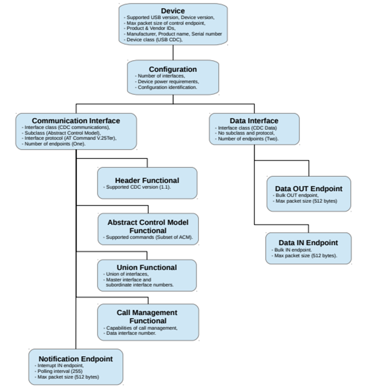

Communication Device Class hay CDC là một chuẩn USB chuyên hỗ trợ các loại device truyền thông dữ liệu như telecommunications device hoặc networking device. Ví dụ như:
- USB to UART/RS232 converter
- USB modem
- USB Ethernet
- STM32 USB Virtual COM Port (CDC ACM)

Các loại communication device class phổ biến:
- Abstract Control Model - ACM: Mô phỏng cổng serial (COM port). Ví dụ như: USB to UART, Virtual COM Port CDC.
- Ethernet Control Model - ECM: Mô phỏng kết nối mạng Ethernet. Ví dụ như: USB Ethernet Dongle CDC NCM
- Network Control Model - NCM: Truyền mạng tốc độ cao hơn ECM. Ví dụ như: Thiết bị mạng tốc độ cao qua USB.

Một communication device bao gồm 3 tác vụ cơ bản:
- Device management: tác vụ này quản lý trạng thái hoạt động của device và thông báo cho host biết về các event xảy ra trên device.
- Call management: tác vụ này có chức năng yêu cầu bắt đầu và kết thúc telephone call.
- Data transmission: tác vụ này có chức năng send và receive dữ liệu.

Các descriptors tại hình minh hoạ dưới đây là bắt buộc đối với USB CDC ACM Device:

**Tham khảo**

https://www.keil.com/pack/doc/mw6/USB/html/_c_d_c.html

https://www.xmos.com/download/AN00124:-USB-CDC-Class-as-Virtual-Serial-Port(2_0_2rc1).pdf