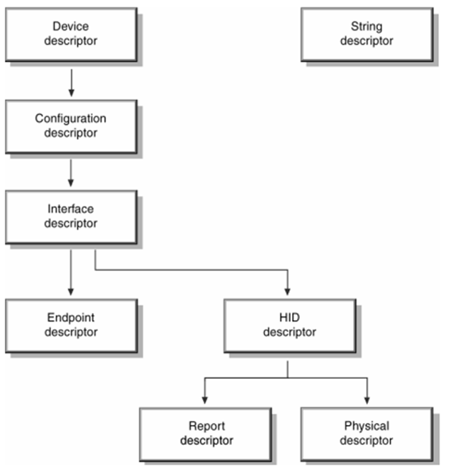
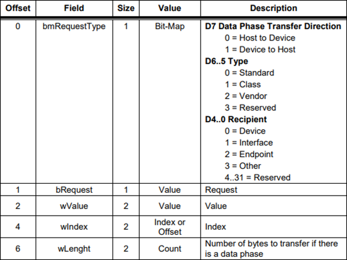
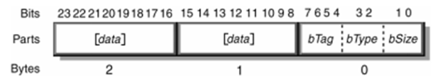
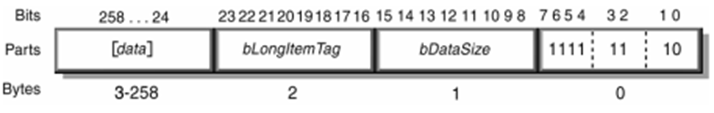
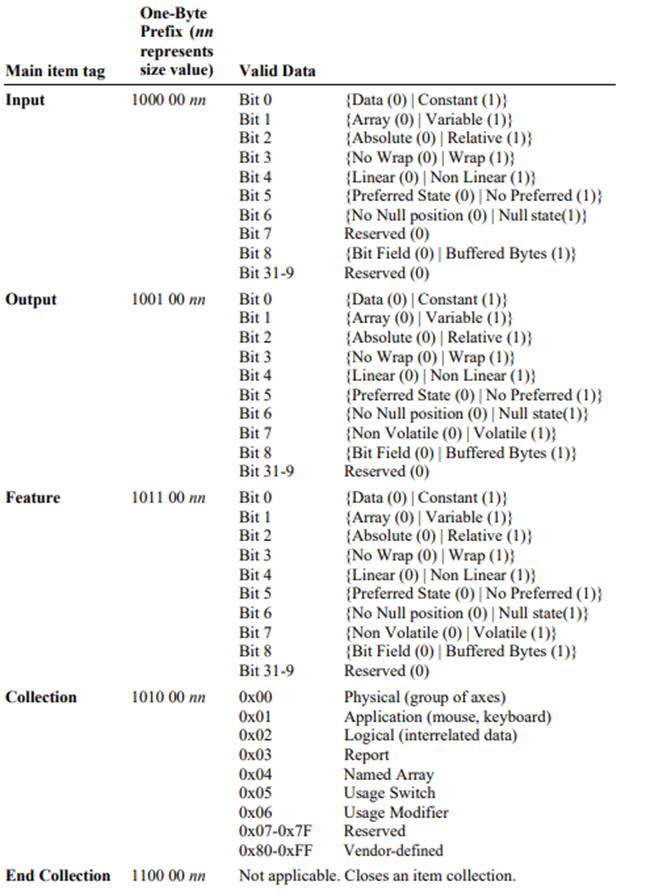

HID là một chuẩn thiết bị USB dành cho các thiết bị giao tiếp trực tiếp với người dùng (human interface). Các thiết bị này thường gửi dữ liệu đơn giản, tốc độ thấp, nhưng yêu cầu phản hồi nhanh. Ví dụ như mouse, keyboard,...Ngoài ra, các thiết bị HID không nhất thiết phải tương tác giữa người và máy tính. Bất kỳ thiết bị nào tuân thủ theo thông số kỹ thuật của HID đều là thiết bị HID.

Các descriptors tại hình minh hoạ dưới đây là bắt buộc đối với USB HID Device:



Byte đầu tiên và thứ hai của mỗi descriptor lần lượt là độ dài và loại của descriptor. Bảng sau liệt kê các giá trị trường kiểu của các descriptor khác nhau.

| Descriptor                | Giá trị |
| ------------------------- | ------- |
| Device Descriptor         | 0x01    |
| Configuration Descriptor  | 0x02    |
| String Descriptor         | 0x03    |
| Interface Descriptor      | 0x04    |
| Endpoint Descriptor       | 0x05    |
| Qualifier Descriptor      | 0x06    |
| Other_Speed_Configuration | 0x07    |
| Interface Power           | 0x08    |
| HID Descriptor            | 0x21    |
| Hub Descriptor            | 0x29    |
| Report Descriptor         | 0x22    |
| Physical Descriptor       | 0x23    |

3 trường `bDeviceClass`, `bDeviceSubClass` và `bDeviceSubClass` trong Device Descriptor phải được đặt thành 0 và trường `bInterfaceClass` trong Interface Descriptor phải được đặt thành 0x03 để host hiểu đây là một thiết bị HID.

Trường `bInterfaceSubClass` của Interface Descriptor được sử dụng để xác định xem thiết bị có hỗ trợ boot interface hay không.

| Subclass code | Mô tả |
| ------------- | ----- |
| 0             | No Subclass |
| 1             | Boot Interface Subclass |
| 2-255         | Reserved |

Trường `bInterfaceProtocol` của Interface Descriptor chỉ có ý nghĩa khi trường `bInterfaceSubClass` khai báo rằng thiết bị hỗ trợ boot interface.

| Protocol code | Mô tả |
| ------------- | ----- |
| 0             | None |
| 1             | Keyboard |
| 2             | Mouse |
| 3-255         | Reserved |

Thông tin các trường HID Descriptor như sau:

| Byte  | Field             | Descriptor |
| ----- | ----------------- | ---------- |
| 0     | `bLength`         | Độ dài của HID Descriptor, luôn là 9 byte. |
| 1     | `bDescriptorType`  | Loại descriptor, luôn là 0x21 cho HID Descriptor. |
| 2–3   | `bcdHID`          | Phiên bản chuẩn HID mà thiết bị tuân theo. |
| 4     | `bCountryCode`    | Mã quốc gia (layout bàn phím). 0 = Not localized. |
| 5     | `bNumDescriptors` | Số lượng các HID class descriptor theo sau (thường là 1, tức là Report Descriptor). |
| 6     | `bDescriptorType` | Loại descriptor tiếp theo, thường là 0x22 cho Report Descriptor. |
| 7–8   | `wDescriptorLength` | Độ dài tính bằng byte của Report Descriptor. |

HID là một thành phần của USB, do nó cũng hỗ trợ các standard request như `GET_DESCRIPTOR`, `SET_CONFIGURATION`,...và cũng hỗ trợ một số request riêng cho class của nó.

Ta có cấu trúc dữ liệu của standard request như sau:



Với HID class, bit `D6-5` của trường `bmRequestType` sẽ là 1, cho biết đây là request class.

Các request cụ thể của HID class hỗ trợ nằm trong trường `bRequest` sẽ như sau:

| `bRequest`     | Value |
| -------------- | ----- |
| `GET_REPORT`   | 0x01  |
| `GET_IDLE`     | 0x02  |
| `GET_PROTOCOL` | 0x03  |
| `Reserved`     | 0x04-0x08 |
| `SET_REPORT`   | 0x09  |
| `SET_IDLE`     | 0x0A  |
| `SET_PROTOCOL` | 0x0B  |

**GET_REPORT**

Host muốn đọc ngay lập tức dữ liệu trạng thái hiện tại của thiết bị HID thay vì chờ Interrupt Transfer.

Ví dụ: lúc mới kết nối, cần lấy trạng thái ban đầu.

<table>
  <tr>
    <th>wValue</th>
    <th colspan="3"></th>
  </tr>
  <tr>
    <td rowspan="4">Byte cao</td>
    <td rowspan="4">Report Type</td>
    <td>0x01</td>
    <td>Input Report</td>
  </tr>
  <tr>
    <td>0x02</td>
    <td>Output Report</td>
  </tr>
  <tr>
    <td>0x03</td>
    <td>Feature Report</td>
  </tr>
  <tr>
    <td>0x04–0xFF</td>
    <td>Reserved</td>
  </tr>
  <tr>
    <td>Byte thấp</td>
    <td>Report ID</td>
    <td colspan="2"></td>
  </tr>
</table>

**SET_REPORT**

Host muốn thiết lập trạng thái cho thiết bị HID. Ví dụ: Gửi lệnh điều khiển LED trên bàn phím,...

**SET_IDLE**

Host thiết lập thời gian Idle Rate cho thiết bị. Sử dụng khi khi host muốn: Giảm tần suất cập nhật để tiết kiệm băng thông hoặc yêu cầu thiết bị gửi thường xuyên hơn để giảm độ trễ. Trong đó, Idle Rate là khoảng thời gian tối đa giữa 2 lần gửi Report kể cả khi dữ liệu không đổi.

Các thiết bị HID report dữ liệu cho host theo interrupt, chẳng hạn như chuột và bàn phím USB. Khi không có hoạt động nào xảy ra, thiết bị không cần phải report dữ liệu cho host. Tuy nhiên, interrupt ở đây thực chất là chế độ thăm dò của host, nghĩa là bất kể ta có report dữ liệu hay không, host vẫn sẽ gửi IN transaction, điều này sẽ gây lãng phí băng thông bus USB. Sau khi host có được configuration descriptor , nó sẽ thiết lập mô tả thông qua `SET_CONFIGURE` và sau đó là `SET_IDLE`, trước khi có được report descriptor.

**SET_PROTOCOL**

Host ra lệnh cho thiết bị chuyển đổi chế độ giao tiếp 2 chế độ:
- Boot Protocol: Format đơn giản chuẩn hóa.
- Report Protocol: Format tự do theo Report Descriptor.

## Report Descriptor

Như đã nói ở trên, HID là một chuẩn dành cho rất nhiều loại thiết bị khác nhau, vì thế nó không thể nào có một định dạng dữ liệu cụ thể cho tất cả các thiết bị HID được. Do đó, cần một cơ chế để các thiết bị HID tự mô tả cấu trúc dữ liệu mà nó sẽ gửi hoặc nhận. Cơ chế đó chính là HID Report Descriptor.

Report descriptor là một bộ mô tả tương đối phức tạp. Các thiết bị USB HID truyền dữ liệu thông qua các report, bao gồm input report, output report và feature report.

Khi thiết bị USB HID truyền dữ liệu tới host thì những dữ liệu này được gọi là dữ liệu thô và nếu không cho host biết những dữ liệu này được sử dụng để làm gì. Do đó, chức năng của report descriptor là mô tả định dạng của dữ liệu report này. Khi host hoặc thiết bị nhận được dữ liệu report, nó sẽ phân tích và hiểu ý nghĩa của dữ liệu dựa trên nội dung report descriptor.

Ví dụ: Nếu thiết bị là một con chuột máy tính, các nút bấm và tọa độ sẽ điều khiển Pointer trên màn hình. Sự kiện click hoặc right click sẽ làm gì, scroll sẽ làm gì. Để tất cả các sự kiện đó được xảy ra, trình điều khiển lớp HID phải biết rõ:
- Thiết bị HID kết nối sẽ điều khiển Pointer của máy tính
- Có 3 nút trên thiết bị và khi nhấn tương ứng với các hàm của Pointer
- Có 2 byte dữ liệu tọa độ sẽ thay đổi tọa độ của Pointer

Tất cả các thông tin này sẽ được mô tả trong phần Report Descriptor. Khi trình điều khiển phân tích cú pháp của Report Descriptor nó sẽ hiểu được khi thiết bị chuột máy tính truyền dữ liệu lên, dữ liệu nào sẽ thuộc ứng dụng nào của máy tính.

Report descriptor bao gồm các item, mỗi item là một phần dữ liệu liên quan đến thiết bị HID. Tất cả các item đều có byte đầu tiên nhằm quy định vai trò của device và độ dài dữ liệu của nó: item type, item tag và item size. Định dạng của item sẽ như sau:



Có hai loại item cơ bản là: short item và long item:
- Nếu item là một short item thì giá trị bSize của nó có thể là 0, 1, 2 hoặc 4 byte.
- Nếu item là một long item thì giá trị bSize cố định là 2.

Định dạng của long item như sau:



Mỗi item chia làm 3 loại item chính:
- 0 - Main item: Mô tả thực tế dữ liệu truyền đi và nơi dữ liệu được sử dụng. Các Global item và Local item có chức năng bổ nghĩa cho Main item.
- 1 - Global item: Mô tả thuộc tính của tất cả các Main item phía sau nó, cho đến khi có một Global item khác xuất hiện.
- 2 - Local item: Mô tả thuộc tính của Main item phía sau nó.

Đối với main item, có các item tag chính sau:
- 0x08 - Input item tag: Mô tả dữ liệu truyền từ thiết bị lên host như sự kiện nhấn nút, dữ liệu cảm biến, dữ liệu của nhà phát hành muốn gửi.
- 0x09: Output item tag: Mô tả dữ liệu từ Host truyền về thiết bị như điều khiển led, động cơ,....
- 0x0A: Collection item tag: Mỗi thiết bị HID phải có 1 bộ sưu tập ứng dụng (Application Collection), để trình xử lý có thể biết được dữ liệu đang sử dụng trong ứng dụng nào. Ví dụ: 1 thiết bị có 3 tính năng chuột, bàn phím và nút nguồn thì phải có 3 Application Collection để phân biệt dữ liệu gửi đi và trả về.
- 0x0B: Feature item tag: Mô tả dữ liệu được truyền đi được sử dụng để cấu hình cài đặt thiết bị như, tăng giảm tốc độ nháy của led, tốc độ động cơ …
- 0x0C: End collection item tag.

Thông tin data của main item như sau:



Đối với global item có các item tag chính như sau:
- 0x00 - Usage Page
- 0x01 - Logical Minimum: Giá trị số nguyên nhỏ nhất của Main Item
- 0x02 - Logical Maxinum: Giá trị số nguyên lớn nhất của Main Item
- 0x03 - Physical Minimum
- 0x04 - Physical Maximum
- 0x07 - Report Size: Kích thước của Main Item (tính theo bit).
- 0x08 - ReportId
- 0x09 - Report Count: Số lượng Main Item

Đối với local item có các item tag chính như sau:
- 0x00: Usage
- 0x01: Usage Minimum
- 0x02: Usage Maximum
- 0x03: Designator Index
- 0x04: Designator Minimum
- 0x05: Designator Maximum
- 0x07: String Index
- 0x08: String Minimum
- 0x09: String Maximum
- 0x0A: Delimiter

## Logical Minimum và Physical Minimum

Trong HID Report Descriptor, Logical Minimum và Physical Minimum (cùng với Logical Maximum và Physical Maximum) là các thông tin quan trọng, nhưng chúng phục vụ hai mục đích khác nhau:
- Logical Minimum và Logical Maximum xác định giá trị dữ liệu thực tế mà thiết bị gửi qua report. Nó mô tả khoảng giá trị mà dữ liệu sẽ thể hiện trong báo cáo.
- Physical Minimum và Physical Maximum mô tả ý nghĩa vật lý thực sự của giá trị đó trong thế giới thực, ví dụ như vị trí, lực, nhiệt độ... Nó là để host hoặc hệ điều hành hiểu rằng giá trị số nhận được tượng trưng cho đại lượng vật lý nào trong đời thực.

Ví dụ: Giả sử ta có một joystick có thể nghiêng trái phải trong khoảng từ -90° đến +90°. Ta cần mô tả HID report như sau:
- Logical Minimum = -127
- Logical Maximum = 127
- Physical Minimum = -90
- Physical Maximum = 90

Ý nghĩa: Giá trị bit gửi về từ thiết bị sẽ nằm trong khoảng từ -127 đến 127.Nhưng về mặt vật lý, giá trị đó biểu diễn cho khoảng từ -90 độ đến +90 độ. Giá trị -127 tương ứng với -90 độ, giá trị 0 tương ứng 0 độ, và giá trị 127 tương ứng với +90 độ.

## Usage minimum và Usage maximum

Khi khai báo Usage Minimum - Usage Maximum, tức là ta đang tạo ra nhiều Usage liên tiếp nhau.

Ví dụ về chuột: Nếu không có Usage Minimum/Maximum, ta phải viết thủ công như sau:

```
Usage (Button 1)
Usage (Button 2)
Usage (Button 3)
```

Nhưng với Usage Minimum và Usage Maximum, ta có thể tiết kiệm số lượng dòng mô tả, không cần viết từng Usage riêng lẻ.

```
Usage Page (Keyboard)
Usage Minimum (0x04) ; Keyboard 'A'
Usage Maximum (0x1D) ; Keyboard 'Z'
```

## Usage Page, Usage và Collection

Trong kiến trúc USB HID (Human Interface Device), Usage Page và Usage là hai khái niệm trung tâm dùng để mô tả ý nghĩa và chức năng của từng phần dữ liệu mà một thiết bị gửi đến host. Khi một thiết bị HID như chuột, bàn phím hoặc tay cầm chơi game giao tiếp với máy tính, nó phải chỉ rõ từng phần dữ liệu tượng trưng cho hành động hoặc thành phần nào. Để làm được việc đó, hệ thống HID sử dụng hai cấp độ phân loại: Usage Page và Usage.

Usage Page có thể hiểu là một nhóm hay một phạm vi các chức năng hoặc đối tượng liên quan với nhau. Ví dụ, "Generic Desktop" là một Usage Page dùng để gom các chức năng cơ bản của thiết bị như trục X, trục Y, chuột, joystick. "Button" là một Usage Page khác, nơi gom tất cả các nút bấm. Mỗi Usage Page được gán một mã số duy nhất, ví dụ 0x01 cho Generic Desktop và 0x09 cho Button.

Bên trong mỗi Usage Page, sẽ có nhiều Usage riêng biệt. Usage là một mục cụ thể thuộc về một Usage Page, định nghĩa chính xác chức năng hay đối tượng nào đang được đề cập. Ví dụ, trong Usage Page Generic Desktop (0x01), Usage 0x30 đại diện cho trục X, Usage 0x31 cho trục Y, Usage 0x02 có thể là chuột. Tương tự, trong Usage Page Button (0x09), Usage 0x01 đại diện cho Button 1, Usage 0x02 cho Button 2, và cứ thế tăng lên.

Mối quan hệ giữa Usage Page và Usage là mối quan hệ cha-con: Usage Page là cấp cha nhóm lại các Usage con có liên quan về mặt chức năng. Một Usage chỉ có ý nghĩa đầy đủ khi đi kèm Usage Page của nó, bởi vì cùng một mã Usage nhưng thuộc các Usage Page khác nhau có thể mang ý nghĩa hoàn toàn khác nhau. Ví dụ, Usage ID 0x01 trong Usage Page Button có nghĩa là Button 1, nhưng Usage ID 0x01 trong Usage Page Generic Desktop lại mang ý nghĩa là Pointer (trỏ chuột).

Khi một thiết bị HID gửi mô tả về cách nó giao tiếp, nó luôn cần thiết lập Usage Page trước, sau đó mới khai báo các Usage cụ thể. Host, tức máy tính, khi nhận mô tả này sẽ dựa vào Usage Page để biết đang xét trong phạm vi nào, và từ đó giải mã chính xác từng Usage để hiểu dữ liệu mà thiết bị đang truyền về.

Thông tin data của Usage Page như sau:

| Hex  | User page                | Mô tả    |
| ---- | ------------------------ | -------- |
| 0x01 | Generic Desktop Controls | Chuột, bàn phím, joystick, gamepad |
| 0x02 | Simulation Controls      | Thiết bị mô phỏng: lái xe, bay, steering, throttle |
| 0x03 | VR Controls              | Thiết bị thực tế ảo: headset, tracker |
| 0x04 | Sport Controls           | Dụng cụ thể thao: thuyền, trượt tuyết, golf |
| 0x05 | Game Controls            | Đồ chơi game |
| 0x06 | Generic Device Controls  | Quản lý thiết bị cơ bản, không chuyên |
| 0x07 | Keyboard/Keypad          | Bàn phím, keypress cụ thể |
| 0x08 | LEDs                     | Điều khiển LED: Num Lock, Caps Lock,... |
| 0x09 | Button                   | Các nút nhấn (nút 1, nút 2, v.v...) |
| 0x0A | Ordinal                  | Dùng để đánh số thứ tự đơn giản |
| 0x0B | Telephony Device         | Thiết bị điện thoại: micro, handset |
| 0x0C | Consumer Device          | Remote control, Volume, Play/Pause |
| 0x0D | Digitizer                | Bảng vẽ, bút stylus, touch screen |

Và xem chi tiết hơn về Usage Page và Usage tại hai tài liệu sau:

https://www.usb.org/sites/default/files/hut1_4.pdf

https://www.usb.org/sites/default/files/documents/hut1_12v2.pdf

**Collection là gì?**

- Collection có thể hiểu đơn giản là một nhóm các Usage hoặc các Collection nhỏ hơn có mối quan hệ chặt chẽ với nhau về mặt chức năng hoặc cấu trúc.
- Mục tiêu chính của Collection là tổ chức và phân loại các Usage vào một cấu trúc hợp lý.
- Nó giúp xác định phạm vi của Usage, tức là các Usage sẽ có cùng loại hoặc cùng chức năng, hoặc có thể được xử lý bởi cùng một thiết bị vật lý.

Mỗi Collection được bắt đầu bằng một lệnh Collection và kết thúc bằng End Collection. Bên trong một Collection, ta có thể định nghĩa các Usage cụ thể, và có thể lồng các Collection khác bên trong nếu muốn mô tả những cấu trúc phức tạp hơn. Collection giúp host hiểu rằng một nhóm Usage hoặc các dữ liệu nằm chung một khối logic, thay vì chỉ là những giá trị đơn lẻ không liên kết.

Collection luôn gắn liền với Usage và Usage Page. Trước khi bắt đầu một Collection, thiết bị cần chỉ định rõ Usage Page đang được làm việc. Sau đó, nó sẽ chọn một Usage cụ thể nằm trong Usage Page đó để mô tả Collection này đang đại diện cho cái gì. Ví dụ, nếu thiết bị chọn Usage Page là Generic Desktop (0x01) và Usage là Mouse (0x02), thì Collection mở ra sau đó sẽ mô tả các dữ liệu, các thuộc tính liên quan đến một con chuột, như trục X, trục Y, nút bấm...

Cấu trúc Collection có thể là Application, Logical, hoặc Physical tùy vào mục đích sử dụng:
- Application Collection: Nhóm các chức năng lớn của thiết bị.
- Logical Collection: Nhóm các hành động có liên quan chặt chẽ với nhau (có thể là các phím, nút, hoặc trục).
- Physical Collection: Nhóm các chức năng của thiết bị vật lý, như các bộ phận khác nhau của một thiết bị phức tạp.

## USB HID Keyboard

Report Descriptor mà một thiết bị USB HID Keyboard cần truyền tới host sẽ có format như sau:

```c
0x05, 0x01,        // Usage Page (Generic Desktop Ctrls)
0x09, 0x06,        // Usage (Keyboard)
0xA1, 0x01,        // Collection (Application)
0x05, 0x07,        //   Usage Page (Kbrd/Keypad)
0x19, 0xE0,        //   Usage Minimum (0xE0)
0x29, 0xE7,        //   Usage Maximum (0xE7)
0x15, 0x00,        //   Logical Minimum (0)
0x25, 0x01,        //   Logical Maximum (1)
0x75, 0x01,        //   Report Size (1)
0x95, 0x08,        //   Report Count (8)
0x81, 0x02,        //   Input (Data,Var,Abs)
0x95, 0x01,        //   Report Count (1)
0x75, 0x08,        //   Report Size (8)
0x81, 0x03,        //   Input (Const,Var,Abs)
0x95, 0x05,        //   Report Count (5)
0x75, 0x01,        //   Report Size (1)
0x05, 0x08,        //   Usage Page (LEDs)
0x19, 0x01,        //   Usage Minimum (Num Lock)
0x29, 0x05,        //   Usage Maximum (Kana)
0x91, 0x02,        //   Output (Data,Var,Abs)
0x95, 0x01,        //   Report Count (1)
0x75, 0x03,        //   Report Size (3)
0x91, 0x03,        //   Output (Const,Var,Abs)
0x95, 0x06,        //   Report Count (6)
0x75, 0x08,        //   Report Size (8)
0x15, 0x00,        //   Logical Minimum (0)
0x25, 0x65,        //   Logical Maximum (101)
0x05, 0x07,        //   Usage Page (Kbrd/Keypad)
0x19, 0x00,        //   Usage Minimum (0x00)
0x29, 0x65,        //   Usage Maximum (0x65)
0x81, 0x00,        //   Input (Data,Array,Abs)
0xC0,              // End Collection
```

Nhìn vào Report Descriptor của Keyboard ta dễ dàng phân tích được dữ liệu sẽ truyền lên host như thế nào. Khi Keyboard truyền lên host thì sẽ gồm tất cả Input trong Usage Page (Kbrd/Keypad).

| Byte | Field                | Value       | Description |
| ---- | -------------------- | ----------- | ----------- |
| 0    | Modifier keys status | 0xE0 - 0xE7 | Chứa các giá trị của các phím lệnh |
| 1    | Reserved             | Reserved    | Reserved |
| 2-7  | Keypress             | 0x00 – 0x65 | Chứa các giá trị của phím ký tự |

Với trường Modifier keys status các giá trị từ E0-E7 tương ứng với:


Với trường keypress giá trị từ 0x00 đến 0x65 có thể xem rõ hơn tại [đây](https://d1.amobbs.com/bbs_upload782111/files_47/ourdev_692986N5FAHU.pdf)

## USB HID Mouse

Report Descriptor mà một thiết bị USB HID Mouse cần truyền tới host sẽ có format như sau:

```c
0x05, 0x01, // Usage Page (Generic Desktop Ctrls)
0x09, 0x02, // Usage (Mouse)
0xA1, 0x01, // Collection (Application)
0x09, 0x01, //   Usage (Pointer)
0xA1, 0x00, //   Collection (Physical)
0x05, 0x09, //     Usage Page (Button)
0x19, 0x01, //     Usage Minimum (0x01)
0x29, 0x03, //     Usage Maximum (0x03)
0x15, 0x00, //     Logical Minimum (0)
0x25, 0x01, //     Logical Maximum (1)
0x95, 0x03, //     Report Count (3)
0x75, 0x01, //     Report Size (1)
0x81, 0x02, //     Input (Data,Var,Abs)
0x95, 0x01, //     Report Count (1)
0x75, 0x05, //     Report Size (5)
0x81, 0x01, //     Input (Const,Array,Abs)
0x05, 0x01, //     Usage Page (Generic Desktop Ctrls)
0x09, 0x30, //     Usage (X)
0x09, 0x31, //     Usage (Y)
0x09, 0x38, //     Usage (Wheel)
0x15, 0x81, //     Logical Minimum (-127)
0x25, 0x7F, //     Logical Maximum (127)
0x75, 0x08, //     Report Size (8)
0x95, 0x03, //     Report Count (3)
0x81, 0x06, //     Input (Data,Var,Rel)
0xC0,       //   End Collection
0x09, 0x3C, //   Usage (Motion Wakeup)
0x05, 0xFF, //   Usage Page (Reserved 0xFF)
0x09, 0x01, //   Usage (0x01)
0x15, 0x00, //   Logical Minimum (0)
0x25, 0x01, //   Logical Maximum (1)
0x75, 0x01, //   Report Size (1)
0x95, 0x02, //   Report Count (2)
0xB1, 0x22, //   Feature (Data,Var,Abs)
0x75, 0x06, //   Report Size (6)
0x95, 0x01, //   Report Count (1)
0xB1, 0x01, //   Feature (Const,Array,Abs)
0xC0,       // End Collection
```

Nhìn vào Report Descriptor của Mouse ta dễ dàng phân tích được dữ liệu sẽ truyền lên host như thế nào.

<table border="1" style="border-collapse:collapse; text-align:center;">
  <tr>
    <th></th>
    <th>Bit 7</th>
    <th>Bit 6</th>
    <th>Bit 5</th>
    <th>Bit 4</th>
    <th>Bit 3</th>
    <th>Bit 2</th>
    <th>Bit 1</th>
    <th>Bit 0</th>
  </tr>

  <tr>
    <td><b>Byte 0</b></td>
    <td>Useless</td>
    <td>Useless</td>
    <td>Useless</td>
    <td>Useless</td>
    <td>Useless</td>
    <td>Left<br>Button</td>
    <td>Middle<br>Button</td>
    <td>Right<br>Button</td>
  </tr>

  <tr>
    <td><b>Byte 1</b></td>
    <td colspan="8">Trục X</td>
  </tr>

  <tr>
    <td><b>Byte 2</b></td>
    <td colspan="8">Trục Y</td>
  </tr>

  <tr>
    <td><b>Byte 3</b></td>
    <td colspan="8">Wheel</td>
  </tr>

  <tr>
    <td><b>Byte 4</b></td>
    <td>Useless</td>
    <td>Useless</td>
    <td>Useless</td>
    <td>Useless</td>
    <td>Useless</td>
    <td>Useless</td>
    <td colspan="2">Wakeup</td>
  </tr>
</table>

## USB HID Custom

USB HID Custom đơn giản là truyền dữ liệu thông qua giao thức USB HID nhưng có thể truyền tùy ý mà không tuân theo report như những thiết bị đã được fix sẵn như chuột, bàn phím, gamepad…. HID custom cho phép người dùng truyền dữ liệu giữa thiết bị và host giống như USB CDC mà không cần cài driver cổng com ảo. Chính vì thế chúng ta có thể sử dụng điều này để giao tiếp nhanh và hiệu quả hơn.

Report Descriptor mà một thiết bị USB HID Custom cần truyền tới host sẽ có format như sau:

```c
0x06, 0x00, 0xFF, // Usage Page = 0xFF00 (Vendor Defined Page 1)
0x09, 0x01,       // Usage (Vendor Usage 1)
0xA1, 0x01,       // Collection (Application)
0x19, 0x01,       //      Usage Minimum
0x29, 0x40,       //      Usage Maximum
0x15, 0x01,       //      Logical Minimum
0x25, 0x40,       //      Logical Maximum
0x75, 0x08,       //      Report Size: 8-bit field size
0x95, 0x40,       //      Report Count
0x81, 0x00,       //      Input (Data, Array, Abs)
0x19, 0x01,       //      Usage Minimum
0x29, 0x40,       //      Usage Maximum
0x91, 0x00,       //      Output (Data, Array, Abs)
0xC0
```