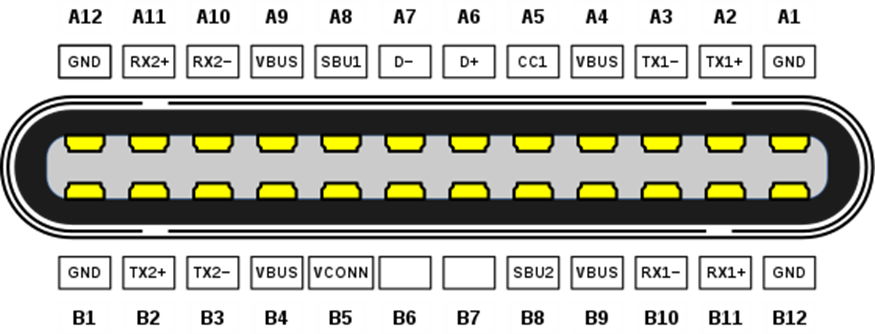
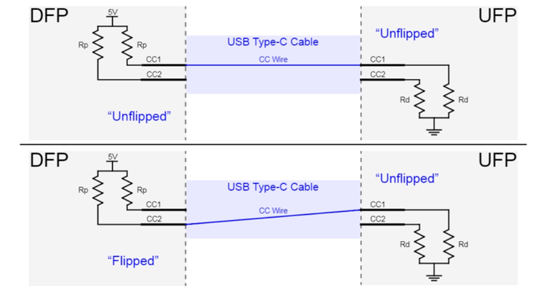

## USB Type C receptacle pinout

## USB Type C plug pinout

## Tại sao USB Type C được sinh ra?

USB Type C được sinh ra để giải quyết các vấn đề:
- Giảm thiểu sự phức tạp của cable và port => giờ đây người dùng không phải quan tâm về hướng của cable.
- Khả năng swap vai trò UFP, DFP giữa hai port kết nối với nhau.
- Giải quyết được vấn đề hạn chế về nguồn điện có thể được cấp => USB BC, USB Type C Current, USB PD.

## Data và Power Role

**Data Flow**

- Downstream Facing Port - DFP: Port trên host hoặc hub mà device kết nối. Ngoài ra, DFP cũng có thể cấp nguồn Vbus cho device và Vconn cho cable.
- Upstream Facing Port - UFP: Port trên device hoặc hub kết nối với DFP của host hoặc hub khác. Ngoài ra, UFP cũng có thể tiêu thụ nguồn Vbus được cấp từ DFP.
- Dual Role Data - DRD: Port có thể hoạt động như một DFP và UFP.

**Power Flow**

- Sink: Một sink port sẽ tiêu thụ nguồn Vbus, thường là một device.
- Source: Một source port sẽ cấp nguồn cho Vbus, thường là host hoặc hub DFP.
- Dual Role Power - DRP: Port có thể hoạt động như một Sink hoặc Source.
Ví dụ, laptop có DRP port có thể nhận nguồn để sạc pin nhưng cũng có thể cấp nguồn để sạc các device.

Một port có khả năng cấp nguồn thì chưa chắc nó sẽ hoạt động như một DFP. Ví dụ như màn hình nó sẽ nhận data từ DFP của laptop nhưng cũng có thể sạc cho laptop.

Một port tiêu thụ nguồn thì chưa chắc nó sẽ hoạt động như một UFP. Ví dụ, một DFP của hub sẽ gửi data tới device trong khi device cấp nguồn hoạt động.

## Chân CC và Vconn

Mỗi cổng DFP và UFP đều có chân CC1 và chân CC2. Các chân này sẽ kết nối với Configuration channel - CC và Voltage Controller - Vconn của cable type C.

**Configuration channel - CC**

Mỗi chân CC đều có điện trở kéo và nó có tác dụng sau:
- Detect được cable attach
- Detect được hướng của cable
- Advertisement, dịch thô là quảng cáo hoặc thông báo biết về current capabilities của DFP.

Để hiểu làm cách nào mà nó detect được ta cần phải hiểu rằng:
- Đối với DFP thì cả hai chân CC1 và CC2 của port sẽ được điện trở Rp kéo lên
- Đối với UFP thì cả hai chân CC1 và CC2 sẽ được điện trở Rd kéo xuống.
- Ngoài ra, đối với cable sẽ chỉ có một đường CC.

→ Nhờ vào điện trở kéo lên, DFP sẽ giám sát hai chân CC1 và CC2, khi kết nối với DFP thông qua cable thì DFP có thể detect được cable attach khi một trong hai chân CC được kéo xuống và chân CC nào được kéo xuống thì nó sẽ detect được hướng của cable. Chi tiết thông qua ảnh sau:

Đối với cable không active hay passive cable thì chân còn lại để hở. Ngược lại, đối với active cable hay Electronically Marked Powered Cable, thì chân còn lại sẽ được điện trở Ra kéo xuống.

→ Đối với host dùng chuẩn USB Type C, chân CC là bắt buộc để cổng DFP detect được có thiết bị UFP attach.

Cho nên đối với trường hợp cable USB Type-C to USB 2.0, và device là thiết bị USB 2.0 thì host nhận ra được device attach là do đầu cable Type-C có một điện trở Rd được gắn sẵn trong cable.

DFP sẽ cho biết dòng hiện tại mà nó cấp thông qua điện trở Rp kéo lên với giá trị cụ thể, và điện trở Rd kéo xuống UFP có giá trị cố định sẽ tạo ra bộ chia áp với điện trở Rp, từ đó UFP sẽ detect được dòng điện mà DFP cung cấp. Đây là một cách đơn giản để negotiate hay thương lượng về nguồn Vbus 5V mà không cần phải sử dụng Power Delivery.

**Voltage Controller - Vconn**

EMCA hay E-marker là một IC nằm bên trong cable type C dùng để xử lý các giao tiếp liên quan đến Power Delivery. Vậy nếu có một EMCA bên trong cable thì nó cần được cấp nguồn và USB type C có một cách để cấp nguồn cho nó được gọi là Vconn.

→ Chỉ có một chân CC được sử dụng để giao tiếp. Chân CC còn lại không được kết nối với đường CC mà được sử dụng để cung cấp nguồn điện cho EMCA, chân này sẽ được gọi là Vconn.

Ngoài ra, đối với Sink port cần yêu cầu nguồn điện trên 3A thì cần phải có EMCA bên trong cable để xem cable có hỗ trợ mang dòng điện trên 3A hay không. Tất cả các cable USB Type C đều phải có khả năng mang dòng điện 3A.

## Làm cách nào mà source có thể cấp nguồn?

Source sử dụng FET để enable hoặc disable cấp nguồn Vbus và ban đầu Source sẽ disable Vbus. Khi detect được Sink, Source sẽ enable FET để cấp nguồn Vbus và Vconn. Source có thể điều chỉnh giá trị điện trở Rp để có thể thay đổi cấp nguồn cho Sink. Khi detect được Sink detach thì Source sẽ disable FET. từ đó dùng cấp nguồn Vbus và Vconn.

## Alternate Modes

Các chân Sideband Use (SBU1 và SBU2) được sử dụng cho chế độ Alternate Mode và Audio Adapter Accessory.

Đối với USB4, các chân này được sử dụng làm Sideband Channel với tuỳ hướng cable thì SBU1 và SBU2 map với SBTX và SBRX.

Host và Device sẽ sử dụng USB Power Delivery Structured Vendor Defined
Messages (Structured VDMs) để cấu hình và enter/exit chế độ Alternate Mode.

Vì các chế độ Alternate Mode không hỗ trợ USB hub nên ta chỉ có thể kết nối trực tiếp device Alternate Mode với host.

Host và device phải đàm phán Explicit Contract USB PD trước khi Structured VDMs có thể được sử dụng để enter vào chế độ Alternate mode.

## Tham khảo

https://www.ti.com/lit/eb/slyy228/slyy228.pdf?HQS=app-ipp-pwr-denusbc-bhp-ebook-null-de