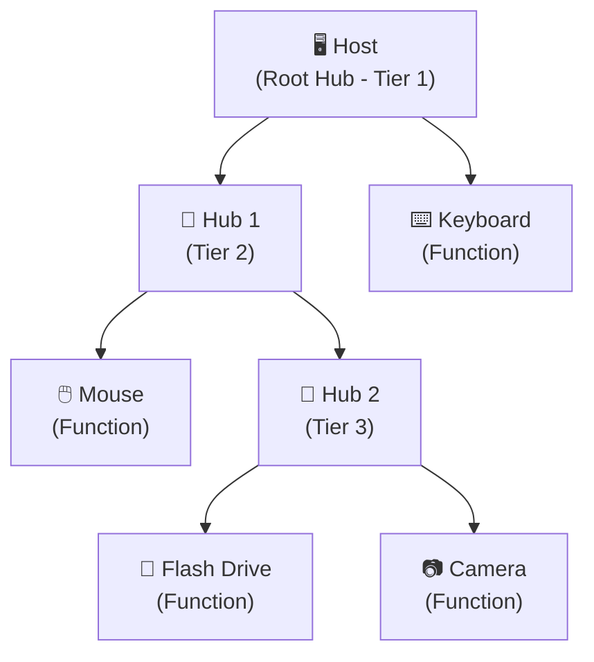
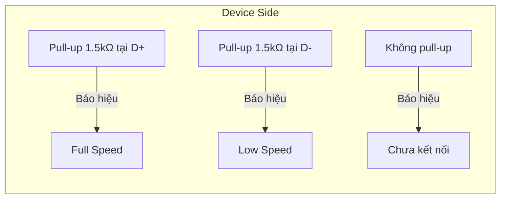
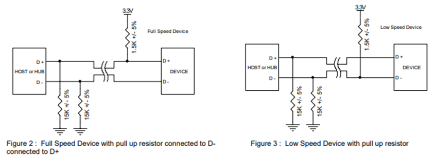
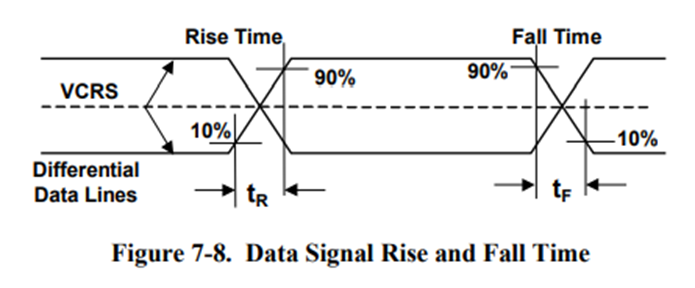

## USB là gì?

USB (Universal Serial Bus) là chuẩn giao tiếp nối tiếp được phát triển bởi nhóm các công ty gồm Intel, Compaq, Microsoft, NEC, IBM, DEC và Nortel vào giữa thập niên 1990. USB được thiết kế để cung cấp một giao diện bus thống nhất cho việc kết nối host (máy tính, vi điều khiển, SoC) với các thiết bị ngoại vi (keyboard, mouse, storage, camera, module IoT,...).

Mục tiêu cốt lõi của USB:
- Cung cấp một bus giao tiếp đơn giản, chuẩn hóa, thay thế hàng loạt cổng kết nối cũ.
- Hỗ trợ hot-plug (cắm/rút nóng) và plug-and-play (tự nhận dạng thiết bị).
- Cho phép cấp nguồn trực tiếp từ bus cho các thiết bị nhỏ.
- Đạt tốc độ truyền cao, phù hợp cho nhiều loại dữ liệu.
- Mở rộng dễ dàng qua hub, hỗ trợ tối đa 127 thiết bị trên cùng một bus.

## Tại sao cần có USB?

USB ra đời để giải quyết các vấn đề của các chuẩn giao tiếp cũ (RS232, PS/2, parallel,...):
- Chuẩn hóa cổng kết nối: Một chuẩn duy nhất thay cho nhiều cổng khác nhau.
- Hot-plug & Plug-and-play: Cắm/rút khi đang hoạt động, tự nhận dạng thiết bị.
- Cấp nguồn trực tiếp: Thiết bị nhỏ có thể lấy nguồn từ bus.
- Tốc độ cao: Phù hợp cho truyền dữ liệu lớn.
- Mở rộng dễ dàng qua hub: Hỗ trợ nhiều thiết bị trên cùng bus.
- Tương thích rộng rãi: Từ PC đến vi điều khiển nhúng.

## USB trong hệ thống nhúng

- Trong các hệ thống embedded, USB đóng vai trò quan trọng:
- Giao tiếp PC ↔ thiết bị nhúng: Truyền dữ liệu, điều khiển, monitoring.
- Firmware update: Qua các class như DFU (Device Firmware Upgrade), CDC (Communication Device Class), MSC (Mass Storage Class).
- Debug và logging: Sử dụng USB CDC làm virtual COM port thay cho UART truyền thống.
- Kết nối ngoại vi: Đọc USB flash drive, kết nối camera, audio device,...

## Tổng quan kiến trúc USB

USB là một cable bus hỗ trợ giao tiếp giữa một host duy nhất và các thiết bị ngoại vi. Toàn bộ giao tiếp trên bus đều do host khởi tạo — device không được phép tự ý gửi dữ liệu nếu host không yêu cầu.

### Vòng đời của một USB Device

Khi một thiết bị được cắm vào host, nó trải qua một chuỗi các bước trước khi có thể hoạt động:

| Giai đoạn | Mô tả |
|---|---|
| **Attach** | Thiết bị được cắm vào cổng USB. Hub phát hiện sự thay đổi trên data line (chuyển từ SE0 sang Idle). |
| **Powered** | VBUS cấp nguồn 5V cho thiết bị. Thiết bị chưa giao tiếp được, chỉ mới nhận điện. |
| **Reset** | Host gửi tín hiệu reset (giữ SE0 ≥ 10ms). Thiết bị chuyển về trạng thái mặc định, được gán địa chỉ 0. |
| **Enumeration** | Host gửi các Standard Request để đọc descriptor, gán địa chỉ duy nhất (1–127), và chọn configuration. |
| **Configured** | Thiết bị sẵn sàng hoạt động. Các endpoint được kích hoạt theo configuration đã chọn. |
| **Suspend** | Nếu bus idle ≥ 3ms, thiết bị phải vào chế độ tiết kiệm năng lượng (tiêu thụ ≤ 2.5mA). |
 
### Topology hệ thống USB
 
Cấu trúc topology của USB được thiết kế phân tầng theo kiểu hình cây:
 

 
Các thành phần chính:
 
| Thành phần | Vai trò | Vị trí trong cây |
|---|---|---|
| **Host** | Điều khiển toàn bộ bus, khởi tạo mọi giao tiếp. Chỉ có một host duy nhất trong hệ thống. | Root — tương ứng Root Hub |
| **Hub** | Mở rộng số cổng kết nối. Nhận dữ liệu từ upstream port và phân phối đến downstream port. | Node |
| **Function** | Thiết bị ngoại vi thực sự cung cấp chức năng cho người dùng (bàn phím, chuột, storage,...). | Leaf |
 
Mỗi kết nối giữa hai thành phần là một liên kết **point-to-point**:
- Host ↔ Hub
- Hub ↔ Hub
- Hub ↔ Function

:::warning Giới hạn 7 tầng
Do giới hạn thời gian truyền tín hiệu qua hub và cable, USB cho phép tối đa 7 tầng (bao gồm cả Root Hub ở tầng 1). Ở tầng 7, chỉ được phép kết nối function — không được đặt hub. Điều này có nghĩa tối đa có 5 hub xếp chồng (non-root) giữa host và device cuối cùng.
:::

:::warning Số lượng thiết bị tối đa
Mỗi thiết bị trên bus được gán một địa chỉ 7-bit (0–127). Địa chỉ 0 được dành riêng cho thiết bị chưa enumeration, nên số thiết bị tối đa là **127** (bao gồm cả hub).
:::

## Speed identification

USB có 3 loại tốc độ truyền dữ liệu:
| Tốc độ | Tên gọi | Bandwidth | Ứng dụng điển hình |
|---|---|---|---|
| **Low Speed** | LS | 1.5 Mb/s | Keyboard, mouse, joystick |
| **Full Speed** | FS | 12 Mb/s | Audio, CDC, HID phức tạp |
| **High Speed** | HS | 480 Mb/s | Mass storage, video, network adapter |

### Cơ chế nhận dạng tốc độ
 
Thiết bị báo tốc độ của nó cho host thông qua **điện trở pull-up 1.5kΩ** trên data line:
 

 
Phía host (hoặc hub), mỗi downstream port có **điện trở pull-down 15kΩ** trên cả D+ và D-. Khi chưa có thiết bị, cả hai line đều ở mức thấp. Khi thiết bị cắm vào, pull-up của device "thắng" pull-down của host trên một line, tạo ra mức logic cao $\rightarrow$ host nhận biết có thiết bị và xác định tốc độ.
 

 
:::warning High speed detection
Thiết bị high speed **ban đầu kết nối ở FS** (pull-up tại D+). Sau đó, host và device thực hiện một quá trình **handshake** đặc biệt để thương lượng chuyển sang HS. Nếu handshake thất bại, thiết bị tiếp tục hoạt động ở FS. Đây là lý do thiết bị HS luôn tương thích ngược với FS.
:::

## Định nghĩa chân cổng USB

### USB2.0

| Pin   | Tên   | Mô tả |
| ----- | ----- | ----- |
| 1     | VBUS	| Nguồn +5V từ host |
| 2     | D-	| Data- |
| 3     | D+	| Data+ |
| 4     | GND	| Mass  |

Đặc điểm:

- Truyền dữ liệu vi sai trên D+/D-
- Mức logic 3.3V
- Cáp xoắn đôi chống nhiễu

### USB3.0

USB 3.0 giữ nguyên 4 chân USB 2.0 và bổ sung thêm cặp SuperSpeed:

| Pin   | Tên   | Mô tả |
| ----- | ----- | ----- |
| 1	    | VBUS  | +5V |
| 2	    | D-    | USB 2.0 Data- |
| 3	    | D+    | USB 2.0 Data+ |
| 4	    | GND   | Mass |
| 5	    | SSTX- | SuperSpeed TX- |
| 6	    | SSTX+ | SuperSpeed TX+ |
| 7	    | GND   | Mass |
| 8	    | SSRX- | SuperSpeed RX- |
| 9	    | SSRX+ | SuperSpeed RX+ |

Đặc điểm:
- **Kênh SuperSpeed hoàn toàn độc lập** với kênh USB 2.0: Hai kênh có thể hoạt động đồng thời.
- **Full-duplex**: USB 3.0 có cặp TX và RX riêng biệt, cho phép truyền và nhận cùng lúc (khác USB 2.0 chỉ half-duplex).
- **Tốc độ:** 5 Gb/s (USB 3.0 / USB 3.2 Gen 1), có thể lên 10 Gb/s (Gen 2) hoặc 20 Gb/s (Gen 2x2).

:::warning Tương thích ngược
Khi cắm thiết bị USB 2.0 vào cổng USB 3.0, chỉ các chân 1–4 được sử dụng. Thiết bị hoạt động bình thường ở tốc độ USB 2.0. Ngược lại, thiết bị USB 3.0 cắm vào cổng USB 2.0 cũng sẽ fallback về tốc độ USB 2.0.
:::

## Thông số kỹ thuật

### Định nghĩa mức điện áp

- Data line sử dụng tín hiệu vi sai D+ / D-
- Mức logic danh định: 0V và 3.3V
- Điện trở pull‑up tại thiết bị: ~1.5 kΩ
- Điện trở termination phía host: 45 Ω mỗi line

### Rise/Fall Time

Output rise time và fall time được đo trong khoảng từ 10% đến 90% tín hiệu và nằm trong khoảng 4ns đến 20ns.

### Line states

| State | Electrical |
| ----- | ---------- |
| Idle  | - Low speed: D- high, D+ low  - Full speed: D+ high, D- low |
| J     | Cùng trạng thái Idle |
| K     | Ngược trạng thái J |
| SE0   | D+ low, D- low |
| SE1   | D+ high, D- high |

:::tip Tại sao có J và K state?
USB sử dụng mã hóa NRZI: bit `0` gây ra chuyển đổi trạng thái (J$\rightarrow$K hoặc K$\rightarrow$J), bit `1` giữ nguyên trạng thái. Việc định nghĩa J/K thay vì dùng trực tiếp mức logic giúp giao thức hoạt động thống nhất cho cả FS và LS, dù mức điện áp thực tế ngược nhau.
:::

### Bus Events

| Event     | Mô tả |
| --------- | ----- |   
| Start of Packet - SOP | Data line chuyển từ trạng thái IDLE sang trạng thái K state |
| End Of Packet - EOP | Data line chuyển sang trạng thái SE0 trong khoảng 2 bit, sau đó, chuyển sang trạng thái J state trong khoảng 1 bit. |
| Attach	| Data line chuyển từ trạng thái SE0 sang trạng thái IDLE trong khoảng 2.5μs. |
| Detach	| Data line ở trạng thái SE0 trong khoảng 2.5μs. |
| Reset	    | Host giữ data line ở trạng thái SE0 ≥ 10 ms. |
| Suspend	| Data line ở trạng thái IDLE trong khoảng ít nhất 3ms. |
| Resume	| Data line ở trạng thái K state trong khoảng 20ms. |
| Sync pattern | Chuỗi tín hiệu KJKJKJKK. |

:::warning Cấu trúc một packet trên bus
Mỗi packet USB trên dây có cấu trúc: `SOP --> Sync --> Data (PID + payload + CRC) --> EOP`. Sync pattern giúp receiver đồng bộ clock trước khi đọc data thực sự. Chi tiết sẽ được trình bày trong bài **USB Protocol**.
:::
 
:::warning Remote wakeup
Trong trạng thái suspend, nếu device hỗ trợ remote wakeup, device có thể chủ động phát tín hiệu K trên bus để đánh thức host. Đây là một trong rất ít trường hợp device được phép khởi tạo tín hiệu mà không cần host yêu cầu trước.
:::