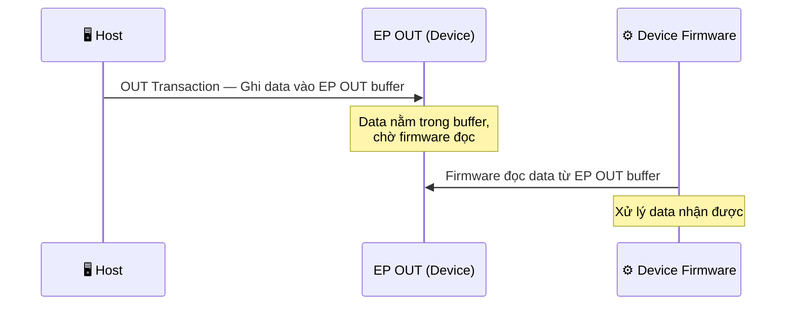
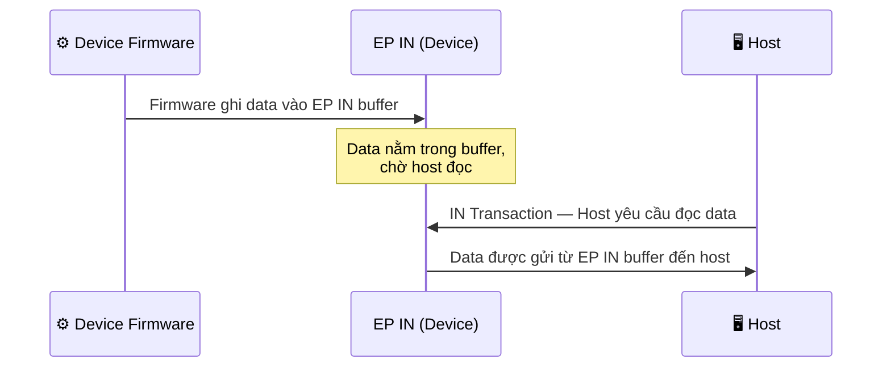
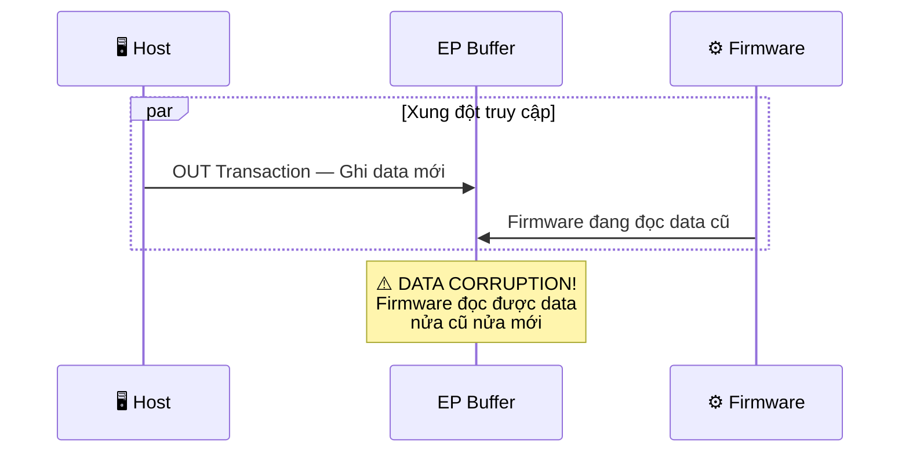

## Endpoint là gì?

Trong USB, mọi việc truyền dữ liệu giữa host và device đều diễn ra thông qua các **endpoint**. Endpoint là các **buffer** nằm bên trong device, đóng vai trò là điểm đầu/cuối của luồng dữ liệu.

Có thể hình dung đơn giản: endpoint giống như các **hộp thư** trên device, trong đó host gửi thư vào hộp OUT và lấy thư từ hộp IN.

:::warning Chú ý
Endpoint là khái niệm **chỉ tồn tại ở phía device**. Host không có endpoint. Mọi giao tiếp trên bus đều do host khởi tạo, nhưng dữ liệu thực sự được đọc/ghi tại các endpoint trên device.
:::

## Tính đơn hướng của endpoint

Mỗi endpoint được thiết kế để truyền dữ liệu theo một hướng duy nhất:

| Loại endpoint | Hướng dữ liệu | Mô tả |
|---|---|---|
| **Endpoint IN** | Device $\rightarrow$ Host | Chứa dữ liệu mà device muốn gửi cho host |
| **Endpoint OUT** | Host $\rightarrow$ Device | Chứa dữ liệu mà host muốn gửi cho device |

:::warning Quy ước hướng
Hướng IN/OUT luôn được xét **từ góc nhìn của host**:
- **IN** = dữ liệu đi **vào** host (từ device gửi lên).
- **OUT** = dữ liệu đi **ra** khỏi host (host gửi xuống device).

Đây là quy ước xuyên suốt trong toàn bộ USB spec. Khi đọc tài liệu hoặc code driver, luôn nhớ "IN/OUT = theo hướng của host".
:::

## Endpoint number và cách định danh

Mỗi endpoint được gán một **endpoint number hay ID** (0–15) cố định tại thời điểm thiết kế phần cứng. Tuy nhiên, endpoint number **chưa đủ** để xác định một endpoint mà cần kết hợp cả **hướng truyền**:

```
Endpoint Address = Endpoint Number + Direction (IN/OUT)
```

Ví dụ: EP1 IN (endpoint number 1, hướng IN) và EP1 OUT (endpoint number 1, hướng OUT) là **hai endpoint hoàn toàn khác nhau**, với hai buffer riêng biệt.

Endpoint address được biểu diễn bằng 1 byte trong USB descriptor:

| Bit | Ý nghĩa |
|---|---|
| Bit 3:0 | Endpoint number (0–15) |
| Bit 6:4 | Reserved (= 0) |
| Bit 7 | Hướng: `0` = OUT, `1` = IN |

Ví dụ: `0x81` = endpoint number 1, hướng IN. `0x02` = endpoint number 2, hướng OUT.

## Endpoint zero (EP0) — Control endpoint

EP0 là endpoint đặc biệt và bắt buộc phải có trên mọi USB device. EP0 bao gồm cả hai hướng: **EP0 IN** và **EP0 OUT**, tạo thành một cặp endpoint hai chiều dùng cho **Control Transfer**.

| Thành phần | Vai trò |
|---|---|
| **EP0 OUT** | Nhận các **control command** (Setup Packet, Standard Request) từ host gửi xuống device |
| **EP0 IN** | Gửi **response data** (descriptor, status) từ device lên host |

EP0 được sử dụng cho:
- **Enumeration**: Host đọc Device Descriptor, Configuration Descriptor,... qua EP0 IN.
- **Gán địa chỉ**: Host gửi `SET_ADDRESS` qua EP0 OUT.
- **Cấu hình thiết bị**: Host gửi `SET_CONFIGURATION`, `SET_INTERFACE`,... qua EP0 OUT.
- **Điều khiển runtime**: Bất kỳ Standard/Class/Vendor Request nào trong suốt vòng đời thiết bị.

:::warning Lưu ý
EP0 là endpoint duy nhất hỗ trợ **Control Transfer** — một loại transfer đặc biệt gồm 3 giai đoạn (Setup $\rightarrow$ Data $\rightarrow$ Status). Các endpoint khác (EP1–EP15) chỉ hỗ trợ Bulk, Interrupt, hoặc Isochronous Transfer. Chi tiết về các loại transfer sẽ được trình bày trong bài **USB Protocol**.
:::

## Giới hạn số lượng endpoint

Một USB device có thể có tối đa **32 endpoint**:

| Nhóm | Số lượng | Chi tiết |
|---|---|---|
| Endpoint OUT | 16 | EP0 OUT $\rightarrow$ EP15 OUT |
| Endpoint IN | 16 | EP0 IN $\rightarrow$ EP15 IN |

:::warning Thực tế trên MCU
Số endpoint thực sự khả dụng phụ thuộc vào phần cứng USB peripheral của MCU. Ví dụ:
- ESP32-S2/S3: Hỗ trợ tối đa 6 endpoint (bao gồm EP0).
- STM32F103: 8 endpoint.
- STM32F4: 4–6 endpoint tùy dòng.

Khi thiết kế USB device trên MCU, cần kiểm tra datasheet để biết số endpoint khả dụng và kích thước buffer (FIFO) của từng endpoint.
:::

## Cơ chế truyền dữ liệu qua Endpoint

### Host ghi dữ liệu xuống Device (OUT Transaction)



1. Host khởi tạo **OUT transaction**, gửi data đến endpoint OUT trên device.
2. Data được lưu vào buffer của endpoint OUT.
3. Firmware trên device đọc data từ buffer và xử lý.

### Device gửi dữ liệu lên Host (IN Transaction)



1. Firmware trên device ghi data vào buffer của endpoint IN.
2. Data **nằm chờ trong buffer** cho đến khi host yêu cầu.
3. Host khởi tạo IN transaction, data từ endpoint IN được gửi lên host.

:::warning Điểm quan trọng
Device không thể chủ động gửi data lên host. Dù firmware đã chuẩn bị data sẵn trong EP IN, data vẫn nằm im cho đến khi host gửi IN transaction. Đây là bản chất **host-centric** (host là trung tâm điều khiển) của USB.
:::

## Tính bất đồng bộ và vấn đề data corruption

Giao tiếp giữa host và device qua USB là **bất đồng bộ (asynchronous)**:

- Device **không được thông báo trước** khi host khởi tạo một transaction.
- Device phải **chủ động kiểm tra** (polling) xem có dữ liệu mới trong endpoint OUT hay không.
- Host cũng không biết khi nào device đã chuẩn bị xong data trong endpoint IN.

### Nguy cơ data corruption

Nếu **firmware đang đọc/ghi endpoint** đồng thời với **host đang truy cập endpoint đó** qua bus, dữ liệu có thể bị hỏng (data corruption).



### Cơ chế bảo vệ

USB hardware và firmware sử dụng một số cơ chế để tránh xung đột:

| Cơ chế | Mô tả |
|---|---|
| **Double Buffering** | Endpoint có 2 buffer luân phiên: một buffer cho host truy cập, một buffer cho firmware truy cập. Hai bên không bao giờ truy cập cùng một buffer. |
| **NAK Response** | Khi endpoint chưa sẵn sàng (firmware đang xử lý), device tự động trả lời **NAK** (Negative Acknowledge) cho host. Host sẽ thử lại sau. |
| **Interrupt/Flag** | Hardware phát interrupt hoặc set flag khi transaction hoàn thành, firmware chỉ truy cập buffer sau khi nhận interrupt/flag. |

:::warning NAK không phải lỗi
NAK là phản hồi hoàn toàn bình thường trong USB, cho biết "endpoint chưa sẵn sàng, hãy thử lại sau". Host sẽ tự động retry. Đây khác với **STALL** — báo hiệu lỗi nghiêm trọng, yêu cầu host can thiệp (thường qua control request để clear STALL).
:::