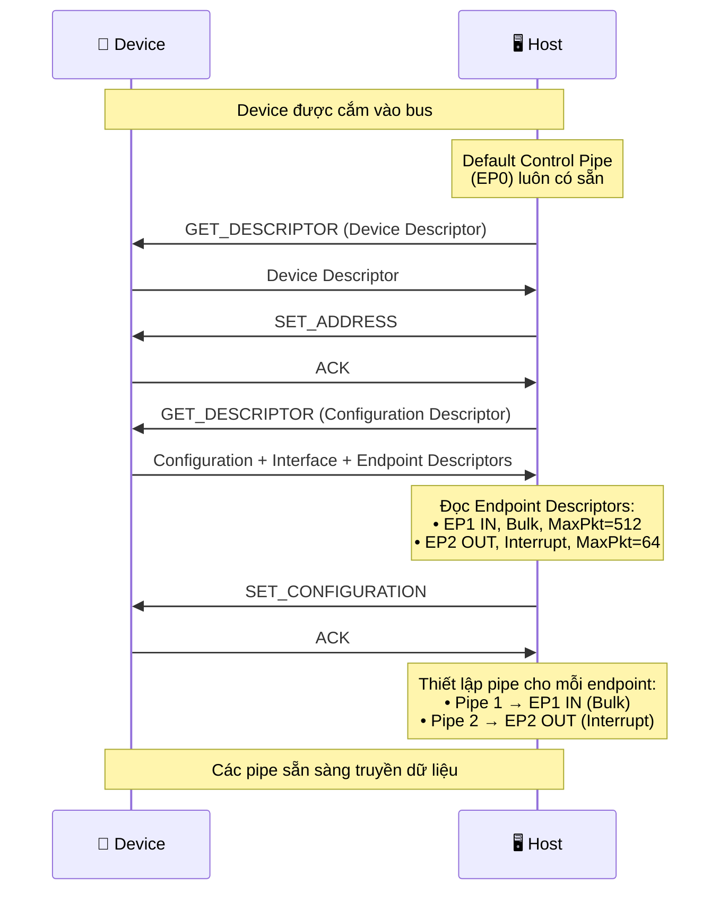
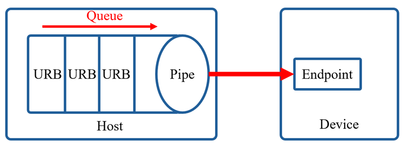
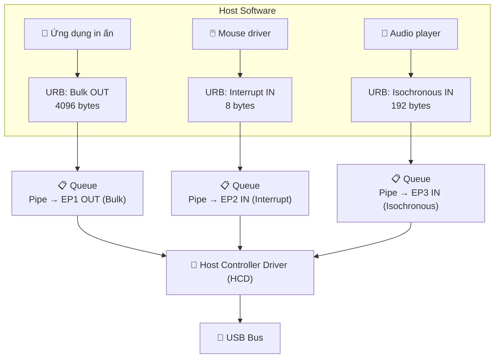
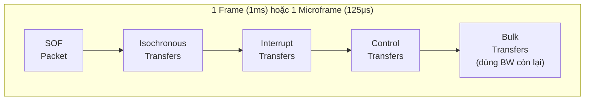
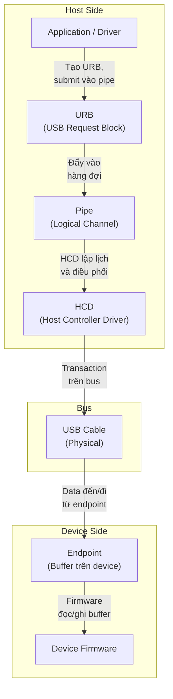

## Pipe là gì?
 
Trong USB, **pipe** là một **kênh giao tiếp logic** kết nối giữa phần mềm phía host và một endpoint cụ thể trên device. Pipe không phải là đường truyền vật lý — nó là một khái niệm trừu tượng đại diện cho một luồng dữ liệu riêng biệt mà host sử dụng để giao tiếp với thiết bị.

Có thể hình dung: nếu endpoint là **hộp thư** trên device, thì pipe là **tuyến đường bưu điện** nối từ host đến hộp thư đó. Mỗi tuyến đường có quy tắc riêng về loại thư, tốc độ, kích thước gói hàng.
 
Mỗi pipe được đặc trưng bởi tập hợp các thông tin sau:
 
| Thuộc tính | Mô tả |
|---|---|---|
| **Endpoint Address** | Số endpoint + hướng (IN/OUT) |
| **Transfer Type** | Control, Bulk, Interrupt, hoặc Isochronous |
| **Direction** | IN (device → host) hoặc OUT (host → device) |
| **Max Packet Size** | Kích thước tối đa mỗi packet (byte) |
| **Polling Interval** | Chu kỳ host poll endpoint (cho Interrupt/Isochronous) |

:::warning Lưu ý
- Tất cả thông tin trên đều được khai báo trong Endpoint Descriptor của device. Host đọc descriptor này trong quá trình enumeration để biết cách thiết lập pipe tương ứng.
- Mỗi pipe gắn liền với một endpoint cố định trên thiết bị, và endpoint này đã được mô tả rõ ràng trong endpoint descriptor.
:::

## Hai loại pipe
 
USB định nghĩa hai loại pipe với đặc tính khác nhau:
 
### 1. Control pipe (Message pipe)
 
- Truyền dữ liệu hai chiều (bidirectional) — cả IN và OUT trên cùng một pipe.
- Sử dụng cấu trúc message có format cố định: Setup Stage → Data Stage (optional) → Status Stage.
- Chỉ dùng cho Control Transfer.
- Default Control Pipe (gắn với EP0) luôn tồn tại ngay khi device được kết nối, trước cả khi enumeration hoàn tất.
 
### 2. Stream pipe
 
- Truyền dữ liệu một chiều (unidirectional) — mỗi pipe chỉ IN hoặc OUT.
- Dữ liệu là stream không có format cố định, host và device tự quy ước ý nghĩa.
- Dùng cho 3 loại transfer còn lại: Bulk, Interrupt, Isochronous.

## Quá trình thiết lập pipe
 
Pipe không tồn tại sẵn (ngoại trừ Default Control Pipe). Chúng được host tạo ra trong quá trình enumeration dựa trên thông tin từ Endpoint Descriptor mà device trả về.
 


Tóm tắt quy trình:
 
1. Khi một thiết bị USB được attach vào host → Default Control Pipe (EP0) tự động có sẵn.
2. Host gửi các control request qua Default Control Pipe để lấy các descriptor từ device.
3. Dựa trên các Endpoint Descriptor mà thiết bị trả về, host sẽ biết: số endpoint, transfer type, hướng, max packet size, polling interval.
4. Host gửi **SET_CONFIGURATION** để kích hoạt configuration.
5. Với mỗi endpoint mà thiết bị khai báo, host sẽ thiết lập một pipe tương ứng, nghĩa là tạo ra một đối tượng quản lý luồng giao tiếp giữa host và endpoint đó.
6. Các pipe sẵn sàng cho việc truyền dữ liệu.

## USB Request Block
 
### URB là gì?
 
Khi host muốn truyền hoặc nhận dữ liệu từ một endpoint thuộc device, host không hiao tiếp trực tiếp với bus mà sẽ gửi một yêu cầu đến hàng đợi queue thuộc pipe tương ứng, yêu cầu này được đóng gói thành một cấu trúc gọi là USB Request Block. URB chính là đơn vị quản lý truyền tải cơ bản trong USB.
 


URB có thể hiểu là một request mà host gửi cho USB driver, mô tả đầy đủ thông tin về một lần truyền dữ liệu cần thực hiện.
 
### Cấu trúc của URB
 
| Thành phần | Mô tả |
|---|---|
| **Pipe Reference** | Pipe nào (bao gồm endpoint address, transfer type) |
| **Transfer Direction** | IN (nhận) hoặc OUT (gửi) |
| **Transfer Type** | Bulk, Interrupt, hoặc Isochronous |
| **Transfer Buffer** | Con trỏ đến vùng nhớ chứa data cần gửi (OUT) hoặc vùng trống để nhận data (IN) |
| **Buffer Length** | Kích thước buffer (số byte cần truyền hoặc nhận) |
| **Interval** | Chu kỳ polling — chỉ có ý nghĩa với Interrupt và Isochronous transfer |
| **Completion Callback** | Hàm callback được gọi khi URB hoàn thành (thành công hoặc thất bại) |
| **Status** | Trạng thái kết quả sau khi URB hoàn thành (success, error, cancelled,...) |
 
### Tại sao cần hàng đợi URB?
 

Hai lý do chính khiến URB cần được quản lý qua queue:
 
**Lý do 1 — Giới hạn max packet size**:
 
Mỗi endpoint có giá trị `wMaxPacketSize` xác định kích thước tối đa của một packet đơn lẻ. Nếu dữ liệu cần truyền lớn hơn max packet size, USB stack phải chia nhỏ thành nhiều packet và gửi tuần tự. URB queue giúp quản lý quá trình chia nhỏ và gửi lần lượt này.
 
Ví dụ: Truyền 4096 byte qua endpoint Bulk có `wMaxPacketSize = 512`:

```
4096 ÷ 512 = 8 packet cần gửi tuần tự qua cùng một pipe
```
 
**Lý do 2 — Nhiều yêu cầu đồng thời**:
 
Ứng dụng có thể tạo ra nhiều URB cùng lúc trên cùng một pipe hoặc trên các pipe khác nhau. Ví dụ:
- In tài liệu dài → hàng loạt URB gửi data qua Bulk OUT pipe.
- Đọc liên tục từ chuột → URB Interrupt IN được submit liên tục.
- Đồng thời stream audio → URB Isochronous IN chạy song song.
 
Mỗi URB có thời gian xử lý khác nhau, cần cơ chế lập lịch để điều phối.
 


## Host Controller Driver và Scheduling

**Host Controller Driver (HCD)** là thành phần phần mềm/phần cứng chịu trách nhiệm lập lịch và điều phối mọi giao tiếp trên bus USB.
 
### Cơ chế hoạt động
 
1. HCD định kỳ duyệt danh sách tất cả các pipe đang hoạt động.
2. Với mỗi pipe, HCD kiểm tra hàng đợi URB xem có URB nào đang chờ xử lý không.
3. Dựa trên mức độ ưu tiên của từng loại transfer, HCD quyết định pipe nào được phép truyền tiếp theo.

### Thứ tự ưu tiên scheduling
 
USB spec quy định bandwidth trên bus được phân bổ theo thứ tự ưu tiên:
 
| Ưu tiên | Transfer Type | Lý do |
|---|---|---|
| 1 (cao nhất) | **Isochronous** | Yêu cầu thời gian thực, không retry — nếu miss thì mất frame |
| 2 | **Interrupt** | Yêu cầu độ trễ thấp, đảm bảo polling đúng interval |
| 3 | **Control** | Cần thiết cho enumeration và quản lý device |
| 4 (thấp nhất) | **Bulk** | Không yêu cầu thời gian thực, sử dụng bandwidth còn lại |
 
:::warning Lưu ý
Isochronous và Interrupt transfer được đảm bảo bandwidth. Tổng bandwidth dành cho hai loại này không vượt quá **80% (FS)** hoặc **90% (HS)** tổng bandwidth mỗi frame/microframe. Phần còn lại dành cho Control và Bulk.
:::

### USB Frame và Microframe
 
HCD tổ chức thời gian trên bus thành các **frame** (FS/LS) hoặc **microframe** (HS):
 
| Tốc độ | Đơn vị thời gian | Chu kỳ |
|---|---|---|
| Full Speed / Low Speed | Frame | 1ms |
| High Speed | Microframe | 125μs (8 microframe = 1 frame) |
 
Trong mỗi frame/microframe, HCD phân bổ thời gian cho các loại transfer theo thứ tự ưu tiên:
 

 
:::warning SOF (Start of Frame)
Host phát một **SOF packet** ở đầu mỗi frame (FS) hoặc microframe (HS) để tất cả device trên bus đồng bộ thời gian. SOF cũng giữ cho bus không rơi vào trạng thái suspend khi không có data transfer.
:::

## Mối quan hệ tổng thể: Endpoint — Pipe — URB — HCD
 

 
Luồng xử lý hoàn chỉnh:

1. Application tạo một URB, mô tả yêu cầu truyền dữ liệu.
2. URB được submit vào pipe tương ứng (mỗi pipe gắn với một endpoint cụ thể).
3. URB đẩy vào hàng đợi của pipe đó.
4. HCD duyệt các pipe, lập lịch theo ưu tiên, chọn URB tiếp theo cần xử lý.
5. HCD thực hiện transaction trên bus để truyền/nhận data với endpoint.
6. Khi hoàn thành, HCD gọi completion callback của URB để thông báo kết quả cho application.