## Mục lục

- [1. Kiến trúc giao thức USB](#1-kiến-trúc-giao-thức-usb)
- [2. Transaction](#2-transaction)
- [3. Định dạng packet](#3-định-dạng-packet)
    - [3.1. SYNC Field](#31-sync-field)
    - [3.2. PID Field (Packet Identifier)](#32-pid-field-packet-identifier)
    - [3.3. Address Field](#33-address-field)
    - [3.4. Endpoint Field](#34-endpoint-field)
    - [3.5. Data Field](#35-data-field)
    - [3.6. CRC Field](#36-crc-field)
    - [3.7. EOP (End of Packet)](#37-eop-end-of-packet)
- [4. Phân loại packet](#4-phân-loại-packet)
    - [4.1. Token packet](#41-token-packet)
    - [4.2. Data packet](#42-data-packet)
    - [4.3. Handshake packet](#43-handshake-packet)
- [5. Các loại transfer](#5-các-loại-transfer)
    - [5.1. Control transfer](#51-control-transfer)
    - [5.2. Interrupt transfer](#52-interrupt-transfer)
    - [5.3. Bulk transfer](#53-bulk-transfer)
    - [5.4. Isochronous transfer](#54-isochronous-transfer)

## 1. Kiến trúc giao thức USB

USB là giao thức truyền thông nối tiếp theo mô hình **host-centric**: toàn bộ bus được điều khiển bởi host, mọi hoạt động truyền dữ liệu đều do host khởi tạo và lập lịch. Device chỉ phản hồi theo yêu cầu từ host, không bao giờ tự ý phát dữ liệu lên bus.

Dữ liệu trên bus USB được tổ chức theo ba lớp logic từ thấp đến cao:

| Lớp | Vai trò | Mô tả |
|---|---|---|
| **Packet** | Đơn vị vật lý nhỏ nhất trên đường truyền | Chứa dữ liệu thô cần truyền |
| **Transaction** | Đơn vị truyền dữ liệu cơ bản (gồm token, data, handshake) | Chuỗi các packet thực hiện một hành động hoàn chỉnh |
| **Transfer** | Mục đích truyền dữ liệu | Chuỗi nhiều transaction, hoàn thành một tác vụ cụ thể |

Các lớp này được tổ chức trong **frame** - đơn vị thời gian mà host dùng để lập lịch:

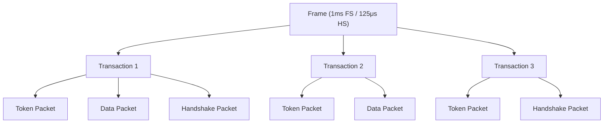

:::warning Lưu ý
Không phải mọi transaction đều có đủ 3 packet. Ví dụ: Isochronous transaction không có Handshake Packet, và một số transaction có thể không có Data Packet.
:::

## 2. Transaction

Transaction là đơn vị giao tiếp cơ bản giữa host và device, gồm tối đa ba packet:

| Packet | Người gửi | Vai trò |
|---|---|---|
| Token Packet | Host | Xác định loại transaction (IN/OUT/SETUP), địa chỉ device và endpoint đích |
| Data Packet (optional) | Host hoặc Device | Chứa payload dữ liệu thực tế |
| Handshake Packet | Device hoặc Host | Gói phản hồi trạng thái (ACK / NAK / STALL) nhằm xác nhận transaction thành công hay thất bại |

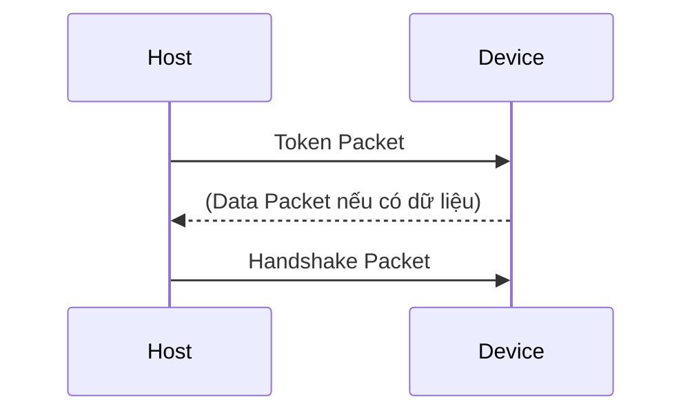

Cách tổ chức này đảm bảo mọi giao tiếp đều được kiểm soát chặt chẽ, tránh xung đột trên bus và cho phép host chủ động quản lý băng thông.

## 3. Định dạng packet

Mọi packet USB đều tuân theo cấu trúc chung, bắt đầu bằng **SYNC** và kết thúc bằng **EOP**:

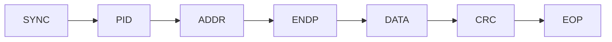

### 3.1. SYNC Field

Trường này được sử dụng để dồng bộ clock giữa transmitter và receiver.

| Thuộc tính | Low/Full Speed | High Speed |
|---|---|---|
| Kích thước | 8 bit | 32 bit |
| Pattern | KJKJKJKK | KJKJKJKK... ×4 lần |

Hai bit cuối của SYNC field (`KK`) đánh dấu ranh giới với trường PID tiếp theo.

### 3.2. PID Field (Packet Identifier)

PID xác định loại packet, từ đó biết packet dùng để làm gì, cấu trúc dữ liệu phía sau, và hướng truyền.

**Cấu trúc PID** (8 bit):

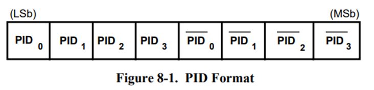

PID gồm 4 bit cao cho biết packet type field và 4 bit thấp dùng để check field. 4 bit check field là phần bù của 4 bit packet type field, nhằm đảm bảo dữ liệu được truyền chính xác.

**Bảng phân loại PID:**

| Nhóm | PID Name | PID[3:0] | Mô tả |
|---|---|---|---|
| **Token** | OUT | 0001 | Host $\rightarrow$ Device data |
| | IN | 1001 | Device $\rightarrow$ Host data |
| | SOF | 0101 | Start of Frame |
| | SETUP | 1101 | Host $\rightarrow$ Device control setup |
| **Data** | DATA0 | 0011 | Data packet, toggle = 0 |
| | DATA1 | 1011 | Data packet, toggle = 1 |
| | DATA2 | 0111 | High-speed high-bandwidth isochronous |
| | MDATA | 1111 | High-speed high-bandwidth isochronous |
| **Handshake** | ACK | 0010 | Nhận thành công |
| | NAK | 1010 | Chưa sẵn sàng, host retry sau |
| | STALL | 1110 | Endpoint lỗi, cần host can thiệp |
| | NYET | 0110 | HS only: nhận OK nhưng chưa sẵn sàng cho packet tiếp |
| **Special** | PRE | 1100 | Preamble (hub dùng cho LS device) |
| | ERR | 1100 | HS only: lỗi từ hub |
| | SPLIT | 1000 | HS only: split transaction |
| | PING | 0100 | HS only: kiểm tra endpoint sẵn sàng trước khi gửi OUT |

### 3.3. Address Field

Trường này cho biết địa chỉ của device.

- Kích thước: 7 bit
- Phạm vi: 0-127 (hỗ trợ tối đa 127 device)

:::warning Lưu ý
- Address 0 = Default address (dùng khi device mới cắm vào)
- Address được host cấp phát trong quá trình enumeration
:::

### 3.4. Endpoint Field

- Kích thước: 4 bit
- Phạm vi: 0-15 (tối đa 16 endpoint)
- Giới hạn:
  - Low Speed device: Tối đa 3 endpoint (bao gồm EP0)
  - Full/High Speed: Tối đa 16 endpoint

### 3.5. Data Field

- Kích thước: 0-1024 byte (tùy transfer type)
- Thứ tự truyền: LSB (Least Significant Bit) trước
- Phân loại theo Transfer Type:
 
| Transfer Type | Low Speed | Full Speed | High Speed |
|--------------|-----------|------------|------------|
| Control | 8 byte | 8/16/32/64 byte | 64 byte |
| Interrupt | 8 byte | 64 byte | 1024 byte |
| Bulk | N/A | 8/16/32/64 byte | 512 byte |
| Isochronous | N/A | 1023 byte | 1024 byte |

:::warning Chú ý
Kích thước thực tế phụ thuộc `wMaxPacketSize` trong endpoint descriptor |
:::

### 3.6. CRC Field

Trường này được sử dụng để verify tất cả các trường ngoài trừ PID.

| Áp dụng cho | Loại CRC | Độ dài | Bảo vệ |
|---|---|---|---|
| Token Packet | CRC5 | 5 bit | ADDR + ENDP fields |
| Data Packet | CRC16 | 16 bit | Data field |

:::warning Lưu ý
CRC không bảo vệ PID field - PID đã có cơ chế check riêng (4 bit complement). CRC chỉ bảo vệ các trường khác trong packet.
:::

### 3.7. EOP (End of Packet)

EOP báo hiệu kết thúc packet bằng tín hiệu SE0 kéo dài 2 bit time, sau đó chuyển về J state trong 1 bit time (đã trình bày trong bài Introduction).

## 4. Phân loại packet

### 4.1. Token packet

Token packet do host gửi, dùng để khởi tạo transaction. Cấu trúc:

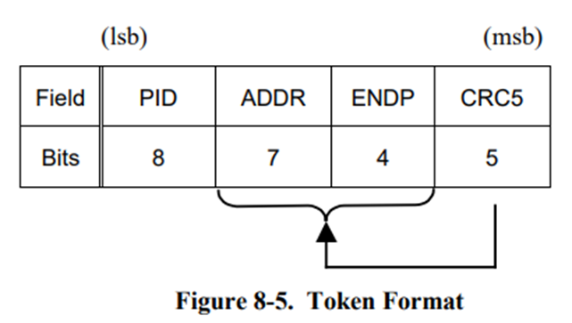

| Token | Hướng data | Ý nghĩa |
|---|---|---|
| **OUT** | Host $\rightarrow$ Device | ADDR + ENDP xác định endpoint sẽ nhận Data Packet tiếp theo |
| **IN** | Device $\rightarrow$ Host | ADDR + ENDP xác định endpoint sẽ truyền Data Packet |
| **SETUP** | Host $\rightarrow$ Device | Giống OUT, nhưng dành riêng cho Control Transfer (Setup Stage) |

Ví dụ:

```
Token: IN, Address=5, Endpoint=1
=> Nghĩa là: "Device số 5, hãy gửi dữ liệu từ endpoint 1 của bạn cho tôi"
```

**SOF Packet** (đặc biệt - không theo format token thông thường):

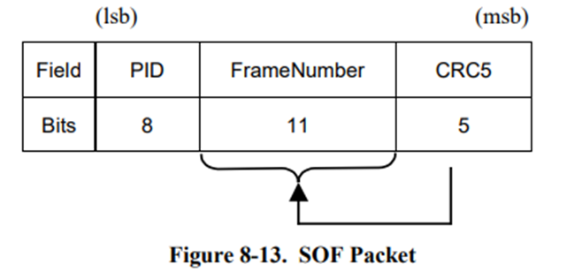

SOF được host phát ở đầu mỗi frame (1ms cho FS) hoặc microframe (125μs cho HS). Frame number đếm tuần tự từ 0 đến 2047 (11 bit) rồi quay lại 0.

### 4.2. Data packet

Data packet chứa payload thực tế. Cấu trúc:

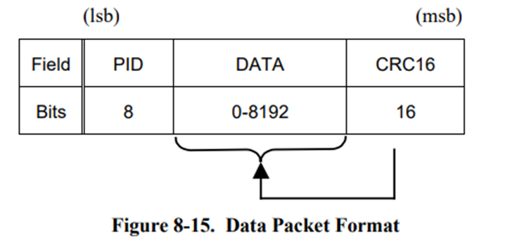

USB sử dụng data toggle (DATA0/DATA1) để phát hiện packet bị mất hoặc bị trùng lặp. Đây là cơ chế quan trọng đảm bảo tính toàn vẹn dữ liệu:

**Cơ chế hoạt động như sau:**
- Mỗi endpoint duy trì một toggle bit nội bộ (0 hoặc 1).
- Data packet gửi đi được đánh dấu DATA0 hoặc DATA1 tương ứng toggle bit hiện tại.
- Sau mỗi lần truyền thành công (nhận ACK), **cả host và device đều đảo toggle bit** (0$\rightarrow$1 hoặc 1$\rightarrow$0).
- Nếu host hoặc device nhận packet có toggle bit không khớp mong đợi $\rightarrow$ **packet bị coi là trùng lặp** $\rightarrow$ ignore data nhưng vẫn gửi ACK.

**Ví dụ - OUT transfer bình thường:**

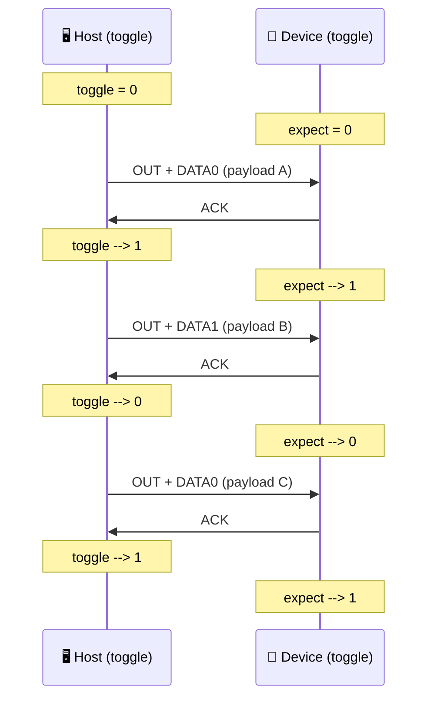

**Ví dụ - ACK bị mất, host retry:**

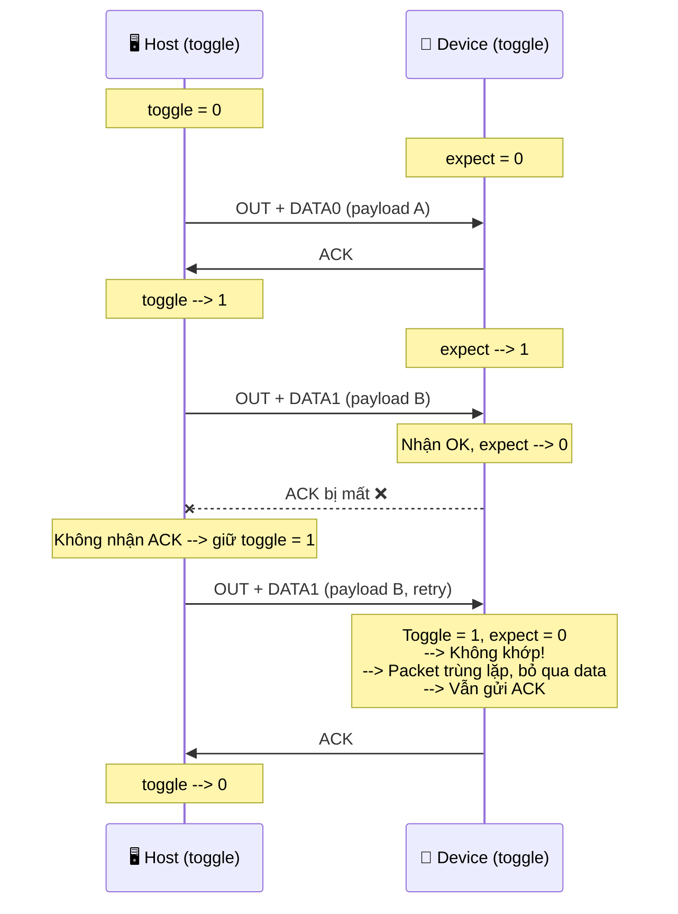

:::tip Tại sao data toggle quan trọng?
Không có data toggle, khi ACK bị mất, host sẽ retry và device nhận data hai lần mà không biết $\rightarrow$ dữ liệu bị trùng lặp. Data toggle giải quyết vấn đề này bằng cách cho device biết "đây là packet mới hay packet cũ gửi lại".
:::

### 4.3. Handshake packet

Handshake packet là packet đơn giản nhất, chỉ chứa PID:

| Handshake | Ý nghĩa | Khi nào gửi | Hành động tiếp theo |
|-----------|---------|-------------|---------------------|
| **ACK** | Acknowledge - Thành công | Data nhận đúng, CRC OK | Host/Device tiếp tục transaction mới |
| **NAK** | Not Acknowledge - Chưa sẵn sàng | Device bận hoặc chưa có data | Host thử lại sau (retry) |
| **STALL** | Endpoint bị halt/lỗi | Endpoint lỗi hoặc không hỗ trợ request | Host phải can thiệp (clear stall) |

Ví dụ:
 
```
Tình huống 1: Printer nhận lệnh in
Host --> OUT Token --> Data (lệnh in) --> Device
Device: Buffer đầy --> NAK
Host: Đợi 1ms --> Thử lại
Device: Buffer trống --> ACK
 
Tình huống 2: Chuột gửi vị trí
Host --> IN Token --> Device
Device: Chưa di chuyển --> NAK
Host: Đợi --> Thử lại
Device: Có di chuyển --> DATA1 (tọa độ) --> Host: ACK
```

:::warning Phân biệt NAK và STALL
- **NAK** = "Tôi đang bận, hỏi lại sau" $\rightarrow$ host tự động retry, hoàn toàn bình thường.
- **STALL** = "Tôi gặp lỗi, không thể tiếp tục" $\rightarrow$ host phải gửi `CLEAR_FEATURE(ENDPOINT_HALT)` để reset endpoint trước khi giao tiếp lại.
:::

## 5. Các loại transfer

Transfer là lớp cao nhất trong kiến trúc giao thức USB. Người thiết kế firmware làm việc chủ yếu ở mức transfer, không cần quan tâm đến từng transaction hay packet riêng lẻ (USB stack và hardware xử lý các lớp thấp hơn).

| Transfer Type | Đặc điểm chính | Ứng dụng |
|---|---|---|
| **Control** | Bắt buộc, có cấu trúc Setup/Data/Status | Enumeration, configuration |
| **Interrupt** | Polling định kỳ, độ trễ thấp | Keyboard, mouse, gamepad |
| **Bulk** | Dữ liệu lớn, đảm bảo chính xác | Flash drive, printer, CDC |
| **Isochronous** | Thời gian thực, không retry | Audio, video, webcam |

Một transfer là một chuỗi nhiều transaction liên tiếp, được host lập lịch để thực hiện một mục đích truyền dữ liệu hoàn chỉnh, ví dụ: đọc một descriptor, truyền một khối dữ liệu lớn, hay stream audio thời gian thực.

Ví dụ:
- Đọc một descriptor (device descriptor) = 1 Control Transfer = 3 Transaction (Setup + Data + Status)
- Stream audio trong 1 giây = 1000 Isochronous Transfer (mỗi 1ms một transfer)

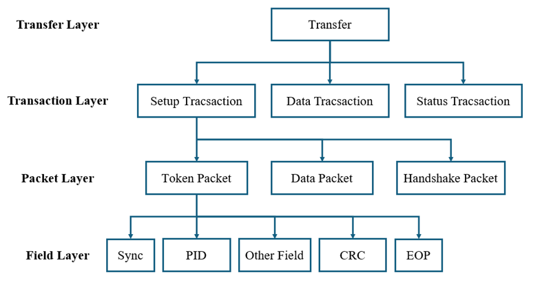

### 5.1. Control transfer

Control transfer là loại transfer **bắt buộc** trên mọi USB device, sử dụng endpoint 0 để quản lý và cấu hình thiết bị. Control transfer có cấu trúc đặc biệt gồm 3 stage:

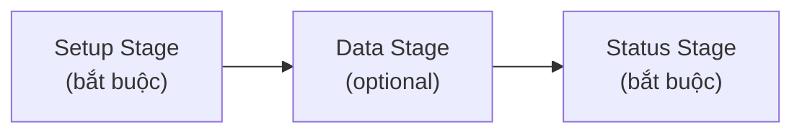

**Max packet size cho control transfer**

| Tốc độ | Max packet size (Data Stage) | Ghi chú |
|---|---|---|
| Low Speed | 8 byte | Cố định |
| Full Speed | 8, 16, 32, hoặc 64 byte | Khai báo trong device descriptor |
| High Speed | 64 byte | Cố định |

:::warning Lưu ý
Setup packet luôn có kích thước cố định 8 byte, không phụ thuộc tốc độ.
:::

**Setup stage**

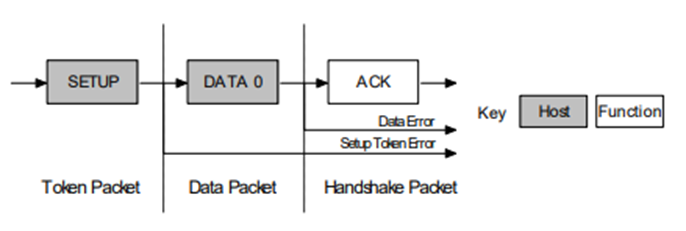

Setup packet (8 byte) chứa thông tin về request mà host muốn thực hiện. Chi tiết cấu trúc setup packet sẽ được trình bày trong bài **standard request**.

:::warning Lưu ý
Khi device nhận setup packet mới, nó phải **hủy bỏ mọi transfer đang dở trên EP0** và bắt đầu xử lý request mới.
:::

**Data stage**

Data stage truyền dữ liệu thực tế liên quan đến request. Stage này có thể có hoặc không tùy thuộc vào request.

Nếu dữ liệu lớn hơn max packet size, nó sẽ được **chia thành nhiều transaction**, mỗi transaction tối đa bằng max packet size. Transaction cuối cùng có thể ngắn hơn (last transaction).

Data stage có hai cách thực hiện khác nhau tùy thuộc vào hướng của data transfer:

- IN: Khi host muốn nhận control data, nó sẽ release một IN Token, nếu function nhận được cái IN Token này mà bị lỗi thì nó sẽ bỏ qua packet. Nếu token được nhận chính xác thì device sẽ response bằng DATA packet chứa control data sẽ được gửi, stall packet cho biết endpoint đã có lỗi hoặc NAK packet cho host biết rằng endpoint đang hoạt động, nhưng tạm thời chưa có dữ liệu được gửi.

- OUT: Khi host cần gửi control data packet tới device, nó sẽ release một OUT token theo sau là một data packet chứa control data. Nếu OUT token hoặc data packet này bị hỏng thì function sẽ ignore packet. Nếu endpoint buffer của function là rỗng và nó nhận data control được gửi vào endpoint buffer thì device sẽ release một ACK để thông báo với Host rằng nó đã nhận dữ liệu thành công. Nếu endpoint buffer là không rỗng do vẫn đang xử lý packet trước đấy thì function sẽ trả về NAK. Tuy nhiên, nếu endpoint bị lỗi và bit halt của nó là được set thì nó sẽ trả về STALL.

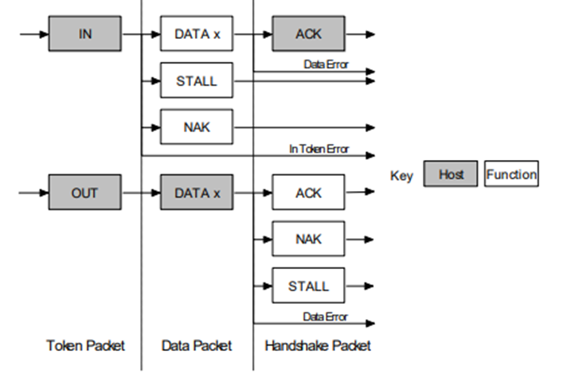

**Status stage**

Status stage báo cáo **kết quả cuối cùng** của toàn bộ control transfer. Hướng truyền ở status stage **ngược lại** với data stage:

| Data stage hướng | Status stage thực hiện | Mô tả |
|---|---|---|
| IN (device $\rightarrow$ host) | Host gửi **OUT + zero-length DATA1** $\rightarrow$ Device reply handshake | Host xác nhận đã nhận đủ data, device báo trạng thái |
| OUT (host $\rightarrow$ device) | Host gửi **IN Token** $\rightarrow$ Device reply **zero-length DATA1** | Device xác nhận đã xử lý xong data từ host |
| No Data Stage | Host gửi **IN Token** $\rightarrow$ Device reply **zero-length DATA1** | Device báo đã thực hiện xong request |

- IN: Nếu host gửi IN Token trong khi data stage nhận data thì host sẽ xác nhận dữ liệu được nhận thành công. Điều này được thực hiện bằng cách host sẽ gửi một OUT token theo sau là data packet có độ dài bằng 0. Lúc này, function có thể thông báo về status của nó tại handshaking stage. Một ACK cho biết một function đã hoàn thành command và giờ nó sẵn sàng để nhận một command khác. Nếu lỗi xảy ra trong khi xử lý command thì function sẽ release STALL. Tuy nhiên, nếu function là vẫn đang trong quá trình xử lý thì nó sẽ trả về NAK để báo cho host biết repeat status stage lần sau.
 
  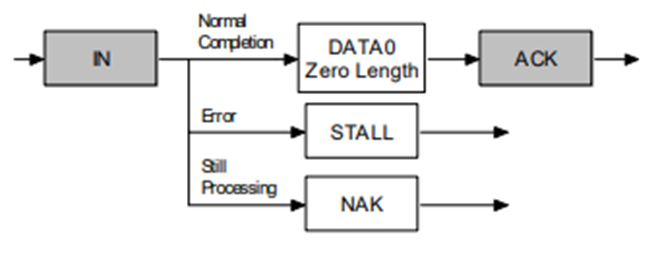

- OUT: Nếu host gửi OUT token trong khi data stage đang truyền data, function sẽ xác nhận data được nhận thành công bằng cách gửi một zero length packet để response In token. Tuy nhiên, nếu lỗi xảy ra, function sẽ release một STALL hoặc nếu nó đang bận xử lý thì nó sẽ release NAK để yêu cầu host thử lại status stage.

  

### 5.2. Interrupt transfer

Interrupt transfer được sử dụng để truyền dữ liệu nhỏ, cần độ trễ thấp và phản hồi đảm bảo. Ví dụ như bàn phím, chuột,...

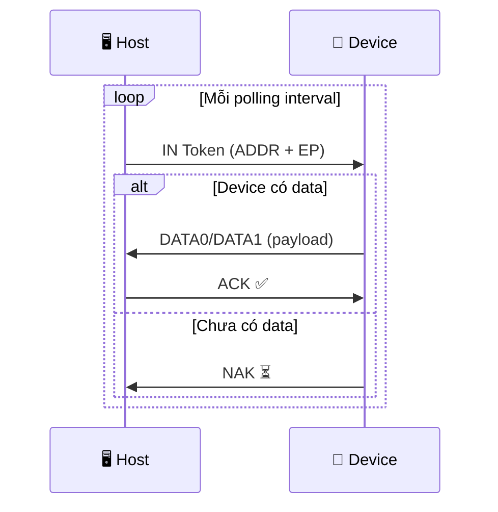

**Cơ chế hoạt động:** Host sẽ định kỳ thăm dò endpoint theo khoảng thời gian được lập trình trong endpoint descriptor. Nếu device có dữ liệu, host sẽ nhận được ngay khi polling. Nếu không có dữ liệu, host nhận được gói NAK. Khi xảy ra lỗi, host tự động retry để đảm bảo dữ liệu truyền và nhận chính xác.

**Max packet size:**

| Tốc độ | Max packet size |
|---|---|
| Low Speed | 8 byte |
| Full Speed | 64 byte |
| High Speed | 1024 byte |

**Polling interval:**

| Tốc độ | Giá trị `bInterval` |
|---|---|
| Low Speed | 10–255 | 
| Full Speed | 1–255 |
| High Speed | 2^(bInterval−1) × 125μs |

:::warning Chú ý:
Tên "Interrupt Transfer" dễ gây nhầm lẫn. Device không thể chủ động ngắt host như interrupt trong MCU. Thay vào đó, host polling đều đặn theo interval, và device trả data khi có hoặc NAK khi không. Tên gọi chỉ phản ánh mục đích sử dụng, không phải cơ chế hoạt động.
:::

### 5.3. Bulk transfer

Bulk transfer được dùng để truyền dữ liệu lớn, không yêu cầu real-time. Dùng khi cần độ tin cậy cao, ví dụ như USB Flash Drive, Printer, UART qua USB (CDC/ACM).

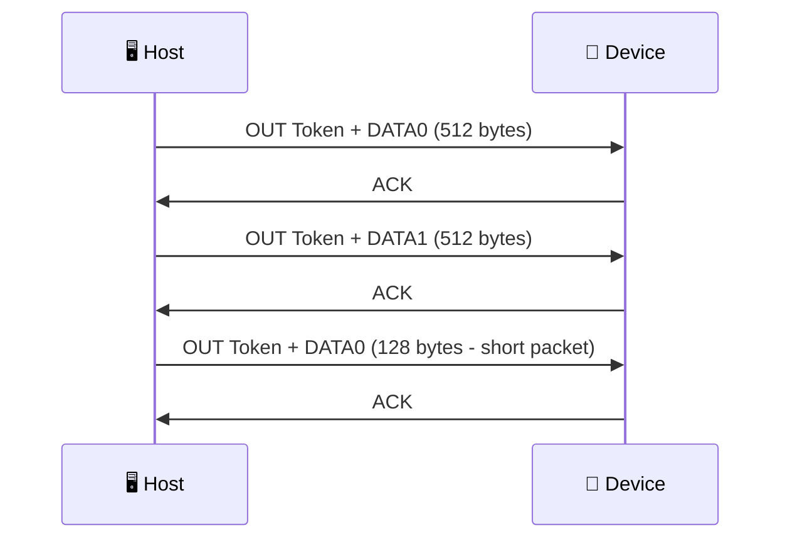

**Cơ chế hoạt động:** Host chỉ truyền data khi bus rảnh và nhận data khi nó ready. Nếu xảy ra lỗi, host sẽ tự retry cho đến khi thành công $\rightarrow$ độ tin cậy cực cao. Nhưng không có băng thông hay thời gian đảm bảo $\rightarrow$ có thể bị chậm nếu USB bận.

**Max packet size:**

| Tốc độ | Max packet size |
|---|---|
| Full Speed | 8, 16, 32, hoặc 64 byte |
| High Speed | 512 byte |
| Low Speed | **Không hỗ trợ** bulk transfer |

:::warning Short Packet và Zero-Length Packet (ZLP)
Bulk transfer kết thúc khi host/device gửi một short packet (nhỏ hơn max packet size). Nếu tổng data vừa đúng bội số của max packet size, cần gửi thêm một zero-length packet (ZLP) để báo hiệu kết thúc transfer. Đây là lỗi phổ biến khi viết firmware USB - quên gửi ZLP khiến host chờ mãi vì nghĩ transfer chưa xong.
:::

### 5.4. Isochronous transfer

Isochronous transfer được dùng trong các ứng dụng yêu cầu thời gian thực, cần truyền đều đặn, ví dụ như microphone, webcam USB, audio USB. Isochronous Transfer không hỗ trợ low speed.

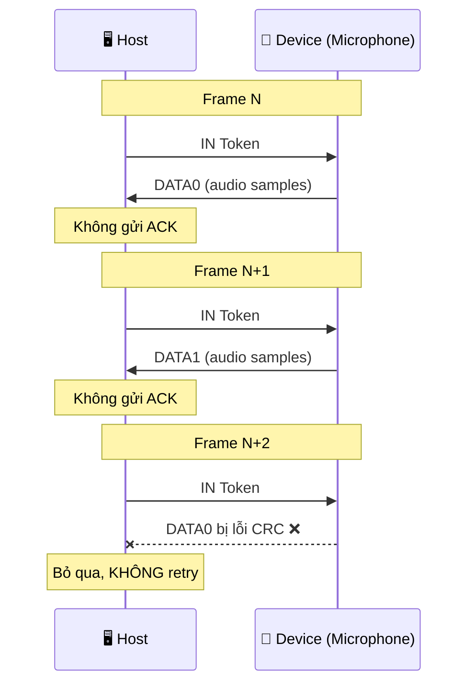

**Cơ chế hoạt động:** Host cấp phát băng thông cố định cho device ở mỗi frame. Data packet được gửi hoặc nhận tại mỗi frame, tức là sau 1 ms đối với full speed hoặc 125μs đối với High Speed. Packet có thể bị lỗi mà không cần retry, vì ưu tiên thời gian hơn độ chính xác $\rightarrow$ không có handshake (ACK/NAK).

**Max packet size:** Kích thước tối đa của data packet là 1023 đối với full speed và 1024 đối với high speed.

:::tip Tại sao Isochronous không retry?
Trong ứng dụng thời gian thực (audio, video), data cũ đã qua thời điểm phát lại sẽ vô nghĩa. Retry sẽ gây delay tích lũy, phá vỡ tính realtime. Thà mất một frame audio (gây "click" nhẹ) còn hơn delay cả stream. Đây là sự đánh đổi có chủ đích trong thiết kế USB protocol.
:::