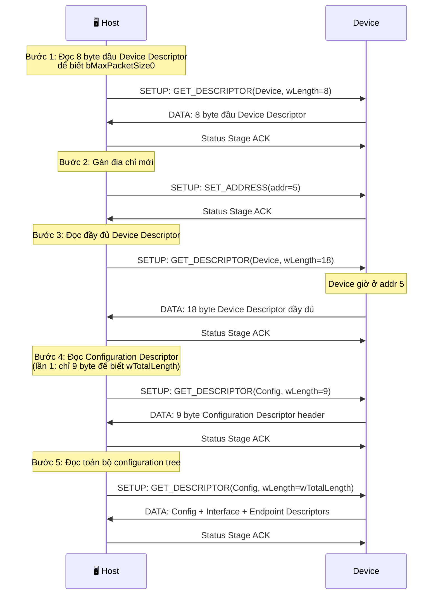

Trong USB, mọi thao tác cấu hình và điều khiển thiết bị đều được thực hiện thông qua Control Transfer trên endpoint 0. Nội dung của các control transfer này được chuẩn hóa thành một tập hợp các Standard Requests. Đây là các yêu cầu bắt buộc mà mọi thiết bị USB phải hiểu và phản hồi đúng theo specification.

## Mục lục

- [1. Setup packet](#1-setup-packet)
- [2. Danh sách Standard Requests](#2-danh-sách-standard-requests)
- [3. Chi tiết các request quan trọng](#3-chi-tiết-các-request-quan-trọng)
    - [3.1. GET_DESCRIPTOR](#31-get_descriptor)
    - [3.2. SET_ADDRESS](#32-set_address)
    - [3.3. SET_CONFIGURATION](#33-set_configuration)
    - [3.4. GET_STATUS, SET_FEATURE, CLEAR_FEATURE](#34-get_status-set_feature-clear_feature)

## 1. Setup packet

Mọi Standard Request đều được gửi trong Setup Stage của Control Transfer, dưới dạng một Setup Packet cố định 8 byte:

| Offset | Field           | Kích thước | Mô tả |
| ------ | --------------- | ---------- | ----- |
| 0      | `bmRequestType` | 1 byte     | Xác định hướng, loại request và đối tượng đích |
| 1	     | `bRequest`	   | 1 byte     | Mã request cụ thể |
| 2–3	 | `wValue`	       | 2 byte     | Tham số chính của request |
| 4–5	 | `wIndex`	       | 2 byte     | Tham số phụ hoặc index |
| 6–7	 | `wLength`       | 2 byte     | Số byte dữ liệu trong data stage |

Trường `bmRequestType` được chia thành các bit ý nghĩa như sau:

| Bit   | Ý nghĩa	     | Giá trị |
| ----- | -------------- | ------- |
| 7	    | Hướng truyền	 | - 0: Host → Device  - 1: Device → Host |
| 6..5  | Loại request	 | - 00: Standard  - 01: Class  - 10: Vendor  - Reserved |
| 4..0	| Đối tượng đích | - 00000: Device  - 00001: Interface  - 00010: Endpoint  - 00011: Other |

Post này sẽ chỉ tập trung vào Standard Requests, tương ứng `bmRequestType` có Type = 00.

## 2. Danh sách Standard Requests

Các Standard Requests bắt buộc theo USB 2.0 Specification:

| `bRequest` | Tên Request          | Hướng         | Mục đích |
| -------- | -------------------- | ------------- | -------- |
| 0x00     | `GET_STATUS`         | Device → Host | Đọc trạng thái của device/interface/endpoint |
| 0x01     | `CLEAR_FEATURE`      | Host → Device | Xóa một tính năng hoặc trạng thái đặc biệt |
| 0x03     | `SET_FEATURE`        | Host → Device | Thiết lập một tính năng hoặc trạng thái đặc biệt |
| 0x05     | `SET_ADDRESS`        | Host → Device | Gán địa chỉ mới cho thiết bị |
| 0x06     | `GET_DESCRIPTOR`     | Device → Host | Đọc descriptor từ thiết bị |
| 0x07     | `SET_DESCRIPTOR`     | Host → Device | Ghi descriptor (hiếm khi sử dụng) |
| 0x08     | `GET_CONFIGURATION`  | Device → Host | Đọc cấu hình hiện tại |
| 0x09     | `SET_CONFIGURATION`  | Host → Device | Chọn cấu hình hoạt động |
| 0x0A     | `GET_INTERFACE`      | Device → Host | Đọc interface đang hoạt động |
| 0x0B     | `SET_INTERFACE`      | Host → Device | Chọn alternate interface |
| 0x0C     | `SYNCH_FRAME`        | Device → Host | Đồng bộ frame (dùng cho isochronous endpoint) |

## 3. Chi tiết các request quan trọng

### 3.1. GET_DESCRIPTOR

Đây là request quan trọng nhất trong toàn bộ giao thức USB. Host sử dụng `GET_DESCRIPTOR` để đọc các descriptor từ thiết bị, bắt đầu bằng Device Descriptor ở địa chỉ mặc định 0. Từ các descriptor này, host xác định loại thiết bị, số lượng cấu hình, số lượng interface và các endpoint cần kích hoạt.

**Setup Packet:**
 
| Field | Giá trị | Chi tiết |
|---|---|---|
| `bmRequestType` | `0x80` | IN, Standard, Device |
| `bRequest` | `0x06` | GET_DESCRIPTOR |
| `wValue` | Trường 16 bit này được chia thành hai byte.  - Byte cao: Descriptor Type - Byte thấp: Descriptor Index | Xem bảng bên dưới |
| `wIndex` | `0x0000` (hoặc Language ID cho String Descriptor) | |
| `wLength` | Số byte tối đa host muốn đọc | Device chỉ gửi tối đa bằng giá trị này |
 
**Descriptor Type:**
 
| Value | Descriptor Type |
|---|---|
| 1 | Device Descriptor |
| 2 | Configuration Descriptor |
| 3 | String Descriptor |
| 4 | Interface Descriptor |
| 5 | Endpoint Descriptor |
| 6 | Device Qualifier Descriptor |
| 7 | Other Speed Configuration |
 
:::warning Lưu ý
Host không gửi `GET_DESCRIPTOR` riêng cho Interface Descriptor hay Endpoint Descriptor. Thay vào đó, khi host request Configuration Descriptor, device phải trả về toàn bộ configuration bao gồm: Configuration Descriptor + tất cả Interface Descriptor + tất cả Endpoint Descriptor liên quan. Đây là lý do `wLength` thường được set lớn (vd: 255 hoặc 512 byte) khi đọc Configuration Descriptor.
:::

**Descriptor Index:**

- Device Descriptor: luôn bằng 0
- Configuration Descriptor: số thứ tự cấu hình (0,1,2...)
- String Descriptor: số thứ tự chuỗi

**Quy trình đọc descriptor điển hình:**
 

 
:::tip Tại sao đọc Device Descriptor hai lần?
Lần đầu, host chỉ đọc 8 byte để lấy trường `bMaxPacketSize0` (offset 7) - vì EP0 max packet size chưa biết, host cần con số này để cấu hình đúng control pipe. Sau khi biết max packet size, host reset device, gán địa chỉ, rồi đọc lại đầy đủ 18 byte.
:::

### 3.2. SET_ADDRESS

Sau khi đọc Device Descriptor lần đầu, host gửi `SET_ADDRESS` để gán một địa chỉ mới cho thiết bị.

**Setup Packet:**
 
| Field | Giá trị | Chi tiết |
|---|---|---|
| `bmRequestType` | `0x00` | OUT, Standard, Device |
| `bRequest` | `0x05` | SET_ADDRESS |
| `wValue` | Địa chỉ mới (1–127) | 7 bit thấp có ý nghĩa |
| `wIndex` | `0x0000` | Không dùng |
| `wLength` | `0x0000` | Không có Data Stage |

:::warning Thời điểm chuyển địa chỉ
Device chỉ chuyển sang địa chỉ mới sau khi Status Stage hoàn tất thành công. Tức là trong suốt quá trình Setup Stage và Status Stage của SET_ADDRESS, device vẫn phản hồi ở địa chỉ cũ (0). USB spec yêu cầu device phải hoàn tất việc chuyển địa chỉ trong vòng 50ms sau Status Stage.
:::

:::warning Lưu ý cho firmware developer
Trên nhiều MCU (STM32, ESP32,...), USB peripheral hardware tự động xử lý SET_ADDRESS - firmware chỉ cần ghi địa chỉ mới vào thanh ghi address tại thời điểm thích hợp (sau Status Stage). Tuy nhiên, một số stack yêu cầu firmware ghi address register trước Status Stage và hardware sẽ tự defer - cần đọc kỹ reference manual của MCU cụ thể.
:::

### 3.3. SET_CONFIGURATION 

Host gửi `SET_CONFIGURATION` để chọn một cấu hình cụ thể mà thiết bị hỗ trợ.
 
| Field | Giá trị | Chi tiết |
|---|---|---|
| `bmRequestType` | `0x00` | OUT, Standard, Device |
| `bRequest` | `0x09` | SET_CONFIGURATION |
| `wValue` | Configuration value | Lấy từ `bConfigurationValue` trong Configuration Descriptor |
| `wIndex` | `0x0000` | Không dùng |
| `wLength` | `0x0000` | Không có Data Stage |

Khi device nhận SET_CONFIGURATION thành công:
- Device chuyển sang trạng thái **Configured**.
- Tất cả endpoint (ngoài EP0) được khai báo trong configuration đó **bắt đầu hoạt động**.
- Data toggle của mọi endpoint được **reset về DATA0**.
- Host thiết lập pipe cho từng endpoint.
 
:::warning Lưu ý
Gửi SET_CONFIGURATION với `wValue = 0` sẽ đưa device về trạng thái Address (unconfigured) - tất cả endpoint ngoài EP0 bị vô hiệu hóa.
:::

### 3.4. GET_STATUS, SET_FEATURE, CLEAR_FEATURE

Ba request này được dùng để quản lý trạng thái thiết bị và endpoint. Ví dụ, `CLEAR_FEATURE` được sử dụng để xóa trạng thái HALT của một endpoint sau khi xảy ra STALL.

Các request này đảm bảo host có thể điều khiển trạng thái logic của device một cách chuẩn hóa.