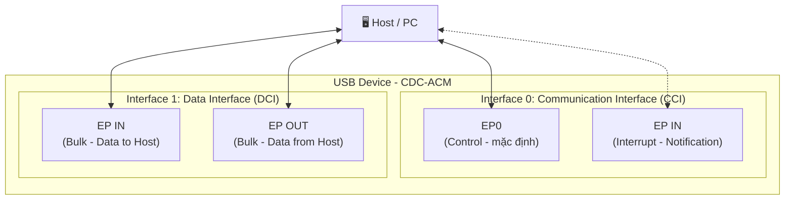
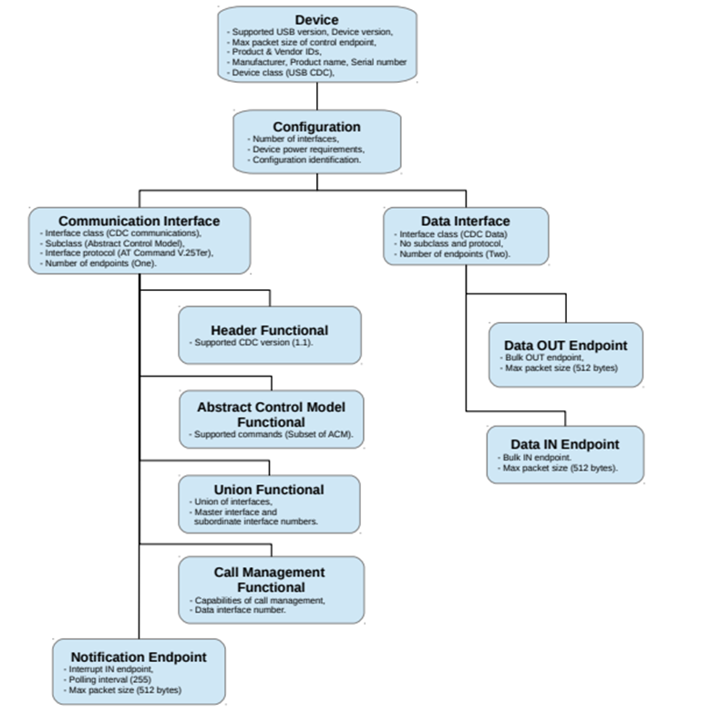
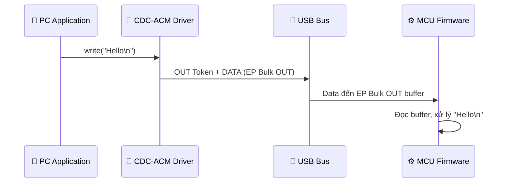
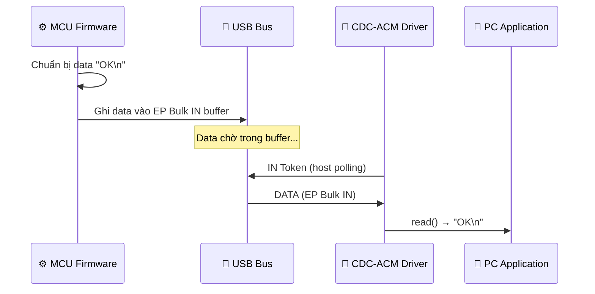
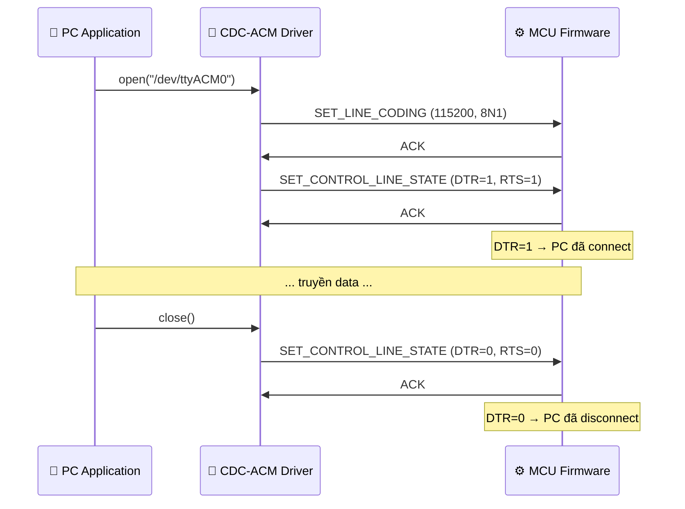

## Tổng quan

**CDC (Communication Device Class)** là một USB device class được thiết kế cho các thiết bị truyền thông — modem, network adapter, serial port,... Trong đó, **CDC-ACM (Abstract Control Model)** là subclass phổ biến nhất, cho phép thiết bị USB hoạt động như một Virtual COM Port (cổng serial ảo) trên máy tính.

Khi MCU implement CDC-ACM, nó sẽ xuất hiện trên PC dưới dạng:
- **Windows**: `COMx` (ví dụ COM3, COM5)
- **Linux**: `/dev/ttyACMx` hoặc `/dev/ttyUSBx`
- **macOS**: `/dev/cu.usbmodemXXXX`

Từ góc nhìn phần mềm PC, giao tiếp với thiết bị CDC-ACM giống hệt giao tiếp UART qua serial port — dùng cùng API (open, read, write, close), cùng các tool (PuTTY, minicom, screen, Arduino Serial Monitor).

## Tại sao CDC-ACM quan trọng trong embedded?
 
| Ưu điểm | Mô tả |
|---|---|
| **Thay thế UART-to-USB bridge** | Không cần chip CP2102, CH340, FTDI — MCU có USB peripheral tự làm được |
| **Debug & logging** | Gửi log/debug message từ MCU lên PC qua Virtual COM Port |
| **Firmware update** | Dùng CDC-ACM làm kênh truyền firmware (custom bootloader) |
| **Giao tiếp PC ↔ MCU** | Truyền command/data hai chiều, đơn giản hơn custom USB protocol |
| **Driverless** | Windows 10+, Linux, macOS đều có driver CDC-ACM tích hợp sẵn |
 
:::warning Chú ý
CDC-ACM mô phỏng giao tiếp serial nhưng thực tế truyền qua USB bus. Các thông số serial (baud rate, parity, stop bits) mà PC gửi xuống **không ảnh hưởng đến tốc độ truyền USB** — chúng chỉ có ý nghĩa nếu MCU dùng chúng để cấu hình một UART thật phía sau (ví dụ: USB-to-UART bridge). Nếu MCU chỉ xử lý data nội bộ, firmware có thể nhận và bỏ qua các thông số này.
:::

## Kiến trúc CDC-ACM
 
### Mô hình hai interface
 
CDC-ACM yêu cầu device khai báo hai interface:

 
| Interface | Class/Subclass/Protocol | Vai trò | Endpoint |
|---|---|---|---|
| **Communication Interface (CCI)** | Class=0x02, Subclass=0x02, Protocol=0x01 | Điều khiển: nhận/gửi command, thông báo trạng thái | EP0 (Control) + 1 EP IN (Interrupt) |
| **Data Interface (DCI)** | Class=0x0A, Subclass=0x00, Protocol=0x00 | Truyền data thực tế (payload) | 1 EP IN (Bulk) + 1 EP OUT (Bulk) |

### Vai trò từng Endpoint
 
| Endpoint | Type | Hướng | Chức năng |
|---|---|---|---|
| **EP0** | Control | Bidirectional | Standard Request + CDC Class Request (SET_LINE_CODING,...) |
| **Notification EP** | Interrupt IN | Device → Host | Thông báo sự kiện (vd: `SERIAL_STATE` — DCD, DSR thay đổi) |
| **Data IN EP** | Bulk IN | Device → Host | Gửi data từ MCU lên PC |
| **Data OUT EP** | Bulk OUT | Host → Device | Nhận data từ PC xuống MCU |

## CDC Class-Specific Requests
 
Ngoài Standard Request, CDC-ACM định nghĩa thêm các Class Request gửi qua Control Transfer. Đây là các request mà PC serial driver gửi xuống device để cấu hình "serial port ảo".

### SET_LINE_CODING (bRequest = 0x20)
 
PC gửi thông số serial xuống device:
 
| Field | Giá trị |
|---|---|
| `bmRequestType` | `0x21` (OUT, Class, Interface) |
| `bRequest` | `0x20` |
| `wValue` | `0x0000` |
| `wIndex` | Interface number (thường = 0) |
| `wLength` | `0x0007` (7 byte) |
 
**Data Stage — 7 byte Line Coding Structure:**
 
| Offset | Field | Size | Mô tả |
|---|---|---|---|
| 0–3 | `dwDTERate` | 4 byte | Baud rate (vd: 115200) |
| 4 | `bCharFormat` | 1 byte | Stop bits: - `0`=1 - `1`=1.5 - `2`=2 |
| 5 | `bParityType` | 1 byte | Parity: - `0`=None - `1`=Odd - `2`=Even - `3`=Mark - `4`=Space |
| 6 | `bDataBits` | 1 byte | Data bits: 5, 6, 7, 8, hoặc 16 |
 
### GET_LINE_CODING (bRequest = 0x21)
 
PC đọc thông số serial hiện tại từ device. Cấu trúc tương tự, nhưng hướng ngược lại (`bmRequestType = 0xA1`, device gửi 7 byte lên host).
 
### SET_CONTROL_LINE_STATE (bRequest = 0x22)
 
PC điều khiển tín hiệu DTR và RTS:
 
| Field | Giá trị |
|---|---|
| `bmRequestType` | `0x21` |
| `bRequest` | `0x22` |
| `wValue` | Bit 0 = DTR  Bit 1 = RTS |
| `wIndex` | Interface number |
| `wLength` | `0x0000` |
 
| wValue Bit | Ý nghĩa |
|---|---|
| Bit 0 = 1 | DTR active — PC đã mở serial port |
| Bit 0 = 0 | DTR inactive — PC đã đóng serial port |
| Bit 1 = 1 | RTS active — PC sẵn sàng nhận data |
| Bit 1 = 0 | RTS inactive |
 
:::warning Detect PC open/close serial port
Khi ứng dụng trên PC mở serial port (ví dụ: PuTTY connect), host gửi `SET_CONTROL_LINE_STATE` với **DTR = 1**. Khi đóng port, host gửi **DTR = 0**. Firmware có thể dùng tín hiệu DTR để biết khi nào PC sẵn sàng nhận data, tránh gửi data khi không có ai đọc.

Đây cũng là cơ chế mà ESP dùng để auto-reset MCU khi upload firmware: PC toggle DTR → MCU reset → bootloader bắt đầu.
:::

## Cấu trúc descriptor
 
CDC-ACM cần một cấu trúc descriptor phức tạp hơn thông thường vì có hai interface và các **Functional Descriptor** đặc thù.

### Descriptor tree

 
### CDC Functional Descriptors
 
Đây là các descriptor đặc thù của CDC class, nằm ngay sau Interface Descriptor của Communication Interface:
 
#### Header Functional Descriptor (bắt buộc)
 
| Offset | Field | Size | Giá trị | Mô tả |
|---|---|---|---|---|
| 0 | bLength | 1 | 5 | Kích thước descriptor |
| 1 | bDescriptorType | 1 | 0x24 | CS_INTERFACE |
| 2 | bDescriptorSubtype | 1 | 0x00 | Header |
| 3–4 | bcdCDC | 2 | 0x0110 | CDC spec version 1.10 |
 
#### Call Management Functional Descriptor
 
| Offset | Field | Size | Giá trị | Mô tả |
|---|---|---|---|---|
| 0 | bLength | 1 | 5 | |
| 1 | bDescriptorType | 1 | 0x24 | CS_INTERFACE |
| 2 | bDescriptorSubtype | 1 | 0x01 | Call Management |
| 3 | bmCapabilities | 1 | 0x00 | Thường = 0 (không handle call management) |
| 4 | bDataInterface | 1 | 1 | Data Interface number |
 
#### ACM Functional Descriptor
 
| Offset | Field | Size | Giá trị | Mô tả |
|---|---|---|---|---|
| 0 | bLength | 1 | 4 | |
| 1 | bDescriptorType | 1 | 0x24 | CS_INTERFACE |
| 2 | bDescriptorSubtype | 1 | 0x02 | ACM |
| 3 | bmCapabilities | 1 | 0x02 | Bit 1 = hỗ trợ SET/GET_LINE_CODING |
 
**`bmCapabilities` bit field:**
 
| Bit | Ý nghĩa |
|---|---|
| Bit 0 | Hỗ trợ `SET_COMM_FEATURE`, `CLEAR_COMM_FEATURE`, `GET_COMM_FEATURE` |
| Bit 1 | Hỗ trợ `SET_LINE_CODING`, `GET_LINE_CODING`, `SET_CONTROL_LINE_STATE`, `SERIAL_STATE` notification |
| Bit 2 | Hỗ trợ `SEND_BREAK` |
| Bit 3 | Hỗ trợ `NETWORK_CONNECTION` notification |
 
:::tip Thông tin hữu ích
Giá trị `bmCapabilities = 0x02` là phổ biến nhất trong embedded — chỉ cần hỗ trợ Line Coding và Control Line State là đủ cho Virtual COM Port.
:::

#### Union Functional Descriptor
 
| Offset | Field | Size | Giá trị | Mô tả |
|---|---|---|---|---|
| 0 | bLength | 1 | 5 | |
| 1 | bDescriptorType | 1 | 0x24 | CS_INTERFACE |
| 2 | bDescriptorSubtype | 1 | 0x06 | Union |
| 3 | bControlInterface | 1 | 0 | Communication Interface number |
| 4 | bSubordinateInterface0 | 1 | 1 | Data Interface number |
 
Union Descriptor liên kết Communication Interface và Data Interface lại với nhau, cho host biết hai interface này thuộc cùng một function.
 
## IAD (Interface Association Descriptor)
 
Khi một USB device có **nhiều function** (ví dụ: CDC-ACM + MSC, hoặc 2 CDC-ACM), cần sử dụng **IAD** để nhóm các interface thuộc cùng một function lại với nhau.
 
| Offset | Field | Size | Giá trị (cho CDC-ACM) | Mô tả |
|---|---|---|---|---|
| 0 | bLength | 1 | 8 | |
| 1 | bDescriptorType | 1 | 0x0B | INTERFACE_ASSOCIATION |
| 2 | bFirstInterface | 1 | 0 | Interface đầu tiên của nhóm |
| 3 | bInterfaceCount | 1 | 2 | Số interface trong nhóm |
| 4 | bFunctionClass | 1 | 0x02 | CDC |
| 5 | bFunctionSubClass | 1 | 0x02 | ACM |
| 6 | bFunctionProtocol | 1 | 0x01 | AT Command |
| 7 | iFunction | 1 | 0 | String index |
 
Khi sử dụng IAD, Device Descriptor cần thay đổi:
 
| Field | Không IAD | Có IAD |
|---|---|---|
| `bDeviceClass` | `0x02` (CDC) | `0xEF` (Miscellaneous) |
| `bDeviceSubClass` | `0x00` | `0x02` (Common Class) |
| `bDeviceProtocol` | `0x00` | `0x01` (IAD) |
 
:::warning Chú ý Nếu device chỉ có đúng một CDC-ACM function và không có function nào khác, có thể bỏ IAD và dùng `bDeviceClass = 0x02`. Tuy nhiên, luôn dùng IAD là practice an toàn nhất — đảm bảo tương thích khi mở rộng thêm function sau.
:::

## Luồng giao tiếp thực tế
 
### PC gửi data xuống MCU
 

 
### MCU gửi data lên PC
 

 
### Mở / Đóng serial port
 

 
## Lưu ý khi implement CDC-ACM
 
### 1. Zero-Length Packet (ZLP) cho Bulk Transfer
 
Khi data gửi từ MCU lên PC có kích thước đúng bằng bội số của max packet size (thường 64 byte ở FS), firmware phải gửi thêm một ZLP để host biết transfer đã kết thúc. Quên ZLP sẽ khiến PC đọc bị treo chờ.

### 2. Buffer overflow trên MCU

Nếu PC gửi data liên tục qua Bulk OUT nhưng firmware xử lý chậm, EP OUT buffer sẽ đầy → device trả NAK → host tự retry. Đây là flow control tự nhiên của USB, nhưng firmware nên đọc buffer kịp thời để tránh mất data khi buffer wrap around.

### 3. Enumeration không thành công trên Windows
 
Nguyên nhân phổ biến:
- Thiếu hoặc sai Functional Descriptor → Windows không nhận dạng được CDC-ACM.
- Thiếu IAD khi dùng composite device → Windows không nhóm được interface.
- `bMaxPacketSize0` trong Device Descriptor không khớp với khả năng thật của EP0.
 
### 4. Tốc độ truyền thực tế
 
| Tốc độ USB | Bulk Max Packet | Throughput thực tế (xấp xỉ) |
|---|---|---|
| Full Speed (12 Mb/s) | 64 byte | ~1 MB/s |
| High Speed (480 Mb/s) | 512 byte | ~40 MB/s |
 
Tốc độ thực tế phụ thuộc vào firmware processing speed, USB stack overhead, và lượng traffic khác trên bus.
 
### 5. Multiple CDC-ACM trên cùng device
 
Một MCU có thể expose nhiều Virtual COM Port bằng cách khai báo nhiều cặp interface (CCI + DCI). Mỗi cặp cần một IAD riêng. Ví dụ: ESP32-S3 có thể tạo 2 CDC-ACM — một cho debug log, một cho data transfer.

## Tham khảo

https://www.keil.com/pack/doc/mw6/USB/html/_c_d_c.html

https://www.xmos.com/download/AN00124:-USB-CDC-Class-as-Virtual-Serial-Port(2_0_2rc1).pdf