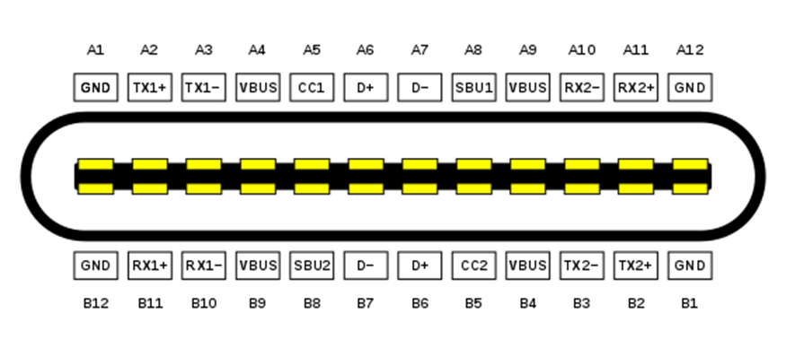
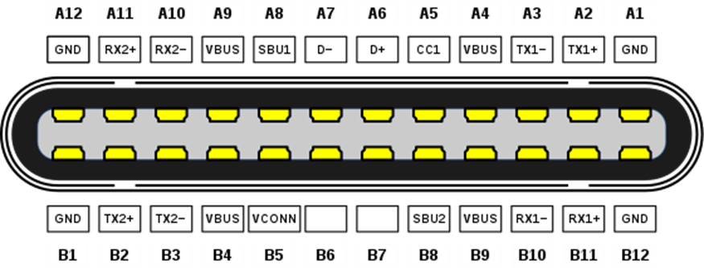
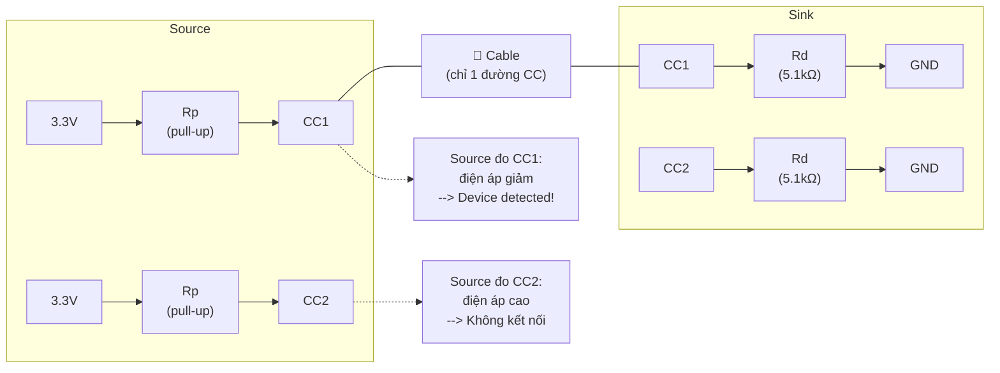
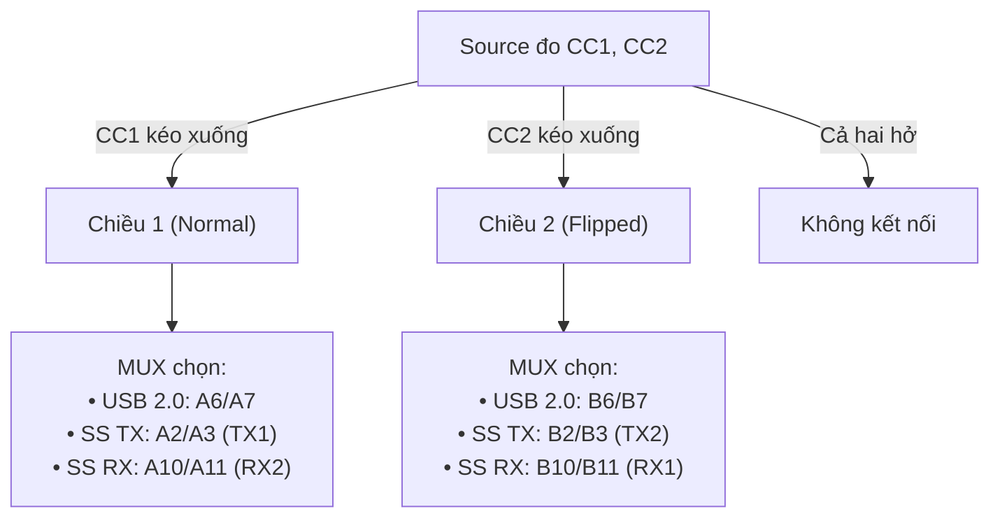
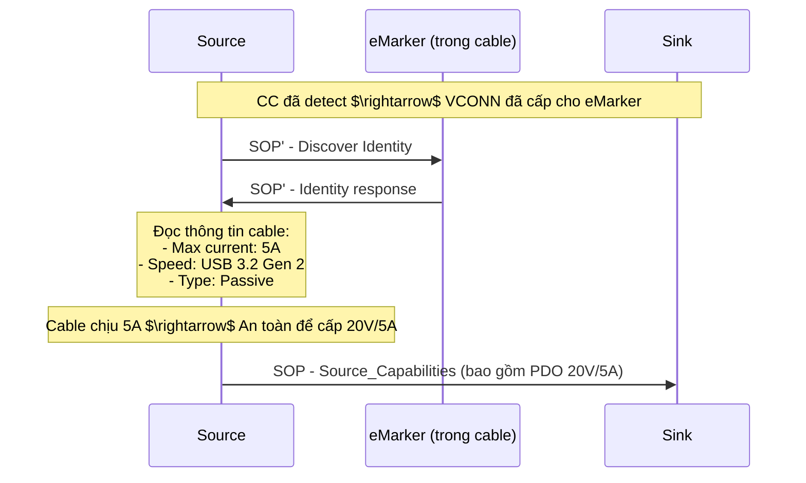
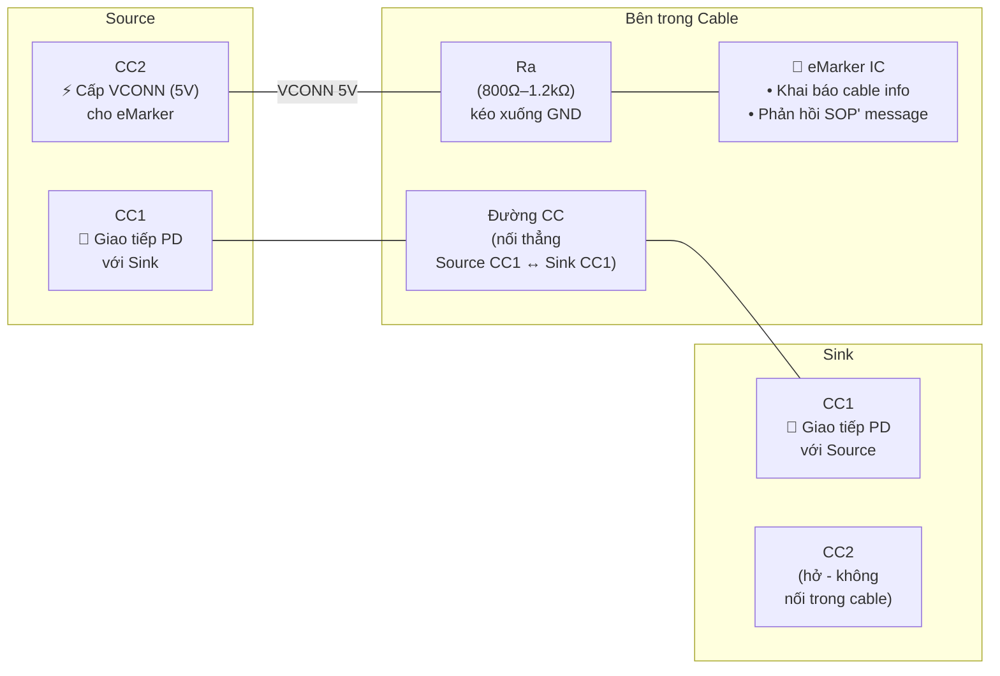
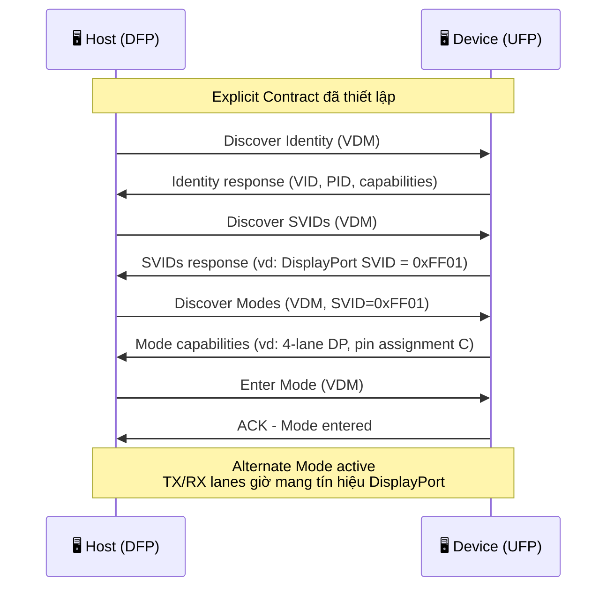

## 1. Tổng quan USB Type-C
 
**USB Type-C** là chuẩn connector vật lý thế hệ mới, được thiết kế để thay thế tất cả các loại connector USB trước đó (Type-A, Type-B, Mini-B, Micro-B). Type-C không chỉ là hình dạng đầu cắm - nó đi kèm một hệ sinh thái giao thức phức tạp hơn nhiều so với USB 2.0/3.0 truyền thống

**Tại sao USB Type-C được sinh ra?**
 
USB Type-C ra đời để giải quyết ba vấn đề cốt lõi:
- Giảm thiểu sự phức tạp của cable và port => giờ đây người dùng không phải quan tâm về hướng của cable.
- Khả năng swap vai trò UFP, DFP giữa hai port kết nối với nhau.
- Giải quyết được vấn đề hạn chế về nguồn điện có thể được cấp => USB BC, USB Type C Current, USB PD.

**Đặc điểm chính:**
 
| Đặc điểm | Mô tả |
|---|---|
| **Reversible** | Cắm chiều nào cũng được - không phân biệt trên/dưới |
| **Symmetrical** | Cả hai đầu cáp đều giống nhau (không còn Type-A $\leftrightarrow$ Type-B) |
| **Đa năng** | Hỗ trợ USB 2.0, USB 3.x, Thunderbolt, DisplayPort, sạc, audio |
| **Cấp nguồn cao** | Lên đến 240W (48V × 5A) với USB PD 3.1 Extended Power Range |
| **Nhỏ gọn** | Kích thước tương đương Micro-B, phù hợp thiết bị mỏng |
 
:::warning Lưu ý quan trọng
USB Type-C là connector (đầu cắm vật lý), không phải protocol. Một cổng Type-C có thể chỉ hỗ trợ USB 2.0 (480 Mb/s) hoặc hỗ trợ đến USB4 (40 Gb/s) - tùy vào phần cứng bên trong. Không phải cổng Type-C nào cũng nhanh hoặc cấp nguồn cao.
:::

## 2. Pinout USB Type-C
 
USB Type-C có 24 chân, được bố trí đối xứng để hỗ trợ cắm đảo chiều:

### 2.1. USB Type C receptacle pinout



### 2.2. USB Type C plug pinout



### 2.3. Phân nhóm chân chức năng
 
| Nhóm | Chân | Số lượng | Mô tả |
|---|---|---|---|
| **VBUS** | A4, A9, B4, B9 | 4 | Nguồn (5V–48V), nhiều chân để chịu dòng cao |
| **GND** | A1, A12, B1, B12 | 4 | Ground |
| **D+/D−** | A6/A7, B6/B7 | 2 cặp | USB 2.0 data - chỉ 1 cặp active, cặp còn lại dự phòng cho đảo chiều |
| **TX/RX** | A2/A3 (TX1), A10/A11 (RX2), B2/B3 (TX2), B10/B11 (RX1) | 4 cặp | USB 3.x SuperSpeed lanes |
| **CC** | A5 (CC1), B5 (CC2) | 2 | **Configuration Channel** - phát hiện kết nối, xác định hướng cắm, thương lượng nguồn |
| **SBU** | A8 (SBU1), B8 (SBU2) | 2 | **Sideband Use** - dùng cho Alternate Mode (DisplayPort, audio,...) |

## 3. Data Role và Power Role

Trong USB Type-C, data role và power role là hai khái niệm tách biệt - đây là điểm khác biệt lớn so với USB truyền thống (host luôn là nguồn, device luôn tiêu thụ).

### 3.1. Data Role
 
| Vai trò | Tên đầy đủ | Mô tả |
|---|---|---|
| **DFP** | Downstream Facing Port | Port phía host - gửi data xuống device. Cung cấp VBUS và VCONN |
| **UFP** | Upstream Facing Port | Port phía device - nhận data từ host. Tiêu thụ VBUS |
| **DRD** | Dual-Role Data | Port có thể hoạt động cả DFP lẫn UFP |
 
### 3.2. Power Role
 
| Vai trò | Mô tả |
|---|---|
| **Source** | Port cấp nguồn VBUS - thường là host hoặc charger |
| **Sink** | Port tiêu thụ nguồn VBUS - thường là device |
| **DRP** | Dual-Role Power - cổng có thể làm cả Source lẫn Sink, thương lượng khi kết nối |

### 3.3. Tại sao tách Data Role và Power Role?
 
Trong USB truyền thống, host = cấp nguồn = điều khiển data. Nhưng trong thực tế, có nhiều tình huống cần linh hoạt hơn:
 
| Ví dụ | Data Role | Power Role | Giải thích |
|---|---|---|---|
| Laptop $\leftrightarrow$ USB Flash Drive | Laptop = DFP | Laptop = Source | Bình thường: host cấp nguồn + điều khiển data |
| Laptop $\leftrightarrow$ Màn hình USB-C | Laptop = DFP | Màn hình = Source | Màn hình cấp nguồn sạc cho laptop, nhưng laptop vẫn là DFP gửi data (video signal) |
| Điện thoại $\leftrightarrow$ Laptop | Điện thoại = DFP | Laptop = Source | Điện thoại điều khiển data, nhưng laptop cấp nguồn sạc cho điện thoại |
 
:::warning Role swap
Việc đổi vai trò được thực hiện qua USB PD protocol:
- **PR_Swap** (Power Role Swap): Đổi Source $\leftrightarrow$ Sink.
- **DR_Swap** (Data Role Swap): Đổi DFP $\leftrightarrow$ UFP.
- **VCONN_Swap**: Đổi bên cấp VCONN cho cable.
:::

## 4. Chân CC (Configuration Channel)
 
CC là thành phần quan trọng nhất trong USB Type-C. Mỗi cổng (DFP và UFP) đều có hai chân CC: CC1 và CC2. Các chân này đảm nhận nhiều chức năng:

### 4.1. Các loại điện trở trên CC pin

Toàn bộ cơ chế detection của USB Type-C dựa trên ba loại điện trở được đặt trên CC pin ở ba vị trí khác nhau:
 
| Điện trở | Đặt tại | Giá trị | Kết nối |
|---|---|---|---|
| **Rp** (pull-up) | Phía Source (host/charger) | 56kΩ / 22kΩ / 10kΩ (hoặc nguồn dòng tương đương) | Kéo CC1 và CC2 lên VBUS hoặc 3.3V |
| **Rd** (pull-down) | Phía Sink (device) | 5.1kΩ (cố định) | Kéo CC1 và CC2 xuống GND |
| **Ra** (pull-down) | Bên trong cable (tại eMarker IC) | 800Ω – 1.2kΩ | Kéo CC xuống GND (chỉ trên chân CC không dùng giao tiếp) |
 
Ngoài ra, có một đặc điểm quan trọng: bên trong cable Type-C chỉ có một đường CC duy nhất nối từ plug A sang plug B. Chân CC còn lại trong cable không được nối (passive cable) hoặc nối đến eMarker IC qua điện trở `Ra` (active cable). Đây là chìa khóa cho tất cả cơ chế detection.

### 4.2. Chức năng 1: Detect Cable Attach
 
Khi chưa có cable, cả hai chân CC1 và CC2 phía Source đều được Rp kéo lên $\rightarrow$ điện áp cao (gần VBUS hoặc 3.3V).

Khi cable được cắm vào và có device ở đầu kia:
1. Đường CC trong cable nối một chân CC phía Source với một chân CC phía Sink.
2. Rp (phía Source) và Rd (phía Sink) tạo thành bộ chia áp $\rightarrow$ điện áp trên chân CC đó giảm xuống.
3. Source đo điện áp trên cả hai chân CC. Chân nào có điện áp giảm $\rightarrow$ phát hiện có device kết nối.


 
**Ví dụ tính toán**: Với Rp = 56kΩ (default) và Rd = 5.1kΩ, điện áp trên CC khi có device:
 
```
V_CC = 3.3V × Rd / (Rp + Rd) = 3.3V × 5.1kΩ / (56kΩ + 5.1kΩ) ≈ 0.275V
```
 
Source so sánh `V_CC` với ngưỡng để quyết định: nếu `V_CC` thấp hơn ngưỡng $\rightarrow$ có device. Nếu `V_CC` cao (gần 3.3V) $\rightarrow$ không có device.
 
:::warning Điểm khác biệt quan trọng với USB Type-A cũ:
Ở USB Type-A, host detect device qua pull-up trên D+/D−. Ở USB Type-C, chân CC là bắt buộc cho việc detect - D+/D− không còn đóng vai trò này. Nếu thiết kế phần cứng Type-C mà thiếu Rp hoặc Rd trên CC, hệ thống sẽ không hoạt động.
:::

:::warning Cable USB Type-C to USB 2.0:
Khi sử dụng cable Type-C to USB 2.0 (đầu kia là Type-A hoặc Micro-B), đầu Type-C của cable có điện trở Rd (5.1kΩ) gắn sẵn bên trong plug. Nhờ vậy, Source vẫn detect được device attach dù thiết bị phía bên kia là USB 2.0 cũ không có CC pin. Đây là cơ chế tương thích ngược quan trọng.
:::

### 4.3. Chức năng 2: Orientation Detection
 
Vì chỉ có một đường CC nối từ plug A sang plug B, Source xác định hướng cắm dựa trên chân CC nào bị kéo xuống:
- Nếu CC1 bị kéo xuống (detect Rd) $\rightarrow$ cable cắm chiều 1 (normal orientation).
- Nếu CC2 bị kéo xuống (detect Rd) $\rightarrow$ cable cắm chiều 2 (flipped orientation).

Source dùng kết quả này để điều khiển MUX (multiplexer) bên trong, chọn đúng cặp tín hiệu:
| CC1 | CC2 | Hướng cắm | Tín hiệu active |
|---|---|---|---|
| Detect Rd | Hở | Chiều 1 (normal) | USB 2.0: A6/A7, SuperSpeed: TX1/RX2 |
| Hở | Detect Rd | Chiều 2 (flipped) | USB 2.0: B6/B7, SuperSpeed: TX2/RX1 |
| Cả hai hở | Cả hai hở | - | Không có cable |



:::warning Lưu ý
Đối với USB 2.0 only device (không có SuperSpeed), không cần MUX vì D+/D− trên plug đã được nối chung giữa hàng A và B. MUX chỉ cần thiết khi có đường SuperSpeed.
:::

### 4.4. Chức năng 3: Current Advertisement

Source thông báo mức dòng tối đa mà nó có thể cấp qua VBUS 5V bằng cách thay đổi giá trị điện trở Rp. Phía Sink đo điện áp trên CC (do bộ chia áp Rp–Rd tạo ra) để biết mức dòng cho phép:

| Rp Value | Điện áp trên CC (Rd = 5.1kΩ) | Mức dòng quảng bá | Công suất (5V) |
|---|---|---|---|
| 56kΩ pull-up | ~0.275V | Default USB (500mA / 900mA) | 2.5W / 4.5W |
| 22kΩ pull-up | ~0.62V | 1.5A | 7.5W |
| 10kΩ pull-up | ~1.11V | 3.0A | 15W |

Đây là cơ chế thương lượng nguồn đơn giản ở mức 5V mà không cần USB PD protocol. Source có thể thay đổi giá trị Rp trong runtime (ví dụ bằng cách switch giữa các điện trở hoặc thay đổi nguồn dòng) để điều chỉnh mức dòng cấp cho device.

### 4.5. Chức năng 4: Kênh giao tiếp USB PD

Chân CC cũng được dùng làm kênh truyền thông cho giao thức USB Power Delivery. PD message được mã hóa BMC (Biphase Mark Coding) và truyền ở tốc độ 300 kbaud trên cùng chân CC đã dùng để detect kết nối.

Tức là một chân CC vừa làm nhiệm vụ detect (qua mức DC từ bộ chia Rp–Rd) vừa truyền PD message (tín hiệu AC chồng lên mức DC). Hardware phía Source và Sink có bộ lọc để tách riêng hai thành phần này.

## 5. VCONN và eMarker

### 5.1. eMarker IC là gì?

eMarker (viết tắt của **Electronically Marked Cable Assembly - EMCA**) là một IC nhỏ được nhúng bên trong cable USB Type-C, nằm ở một trong hai đầu plug.

**Chức năng của eMarker**

| Chức năng | Mô tả |
|---|---|
| **Khai báo khả năng dòng điện** | Cable chịu được 3A hay 5A. Source phải hỏi eMarker trước khi cấp dòng trên 3A |
| **Khai báo tốc độ data** | Cable hỗ trợ USB 2.0, USB 3.2 Gen 1 (5 Gb/s), Gen 2 (10 Gb/s), hay USB4 (40 Gb/s) |
| **Khai báo thông tin vendor** | VID, PID, firmware version của cable |
| **Khai báo chiều dài cable** | Ảnh hưởng đến tốc độ data tối đa có thể hỗ trợ |
| **Khai báo loại cable** | Passive hay active (active cable có bộ re-driver/re-timer bên trong) |
| **Hỗ trợ Alternate Mode** | Cable có hỗ trợ DisplayPort, Thunderbolt hay không |

**Khi nào cable cần eMarker?**

| Trường hợp | Cần eMarker? | Lý do |
|---|---|---|
| Truyền dòng ≤ 3A, USB 2.0 only | Không bắt buộc | Mọi cable Type-C đều phải chịu được 3A |
| Truyền dòng > 3A (vd: 5A cho PD 100W) | Bắt buộc | Source phải xác nhận cable chịu 5A trước khi cấp |
| USB 3.2 Gen 2 (10 Gb/s) trở lên | Bắt buộc | Đảm bảo chất lượng tín hiệu |
| USB4 / Thunderbolt 3/4 | Bắt buộc | Cable phải là active cable với re-timer |
| Alternate Mode (DisplayPort ≥ HBR3) | Bắt buộc | Khai báo khả năng mang tín hiệu alt mode |

**Cách Source đọc thông tin eMarker**

Source giao tiếp với eMarker qua **SOP' (SOP Prime) message** trên CC line - đây là loại PD message đặc biệt dành cho cable (khác với SOP thông thường dành cho device ở đầu kia):


 
:::warning Chú ý
Nếu Source không đọc được eMarker (cable không có eMarker, hoặc eMarker không phản hồi), Source bị giới hạn ở 3A - không được cấp 5A dù Sink request. Đây là cơ chế bảo vệ quan trọng: cable không đủ tiêu chuẩn mang 5A có thể quá nhiệt hoặc gây cháy.
:::

### 5.2. Cơ chế VCONN

eMarker IC cần nguồn điện để hoạt động. Nguồn này được cấp qua VCONN - sử dụng chân CC không dùng cho giao tiếp.

Nhớ lại: cable chỉ có một đường CC dùng cho giao tiếp PD với device ở đầu kia. Chân CC còn lại ở phía Source không kết nối đến Sink - chân này được tận dụng để cấp 5V cho eMarker:



### 5.3. VCONN Specifications
 
| Thông số | Giá trị |
|---|---|
| Điện áp VCONN | **5V** (nominal) |
| Dòng tối đa | Passive cable eMarker: ≤ 12mA. Active cable: tùy thiết kế (có thể đến 300mA–500mA) |
| Ai cấp VCONN | Mặc định là Source. Có thể swap qua VCONN_Swap PD message |
| Khi nào tắt VCONN | Khi detect cable detach (CC trở về hở) |

## 6. Cơ chế cấp nguồn của Source

Source sử dụng FET để enable hoặc disable VBUS. Quy trình:
1. **Ban đầu**: Source disable VBUS (FET tắt). Chỉ Rp trên CC1/CC2 hoạt động để giám sát.
2. **Detect device**: Khi Rd phía Sink kéo CC xuống $\rightarrow$ Source biết có device $\rightarrow$ enable FET $\rightarrow$ cấp VBUS 5V.
3. **Detect eMarker**: Nếu CC còn lại detect Ra $\rightarrow$ Source enable VCONN (5V) trên CC đó để cấp nguồn cho eMarker.
4. **Điều chỉnh dòng**: Source có thể thay đổi giá trị Rp (56kΩ $\rightarrow$ 22kΩ $\rightarrow$ 10kΩ) để thay đổi mức dòng quảng bá cho device.
5. **Detect detach**: Khi device rút cable $\rightarrow$ CC trở về mức cao (hở) $\rightarrow$ Source disable FET $\rightarrow$ ngắt VBUS và VCONN.

:::warning
Source không được cấp VBUS trước khi detect device trên CC pin. Đây là yêu cầu bắt buộc của USB Type-C spec - khác với USB Type-A cũ (VBUS luôn có sẵn 5V trên downstream port).
:::

## 7. Alternate Modes

USB Type-C cho phép tái sử dụng các chân SuperSpeed (TX/RX) và SBU cho giao thức không phải USB - gọi là Alternate Mode.

Các chân SBU1 (A8) và SBU2 (B8) - Sideband Use - được dành riêng cho Alternate Mode:
- DisplayPort Alt Mode: SBU dùng làm AUX channel.
- USB4: SBU dùng làm Sideband Channel (SBTX/SBRX), mapping tùy hướng cable.
- Audio Adapter Accessory: SBU1 = mic, SBU2 = ground sense.

### 7.1. Các Alternate Mode phổ biến

| Alternate Mode | Mô tả | Chân sử dụng |
|---|---|---|
| **DisplayPort** | Xuất video qua USB-C | TX/RX lanes + SBU (AUX) |
| **Thunderbolt 3/4** | Data + video + sạc | Tất cả TX/RX lanes |
| **HDMI** | Xuất HDMI qua USB-C | TX/RX lanes + SBU |
| **Audio Adapter** | Tai nghe analog qua USB-C | SBU1 (mic), D+/D− |

### 7.2. Điều kiện để vào Alternate Mode

1. Host và device phải thiết lập Explicit Contract qua USB PD trước.
2. Sử dụng Structured VDM (Vendor Defined Message) trên CC pin để discover và enter/exit Alternate Mode.
3. Alternate Mode không hỗ trợ qua USB hub - chỉ kết nối point-to-point trực tiếp giữa host và device.


 
:::warning Chú ý
Khi Alternate Mode active, một số hoặc tất cả SuperSpeed lanes bị chiếm dụng cho giao thức alt mode. USB 3.x data có thể bị giảm hoặc mất hoàn toàn tùy cấu hình. Ví dụ: DP 4-lane chiếm hết TX/RX → chỉ còn USB 2.0. Một số cấu hình cho phép DP 2-lane + USB 3.x đồng thời.
:::

:::warning Chú ý
Chế độ Alternate Mode không hỗ trợ hub nên ta chỉ có thể kết nối trực tiếp device với host.
:::

## Tham khảo

https://www.ti.com/lit/eb/slyy228/slyy228.pdf?HQS=app-ipp-pwr-denusbc-bhp-ebook-null-de