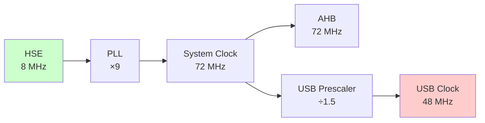
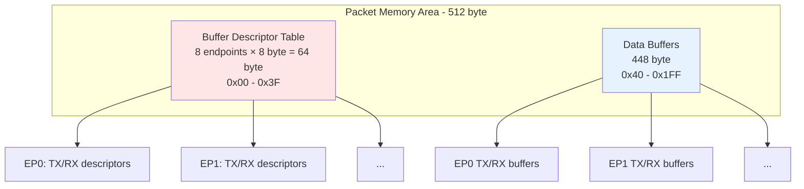
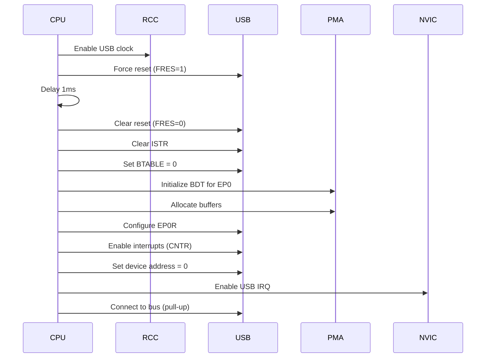

## Mục lục

1. [Tổng quan STM32F103 USB](#tổng-quan-stm32f103-usb)
2. [Bước 1: Cấu hình Hardware](#bước-1-cấu-hình-hardware)
3. [Bước 2: Hiểu về USB Registers](#bước-2-hiểu-về-usb-registers)
4. [Bước 3: Packet Memory Area (PMA)](#bước-3-packet-memory-area-pma)
 
## Tổng quan STM32F103 USB

STM32F103 tích hợp USB 2.0 Full Speed Device peripheral với các đặc điểm:

| Thông số | Giá trị | Ghi chú |
|----------|---------|---------|
| **Tốc độ** | Full Speed (12 Mbps) | Không hỗ trợ High Speed |
| **Số endpoints** | 8 (EP0-EP7) | EP0 bắt buộc cho control |
| **Packet Buffer Memory** | 512 byte | SRAM riêng, truy cập đặc biệt |
| **DMA** | Không hỗ trợ | Phải dùng CPU copy |
| **Pins** | PA11 (D-), PA12 (D+) | Chân cố định, không remap được |
| **Clock** | 48 MHz ±0.25% | Phải chính xác tuyệt đối |
| **Pull-up** | 1.5kΩ trên D+ | Có thể dùng internal hoặc external |
 
## Bước 1: Cấu hình hardware
 
### 1.1. Sơ đồ kết nối chân
 
```
┌──────────────────────────────────────────┐
│                                          │
│  PA12 (USB_DP) ──┬── 1.5kΩ ──── +3.3V    │ ← Pull-up resistor
│                  │                       │
│                  └────────────── USB D+  │
│                                          │
│  PA11 (USB_DM) ──────────────── USB D-   │
│                                          │
│  GND ────────────────────────── USB GND  │
│                                          │
│  +5V ────────────────────────── USB VCC  │
│      (hoặc dùng nguồn riêng)             │
└──────────────────────────────────────────┘
```

:::warning Lưu ý quan trọng
- Pull-up resistor 1.5kΩ trên D+ báo cho host biết đây là full speed device
- PA12 có thể dùng internal pull-up (nếu có) hoặc external resistor
- Một số board Blue Pill có pull-up 10kΩ $\rightarrow$ host không nhận diện $\rightarrow$ cần thay bằng 1.5kΩ
:::

### 1.2. Oscillator và Clock
 
USB **bắt buộc** phải có clock 48MHz với độ chính xác ±0.25%.



**Code cấu hình clock:**

```c
void SystemClock_Config(void)
{
    RCC_OscInitTypeDef RCC_OscInitStruct = {0};
    RCC_ClkInitTypeDef RCC_ClkInitStruct = {0};
 
    // 1. Cấu hình HSE và PLL
    RCC_OscInitStruct.OscillatorType = RCC_OSCILLATORTYPE_HSE;
    RCC_OscInitStruct.HSEState = RCC_HSE_ON;
    RCC_OscInitStruct.HSEPredivValue = RCC_HSE_PREDIV_DIV1;
    RCC_OscInitStruct.PLL.PLLState = RCC_PLL_ON;
    RCC_OscInitStruct.PLL.PLLSource = RCC_PLLSOURCE_HSE;
    RCC_OscInitStruct.PLL.PLLMUL = RCC_PLL_MUL9;  // 8MHz × 9 = 72MHz
    HAL_RCC_OscConfig(&RCC_OscInitStruct);
 
    // 2. Cấu hình System Clock
    RCC_ClkInitStruct.ClockType = RCC_CLOCKTYPE_HCLK | RCC_CLOCKTYPE_SYSCLK |
                                  RCC_CLOCKTYPE_PCLK1 | RCC_CLOCKTYPE_PCLK2;
    RCC_ClkInitStruct.SYSCLKSource = RCC_SYSCLKSOURCE_PLLCLK;
    RCC_ClkInitStruct.AHBCLKDivider = RCC_SYSCLK_DIV1;     // 72MHz
    RCC_ClkInitStruct.APB1CLKDivider = RCC_HCLK_DIV2;      // 36MHz
    RCC_ClkInitStruct.APB2CLKDivider = RCC_HCLK_DIV1;      // 72MHz
    HAL_RCC_ClockConfig(&RCC_ClkInitStruct, FLASH_LATENCY_2);
 
    // 3. Enable USB Clock (72MHz / 1.5 = 48MHz)
    __HAL_RCC_USB_CLK_ENABLE();
}
```

**Kiểm tra clock:**

```c
// Verify USB clock = 48MHz
uint32_t usb_freq = HAL_RCC_GetPCLK1Freq() * 2 / 1.5;
assert(usb_freq == 48000000);  // Must be exactly 48MHz
```

## Bước 2: Hiểu về USB Registers

### 2.1. Danh sách các thanh ghi
 
STM32F103 có các nhóm register chính:

| Thanh ghi | Offset | Mô tả | Truy cập |
|-----------|--------|-------|----------|
| USB_EP0R | 0x00 | Endpoint 0 Register | R/W |
| USB_EP1R | 0x04 | Endpoint 1 Register | R/W |
| ... | ... | ... | ... |
| USB_EP7R | 0x1C | Endpoint 7 Register | R/W |
| USB_CNTR | 0x40 | Control Register | R/W |
| USB_ISTR | 0x44 | Interrupt Status Register | R/W |
| USB_FNR | 0x48 | Frame Number Register | R |
| USB_DADDR | 0x4C | Device Address Register | R/W |
| USB_BTABLE | 0x50 | Buffer Table Address | R/W |
 
### 2.2. USB_CNTR - Control Register

**Offset:** 0x40  
**Reset value:** 0x0003 (FRES=1, PDWN=1)
 
| Bit | Tên | R/W | Mô tả |
|-----|-----|-----|-------|
| 15 | CTRM | R/W | Correct Transfer Interrupt Mask<br/>1 = Enable interrupt khi CTR=1 |
| 14 | PMAOVRM | R/W | Packet Memory Area Over/Underrun Mask |
| 13 | ERRM | R/W | Error Interrupt Mask |
| 12 | WKUPM | R/W | Wakeup Interrupt Mask |
| 11 | SUSPM | R/W | Suspend Mode Interrupt Mask |
| 10 | RESETM | R/W | Reset Interrupt Mask |
| 9 | SOFM | R/W | Start of Frame Interrupt Mask |
| 8 | ESOFM | R/W | Expected Start of Frame Interrupt Mask |
| 7:4 | - | - | Reserved |
| 3 | RESUME | W | Resume Request (self-clear) |
| 2 | FSUSP | R/W | Force Suspend |
| 1 | PDWN | R/W | Power Down<br/>1 = USB peripheral powered down |
| 0 | FRES | R/W | Force USB Reset<br/>1 = Reset USB peripheral |
 
### 2.3. USB_ISTR - Interrupt Status Register

**Offset:** 0x44  
**Reset value:** 0x0000

| Bit | Tên | R/W | Mô tả |
|-----|-----|-----|-------|
| 15 | CTR | R | Correct Transfer<br/>1 = Transaction hoàn thành |
| 14 | PMAOVR | RC_W0 | Packet Memory Area Over/Underrun |
| 13 | ERR | RC_W0 | Error (timeout, CRC, bit stuffing) |
| 12 | WKUP | RC_W0 | Wakeup |
| 11 | SUSP | RC_W0 | Suspend |
| 10 | RESET | RC_W0 | Reset |
| 9 | SOF | RC_W0 | Start of Frame |
| 8 | ESOF | RC_W0 | Expected Start of Frame |
| 7:5 | - | - | Reserved |
| 4:0 | EP_ID | R | Endpoint Identifier (0-7) |

:::warning Lưu ý
RC_W0 = Read, Clear by writing 0
:::

**Ví dụ xử lý interrupt:**
 
```c
void USB_LP_CAN1_RX0_IRQHandler(void)
{
    uint16_t istr = USB->ISTR;
    
    // 1. USB Reset
    if (istr & USB_ISTR_RESET) {
        USB_HandleReset();
        USB->ISTR = ~USB_ISTR_RESET;  // Clear by writing 0
    }
    
    // 2. Correct Transfer (CTR)
    if (istr & USB_ISTR_CTR) {
        uint8_t ep_id = istr & USB_ISTR_EP_ID;
        USB_HandleTransfer(ep_id);
        // CTR không clear ở đây, clear trong endpoint handler
    }

    // 3. Suspend
    if (istr & USB_ISTR_SUSP) {
        USB_HandleSuspend();
        USB->ISTR = ~USB_ISTR_SUSP;
    }
    
    // 4. Wakeup
    if (istr & USB_ISTR_WKUP) {
        USB_HandleWakeup();
        USB->ISTR = ~USB_ISTR_WKUP;
    }
}
```

### 2.4. USB_EPnR - Endpoint Register

**Offset:** 0x00 + (n × 4), n = 0..7  
**Reset value:** 0x0000

| Bit(s) | Tên | Type | Mô tả |
|--------|-----|------|-------|
| 15 | CTR_RX | RC_W0 | Correct Transfer for RX<br/>1 = RX transaction thành công |
| 14 | DTOG_RX | T | Data Toggle for RX<br/>- 0 = Expect DATA0<br/>- 1 = Expect DATA1 |
| 13:12 | STAT_RX[1:0] | T | RX Status (toggle bits)<br/>- 00=DISABLED<br/>- 01=STALL<br/>- 10=NAK<br/>- 11=VALID |
| 11 | SETUP | R | Setup Transaction Completed<br/>1 = Setup packet received (EP0 only) |
| 10:9 | EP_TYPE[1:0] | R/W | Endpoint Type<br/>- 00=BULK<br/>- 01=CONTROL<br/>- 10=ISO<br/>- 11=INTERRUPT |
| 8 | EP_KIND | R/W | Endpoint Kind (depends on EP_TYPE) |
| 7 | CTR_TX | RC_W0 | Correct Transfer for TX<br/>1 = TX transaction thành công |
| 6 | DTOG_TX | T | Data Toggle for TX<br/>- 0 = Send DATA0<br/>- 1 = Send DATA1 |
| 5:4 | STAT_TX[1:0] | T | TX Status (toggle bits)<br/>- 00=DISABLED<br/>- 01=STALL<br/>- 10=NAK<br/>- 11=VALID |
| 3:0 | EA[3:0] | R/W | Endpoint Address (0-15) |
 
**Chú thích type:**
- **R**: Read only
- **W**: Write only
- **R/W**: Read/Write
- **RC_W0**: Read, Clear by writing 0
- **T**: Toggle bits (đặc biệt, xem bên dưới)

#### 2.4.1. Toggle bits (STAT_TX, STAT_RX, DTOG_TX, DTOG_RX)
 
Toggle bits **KHÔNG THỂ** ghi trực tiếp. Phải dùng cơ chế XOR để thay đổi:

Công thức: `New_Value = Old_Value XOR Write_Value`

**Bảng STAT_RX/STAT_TX:**
 
| Giá trị | Tên | Ý nghĩa |
|---------|-----|---------|
| 00 | DISABLED | Endpoint bị vô hiệu hóa |
| 01 | STALL | Endpoint trả STALL (lỗi) |
| 10 | NAK | Endpoint trả NAK (chưa sẵn sàng) |
| 11 | VALID | Endpoint sẵn sàng TX/RX |
 
**Bảng chuyển đổi trạng thái:**
 
Để chuyển từ trạng thái cũ sang trạng thái mới, phải XOR với giá trị trong bảng:
 
| Từ ↓ / Đến → | DISABLED (00) | STALL (01) | NAK (10) | VALID (11) |
|---------------|---------------|------------|----------|------------|
| **DISABLED (00)** | 00 (no change) | 01 | 10 | 11 |
| **STALL (01)** | 01 | 00 (no change) | 11 | 10 |
| **NAK (10)** | 10 | 11 | 00 (no change) | 01 |
| **VALID (11)** | 11 | 10 | 01 | 00 (no change) |
 
**Ví dụ:** Để chuyển STAT_RX từ NAK (10) → VALID (11):

```
Old value = 10 (NAK)
Want = 11 (VALID)
XOR value = 10 XOR 11 = 01
→ Ghi STAT_RX = 01
```
 
#### 2.4.2. Các bit cần giữ khi ghi EPnR
  
Khi ghi vào USB_EPnR, **PHẢI** giữ các bit sau (vì có thể bị hardware thay đổi):
- **CTR_RX** (bit 15): RC_W0 - Phải ghi 0 để clear
- **CTR_TX** (bit 7): RC_W0 - Phải ghi 0 để clear
- **DTOG_RX** (bit 14): Toggle - Giữ nguyên nếu không muốn thay đổi
- **DTOG_TX** (bit 6): Toggle - Giữ nguyên nếu không muốn thay đổi
- **STAT_RX** (bits 13:12): Toggle - Dùng XOR
- **STAT_TX** (bits 5:4): Toggle - Dùng XOR

**Mask để giữ:**

```c
#define USB_EPREG_MASK  (USB_EP_CTR_RX | USB_EP_SETUP | \
                         USB_EP_T_FIELD | USB_EP_KIND | \
                         USB_EP_CTR_TX | USB_EPADDR_FIELD)
// = 0x870F (giữ tất cả ngoại trừ toggle bits)
```

**Template ghi EPnR an toàn:**

```c
// Đọc giá trị hiện tại
uint16_t reg = USB->EPnR;
 
// Giữ lại các bits cố định, clear CTR_RX và CTR_TX
reg &= USB_EPREG_MASK;
 
// XOR với giá trị mới cho toggle bits
reg ^= new_toggle_value;
 
// Ghi lại
USB->EPnR = reg;
```

### 2.5. USB_DADDR - Device Address Register
 
**Offset:** 0x4C  
**Reset value:** 0x0000
 
| Bit(s) | Tên | R/W | Mô tả |
|--------|-----|-----|-------|
| 15:8 | - | - | Reserved |
| 7 | EF | R/W | Enable Function<br/>0 = USB disabled<br/>1 = USB enabled |
| 6:0 | ADD[6:0] | R/W | Device Address (0-127) |
 
**Sử dụng:**
 
```c
// Enable USB function với address 0
USB->DADDR = USB_DADDR_EF | 0x00;
 
// Set address sau khi nhận SET_ADDRESS
USB->DADDR = USB_DADDR_EF | new_address;
```
 
### 2.6. USB_BTABLE - Buffer Table Register
 
**Offset:** 0x50  
**Reset value:** 0x0000
 
| Bit(s) | Tên | R/W | Mô tả |
|--------|-----|-----|-------|
| 15:3 | BTABLE[12:0] | R/W | Buffer Table offset (must be aligned to 8 byte) |
| 2:0 | - | - | Reserved (always 0) |
 
**Thông thường:** BTABLE = 0x0000 (bắt đầu từ đầu PMA)
 
## Bước 3: Packet Memory Area (PMA)
 
### 3.1. Tổng quan PMA
 
Packet Memory Area là **SRAM 512 byte riêng biệt** dành cho USB, không nằm trong SRAM chính.
 
**Đặc điểm:**
- Kích thước: 512 byte
- Base address: 0x40006000
- Truy cập đặc biệt: 16-bit aligned, chỉ sử dụng lower byte
- Mỗi byte chiếm 2 byte (word) trong memory


 
### 3.2. Buffer Descriptor Table

Mỗi endpoint có 2 descriptor (TX và RX), mỗi descriptor 4 byte:

```
Offset trong BDT:
EP0: 0x00 (TX), 0x04 (RX)
EP1: 0x08 (TX), 0x0C (RX)
EP2: 0x10 (TX), 0x14 (RX)
...
EP7: 0x38 (TX), 0x3C (RX)
```
 
**Cấu trúc mỗi descriptor:**
 
| Offset | Tên | Mô tả |
|--------|-----|-------|
| +0 | ADDRn_TX/RX | Buffer address (offset trong PMA) |
| +2 | COUNTn_TX/RX | Byte count |
 
### 3.3. TX Descriptor (ADDRn_TX, COUNTn_TX)
 
**ADDRn_TX** (16-bit):

| Bit(s) | Tên | Mô tả |
|--------|-----|-------|
| 15:1 | ADDRn_TX[15:1] | Buffer address (aligned to 2 byte) |
| 0 | - | Reserved (always 0) |
 
**COUNTn_TX** (16-bit):

| Bit(s) | Tên | Mô tả |
|--------|-----|-------|
| 15:10 | - | Reserved |
| 9:0 | COUNTn_TX[9:0] | Number of bytes to transmit (0-1023) |
 
### 3.4. RX Descriptor (ADDRn_RX, COUNTn_RX)
 
**ADDRn_RX** (16-bit):

| Bit(s) | Tên | Mô tả |
|--------|-----|-------|
| 15:1 | ADDRn_RX[15:1] | Buffer address (aligned to 2 byte) |
| 0 | - | Reserved (always 0) |
 
**COUNTn_RX** (16-bit):
 
Có 2 format tùy thuộc buffer size:
 
**Format 1: Buffer size ≤ 62 byte**

```
┌───┬─────────────┬───────────────┐
│15 │   14:10     │     9:0       │
├───┼─────────────┼───────────────┤
│ 0 │ NUM_BLOCK   │  COUNT (R)    │
└───┴─────────────┴───────────────┘
 
NUM_BLOCK[4:0] = (buffer_size / 2) - 1
COUNT[9:0] = Số byte nhận được (hardware update)

Ví dụ: Buffer 32 byte
  NUM_BLOCK = (32 / 2) - 1 = 15 = 0x0F
  COUNTn_RX = 0x0000 | (15 << 10) = 0x3C00
```


**Format 2: Buffer size > 62 byte**

```
┌───┬─────────────┬───────────────┐
│15 │   14:10     │     9:0       │
├───┼─────────────┼───────────────┤
│ 1 │ NUM_BLOCK   │  COUNT (R)    │
└───┴─────────────┴───────────────┘
 
NUM_BLOCK[4:0] = (buffer_size / 32) - 1
COUNT[9:0] = Số byte nhận được (hardware update)

Ví dụ: Buffer 64 byte
  NUM_BLOCK = (64 / 32) - 1 = 1
  COUNTn_RX = 0x8000 | (1 << 10) = 0x8400
```

**Bảng tính NUM_BLOCK:**
 
| Buffer Size | Format | NUM_BLOCK | COUNTn_RX (initial) |
|-------------|--------|-----------|---------------------|
| 2 byte | 1 | 0 | 0x0000 |
| 32 byte | 1 | 15 | 0x3C00 |
| 62 byte | 1 | 30 | 0x7800 |
| 64 byte | 2 | 1 | 0x8400 |
| 96 byte | 2 | 2 | 0x8800 |
| 128 byte | 2 | 3 | 0x8C00 |
| 256 byte | 2 | 7 | 0x9C00 |
| 512 byte | 2 | 15 | 0xBC00 |
 
### 3.5. Truy cập PMA
 
⚠️ **PMA không truy cập như SRAM bình thường!**
 
Mỗi byte data chiếm **2 byte (word)** trong PMA, chỉ sử dụng **lower byte**.

```
Physical PMA layout:
┌──────────┬──────────┬──────────┬──────────┐
│ Byte 0   │    XX    │ Byte 1   │    XX    │
│ (16 bit) │ (unused) │ (16 bit) │ (unused) │
└──────────┴──────────┴──────────┴──────────┘
0x00       0x02       0x04       0x06
```

**Ví dụ cụ thể:**
 
Để lưu 4 byte data `{0x12, 0x34, 0x56, 0x78}` vào PMA offset 0x40:
 
```
PMA[0x40] = 0x0012  // Byte 0
PMA[0x42] = 0x0034  // Byte 1
PMA[0x44] = 0x0056  // Byte 2
PMA[0x46] = 0x0078  // Byte 3
```
 
**Code truy cập PMA:**
 
```c
#define USB_PMAADDR  0x40006000UL

static inline uint16_t* PMA_GetAddr(uint16_t offset)
{
    return (uint16_t *)(USB_PMAADDR + (offset << 1));
}

// Ghi 1 byte vào PMA
void PMA_WriteByte(uint16_t offset, uint8_t data)
{
    *PMA_GetAddr(offset) = data;
}

// Đọc 1 byte từ PMA
uint8_t PMA_ReadByte(uint16_t offset)
{
    return (uint8_t)(*PMA_GetAddr(offset));
}

// Ghi buffer vào PMA
void PMA_WriteBuffer(uint16_t pma_offset, const uint8_t *buf, uint16_t len)
{
    uint16_t *pma = PMA_GetAddr(pma_offset);
    
    for (uint16_t i = 0; i < len; i++) {
        *pma++ = buf[i];
    }
}
 
// Đọc buffer từ PMA
void PMA_ReadBuffer(uint16_t pma_offset, uint8_t *buf, uint16_t len)
{
    uint16_t *pma = PMA_GetAddr(pma_offset);
    
    for (uint16_t i = 0; i < len; i++) {
        buf[i] = (uint8_t)(*pma++);
    }
}
```

**Tối ưu:**

Vì USB buffer thường chẵn (2/4/8/16/32/64), có thể tối ưu bằng word copy:
 
```c
void PMA_Write(uint16_t pma_offset, const uint8_t *buf, uint16_t len)
{
    uint16_t *pma = PMA_GetAddr(pma_offset);
    uint16_t n = (len + 1) >> 1;  // Round up to words
    
    for (uint16_t i = 0; i < n; i++) {
        uint16_t word = buf[i * 2] | (buf[i * 2 + 1] << 8);
        *pma++ = word;
    }
}
```

### 3.6. Layout ví dụ PMA cho USB HID Mouse

```
┌─────────────────────────────────────────────────┐
│  Buffer Descriptor Table (64 byte)              │
├─────────────────────────────────────────────────┤
│  0x00: EP0 TX ADDR = 0x40                       │
│  0x02: EP0 TX COUNT = 0x0000                    │
│  0x04: EP0 RX ADDR = 0x80                       │
│  0x06: EP0 RX COUNT = 0x8400 (64 byte buf)      │
├─────────────────────────────────────────────────┤
│  0x08: EP1 TX ADDR = 0xC0                       │
│  0x0A: EP1 TX COUNT = 0x0000                    │
│  0x0C: EP1 RX ADDR = 0x0000 (không dùng)        │
│  0x0E: EP1 RX COUNT = 0x0000                    │
├─────────────────────────────────────────────────┤
│  0x10-0x3F: EP2-EP7 (không dùng)                │
└─────────────────────────────────────────────────┘
┌─────────────────────────────────────────────────┐
│  Data Buffers (448 byte)                        │
├─────────────────────────────────────────────────┤
│  0x40-0x7F: EP0 TX Buffer (64 byte)             │
│  0x80-0xBF: EP0 RX Buffer (64 byte)             │
│  0xC0-0xC7: EP1 TX Buffer (8 byte - HID report) │
│  0xC8-0x1FF: Unused (312 byte)                  │
└─────────────────────────────────────────────────┘
```

## Bước 4: Khởi tạo USB Peripheral


