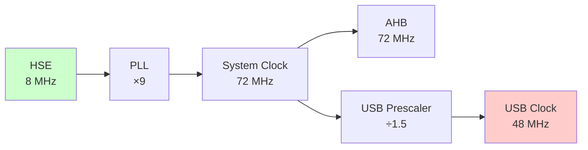
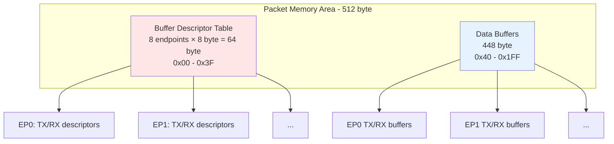
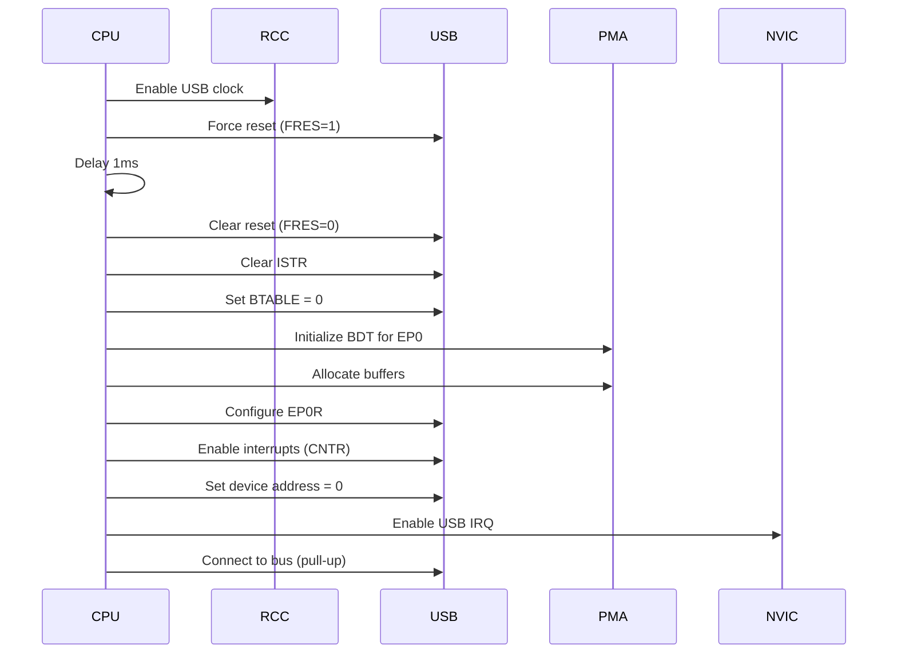

## Mục lục

1. [Tổng quan STM32F103 USB](#tổng-quan-stm32f103-usb)
2. [Bước 1: Cấu hình Hardware](#bước-1-cấu-hình-hardware)
3. [Bước 2: Hiểu về USB Registers](#bước-2-hiểu-về-usb-registers)
4. [Bước 3: Packet Memory Area (PMA)](#bước-3-packet-memory-area-pma)
5. [Bước 4: Thao tác với endpoint](#bước-4-thao-tác-với-endpoint)
6. [Bước 5: Khởi tạo USB Peripheral](#bước-5-khởi-tạo-usb-peripheral)
7. [Bước 6: Xử lý USB Event](#bước-6-xử-lý-usb-event)
8. [Bước 7: Xử lý Control Transfer](#bước-7-xử-lý-control-transfer)
9. [Tool debug](#tool-debug)

## Tổng quan STM32F103 USB

STM32F103 tích hợp USB 2.0 Full Speed Device peripheral với các đặc điểm:

| Thông số | Giá trị | Ghi chú |
|----------|---------|---------|
| **Tốc độ** | Full Speed (12 Mbps) | Không hỗ trợ High Speed |
| **Số endpoints** | 8 (EP0-EP7) | EP0 bắt buộc cho control |
| **Packet Buffer Memory** | 512 byte | SRAM riêng, truy cập đặc biệt |
| **DMA** | Không hỗ trợ | Phải dùng CPU copy |
| **Pins** | PA11 (D-), PA12 (D+) | Chân cố định, không remap được |
| **Clock** | 48 MHz ±0.25% | Phải chính xác tuyệt đối |
| **Pull-up** | 1.5kΩ trên D+ | Có thể dùng internal hoặc external |
 
## Bước 1: Cấu hình hardware
 
### 1.1. Sơ đồ kết nối chân
 
```
┌──────────────────────────────────────────┐
│                                          │
│  PA12 (USB_DP) ──┬── 1.5kΩ ──── +3.3V    │ ← Pull-up resistor
│                  │                       │
│                  └────────────── USB D+  │
│                                          │
│  PA11 (USB_DM) ──────────────── USB D-   │
│                                          │
│  GND ────────────────────────── USB GND  │
│                                          │
│  +5V ────────────────────────── USB VCC  │
│      (hoặc dùng nguồn riêng)             │
└──────────────────────────────────────────┘
```

:::warning Lưu ý quan trọng
- Pull-up resistor 1.5kΩ trên D+ báo cho host biết đây là full speed device
- PA12 có thể dùng internal pull-up (nếu có) hoặc external resistor
- Một số board Blue Pill có pull-up 10kΩ $\rightarrow$ host không nhận diện $\rightarrow$ cần thay bằng 1.5kΩ
:::

### 1.2. Oscillator và Clock
 
USB **bắt buộc** phải có clock 48MHz với độ chính xác ±0.25%.



**Code cấu hình clock:**

```c
void SystemClock_Config(void)
{
    RCC_OscInitTypeDef RCC_OscInitStruct = {0};
    RCC_ClkInitTypeDef RCC_ClkInitStruct = {0};
 
    // 1. Cấu hình HSE và PLL
    RCC_OscInitStruct.OscillatorType = RCC_OSCILLATORTYPE_HSE;
    RCC_OscInitStruct.HSEState = RCC_HSE_ON;
    RCC_OscInitStruct.HSEPredivValue = RCC_HSE_PREDIV_DIV1;
    RCC_OscInitStruct.PLL.PLLState = RCC_PLL_ON;
    RCC_OscInitStruct.PLL.PLLSource = RCC_PLLSOURCE_HSE;
    RCC_OscInitStruct.PLL.PLLMUL = RCC_PLL_MUL9;  // 8MHz × 9 = 72MHz
    HAL_RCC_OscConfig(&RCC_OscInitStruct);
 
    // 2. Cấu hình System Clock
    RCC_ClkInitStruct.ClockType = RCC_CLOCKTYPE_HCLK | RCC_CLOCKTYPE_SYSCLK |
                                  RCC_CLOCKTYPE_PCLK1 | RCC_CLOCKTYPE_PCLK2;
    RCC_ClkInitStruct.SYSCLKSource = RCC_SYSCLKSOURCE_PLLCLK;
    RCC_ClkInitStruct.AHBCLKDivider = RCC_SYSCLK_DIV1;     // 72MHz
    RCC_ClkInitStruct.APB1CLKDivider = RCC_HCLK_DIV2;      // 36MHz
    RCC_ClkInitStruct.APB2CLKDivider = RCC_HCLK_DIV1;      // 72MHz
    HAL_RCC_ClockConfig(&RCC_ClkInitStruct, FLASH_LATENCY_2);
 
    // 3. Enable USB Clock (72MHz / 1.5 = 48MHz)
    __HAL_RCC_USB_CLK_ENABLE();
}
```

**Kiểm tra clock:**

```c
// Verify USB clock = 48MHz
uint32_t usb_freq = HAL_RCC_GetPCLK1Freq() * 2 / 1.5;
assert(usb_freq == 48000000);  // Must be exactly 48MHz
```

## Bước 2: Hiểu về USB Registers

### 2.1. Danh sách các thanh ghi
 
STM32F103 có các nhóm register chính:

| Thanh ghi | Offset | Mô tả | Truy cập |
|-----------|--------|-------|----------|
| USB_EP0R | 0x00 | Endpoint 0 Register | R/W |
| USB_EP1R | 0x04 | Endpoint 1 Register | R/W |
| ... | ... | ... | ... |
| USB_EP7R | 0x1C | Endpoint 7 Register | R/W |
| USB_CNTR | 0x40 | Control Register | R/W |
| USB_ISTR | 0x44 | Interrupt Status Register | R/W |
| USB_FNR | 0x48 | Frame Number Register | R |
| USB_DADDR | 0x4C | Device Address Register | R/W |
| USB_BTABLE | 0x50 | Buffer Table Address | R/W |
 
### 2.2. USB_CNTR - Control Register

**Offset:** 0x40  
**Reset value:** 0x0003 (FRES=1, PDWN=1)
 
| Bit | Tên | R/W | Mô tả |
|-----|-----|-----|-------|
| 15 | CTRM | R/W | Correct Transfer Interrupt Mask<br/>1 = Enable interrupt khi CTR=1 |
| 14 | PMAOVRM | R/W | Packet Memory Area Over/Underrun Mask |
| 13 | ERRM | R/W | Error Interrupt Mask |
| 12 | WKUPM | R/W | Wakeup Interrupt Mask |
| 11 | SUSPM | R/W | Suspend Mode Interrupt Mask |
| 10 | RESETM | R/W | Reset Interrupt Mask |
| 9 | SOFM | R/W | Start of Frame Interrupt Mask |
| 8 | ESOFM | R/W | Expected Start of Frame Interrupt Mask |
| 7:4 | - | - | Reserved |
| 3 | RESUME | W | Resume Request (self-clear) |
| 2 | FSUSP | R/W | Force Suspend |
| 1 | PDWN | R/W | Power Down<br/>1 = USB peripheral powered down |
| 0 | FRES | R/W | Force USB Reset<br/>1 = Reset USB peripheral |
 
### 2.3. USB_ISTR - Interrupt Status Register

**Offset:** 0x44  
**Reset value:** 0x0000

| Bit | Tên | R/W | Mô tả |
|-----|-----|-----|-------|
| 15 | CTR | R | Correct Transfer<br/>1 = Transaction hoàn thành |
| 14 | PMAOVR | RC_W0 | Packet Memory Area Over/Underrun |
| 13 | ERR | RC_W0 | Error (timeout, CRC, bit stuffing) |
| 12 | WKUP | RC_W0 | Wakeup |
| 11 | SUSP | RC_W0 | Suspend |
| 10 | RESET | RC_W0 | Reset |
| 9 | SOF | RC_W0 | Start of Frame |
| 8 | ESOF | RC_W0 | Expected Start of Frame |
| 7:5 | - | - | Reserved |
| 4:0 | EP_ID | R | Endpoint Identifier (0-7) |

:::warning Lưu ý
RC_W0 = Read, Clear by writing 0
:::

### 2.4. USB_EPnR - Endpoint Register

**Offset:** 0x00 + (n × 4), n = 0..7  
**Reset value:** 0x0000

| Bit(s) | Tên | Type | Mô tả |
|--------|-----|------|-------|
| 15 | CTR_RX | RC_W0 | Correct Transfer for RX<br/>1 = RX transaction thành công |
| 14 | DTOG_RX | T | Data Toggle for RX<br/>- 0 = Expect DATA0<br/>- 1 = Expect DATA1 |
| 13:12 | STAT_RX[1:0] | T | RX Status (toggle bits)<br/>- 00=DISABLED<br/>- 01=STALL<br/>- 10=NAK<br/>- 11=VALID |
| 11 | SETUP | R | Setup Transaction Completed<br/>1 = Setup packet received (EP0 only) |
| 10:9 | EP_TYPE[1:0] | R/W | Endpoint Type<br/>- 00=BULK<br/>- 01=CONTROL<br/>- 10=ISO<br/>- 11=INTERRUPT |
| 8 | EP_KIND | R/W | Endpoint Kind (depends on EP_TYPE) |
| 7 | CTR_TX | RC_W0 | Correct Transfer for TX<br/>1 = TX transaction thành công |
| 6 | DTOG_TX | T | Data Toggle for TX<br/>- 0 = Send DATA0<br/>- 1 = Send DATA1 |
| 5:4 | STAT_TX[1:0] | T | TX Status (toggle bits)<br/>- 00=DISABLED<br/>- 01=STALL<br/>- 10=NAK<br/>- 11=VALID |
| 3:0 | EA[3:0] | R/W | Endpoint Address (0-15) |
 
**Chú thích type:**
- **R**: Read only
- **W**: Write only
- **R/W**: Read/Write
- **RC_W0**: Read, Clear by writing 0
- **T**: Toggle bits (đặc biệt, xem bên dưới)

#### 2.4.1. Toggle bits (STAT_TX, STAT_RX, DTOG_TX, DTOG_RX)
 
Toggle bits **KHÔNG THỂ** ghi trực tiếp. Phải dùng cơ chế XOR để thay đổi:

Công thức: `New_Value = Old_Value XOR Write_Value`

**Bảng STAT_RX/STAT_TX:**
 
| Giá trị | Tên | Ý nghĩa |
|---------|-----|---------|
| 00 | DISABLED | Endpoint bị vô hiệu hóa |
| 01 | STALL | Endpoint trả STALL (lỗi) |
| 10 | NAK | Endpoint trả NAK (chưa sẵn sàng) |
| 11 | VALID | Endpoint sẵn sàng TX/RX |
 
**Bảng chuyển đổi trạng thái:**
 
Để chuyển từ trạng thái cũ sang trạng thái mới, phải XOR với giá trị trong bảng:
 
| Từ ↓ / Đến → | DISABLED (00) | STALL (01) | NAK (10) | VALID (11) |
|---------------|---------------|------------|----------|------------|
| **DISABLED (00)** | 00 (no change) | 01 | 10 | 11 |
| **STALL (01)** | 01 | 00 (no change) | 11 | 10 |
| **NAK (10)** | 10 | 11 | 00 (no change) | 01 |
| **VALID (11)** | 11 | 10 | 01 | 00 (no change) |
 
**Ví dụ:** Để chuyển STAT_RX từ NAK (10) → VALID (11):

```
Old value = 10 (NAK)
Want = 11 (VALID)
XOR value = 10 XOR 11 = 01
→ Ghi STAT_RX = 01
```
 
#### 2.4.2. Xây dựng code để thao tác các bit trong thanh ghi

Khi ghi vào thanh ghi `USB_EPnR`, ta cần sử dụng bit mask để giữ các bit sau:

```c
#define USB_EPREG_MASK  (USB_EP_CTR_RX | USB_EP_SETUP | \
                         USB_EP_EP_TYPE | USB_EP_KIND | \
                         USB_EP_CTR_TX | USB_EP_EA)
// = 0x8F8F
```

Template ghi EPnR an toàn:

```c
#define EP_RX_DIS    0x0000  // 00: Disabled
#define EP_RX_STALL  0x1000  // 01: Stall
#define EP_RX_NAK    0x2000  // 10: NAK
#define EP_RX_VALID  0x3000  // 11: Valid

static inline void USB_SetRxStatus (uint8_t ep, uint16_t status)
{
    // Đọc giá trị hiện tại
    uint16_t reg = USB->EPnR[ep].WORD;
    
    // Giữ lại các bits cố định
    reg &= USB_EPREG_MASK;

    // XOR với giá trị mới
    reg ^= status;

    // Ghi lại
    USB->EPnR[ep].WORD = reg;
}
```

Tương tự như vậy ta sẽ triển khai các API thao tác với các bit khác trong thanh ghi EPnR:

```c
static inline void USB_SetRxStatus(uint8_t ep, uint16_t status);
static inline void USB_SetTxStatus(uint8_t ep, uint16_t status);
static inline void USB_SetToggleRxData(uint8_t ep, uint16_t toggle);
static inline void USB_SetToggleTxData(uint8_t ep, uint16_t toggle);
static inline void USB_ClearRxFlag(uint8_t ep);
static inline void USB_ClearTxFlag(uint8_t ep);
```

### 2.5. USB_DADDR - Device Address Register
 
**Offset:** 0x4C  
**Reset value:** 0x0000
 
| Bit(s) | Tên | R/W | Mô tả |
|--------|-----|-----|-------|
| 15:8 | - | - | Reserved |
| 7 | EF | R/W | Enable Function<br/>0 = USB disabled<br/>1 = USB enabled |
| 6:0 | ADD[6:0] | R/W | Device Address (0-127) |
 
**Sử dụng:**
 
```c
// Enable USB function với address 0
USB->DADDR = USB_DADDR_EF | 0x00;
 
// Set address sau khi nhận SET_ADDRESS
USB->DADDR = USB_DADDR_EF | new_address;
```
 
### 2.6. USB_BTABLE - Buffer Table Register
 
**Offset:** 0x50  
**Reset value:** 0x0000
 
| Bit(s) | Tên | R/W | Mô tả |
|--------|-----|-----|-------|
| 15:3 | BTABLE[12:0] | R/W | Buffer Table offset (must be aligned to 8 byte) |
| 2:0 | - | - | Reserved (always 0) |
 
**Thông thường:** BTABLE = 0x0000 (bắt đầu từ đầu PMA)
 
## Bước 3: Packet Memory Area (PMA)
 
### 3.1. Tổng quan PMA
 
Packet Memory Area là **SRAM 512 byte riêng biệt** dành cho USB, không nằm trong SRAM chính.
 
**Đặc điểm:**
- Kích thước: 512 byte
- Base address: 0x40006000
- Truy cập đặc biệt: 16-bit aligned, chỉ sử dụng lower byte
- Mỗi byte chiếm 2 byte (word) trong memory


 
### 3.2. Buffer Descriptor Table

Mỗi endpoint có 2 descriptor (TX và RX), mỗi descriptor 4 byte:

```
Offset trong BDT:
EP0: 0x00 (TX), 0x04 (RX)
EP1: 0x08 (TX), 0x0C (RX)
EP2: 0x10 (TX), 0x14 (RX)
...
EP7: 0x38 (TX), 0x3C (RX)
```
 
**Cấu trúc mỗi descriptor:**
 
| Offset | Tên | Mô tả |
|--------|-----|-------|
| +0 | ADDRn_TX/RX | Buffer address (offset trong PMA) |
| +2 | COUNTn_TX/RX | Byte count |
 
#### 3.2.1. TX Descriptor
 
**ADDRn_TX** (16-bit):

| Bit(s) | Tên | Mô tả |
|--------|-----|-------|
| 15:1 | ADDRn_TX[15:1] | Buffer address (aligned to 2 byte) |
| 0 | - | Reserved (always 0) |
 
**COUNTn_TX** (16-bit):

| Bit(s) | Tên | Mô tả |
|--------|-----|-------|
| 15:10 | - | Reserved |
| 9:0 | COUNTn_TX[9:0] | Number of bytes to transmit (0-1023) |
 
#### 3.2.2. RX Descriptor

**ADDRn_RX** (16-bit):

| Bit(s) | Tên | Mô tả |
|--------|-----|-------|
| 15:1 | ADDRn_RX[15:1] | Buffer address (aligned to 2 byte) |
| 0 | - | Reserved (always 0) |
 
**COUNTn_RX** (16-bit):
 
Có 2 format tùy thuộc buffer size:
 
**Format 1: Buffer size ≤ 62 byte**

```
┌───┬─────────────┬───────────────┐
│15 │   14:10     │     9:0       │
├───┼─────────────┼───────────────┤
│ 0 │ NUM_BLOCK   │  COUNT (R)    │
└───┴─────────────┴───────────────┘
 
NUM_BLOCK[4:0] = (buffer_size / 2) - 1
COUNT[9:0] = Số byte nhận được (hardware update)

Ví dụ: Buffer 32 byte
  NUM_BLOCK = (32 / 2) - 1 = 15 = 0x0F
  COUNTn_RX = 0x0000 | (15 << 10) = 0x3C00
```

**Format 2: Buffer size > 62 byte**

```
┌───┬─────────────┬───────────────┐
│15 │   14:10     │     9:0       │
├───┼─────────────┼───────────────┤
│ 1 │ NUM_BLOCK   │  COUNT (R)    │
└───┴─────────────┴───────────────┘
 
NUM_BLOCK[4:0] = (buffer_size / 32) - 1
COUNT[9:0] = Số byte nhận được (hardware update)

Ví dụ: Buffer 64 byte
  NUM_BLOCK = (64 / 32) - 1 = 1
  COUNTn_RX = 0x8000 | (1 << 10) = 0x8400
```

**Bảng tính NUM_BLOCK:**
 
| Buffer Size | Format | NUM_BLOCK | COUNTn_RX (initial) |
|-------------|--------|-----------|---------------------|
| 2 byte | 1 | 0 | 0x0000 |
| 32 byte | 1 | 15 | 0x3C00 |
| 62 byte | 1 | 30 | 0x7800 |
| 64 byte | 2 | 1 | 0x8400 |
| 96 byte | 2 | 2 | 0x8800 |
| 128 byte | 2 | 3 | 0x8C00 |
| 256 byte | 2 | 7 | 0x9C00 |
| 512 byte | 2 | 15 | 0xBC00 |

#### 3.2.3. Triển khai các API cho Buffer Descriptor Table

Ta định nghĩa các API để đọc/ghi số lượng byte và địa chỉ offset trong PMA.

```c
#define PMA                     ((uint16_t *)USB_PMAADDR)

// BDT offsets for each endpoint
#define BDT_TX_ADDR(ep)         ((ep) * 8 + 0)
#define BDT_TX_COUNT(ep)        ((ep) * 8 + 2)
#define BDT_RX_ADDR(ep)         ((ep) * 8 + 4)
#define BDT_RX_COUNT(ep)        ((ep) * 8 + 6)

static inline void BDT_SetTxAddr(uint8_t ep, uint16_t addr) {
    PMA[BDT_TX_ADDR(ep)] = addr;
}

static inline uint16_t BDT_GetTxAddr(uint8_t ep) {
    return PMA[BDT_TX_ADDR(ep)];
}

static inline void BDT_SetTxCount(uint8_t ep, uint16_t count) {
    PMA[BDT_TX_COUNT(ep)] = count & 0x3FF;
}

static inline uint16_t BDT_GetTxCount(uint8_t ep) {
    return PMA[BDT_TX_COUNT(ep)] & 0x3FF;
}

static inline void BDT_SetRxAddr(uint8_t ep, uint16_t addr) {
    PMA[BDT_RX_ADDR(ep)] = addr;
}

static inline uint16_t BDT_GetRxAddr(uint8_t ep) {
    return PMA[BDT_RX_ADDR(ep)];
}

static inline uint16_t BDT_GetRxCount(uint8_t ep) {
    return PMA[BDT_RX_COUNT(ep)] & 0x3FF;
}

void BDT_SetRxCount(uint8_t ep, uint16_t size)
{
    uint16_t count_reg;
    
    if (size <= 62) {
        // Format 1: blocks of 2 bytes
        uint16_t num_block = (size >> 1) - 1;
        count_reg = (num_block << 10);
    } else {
        // Format 2: blocks of 32 bytes
        uint16_t num_block = (size >> 5) - 1;
        count_reg = 0x8000 | (num_block << 10);
    }
    
    PMA[BDT_RX_COUNT(ep)] = count_reg;
}
```

### 3.3. Truy cập PMA
 
⚠️ **PMA không truy cập như SRAM bình thường!**

Mỗi byte data chiếm 2 byte (word) trong PMA, chỉ sử dụng lower byte.

```
Physical PMA layout:
┌──────────┬──────────┬──────────┬──────────┐
│ Byte 0   │    XX    │ Byte 1   │    XX    │
│ (16 bit) │ (unused) │ (16 bit) │ (unused) │
└──────────┴──────────┴──────────┴──────────┘
0x00       0x02       0x04       0x06
```

**Ví dụ cụ thể:**
 
Để lưu 4 byte data `{0x12, 0x34, 0x56, 0x78}` vào PMA offset 0x40:
 
```
PMA[0x40] = 0x0012  // Byte 0
PMA[0x42] = 0x0034  // Byte 1
PMA[0x44] = 0x0056  // Byte 2
PMA[0x46] = 0x0078  // Byte 3
```
 
**Code truy cập PMA:**
 
```c
#define USB_PMAADDR  0x40006000UL

static inline uint16_t* USB_PMA_GetAddr(uint16_t offset)
{
    return (uint16_t *)(USB_PMAADDR + (offset << 1));
}

void USB_PMA_Write(uint16_t pma_offset, const uint8_t *buf, uint16_t len)
{
    uint16_t *pma = USB_PMA_GetAddr(pma_offset);

    /* Vì USB buffer thường chẵn (2/4/8/16/32/64), có thể tối ưu bằng word copy */
    uint16_t n = (len + 1) >> 1;
    
    for (uint16_t i = 0; i < n; i++) {
        uint16_t word = buf[i * 2] | (buf[i * 2 + 1] << 8);
        *pma++ = word;
    }
}

void USB_PMA_Read(uint16_t pma_offset, const uint8_t *buf, uint16_t len)
{
    uint16_t *pma = USB_PMA_GetAddr(pma_offset);

    /* Vì USB buffer thường chẵn (2/4/8/16/32/64), có thể tối ưu bằng word copy */
    uint16_t n = (len + 1) >> 1;
    
    for (uint16_t i = 0; i < n; i++) {
        *((uint16_t*) buf) = *((uint16_t*) pma);
        pma++;
        buf = buf + 2;
    }
}
```

**Ví dụ sử dụng:**

```c
// Write data to EP0 TX buffer
uint8_t data[] = {0x12, 0x34, 0x56, 0x78};
USB_PMA_Write(EP0_TX_ADDR, data, 4);

// Read data from EP0 RX buffer
uint8_t buffer[64];
USB_PMA_Read(EP0_RX_ADDR, buffer, count);
```

### 3.4. Layout ví dụ PMA cho USB HID Mouse

```
┌─────────────────────────────────────────────────┐
│  Buffer Descriptor Table (64 byte)              │
├─────────────────────────────────────────────────┤
│  0x00: EP0 TX ADDR = 0x40                       │
│  0x02: EP0 TX COUNT = 0x0000                    │
│  0x04: EP0 RX ADDR = 0x80                       │
│  0x06: EP0 RX COUNT = 0x8400 (64 byte buf)      │
├─────────────────────────────────────────────────┤
│  0x08: EP1 TX ADDR = 0xC0                       │
│  0x0A: EP1 TX COUNT = 0x0000                    │
│  0x0C: EP1 RX ADDR = 0x0000 (không dùng)        │
│  0x0E: EP1 RX COUNT = 0x0000                    │
├─────────────────────────────────────────────────┤
│  0x10-0x3F: EP2-EP7 (không dùng)                │
└─────────────────────────────────────────────────┘
┌─────────────────────────────────────────────────┐
│  Data Buffers (448 byte)                        │
├─────────────────────────────────────────────────┤
│  0x40-0x7F: EP0 TX Buffer (64 byte)             │
│  0x80-0xBF: EP0 RX Buffer (64 byte)             │
│  0xC0-0xC7: EP1 TX Buffer (8 byte - HID report) │
│  0xC8-0x1FF: Unused (312 byte)                  │
└─────────────────────────────────────────────────┘
```

## Bước 4: Thao tác với endpoint

### 4.1. Khởi tạo endpoint

```c
void USB_EndpointInit(uint8_t ep, uint8_t type, uint16_t addr, uint16_t len)
{
    uint8_t ep_mask = 0;
    
    ep_mask = ep & 0x7FU;
    USB_SET_TYPE_TRANSFER(ep_mask, type);
    USB_SET_ENDPOINT_ADDRESS(ep_mask);

    if ((ep & 0x80) == 0x80)      // IN endpoint
    {
        BDT_SetTxAddr(ep_mask, addr);

        USB_SetTxStatus(ep_mask, EP_TX_NAK);
        USB_SetToggleTxData(ep_mask, DATA_TGL_0);
    }
    else
    {
        BDT_SetRxAddr(ep_mask, addr);
        BDT_SetRxCount(ep_mask, len);

        USB_SetRxStatus(ep_mask, EP_RX_VALID);
        USB_SetToggleRxData(ep_mask, DATA_TGL_0);
    }
}
```

### 4.2. Gửi data tới endpoint

```c
void EP_Transmit(uint8_t ep, const uint8_t *data, uint16_t len)
{
    uint16_t tx_addr  = BDT_GetTxAddr(ep);
    USB_PMA_Write(tx_addr, data, len);
    BDT_SetTxCount(ep, len);
    EP_SetTxStatus(ep, EP_TX_VALID);
}
```

### 4.3. Nhận data từ endpoint

```c
uint16_t EP_Receive(uint8_t ep, uint8_t *buffer)
{
    uint16_t count = BDT_GetRxCount(ep);
    if (count > 0) {
        uint16_t rx_addr = PMA[BDT_RX_ADDR(ep)];
        USB_PMA_Read(rx_addr, buffer, count);
    }
    return count;
}
```

## Bước 5: Khởi tạo USB Peripheral



Đây là source code khởi tạo:

```c
void USB_Init(void)
{
    // 1. Enable clock
    __HAL_RCC_USB_CLK_ENABLE();
    
    // 2. Reset peripheral
    USB->CNTR.BITS.FRES = 0x01;
    HAL_Delay(1);
    USB->CNTR.BITS.FRES = 0x00;
    
    // 3. Clear flags & set BTABLE
    USB->ISTR.WORD = 0;
    USB->BTABLE = 0;
    
    // 4. Init EP0
    USB_EP0_Init();
    
    // 5. Enable interrupts
    USB->CNTR.WORD = USB_CNTR_CTRM | USB_CNTR_RESETM | USB_CNTR_SUSPM | USB_CNTR_WKUPM;
    
    // 6. Enable NVIC
    HAL_NVIC_EnableIRQ(USB_LP_CAN1_RX0_IRQn);
}
```

## Bước 6: Xử lý USB Event

```c
void USB_LP_CAN1_RX0_IRQHandler(void)
{
    // 1. USB Reset
    if (USB->ISTR.BITS.RESET) {
        USB_HandleReset();
        USB->ISTR = ~USB_ISTR_RESET;  // Clear by writing 0
    }
    
    // 2. Correct Transfer (CTR)
    if (USB->ISTR.BITS.CTR) {
        uint8_t ep_id = istr & USB_ISTR_EP_ID;
        USB_HandleTransfer(ep_id);
    }

    // 3. Suspend
    if (USB->ISTR.BITS.SUSP) {
        USB->ISTR.BITS.SUSP = 0;
    }
    
    // 4. Wakeup
    if (USB->ISTR.BITS.WKUP) {
        USB->ISTR.BITS.WKUP = 0;
    }
}

void USB_HandleReset(void)
{
    USB->ISTR.BITS.RESET = 0x00;

    USB->DADDR.BITS.EF = 0x01;
    USB->DADDR.BITS.ADD = 0x00;

    USB_EndpointInit(0x80, 0x00, 0x18, 0x40);
    USB_EndpointInit(0x00, 0x00, 0x58, 0x40);

    for (int i = 1; i < 8; i++) {
        USB_SetRxStatus(i, EP_RX_DIS);
        USB_SetTxStatus(i, EP_TX_DIS);
    }
}
```

## Bước 7: Xử lý Control Transfer

```c
void USB_HandleTransfer(void)
{
    uint8_t ep = 0;

    while (USB->ISTR.BITS.CTR != RESET)
    {
        ep = USB->ISTR.BITS.EP_ID;
        
        /* Endpoint 0 */
        if (ep == 0)
        {
            if (USB->ISTR.BITS.DIR != RESET)
            {
                if (USB->EPnRp[ep].BITS.SETUP != RESET)
                {
                    USB_EP0_HandleSetup();
                }
                else
                {
                    if (USB->EPnRp[ep].BITS.CTR_RX != RESET)
                    {
                        USB_EP0_HandleOut();
                    }
                }

                USB_ClearRxFlag(ep);
            }
            else
            { 
                // In token
                if (USB->EPnRp[ep].BITS.CTR_TX != RESET)
                {
                    // Clear bit CTR_TX
                    USB_EP0_HandleIn();
                    USB_ClearTxFlag(ep);
                }
            }
        }
        else
        {
            if (USB->ISTR.BITS.DIR != RESET) // Out token
            {
                if (USB->EPnRp[ep].BITS.CTR_RX != RESET)
                {    
                    switch (ep)
                    {
                        #ifdef USB_EP1_OUT_HANDLER
                        case 1: USB_EP1_OUT_HANDLER(); break;
                        #endif /* USB_EP1_OUT_HANDLER */

                        #ifdef USB_EP2_OUT_HANDLER
                        case 2: USB_EP2_OUT_HANDLER(); break;
                        #endif /* USB_EP2_OUT_HANDLER */

                        #ifdef USB_EP3_OUT_HANDLER
                        case 3: USB_EP3_OUT_HANDLER(); break;
                        #endif /* USB_EP3_OUT_HANDLER */

                        #ifdef USB_EP4_OUT_HANDLER
                        case 4: USB_EP4_OUT_HANDLER(); break;
                        #endif /* USB_EP4_OUT_HANDLER */

                        default: break;
                    }

                    USB_ClearRxFlag(USB, ep);
                }
            }
            else                            // In token
            {
                if (USB->EPnRp[ep].BITS.CTR_TX != RESET)
                {   
                    switch (ep)
                    {
                        #ifdef USB_EP1_IN_HANDLER
                        case 1: USB_EP1_IN_HANDLER(); break;
                        #endif /* USB_EP1_OUT_HANDLER */

                        #ifdef USB_EP2_IN_HANDLER
                        case 2: USB_EP2_IN_HANDLER(); break;
                        #endif /* USB_EP2_IN_HANDLER */

                        #ifdef USB_EP3_IN_HANDLER
                        case 3: USB_EP3_IN_HANDLER(); break;
                        #endif /* USB_EP3_IN_HANDLER */

                        #ifdef USB_EP4_IN_HANDLER
                        case 4: USB_EP4_IN_HANDLER(); break;
                        #endif /* USB_EP4_IN_HANDLER */

                        default: break;
                    }

                    USB_ClearTxFlag(USB, ep);
                }
            }
        }
    }
}
```
### 7.1. Xử lý SETUP Handler

Định nghĩa một cấu trúc struct cho setup packet:

```c
typedef struct {
    uint8_t  bmRequestType;
    uint8_t  bRequest;
    uint16_t wValue;
    uint16_t wIndex;
    uint16_t wLength;
} __attribute__((packed)) USB_SetupPacket_t;
```

Định nghĩa các macro cho các loại request:

```c
#define USB_REQ_TYP_STANDARD    0x00
#define USB_REQ_TYP_CLASS       0x20
#define USB_REQ_TYP_VENDOR      0x40
```

Bắt đầu viết hàm xử lý SETUP handler:

```c
void USB_EP0_HandleSetup(void)
{
    USB_SetupPacket_t setup;

    // Read setup packet    
    USB_PMA_Read(EP0_RX_ADDR, (uint8_t *)&setup, 8);
    
    uint8_t type = setup.bmRequestType & 0x60;
    switch (type) {
        case USB_REQ_TYP_STANDARD: USB_HandleStandardRequest(&setup); break;
        case USB_REQ_TYP_CLASS: USB_HandleClassRequest(&setup); break;
        case USB_REQ_TYP_VENDOR: USB_HandleVendorRequest(&setup); break;
        default: USB_EP0_Stall(); break;
    }
}
```

### 7.2. Xử lý Standard Request Handler

Định nghĩa các macro cho standard request:

```c
#define USB_REQ_GET_STATUS          0x00
#define USB_REQ_CLEAR_FEATURE       0x01
#define USB_REQ_SET_FEATURE         0x03
#define USB_REQ_SET_ADDRESS         0x05
#define USB_REQ_GET_DESCRIPTOR      0x06
#define USB_REQ_SET_DESCRIPTOR      0x07
#define USB_REQ_GET_CONFIGURATION   0x08
#define USB_REQ_SET_CONFIGURATION   0x09
#define USB_REQ_GET_INTERFACE       0x0A
#define USB_REQ_SET_INTERFACE       0x0B
```

Bắt đầu viết hàm xử lý standard request handler:

```c
void USB_EP0_SendData(const uint8_t *data, uint16_t len);

void USB_HandleStandardRequest(USB_SetupPacket_t *setup)
{
    switch (setup->bRequest) {
        case USB_REQ_GET_DESCRIPTOR:
            USB_GetDescriptor(setup);
            break;
            
        case USB_REQ_SET_ADDRESS:
            // Chỉ save address, set SAU Status stage!
            usb_address = setup->wValue & 0x7F;
            USB_EP0_SendData(NULL, 0);  // Send ZLP
            break;
            
        case USB_REQ_SET_CONFIGURATION:
            usb_configuration = setup->wValue;
            if (setup->wValue == 1) {
                usb_state = USB_STATE_CONFIGURED;
                USB_ConfigureEndpoints();
            }
            USB_EP0_SendData(NULL, 0);  // Send ZLP
            break;
            
        default:
            USB_EP0_Stall();
            break;
    }
}
```

Tiếp theo, viết hàm xử lý cho `GET_DESCRIPTOR`:

```c
void USB_GetDescriptor(USB_SetupPacket_t *setup)
{
    uint8_t desc_type = setup->wValue >> 8;
    const uint8_t *desc = NULL;
    uint16_t len = 0;
    
    switch (desc_type) {
        case USB_DESC_TYPE_DEVICE:
            desc = DeviceDescriptor;
            len = sizeof(DeviceDescriptor);
            break;
        case USB_DESC_TYPE_CONFIGURATION:
            desc = ConfigDescriptor;
            len = sizeof(ConfigDescriptor);
            break;
        // ... other types
    }
    
    if (desc) {
        if (len > setup->wLength) len = setup->wLength;
        USB_EP0_SendData(desc, len);
    } else {
        USB_EP0_Stall();
    }
}
```

## Tool debug

**Software:** Wireshark + USBPcap: Capture USB traffic

**Hardware:** Logic Analyzer

Nếu muốn theo dõi quá trình giao tiếp giữa host và thiết bị USB thì có một số tool chuyên dụng rất mạnh như sau:
- Total Phase Beagle USB 12/480 Protocol Analyzer
- LeCroy USB Analyzer
- Ellisys USB Explorer