## Mục lục

- [1. Tổng quan](#1-tổng-quan)
- [2. Contract](#2-contract)
    - [2.1. Default Contract](#21-default-contract)
    - [2.2. Explicit Contract](#22-explicit-contract)
    - [2.3. Implicit Contract](#23-implicit-contract)
- [3. Source Operation](#3-source-operation)
    - [Quy trình hoạt động của Source](#quy-trình-hoạt-động-của-source)
    - [Giai đoạn 1: Attach](#giai-đoạn-1-attach-chưa-có-pd-connection-hay-contract)
    - [Giai đoạn 2: Pre-PD](#giai-đoạn-2-pre-pd-trước-khi-thiết-lập-pd-connection)
    - [Giai đoạn 3: PD Connection](#giai-đoạn-3-pd-connection)
    - [Giai đoạn 4–5: Explicit Contract](#giai-đoạn-45-explicit-contract)
    - [Giai đoạn 6: Detach hoặc Error](#giai-đoạn-6-detach-hoặc-error)
- [4. Sink Operation](#4-sink-operation)
    - [Quy trình hoạt động của Sink](#quy-trình-hoạt-động-với-sink)
    - [Giai đoạn 1–2: Attach và chờ Source_Capabilities](#giai-đoạn-12-attach-và-chờ-source_capabilities)
    - [Giai đoạn 3: Thương lượng](#giai-đoạn-3-thương-lượng)
    - [Giai đoạn 4–5: Explicit Contract](#giai-đoạn-45-explicit-contract-1)
- [5. Protocol Layer](#5-protocol-layer)
    - [Cơ chế truyền tin cậy](#cơ-chế-truyền-tin-cậy)
    - [Ba loại PD Message](#ba-loại-pd-message)
    - [Message Header (16 bit)](#message-header-16-bit)
    - [Control Messages](#control-messages)
    - [Data Messages](#data-messages)
- [6. Capabilities Message và Power Negotiation](#6-capabilities-message-vàng-power-negotiation)
    - [Quy trình thương lượng nguồn hoàn chỉnh](#quy-trình-thương-lượng-nguồn-hoàn-chỉnh)
    - [Cơ chế Sink chọn PDO](#cơ-chế-sink-chọn-pdo)
- [7. Power Data Object (PDO)](#7-power-data-object-pdo)
    - [PDO là gì?](#pdo-là-gì)
    - [Quy tắc sắp xếp PDO trong Source_Capabilities](#quy-tắc-sắp-xếp-pdo-trong-source_capabilities)
    - [Phân loại PDO theo Supply Type](#phân-loại-pdo-theo-supply-type-bit-3130)
    - [Fixed Supply PDO](#fixed-supply-pdo-phổ-biến-nhất)
    - [Battery Supply PDO](#battery-supply-pdo)
    - [Variable Supply PDO](#variable-supply-pdo)
    - [Augmented PDO (APDO) - Programmable Power Supply (PPS)](#augmented-pdo-apdo-programmable-power-supply-pps)
- [8. Request Data Object (RDO)](#8-request-data-object-rdo)
    - [RDO là gì?](#rdo-là-gì)
    - [Cấu trúc RDO cho Fixed/Variable Supply](#cấu-trúc-rdo-cho-fixedvariable-supply)
    - [Cấu trúc RDO cho PPS (Programmable)](#cấu-trúc-rdo-cho-pps-programmable)
    - [Capability Mismatch](#capability-mismatch)
- [9. Extended Power Range (EPR)](#9-extended-power-range-epr)
    - [Tổng quan](#tổng-quan-1)
    - [Điều kiện để enter EPR](#điều-kiện-để-enter-epr)
    - [Quy trình enter EPR](#quy-trình-enter-epr)
    - [Mất liên lạc trong EPR](#mất-liên-lạc-trong-epr)
- [10. Error Handling](#10-error-handling)
    - [Soft Reset](#soft-reset)
    - [Hard Reset](#hard-reset)

# 1. Tổng quan

Trước khi ta bắt đầu tìm hiểu về USB PD, ta phải xem lại các tiêu chuẩn USB trước đây để hiểu một số lợi ích và thách thức của USB PD. Các tiêu chuẩn USB đầu tiên như USB 1.1 và USB 2.0 - được dùng là để truyền dữ liệu là chính chứ không phải truyền điện. Chúng chỉ cho phép truyền tối đa 5V và 500mA qua cáp USB, điều này là đủ cho chuột, bàn phím, nhưng không đủ để sạc pin cho các thiết bị lớn hơn.

Theo thời gian, người tiêu dùng bắt đầu đòi hỏi nhiều hơn từ USB. Họ muốn sạc pin nhanh qua cáp USB, nơi dòng điện tối đa 500mA không còn đủ nữa. Mỗi thế hệ tiêu chuẩn mới đều mở rộng khả năng cấp nguồn:

| Tiêu chuẩn | Năm | Điện áp | Dòng tối đa | Công suất | Cơ chế |
|---|---|---|---|---|---|
| **USB 2.0** | 2000 | 5V | 500mA | **2.5W** | Cố định |
| **USB 3.0** | 2008 | 5V | 900mA | **4.5W** | Cố định |
| **USB BC 1.2** | 2010 | 5V | 1.5A | **7.5W** | Detect charger type qua D+/D− |
| **USB Type-C 1.3** | 2017 | 5V | 3A | **15W** | Quảng bá dòng qua Rp trên CC pin |
| **USB PD 3.0** | 2018 | 5V–20V | 5A | **100W** | Thương lượng qua CC line (BMC) |
| **USB PD 3.1 SPR** | 2021 | 5V–20V | 5A | **100W** | Standard Power Range |
| **USB PD 3.1 EPR** | 2021 | 5V–48V | 5A | **240W** | Extended Power Range |

:::warning Battery Charging
USB BC 1.2 là tiêu chuẩn sạc pin trước thời đại Type-C. Nó sử dụng D+/D− để detect loại charger (SDP, CDP, DCP) - hoàn toàn khác cơ chế CC pin của Type-C. BC 1.2 vẫn còn tồn tại trên các cổng Type-A nhưng không áp dụng cho Type-C.
:::

## 2. Contract

Trong USB PD, mối quan hệ cấp nguồn giữa Source và Sink được gọi là Contract. Source luôn ở trong một trong ba trạng thái contract sau:

### 2.1. Default Contract

Contract này được enter ngay sau khi Source detect device attach trên CC pin, trong đó Source sẽ cấp 5V và quảng bá dòng điện mà nó cung cấp bằng cách sử dụng giá trị điện trở Rp như được xác định trong USB Type C specification.

Source sẽ vẫn là Default Contract cho đến khi Sink detach hoặc Source và Sink thương lượng thành công $\rightarrow$ enter Explicit Contract

### 2.2. Explicit Contract

Contract này được enter khi hoàn tất quá trình thương lượng power: Source_Capabilities $\rightarrow$ Request $\rightarrow$ Accept $\rightarrow$ PS_RDY

**Explicit Contract kết thúc khi:**

| Sự kiện | Hậu quả | Chi tiết |
|---|---|---|
| **Sink detach** | $\rightarrow$ Default Contract | Source tắt VBUS, chờ attach mới |
| **Hard Reset** | $\rightarrow$ Default Contract | Source kéo VBUS về 0V rồi bật lại 5V, thương lượng lại từ đầu |
| **PR_Swap hoặc FR_Swap** | $\rightarrow$ Implicit Contract | VBUS về 5V, đổi vai trò, thương lượng Explicit Contract mới |
| **Source gửi Source_Capabilities mới** | $\rightarrow$ Thương lượng lại | Contract cũ bị thay thế bằng contract mới (re-negotiation) |

**Re-negotiation trong Explicit Contract**
 
Explicit Contract không phải là cố định - cả Source và Sink đều có thể khởi tạo thương lượng lại:
 
| Ai khởi tạo | Cách thực hiện | Ví dụ thực tế |
|---|---|---|
| **Source** | Gửi lại `Source_Capabilities` message mới (có thể khác PDO list) | Charger đang dùng chung cho 2 thiết bị, cần giảm dòng cho thiết bị thứ nhất |
| **Sink** | Gửi Get_Source_Cap → Source trả `Source_Capabilities` → Sink gửi Request mới | Laptop đang sạc pin, pin gần đầy → request giảm dòng xuống |

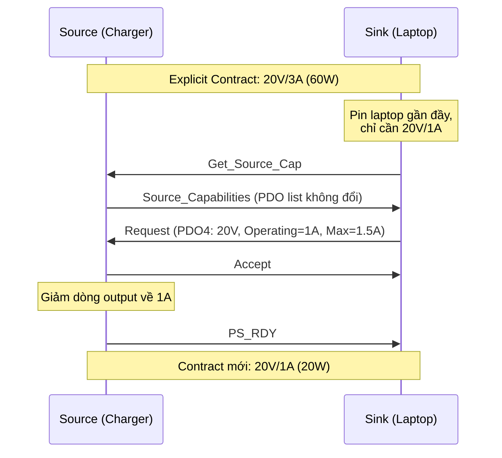

### 2.3. Implicit Contract

Contract này được enter ngay sau khi thực hiện **PR_Swap** (Power Role Swap) hoặc **FR_Swap** (Fast Role Swap), trong đó Source sẽ cấp 5V và quảng bá dòng điện mà nó có thể cấp bằng cách sử dụng giá trị điện trở Rp như được xác định trong USB Type C specification. Source ở Implicit Contract là tạm thời, nó sẽ ngay lập tức đàm phán với Sink và enter Explicit Contract.

**Tại sao cần Implicit Contract?**

Khi xảy ra PR_Swap (Source ↔ Sink), bên vừa trở thành Source mới chưa biết bên kia cần bao nhiêu nguồn. Hệ thống cần quay về trạng thái an toàn (5V) trước khi thương lượng lại. Implicit Contract chính là trạng thái "nghỉ tạm" này.

**Ví dụ PR_Swap:**

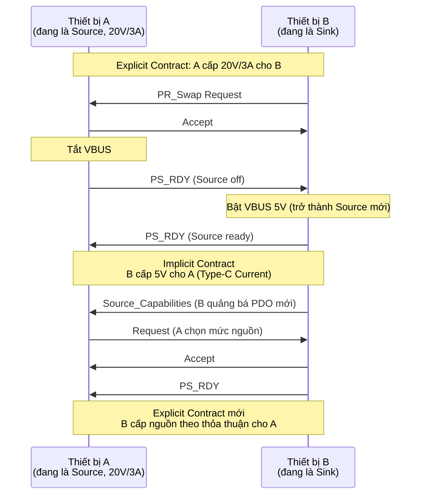

:::warning Giao tiếp trước Explicit Contract
- Khi ở Default Contract hoặc Implicit Contract, VBUS luôn ở 5V với dòng theo USB Type-C Current.
- Chỉ khi ở Explicit Contract, VBUS mới có thể ở mức điện áp cao hơn 5V.
- Trước khi enter Explicit Contract, chỉ Source và eMarker trong cable có thể giao tiếp (qua SOP'). Các tính năng nâng cao như DR_Swap, Alternate Mode, EPR đều yêu cầu Explicit Contract.
:::

:::warning Fast Role Swap
FR_Swap là phiên bản nhanh của PR_Swap, dùng khi Source mất nguồn đột ngột (ví dụ: rút sạc khỏi hub). Sink phát hiện VBUS giảm $\rightarrow$ trigger FR_Swap signal trên CC $\rightarrow$ Sink chuyển sang Source ngay lập tức để duy trì VBUS cho các thiết bị khác. FR_Swap phải hoàn tất trong vài millisecond, nhanh hơn nhiều so với PR_Swap thông thường (~25ms).
:::

## 3. Source Operation

### Quy trình hoạt động của Source

Source hoạt động theo một state machine phức tạp, nhưng có thể tóm tắt thành các giai đoạn chính:

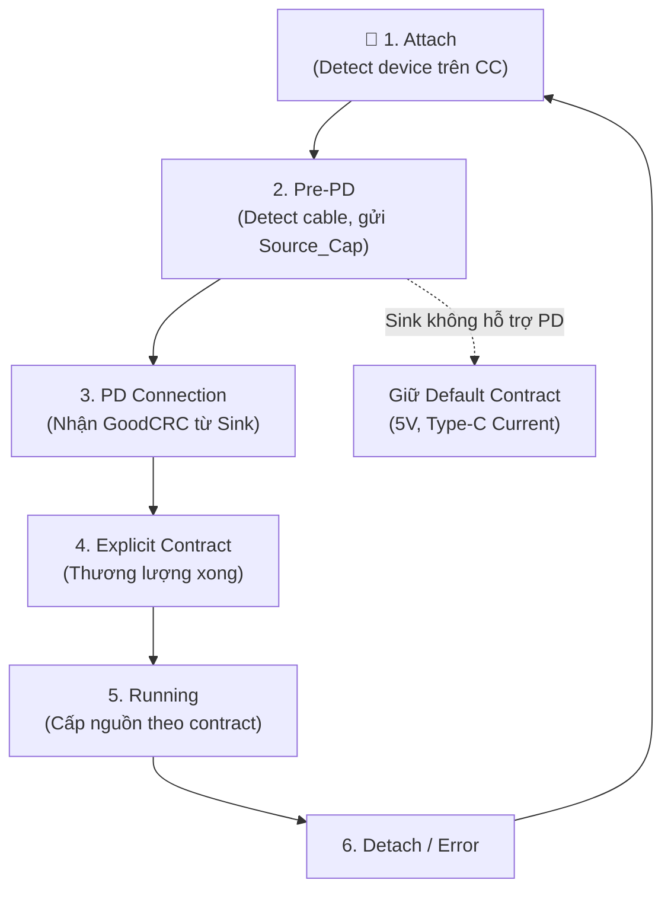

### Giai đoạn 1: Attach (chưa có PD Connection hay Contract)

Source detect device qua CC pin, enable VBUS 5V. Lúc này chỉ có Default Contract.

### Giai đoạn 2: Pre-PD (trước khi thiết lập PD Connection)

Trước khi gửi `Source_Capabilities` message đến Sink, Source thực hiện hai việc quan trọng:

**a) Detect cable (qua SOP'):**

Source gửi **Discover Identity** qua `SOP'` đến eMarker IC trong cable để biết:
- Cable hỗ trợ dòng tối đa bao nhiêu (3A hay 5A)?
- Cable hỗ trợ tốc độ data nào?
- Cable có hỗ trợ Extended Power Range không?

Dựa trên kết quả, Source giới hạn `Source_Capabilities` cho phù hợp với cable. Ví dụ: nếu cable chỉ chịu 3A, Source sẽ không quảng bá PDO 20V/5A dù Source hardware hỗ trợ.

:::warning Chú ý
Nếu cable không có eMarker (passive cable không phản hồi SOP'), Source mặc định giới hạn ở **3A** - đây là khả năng tối thiểu mà mọi cable Type-C phải hỗ trợ.
:::

**b) Quảng bá `Source_Capabilities` định kỳ:**

Source gửi `Source_Capabilities` message mỗi `tTypeCSendSourceCap` (100–200ms) cho đến khi nhận được `GoodCRC` phản hồi từ Sink.

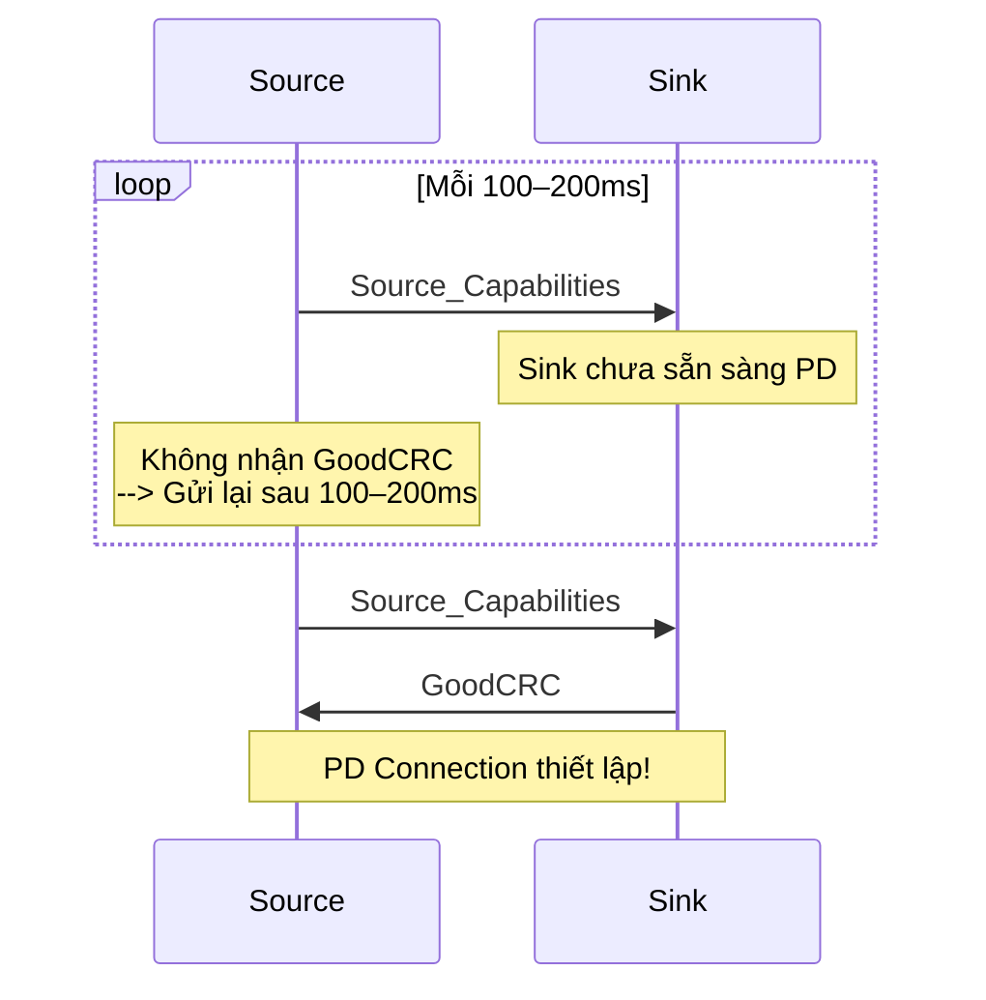

### Giai đoạn 3: PD Connection

PD Connection được thiết lập khi Source detect được Sink có khả năng PD, thông qua một trong hai cách:
- Nhận `GoodCRC` phản hồi từ `Source_Capabilities` message.
- Nhận Hard Reset Signaling từ Sink.

Từ thời điểm này, Source và Sink bắt đầu thương lượng PD.

### Giai đoạn 4–5: Explicit Contract

Sau khi hoàn tất chuỗi `Source_Capabilities` $\rightarrow$ `Request` $\rightarrow$ `Accept` $\rightarrow$ `PS_RDY`, Explicit Contract được thiết lập. Source cấp nguồn theo thỏa thuận.

### Giai đoạn 6: Detach hoặc Error

Khi xảy ra lỗi giao tiếp hoặc device rút cable, Source xử lý theo các cấp độ nghiêm trọng tăng dần.

## 4. Sink Operation

### Quy trình hoạt động của Sink

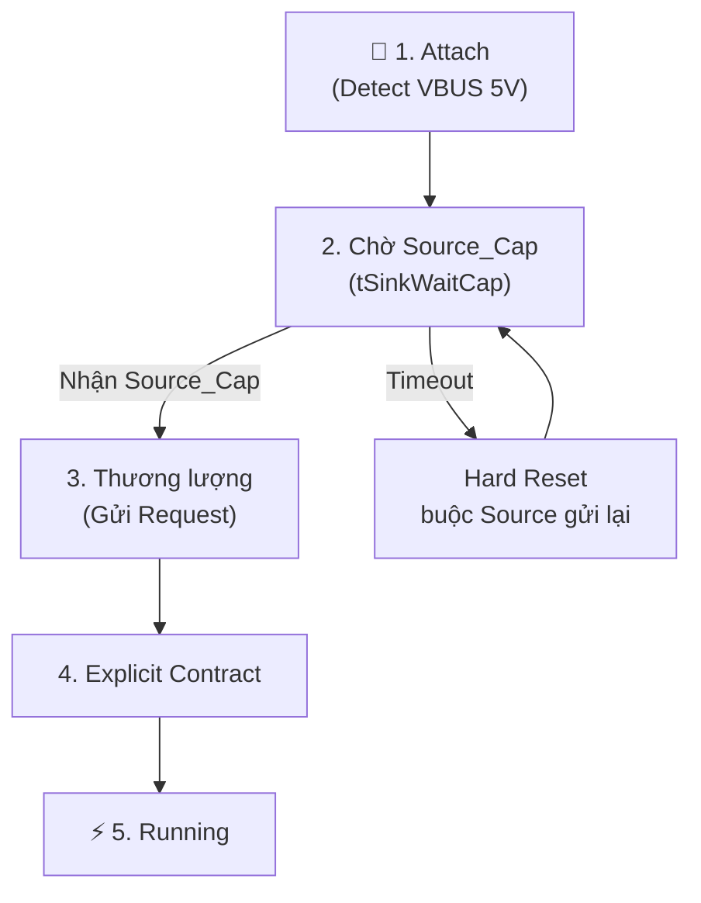

### Giai đoạn 1–2: Attach và chờ `Source_Capabilities`

Khi Sink detect VBUS 5V, nó bắt đầu chờ `Source_Capabilities` message từ Source trong khoảng thời gian **tSinkWaitCap**.

Nếu **timeout** mà không nhận được `Source_Capabilities`:
- Sink thực hiện **Hard Reset Signaling** để buộc Source gửi lại `Source_Capabilities` (nếu Source có khả năng PD).
- Nếu vẫn không nhận được $\rightarrow$ Sink kết luận Source không hỗ trợ PD $\rightarrow$ hoạt động ở Default Contract (5V, dòng theo Rp).

### Giai đoạn 3: Thương lượng

Sink phân tích danh sách PDO trong `Source_Capabilities`, chọn PDO phù hợp nhất với nhu cầu, rồi gửi Request message chứa Request Data Object (RDO).

### Giai đoạn 4–5: Explicit Contract

Tương tự Source - sau `Accept` + `PS_RDY`, Sink nhận nguồn theo contract.

## 5. Protocol Layer

### Cơ chế truyền tin cậy

Mọi PD message đều phải được xác nhận bằng `GoodCRC`. Đây là cơ chế đảm bảo tin cậy ở tầng protocol:

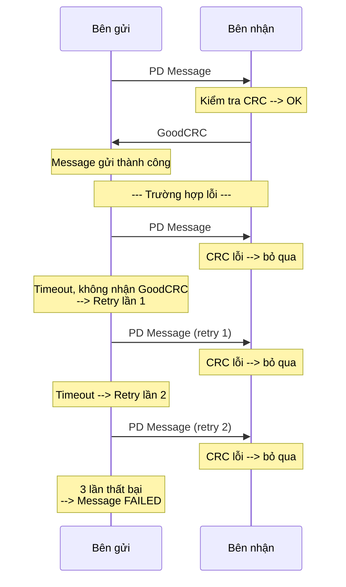

Quy tắc:
- Sau khi gửi message, bên gửi chờ `GoodCRC` trong khoảng **tReceive** (~1ms).
- Nếu không nhận `GoodCRC` → retry tối đa 2 lần (tổng cộng 3 lần gửi).
- Sau 3 lần thất bại → message coi là failed → trigger error handling.

### Ba loại PD Message

Mọi PD message đều bắt đầu bằng **16-bit Header**, theo sau là data (nếu có):

```
┌──────────────────────┬─────────────────────────┬────────┐
│   Message Header     │   Data Objects          │  CRC   │
│     (16 bit)         │  (0–7 × 32 bit)         │(32 bit)│
└──────────────────────┴─────────────────────────┴────────┘
```

| Loại message | Number of Data Objects (Header bit 14:12) | Kích thước data | Mục đích |
|---|---|---|---|
| **Control Message** | = 0 | Không có data | Quản lý luồng giao tiếp (ACK, reject, swap,...) |
| **Data Message** | 1–7 | 32–224 bit (1–7 × 32-bit Data Object) | Trao đổi thông tin nguồn, request, vendor data |
| **Extended Message** | > 0, Extended bit = 1 | Đến 260 byte | Firmware update, security, battery info |

### Message Header (16 bit)

| Bit | Field | SOP | SOP'/SOP'' | Mô tả |
|---|---|---|---|---|
| 15 | **Extended** | ✅ | ✅ | `0` = Control/Data, `1` = Extended message |
| 14:12 | **Number of Data Objects** | ✅ | ✅ | Số lượng 32-bit Data Object sau header (`0` = Control Message) |
| 11:9 | **MessageID** | ✅ | ✅ | Bộ đếm 3-bit (0–7), tăng sau mỗi message thành công. Dùng detect duplicate |
| 8 | **Port Power Role** | ✅ | - | `0` = Sink, `1` = Source |
| 8 | **Cable Plug** | - | ✅ | `0` = message từ DFP/UFP, `1` = từ Cable Plug |
| 7:6 | **Specification Revision** | ✅ | ✅ | `01` = PD 2.0, `10` = PD 3.0 |
| 5 | **Port Data Role** | ✅ | - | `0` = UFP, `1` = DFP |
| 5 | **Reserved** | - | ✅ | |
| 4:0 | **Message Type** | ✅ | ✅ | Xác định loại message cụ thể |

**Giải thích SOP, SOP', SOP'':**

| Loại SOP | Giao tiếp giữa | Mục đích |
|---|---|---|
| **SOP** | Source ↔ Sink (hai Port Partner) | Thương lượng nguồn, swap role, VDM |
| **SOP'** (SOP Prime) | Source ↔ eMarker **gần phía Source** | Đọc thông tin cable |
| **SOP''** (SOP Double Prime) | Source ↔ eMarker **gần phía Sink** | Cable có 2 eMarker (active cable hai đầu) |

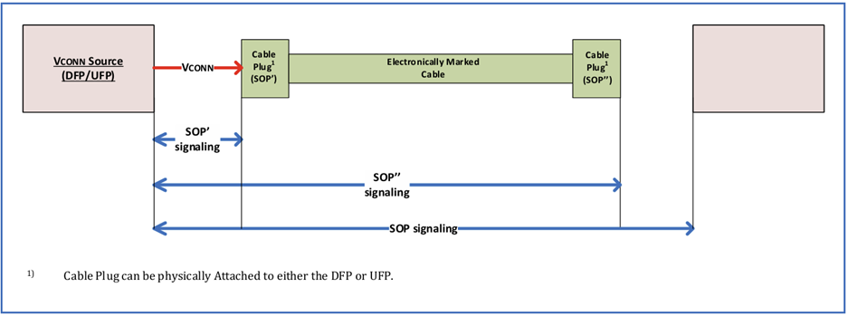

### Control Messages

Control message là bản tin ngắn được sử dụng để quản lý luồng bản tin giữa các Port Partners. Một message được coi là Control Message nếu trường Number Data Of Object trong header được set là 0.

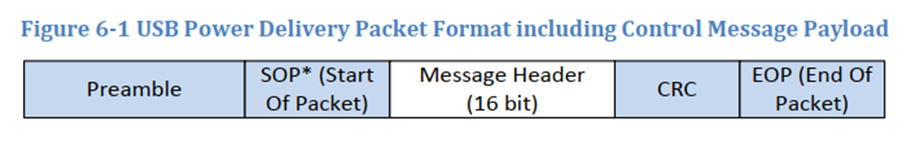

Type của control message sẽ được xác định trong trường **Message Type** của header và được định nghĩa tại bảng sau:

| Message Type | Tên | Gửi bởi | Mô tả |
|---|---|---|---|
| 0x01 | **GoodCRC** | Source / Sink / Cable | Xác nhận nhận message thành công |
| 0x02 | **GotoMin** | Source only | Yêu cầu Sink giảm tiêu thụ về mức tối thiểu đã khai báo |
| 0x03 | **Accept** | Source / Sink / Cable | Chấp nhận request hoặc swap |
| 0x04 | **Reject** | Source / Sink / Cable | Từ chối request hoặc swap |
| 0x05 | **Ping** | Source only | Kiểm tra Sink còn kết nối (chỉ dùng trong PPS mode) |
| 0x06 | **PS_RDY** | Source / Sink | Power Supply Ready - VBUS đã ổn định ở mức mới |
| 0x07 | **Get_Source_Cap** | Sink / DRP | Yêu cầu Source gửi lại Source_Capabilities |
| 0x08 | **Get_Sink_Cap** | Source / DRP | Yêu cầu Sink gửi Sink_Capabilities |
| 0x09 | **DR_Swap** | Source / Sink | Yêu cầu đổi Data Role (DFP ↔ UFP) |
| 0x0A | **PR_Swap** | Source / Sink | Yêu cầu đổi Power Role (Source ↔ Sink) |
| 0x0B | **VCONN_Swap** | Source / Sink | Yêu cầu đổi bên cấp VCONN |
| 0x0C | **Wait** | Source / Sink | Yêu cầu chờ - đang bận, sẽ initiate lại sau |
| 0x0D | **Soft_Reset** | Source / Sink | Reset protocol layer (giữ nguyên contract) |
| 0x0E | **Data_Reset** | Source / Sink | Reset data path (giữ nguyên power) |
| 0x0F | **Data_Reset_Complete** | Source / Sink | Xác nhận Data Reset hoàn tất |
| 0x10 | **Not_Supported** | Source / Sink / Cable | Thông báo message nhận được không được hỗ trợ |

### Data Messages

Data message là bản tin có một hoặc nhiều 32-bit Data Object (Number of Data Objects ≥ 1).

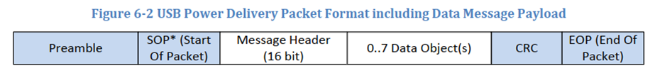

Type của data message sẽ được xác định trong trường **Message Type** của header và được định nghĩa tại bảng sau:

| Message Type | Tên | Gửi bởi | Mô tả |
|---|---|---|---|
| 0x01 | **Source_Capabilities** | Source / DRP | Danh sách PDO quảng bá khả năng cấp nguồn |
| 0x02 | **Request** | Sink only | RDO chứa mức nguồn Sink yêu cầu |
| 0x03 | **BIST** | Tester / Source / Sink | Built-In Self Test |
| 0x04 | **Sink_Capabilities** | Sink / DRP | Danh sách PDO khai báo nhu cầu nguồn |
| 0x05 | **Battery_Status** | Source / Sink | Trạng thái battery |
| 0x06 | **Alert** | Source / Sink | Thông báo sự kiện (OCP, OTP, thay đổi status) |
| 0x07 | **Get_Country_Info** | Sink / DRP | Yêu cầu thông tin quốc gia |
| 0x08 | **Enter_USB** | DFP | Yêu cầu enter USB4 mode |
| 0x09 | **EPR_Request** | Sink | Request ở chế độ Extended Power Range |
| 0x0A | **EPR_Mode** | Source / Sink | Enter/Exit chế độ EPR |
| 0x0B | **Source_Info** | Source | Thông tin chi tiết về Source |
| 0x0C | **Revision** | Source / Sink / Cable | Khai báo PD revision hỗ trợ |
| 0x0F | **Vendor_Defined** | Source / Sink / Cable | Message tùy chỉnh vendor (VDM) |

## 6. Capabilities Message và Power Negotiation

### Quy trình thương lượng nguồn hoàn chỉnh

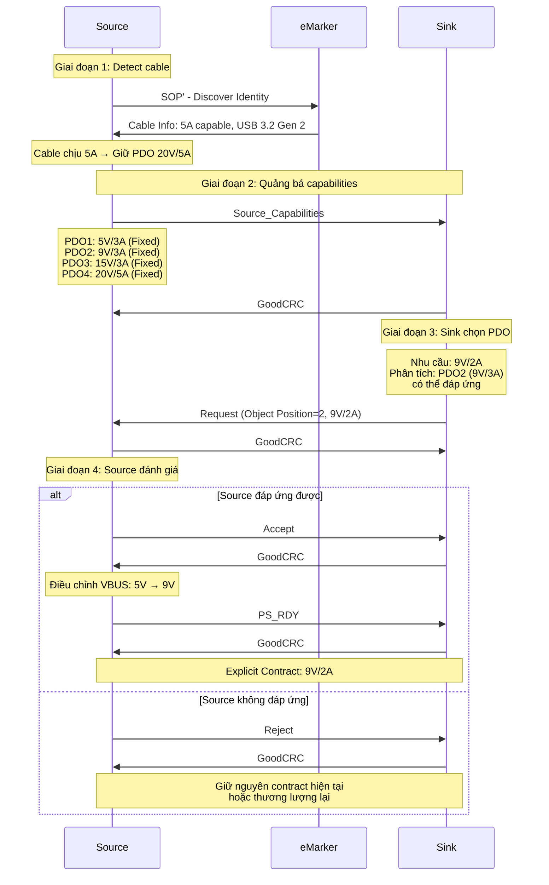

### Cơ chế Sink chọn PDO

Khi nhận `Source_Capabilities`, Sink thực hiện:
1. Duyệt danh sách PDO từ Source.
2. So sánh với nhu cầu nguồn của mình.
3. Chọn PDO phù hợp nhất - thường là PDO có điện áp và dòng đáp ứng nhu cầu mà không quá dư thừa.
4. Gửi Request message chứa Request Data Object (RDO) với:
   - Object Position: Chỉ số PDO được chọn (1-indexed, PDO1 = position 1).
   - Operating Current: Dòng Sink cần ở mức hoạt động bình thường.
   - Max Operating Current: Dòng tối đa Sink có thể yêu cầu.

:::warning Chú ý
Nếu nhu cầu nguồn của Sink vượt quá mọi PDO mà Source quảng bá, Sink vẫn phải chọn PDO gần nhất có thể và thương lượng lại nếu cần. Sink không được từ chối mọi PDO - luôn phải gửi Request.
:::

## 7. Power Data Object (PDO)

### PDO là gì?

PDO là đơn vị 32-bit mô tả một mức nguồn cụ thể mà Source có thể cấp hoặc Sink cần. Mỗi `Source_Capabilities` message chứa từ 1 đến 7 PDO, tạo thành "menu nguồn" mà Sink có thể chọn.

### Quy tắc sắp xếp PDO trong Source_Capabilities

`Source_Capabilities` message chứa danh sách PDO được sắp xếp theo thứ tự bắt buộc bởi spec:

| Thứ tự | Loại PDO | Quy tắc sắp xếp |
|---|---|---|
| 1 | Fixed Supply 5V (vSafe5V) | Luôn ở vị trí đầu tiên |
| 2 | Fixed Supply khác | Theo voltage từ thấp đến cao (9V, 15V, 20V) |
| 3 | Battery Supply | Theo Minimum Voltage từ thấp đến cao |
| 4 | Variable Supply (non-Battery) | Theo Minimum Voltage từ thấp đến cao |
| 5 | SPR Adjustable Voltage Supply | |
| 6 | Programmable Power Supply (PPS) | Theo Maximum Voltage từ thấp đến cao |

Quy tắc quan trọng:
- PDO đầu tiên bắt buộc là 5V (vSafe5V) - đảm bảo Sink luôn có thể fall back về mức an toàn.
- Không được có hai PDO cùng type và cùng điện áp trong cùng một `Capabilities` message.
- Số lượng tối đa 7 PDO trong SPR. EPR cho phép thêm PDO.

### Phân loại PDO theo Supply Type (bit 31:30)

| Bit 31:30 | Supply Type | Mô tả |
|---|---|---|
| `00` | Fixed Supply | Điện áp cố định - phổ biến nhất |
| `01` | Battery | Dải điện áp, tham số là công suất |
| `10` | Variable Supply | Dải điện áp, tham số là dòng |
| `11` | Augmented (APDO) | PPS hoặc EPR AVS - điều chỉnh liên tục |

### Fixed Supply PDO (phổ biến nhất)

Cung cấp điện áp cố định (5V, 9V, 15V, 20V,...). Đây là loại PDO mà hầu hết charger và thiết bị sử dụng.

**Cấu trúc bit**

| Bit | Field | Mô tả |
|---|---|---|
| 31:30 | Supply Type | `00` = Fixed Supply |
| 29 | Dual-Role Power | `1` = thiết bị có thể làm cả Source và Sink |
| 28 | USB Suspend Supported | `1` = hỗ trợ USB Suspend |
| 27 | Unconstrained Power | `1` = Source có nguồn dồi dào (wall adapter). `0` = nguồn hạn chế (battery) |
| 26 | USB Communications Capable | `1` = có USB data ngoài PD |
| 25 | Dual-Role Data | `1` = có thể swap DFP/UFP |
| 24:20 | Voltage | Đơn vị 50mV. Ví dụ: 9V = 9000mV ÷ 50 = 180 = `0x0B4` |
| 19:10 | Reserved | Phải = 0 |
| 9:0 | Max Current | Đơn vị 10mA. Ví dụ: 3A = 3000mA ÷ 10 = 300 = `0x12C` |

:::warning Chú ý
Bit 29–25 (Dual-Role Power, USB Suspend, Unconstrained Power, USB Comms, Dual-Role Data) chỉ có ý nghĩa trong PDO đầu tiên (5V vSafe5V). Các PDO Fixed Supply còn lại phải set các bit này về 0.
:::

#### Ví dụ decode Fixed Supply PDO

**Charger 65W điển hình:**

| PDO# | Position | Voltage | Max Current | Công suất | Hex (32-bit) |
|---|---|---|---|---|---|
| PDO1 | 1 | 5V | 3A | 15W | `0x2C019096` |
| PDO2 | 2 | 9V | 3A | 27W | `0x0002D12C` |
| PDO3 | 3 | 15V | 3A | 45W | `0x0004B12C` |
| PDO4 | 4 | 20V | 3.25A | 65W | `0x00064146` |

**Cách decode PDO4 = `0x00064146`:**
```
Bit 31:30 = 00         → Fixed Supply
Bit 24:20 = 0x190 = 400 → Voltage = 400 × 50mV = 20,000mV = 20V
Bit 9:0   = 0x146 = 326 → Max Current = 326 × 10mA = 3,260mA ≈ 3.25A
Công suất = 20V × 3.25A = 65W
```

**Charger 100W:**

| PDO# | Position | Voltage | Max Current | Công suất |
|---|---|---|---|---|
| PDO1 | 1 | 5V | 3A | 15W |
| PDO2 | 2 | 9V | 3A | 27W |
| PDO3 | 3 | 15V | 3A | 45W |
| PDO4 | 4 | 20V | **5A** | **100W** |

:::warning Chú ý
PDO 20V/5A yêu cầu cable có eMarker khai báo 5A capable. Nếu Source không đọc được eMarker hoặc cable chỉ hỗ trợ 3A, Source phải loại bỏ PDO 20V/5A khỏi `Source_Capabilities` hoặc giảm dòng về 3A.
:::

### Battery Supply PDO

Dùng khi Source là thiết bị chạy pin, điện áp output thay đổi theo mức sạc (ví dụ: Li-ion battery 2.8V–4.2V).

**Cấu trúc bit**

| Bit | Field | Mô tả |
|---|---|---|
| 31:30 | Supply Type | `01` = Battery |
| 29:20 | Max Voltage | Đơn vị 50mV. Ví dụ: 4.2V = 84 |
| 19:10 | Min Voltage | Đơn vị 50mV. Ví dụ: 2.8V = 56 |
| 9:0 | Max Allowable Power | Đơn vị 250mW. Ví dụ: 15W = 60 |

:::warning Chú ý
Battery PDO dùng công suất (Watt) thay vì dòng điện, vì khi điện áp thay đổi, dòng cũng thay đổi để giữ công suất ổn định.
:::

### Variable Supply PDO

Tương tự Battery PDO nhưng không phải battery - ví dụ: nguồn DC-DC có output thay đổi.

**Cấu trúc bit**

| Bit | Field | Mô tả |
|---|---|---|
| 31:30 | Supply Type | `10` = Variable |
| 29:20 | Max Voltage | Đơn vị 50mV |
| 19:10 | Min Voltage | Đơn vị 50mV |
| 9:0 | Max Current | Đơn vị 10mA |

Điểm khác biệt với Battery: Variable dùng dòng điện (mA) thay vì công suất (mW).

### Augmented PDO (APDO) - Programmable Power Supply (PPS)

PPS cho phép Sink điều chỉnh liên tục điện áp và dòng điện trong dải cho phép, với bước nhỏ (20mV, 50mA). Đây là tính năng quan trọng cho sạc pin thông minh - Sink (phone/laptop) có thể kiểm soát chính xác điện áp sạc tùy theo trạng thái pin.

**Cấu trúc bit**

| Bit | Field | Mô tả |
|---|---|---|
| 31:30 | Supply Type | `11` = Augmented PDO (APDO) |
| 29:28 | APDO Type | `00` = SPR Programmable Power Supply |
| 27 | PPS Power Limited | `1` = Source bị giới hạn công suất (có thể không cấp đủ max V × max I) |
| 24:17 | Max Voltage | Đơn vị 100mV. Ví dụ: 21V = 210 |
| 15:8 | Min Voltage | Đơn vị 100mV. Ví dụ: 3.3V = 33 |
| 6:0 | Max Current | Đơn vị 50mA. Ví dụ: 3A = 60 |

:::warning Chú ý APDO dùng đơn vị khác với Fixed Supply PDO:
- Voltage: **100mV** (không phải 50mV)
- Current: **50mA** (không phải 10mA)

Cần cẩn thận khi decode - nhầm đơn vị sẽ tính sai gấp đôi.
:::

**Ví dụ PPS PDO**

Charger hỗ trợ PPS quảng bá:

| PDO# | Type | Min Voltage | Max Voltage | Max Current | Ứng dụng |
|---|---|---|---|---|---|
| PDO1 | Fixed | 5V | 5V | 3A | Default |
| PDO2 | Fixed | 9V | 9V | 3A | Quick Charge |
| PDO3 | Fixed | 15V | 15V | 3A | Laptop nhỏ |
| PDO4 | Fixed | 20V | 20V | 3.25A | Laptop (65W) |
| PDO5 | PPS | 3.3V | 11V | 3A | Sạc pin phone CC mode |
| PDO6 | PPS | 3.3V | 21V | 3.25A | Sạc pin laptop CC mode |

**Cơ chế hoạt động PPS**

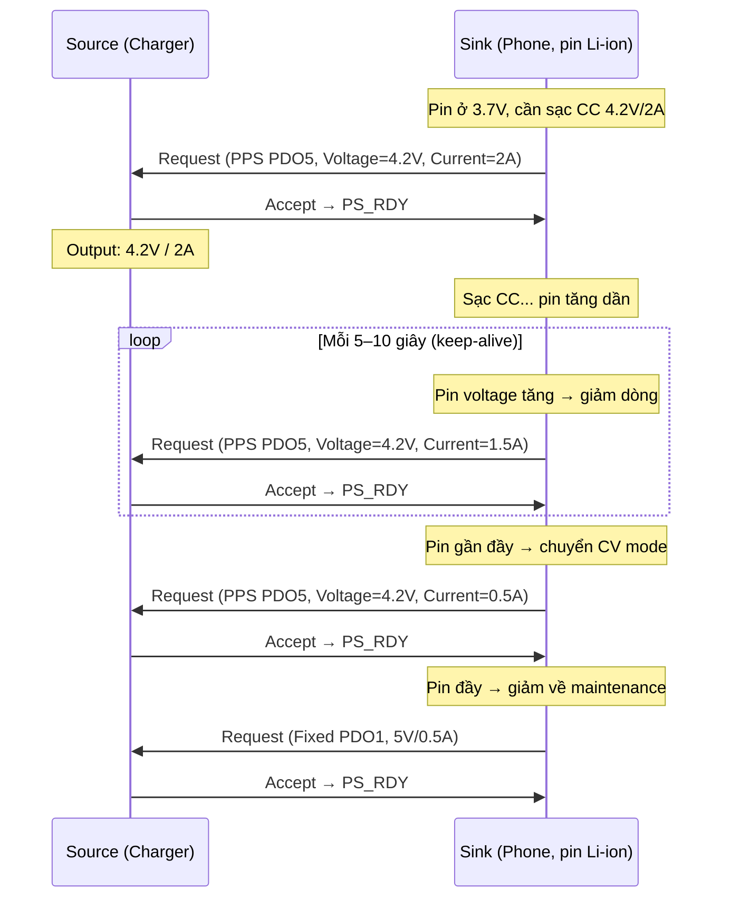

**PPS Keep-alive và Safety**

- Sink phải gửi Request mỗi tối đa 10 giây (tPPSRequest)
- Nếu timeout, Source thực hiện Hard Reset → VBUS về 5V

:::tip Tại sao PPS cần keep-alive?
PPS cho phép điện áp cao với dòng lớn (ví dụ: 21V/3A = 63W). Nếu Sink bị treo, mất kết nối, hoặc pin gặp sự cố mà Source vẫn cấp nguồn cao → nguy hiểm. Keep-alive đảm bảo: nếu Sink "im lặng" quá 10 giây → Source tự động cắt nguồn cao, kéo về 5V an toàn.
:::

:::warning Chú ý
Khi Sink ở chế độ PPS mà không cần thay đổi mức nguồn, Sink vẫn phải gửi cùng Request (cùng voltage, cùng current) trước khi timeout 10s - đây thuần túy là tín hiệu "tôi vẫn sống".
:::

## 8. Request Data Object (RDO)

### RDO là gì?

Sau khi nhận `Source_Capabilities`, Sink gửi lại Request message chứa một RDO (32-bit) - mô tả mức nguồn Sink muốn nhận. RDO tham chiếu đến một PDO cụ thể trong `Source_Capabilities` qua **Object Position**.

### Cấu trúc RDO cho Fixed/Variable Supply

| Bit | Field | Mô tả |
|---|---|---|
| 31 | Reserved | = 0 |
| 30 | GiveBack Flag | `1` = Sink sẵn sàng giảm dòng khi Source yêu cầu (GotoMin) |
| 29 | Capability Mismatch | `1` = Không có PDO nào đáp ứng đủ nhu cầu Sink → Sink chọn PDO gần nhất |
| 28 | USB Communications Capable | `1` = Sink có USB data |
| 27 | No USB Suspend | `1` = Sink không muốn bị suspend |
| 26 | Unchunked Extended Messages Supported | PD 3.0+ |
| 25 | EPR Mode Capable | Sink hỗ trợ EPR |
| 24:20 | Object Position | Chỉ số PDO được chọn (1-indexed: PDO1 = 1, PDO2 = 2,...) |
| 19:10 | Operating Current | Dòng hoạt động bình thường (đơn vị 10mA) |
| 9:0 | Max Operating Current | Dòng tối đa Sink có thể yêu cầu (đơn vị 10mA) |

### Cấu trúc RDO cho PPS (Programmable)

| Bit | Field | Mô tả |
|---|---|---|
| 31 | Reserved | = 0 |
| 30 | Reserved | = 0 |
| 29 | Capability Mismatch | |
| 28 | USB Communications Capable | |
| 27 | No USB Suspend | |
| 26 | Unchunked Extended Messages Supported | |
| 25 | EPR Mode Capable | |
| 24:20 | Object Position | Chỉ số APDO (PPS PDO) được chọn |
| 19:9 | Output Voltage | Đơn vị 20mV. Ví dụ: 9V = 450 |
| 6:0 | Operating Current | Đơn vị 50mA. Ví dụ: 2A = 40 |

:::warning Chú ý
RDO cho PPS cho phép Sink chỉ định chính xác voltage và current mong muốn (trong dải của PPS PDO). Khác với Fixed Supply RDO chỉ chọn position - voltage đã cố định bởi PDO.
:::

### Ví dụ thương lượng hoàn chỉnh với RDO

Giả sử: Phone (Sink) cắm vào charger 65W (Source).

```
Source_Capabilities:
  PDO1: Fixed 5V / 3A     (position 1)
  PDO2: Fixed 9V / 3A     (position 2)
  PDO3: Fixed 15V / 3A    (position 3)
  PDO4: Fixed 20V / 3.25A (position 4)
  PDO5: PPS 3.3V–11V / 3A (position 5)
```

**Phone muốn sạc nhanh 9V/2A:**
```
RDO:
  Object Position = 2     (chọn PDO2: 9V)
  Operating Current = 200 (= 2A = 2000mA ÷ 10)
  Max Operating Current = 250 (= 2.5A, dự phòng peak)
  Capability Mismatch = 0 (PDO2 đáp ứng đủ)
  GiveBack Flag = 0
```

**Phone muốn sạc PPS 4.2V/2A:**
```
RDO (PPS):
  Object Position = 5     (chọn PDO5: PPS 3.3V–11V)
  Output Voltage = 210    (= 4.2V = 4200mV ÷ 20)
  Operating Current = 40  (= 2A = 2000mA ÷ 50)
  Capability Mismatch = 0
```

### Capability Mismatch

Khi không có PDO nào trong `Source_Capabilities` đáp ứng đủ nhu cầu Sink, Sink vẫn phải gửi Request (không được không phản hồi). Sink chọn PDO gần nhất và set Capability Mismatch = 1 trong RDO:

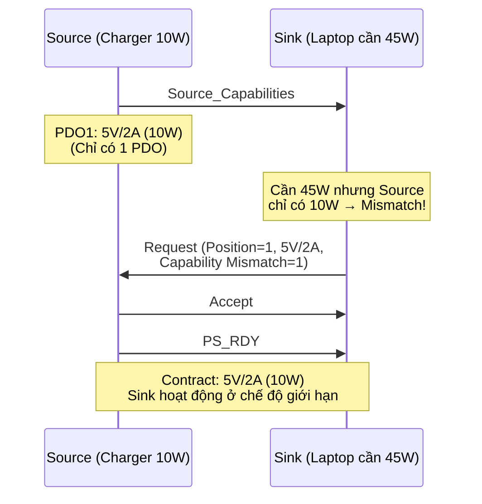

:::warning Chú ý
Khi Source nhận RDO với Capability Mismatch = 1, Source biết Sink không hài lòng. Nếu Source sau đó có thêm khả năng (ví dụ: một thiết bị khác rút ra, giải phóng bandwidth), Source có thể gửi lại `Source_Capabilities` mới để re-negotiate.
:::

## 9. Extended Power Range (EPR)

### Tổng quan

EPR mở rộng công suất từ 100W (SPR) lên 240W, bổ sung các mức điện áp 28V, 36V, 48V.

### Điều kiện để enter EPR

| Yêu cầu | Mô tả |
|---|---|
| **Explicit Contract** | Phải đang ở Explicit Contract (SPR) trước khi enter EPR |
| **Source hỗ trợ EPR** | Source phải có EPR PDO trong `Source_Capabilities` |
| **Sink hỗ trợ EPR** | Sink phải gửi EPR_Mode request |
| **Cable hỗ trợ EPR** | eMarker phải khai báo hỗ trợ EPR (cable chịu được >20V) |
| **Keep-alive bắt buộc** | Cả Source và Sink phải duy trì liên lạc định kỳ |

### Quy trình enter EPR

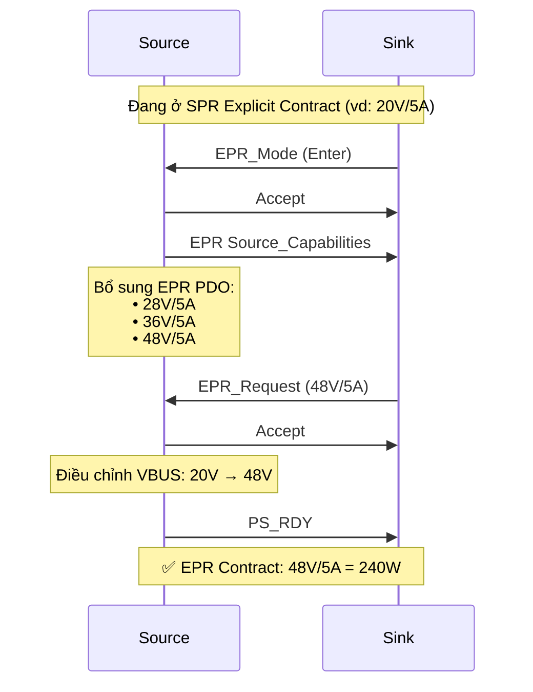

### Mất liên lạc trong EPR

Nếu Source hoặc Sink mất liên lạc (không nhận phản hồi định kỳ):
1. Hard Reset được thực hiện tự động.
2. VBUS được kéo về 5V (vSafe5V).
3. Hệ thống quay lại SPR mode - phải thương lượng lại từ đầu nếu muốn EPR.

:::warning Chú ý
EPR yêu cầu giám sát liên tục vì điện áp 28V–48V nguy hiểm hơn nhiều so với 5V–20V. Mất kiểm soát ở 48V/5A có thể gây hỏng thiết bị hoặc nguy hiểm.
:::

## 10. Error Handling

USB PD có hai cấp độ xử lý lỗi:

### Soft Reset

| Thuộc tính | Mô tả |
|---|---|
| **Trigger** | Lỗi protocol (vd: không nhận `GoodCRC` sau 3 lần retry) |
| **Thực hiện** | Gửi `Soft_Reset` control message |
| **Tác dụng** | Reset MessageID counter, timer, protocol state |
| **Giữ nguyên** | Negotiated Voltage, Negotiated Current, Power Role, Data Role, VCONN Source |
| **Không ảnh hưởng** | Explicit Contract vẫn còn hiệu lực - VBUS không thay đổi |

### Hard Reset

| Thuộc tính | Mô tả |
|---|---|
| **Trigger** | Soft Reset thất bại, lỗi nghiêm trọng, timeout trong EPR/PPS, lỗi Power Transition |
| **Thực hiện** | Gửi **Hard Reset Signaling** trên CC line (không phải message) |
| **Tác dụng** | Reset toàn bộ PD protocol |
| **Reset về default** | Data Role, Power Role, VCONN Source (trả về Source Port) |
| **VBUS** | Kéo về **vSafe5V** (5V) hoặc **vSafe0V** (0V) rồi bật lại |
| **Contract** | Explicit Contract bị hủy → bắt đầu lại từ Default Contract |
| **Alternate Mode** | Exit mọi Modal Operation |

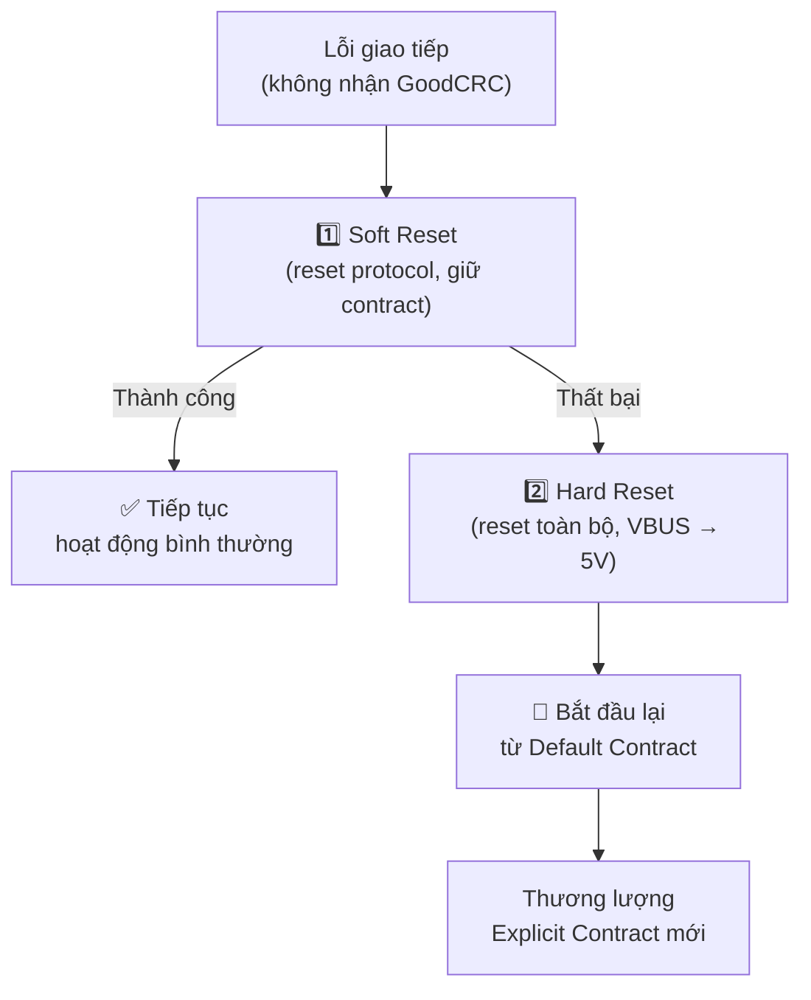

:::warning Chú ý
Hard Reset là phương án cuối cùng - nó gây gián đoạn nguồn (VBUS về 5V hoặc 0V tạm thời), có thể khiến thiết bị đang hoạt động bị mất điện. Vì vậy, PD stack luôn thử Soft Reset trước.
:::