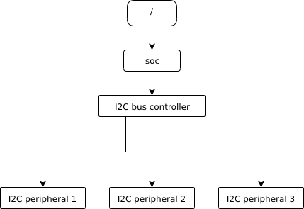
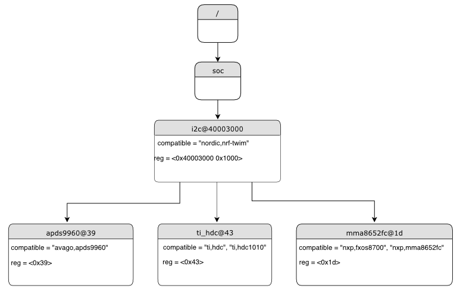
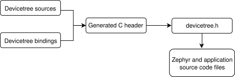

## Devicetree là gì?

Devicetree là một cấu trúc dữ liệu dạng cây mô tả phần cứng. Mỗi node trong cây là một thành phần phần cứng (một UART controller, một chân LED, một cảm biến trên bus I2C...) và mỗi node mang theo các property mô tả thuộc tính của thành phần đó: địa chỉ thanh ghi, số interrupt, tốc độ clock, chân GPIO...

Ý tưởng giống Kconfig ở chỗ tách cấu hình ra khỏi source code, nhưng phân vai rõ ràng:

- **Kconfig** trả lời câu hỏi *"phần mềm nào được biên dịch vào firmware?"* (bật driver I2C, bật Bluetooth, chọn kích thước stack).
- **Devicetree** trả lời câu hỏi *"phần cứng có những gì và nằm ở đâu?"* (I2C1 nằm ở địa chỉ `0x40005400`, cảm biến BME280 nằm ở address `0x76` trên bus đó).

Hai hệ thống này bổ trợ nhau. Một driver chỉ thực sự hoạt động khi vừa được bật trong Kconfig, vừa có node tương ứng trong devicetree với `status = "okay"`.

Điểm khác biệt lớn nhất so với Linux: Zephyr không đọc devicetree lúc runtime. Không có file `.dtb` nào được nạp vào bộ nhớ. Toàn bộ cây được xử lý tại thời điểm build và biến thành các macro C trong một header file. Điều này có nghĩa mọi truy cập devicetree đều là hằng số biên dịch, không tốn RAM, không tốn thời gian parse.

## Cú pháp devicetree

Hãy hình dung một board có một I2C controller và ba cảm biến nối vào bus đó:

<p align="center"></p>

Cách sắp xếp phần cứng này ánh xạ trực tiếp thành cây devicetree: controller là node cha, ba cảm biến là node con của nó.

<p align="center"></p>

Trong hình, tên node nằm ở phần nền xám phía trên, các property nằm bên dưới dưới dạng `name = value`. Node `i2c@40003000` có `reg` gồm địa chỉ gốc và kích thước vùng thanh ghi, còn ba node con chỉ có `reg` là địa chỉ slave trên bus (`0x39`, `0x43`, `0x1d`) — đúng với quy tắc `#address-cells`/`#size-cells` sẽ nói ở phần sau.

File devicetree dùng cú pháp DTS (Devicetree Source). Một ví dụ rút gọn:

```dts
/dts-v1/;

/ {
    soc {
        uart1: serial@40013800 {
            compatible = "st,stm32-uart";
            reg = <0x40013800 0x400>;
            interrupts = <37 0>;
            current-speed = <115200>;
            status = "okay";
        };
    };

    leds {
        compatible = "gpio-leds";
        led0: led_0 {
            gpios = <&gpioa 5 GPIO_ACTIVE_HIGH>;
            label = "Green LED";
        };
    };

    aliases {
        led0 = &led0;
    };

    chosen {
        zephyr,console = &uart1;
    };
};
```

Cách đọc từng thành phần:

**Node và path.** `/` là root. Mỗi node lồng bên trong tạo thành một đường dẫn, ví dụ node UART ở trên có path là `/soc/serial@40013800`. Path là cách định danh tuyệt đối, luôn đúng nhưng dài dòng.

**Node name và unit address.** Tên node có dạng `<name>@<unit-address>`. Phần sau `@` là địa chỉ của thiết bị trên bus cha, và phải trùng với giá trị đầu tiên của property `reg`. Với node không có địa chỉ (như `leds`) thì bỏ luôn phần `@`.

**Node label.** `uart1:` đứng trước tên node là label. Đây là tên ngắn để tham chiếu tới node từ nơi khác, dùng `&uart1`. Trong thực tế ta làm việc với label nhiều hơn path rất nhiều.

**Property.** Cặp key-value. Giá trị có thể là:

```dts
string      = "hello";
string-list = "a", "b", "c";
int         = <42>;
array       = <1 2 3>;
phandle     = <&uart1>;           /* tham chiếu tới node khác */
bool-true;                        /* property tồn tại = true */
bytes       = [00 11 22 ff];      /* mảng byte */
```

Kiểu boolean hơi đặc biệt: chỉ cần property có mặt là `true`, không có mặt là `false`. Không tồn tại `property = <0>` để biểu diễn false.

## Các property quan trọng

**`compatible`** là property quan trọng nhất. Nó là chuỗi định danh cho biết node này là loại phần cứng gì, và qua đó build system biết dùng binding nào để kiểm tra node cũng như driver nào sẽ điều khiển nó. Quy ước đặt tên là `"<vendor>,<device>"`, ví dụ `"nordic,nrf-uarte"`, `"bosch,bme280"`.

Property này có thể là một danh sách, xếp theo thứ tự cụ thể trước, tổng quát sau:

```dts
compatible = "st,stm32f401-uart", "st,stm32-uart";
```

Nếu không có driver nào khớp chuỗi đầu, hệ thống thử chuỗi tiếp theo.

**`reg`** mô tả vùng địa chỉ hoặc địa chỉ trên bus. Với thiết bị memory-mapped thì là cặp (địa chỉ gốc, kích thước):

```dts
reg = <0x40013800 0x400>;
```

Với thiết bị trên bus I2C thì chỉ là địa chỉ slave:

```dts
bme280@76 {
    reg = <0x76>;
};
```

Cách diễn giải `reg` do node cha quy định qua hai property `#address-cells` và `#size-cells` — số lượng ô 32-bit dành cho địa chỉ và cho kích thước. Bus I2C có `#address-cells = <1>` và `#size-cells = <0>`, nên `reg` chỉ có một số duy nhất và không có phần kích thước.

**`status`** quyết định node có được kích hoạt hay không. Chỉ có hai giá trị đáng quan tâm:

```dts
status = "okay";      /* thiết bị được dùng, driver sẽ được khởi tạo */
status = "disabled";  /* bỏ qua hoàn toàn, không sinh code */
```

Đây là nguồn gốc của rất nhiều lỗi "tại sao driver của tôi không chạy". File `.dts` của board thường khai báo sẵn mọi peripheral của SoC nhưng để `status = "disabled"`, và nhiệm vụ của ta là bật cái mình cần trong overlay.

**`phandle`** là tham chiếu tới node khác, viết bằng `&label`. Thường phandle đi kèm thêm vài tham số gọi là *specifier*:

```dts
gpios = <&gpioa 5 GPIO_ACTIVE_HIGH>;
```

Dòng này nghĩa là: chân số 5 của controller `gpioa`, mức tích cực là mức cao. Số lượng ô đi sau phandle do node được trỏ tới quy định qua `#gpio-cells`. Tương tự có `#pwm-cells`, `#dma-cells`...

## Hai node đặc biệt: aliases và chosen

Cả hai đều nằm ở root và đều dùng để đặt tên ổn định cho một node, giúp code ứng dụng không phụ thuộc vào tên phần cứng cụ thể.

```dts
aliases {
    led0 = &green_led;
    sw0 = &user_button;
};

chosen {
    zephyr,console = &uart0;
    zephyr,shell-uart = &uart0;
    zephyr,sram = &sram0;
    zephyr,flash = &flash0;
    zephyr,code-partition = &slot0_partition;
};
```

`aliases` dành cho ứng dụng. Nhờ nó mà mẫu blinky viết `DT_ALIAS(led0)` chạy được trên hàng trăm board khác nhau mà không sửa một dòng code.

`chosen` dành cho hệ thống, mô tả những lựa chọn cấp toàn cục: console dùng UART nào, vùng RAM nào, partition nào chứa firmware. Zephyr định nghĩa sẵn một tập tên `zephyr,*` với ý nghĩa cố định.

## Tổ chức file trong Zephyr

Trước khi biên dịch, tất cả các file dưới đây được ghép lại thành một cây duy nhất:

| File | Vai trò |
|---|---|
| `<soc>.dtsi` | Mô tả toàn bộ peripheral của dòng SoC. Do vendor viết, phần lớn để `disabled`. |
| `<board>.dts` | Mô tả board cụ thể: `/include/` file SoC ở trên, bật các peripheral có nối ra ngoài, khai báo LED, nút bấm, aliases, chosen. |
| `app.overlay` hoặc `boards/<board>.overlay` | Của ứng dụng. Nơi ta thêm/sửa/tắt node cho riêng dự án của mình. |
| `dts/bindings/*.yaml` | Không phải devicetree. Đây là file mô tả *luật* cho một `compatible`. |

Overlay không phải là một cây riêng mà là phần bổ sung được ghép chồng lên cây gốc. Cú pháp phổ biến nhất là mở lại một node đã tồn tại bằng label của nó:

```dts
/* app.overlay */

&i2c1 {
    status = "okay";
    clock-frequency = <I2C_BITRATE_FAST>;

    bme280: bme280@76 {
        compatible = "bosch,bme280";
        reg = <0x76>;
    };
};

&uart1 {
    status = "disabled";
};

/ {
    aliases {
        my-sensor = &bme280;
    };
};
```

Quy tắc ghép: property khai báo sau ghi đè property cùng tên khai báo trước, node mới thì được thêm vào. Muốn xoá hẳn một property dùng `/delete-property/`, xoá node dùng `/delete-node/`.

Zephyr tự động nhặt overlay theo thứ tự: `boards/<board>.overlay` trong thư mục app, rồi `app.overlay`. Ngoài ra có thể chỉ định thủ công:

```bash
west build -b nucleo_f401re . -- -DEXTRA_DTC_OVERLAY_FILE=custom.overlay
```

## Bindings

Devicetree tự nó không có kiểu dữ liệu. Trình biên dịch không biết `current-speed` là số hay chuỗi, cũng không biết node `bosch,bme280` bắt buộc phải có property `reg`. Bindings sinh ra để lấp chỗ trống đó: mỗi giá trị `compatible` có một file YAML mô tả node đó được phép và bắt buộc có những property nào, kiểu gì.

```yaml
# dts/bindings/sensor/bosch,bme280-i2c.yaml
description: Bosch BME280 temperature/pressure/humidity sensor

compatible: "bosch,bme280"

include: [sensor-device.yaml, i2c-device.yaml]

properties:
  reg:
    required: true

  sampling-rate:
    type: int
    default: 10
    description: Sampling rate in Hz
```

Nếu ta viết một node với `compatible` không có binding tương ứng, build vẫn qua nhưng **không macro nào được sinh ra** cho node đó — code sẽ lỗi khi truy cập. Đây là lỗi khó đoán thứ hai sau `status = "disabled"`.

Binding cũng là nơi khai báo `<name>-cells` để định nghĩa ý nghĩa các ô đi sau phandle:

```yaml
gpio-cells:
  - pin
  - flags
```

Nhờ khai báo này mà từ `<&gpioa 5 GPIO_ACTIVE_HIGH>` ta lấy được `pin = 5` bằng macro `DT_GPIO_PIN(...)`.

## Luồng build

Sơ đồ chính thức của Zephyr mô tả toàn bộ quá trình:

<p align="center"></p>

Diễn giải chi tiết hơn:

```
board.dts ──┐
soc.dtsi  ──┼──► C preprocessor ──► zephyr.dts.pre ──┐
overlay   ──┘    (xử lý #include,                    │
                  hằng số GPIO_ACTIVE_HIGH...)       │
                                                     ▼
                         bindings/*.yaml ──► gen_defines.py
                                                     │
                                                     ▼
                                        devicetree_generated.h
                                        (macro #define DT_N_...)
                                                     │
                                                     ▼
                                     code C dùng <zephyr/devicetree.h>
```

File kết quả nằm ở `build/zephyr/include/generated/zephyr/devicetree_generated.h`, còn cây sau khi ghép ở `build/zephyr/zephyr.dts`. Khi nghi ngờ, hãy mở hai file này ra xem — chúng là sự thật cuối cùng.

## API trong code C

Tất cả bắt đầu bằng việc lấy *node identifier* — một token do preprocessor sinh ra đại diện cho node. Có bốn cách lấy:

```c
#include <zephyr/devicetree.h>

#define N1  DT_NODELABEL(uart1)            /* theo label, hay dùng nhất */
#define N2  DT_ALIAS(led0)                 /* theo aliases */
#define N3  DT_PATH(soc, serial_40013800)  /* theo path */
#define N4  DT_CHOSEN(zephyr_console)      /* theo chosen */
```

Chú ý: dấu `,`, `-` và `@` trong tên đều được đổi thành `_` khi viết trong macro.

Từ node identifier, đọc property:

```c
int speed  = DT_PROP(N1, current_speed);          /* 115200 */
bool has   = DT_NODE_HAS_PROP(N1, current_speed);
int def    = DT_PROP_OR(N1, foo, 42);             /* mặc định nếu không có */

uintptr_t base = DT_REG_ADDR(N1);                 /* 0x40013800 */
size_t    size = DT_REG_SIZE(N1);

int irq  = DT_IRQN(N1);
int prio = DT_IRQ(N1, priority);
```

Với mảng, danh sách và quan hệ cha con:

```c
#define BUS  DT_BUS(DT_NODELABEL(bme280))     /* lấy node bus cha */
int n = DT_PROP_LEN(N1, some_array);
int v = DT_PROP_BY_IDX(N1, some_array, 2);
```

Kiểm tra node có tồn tại và đang bật hay không — nên làm ngay tại thời điểm build để lỗi lộ ra sớm:

```c
#define LED_NODE DT_ALIAS(led0)

#if !DT_NODE_HAS_STATUS(LED_NODE, okay)
#error "Node led0 chua duoc bat trong devicetree"
#endif
```

## Lấy con trỏ struct device

Đọc được property mới chỉ là dữ liệu tĩnh. Để thực sự điều khiển phần cứng ta cần `struct device *`, lấy qua:

```c
static const struct device *uart = DEVICE_DT_GET(DT_NODELABEL(uart1));

if (!device_is_ready(uart)) {
    printk("UART chua san sang\n");
    return -ENODEV;
}
```

`DEVICE_DT_GET` là hằng số biên dịch, nó chỉ trỏ tới cấu trúc do driver tạo ra. Nếu driver chưa được bật trong Kconfig hoặc node đang `disabled`, ta sẽ nhận lỗi link kiểu `undefined reference to __device_dts_ord_XX`. Đó là dấu hiệu điển hình của việc thiếu `CONFIG_...=y` hoặc thiếu `status = "okay"`.

Với thiết bị lấy từ `chosen` hoặc từ bus:

```c
const struct device *console = DEVICE_DT_GET(DT_CHOSEN(zephyr_console));
const struct device *i2c = DEVICE_DT_GET(DT_BUS(DT_NODELABEL(bme280)));
```

## Devicetree spec — cách dùng thực tế nhất

Với GPIO, PWM, ADC, SPI chip select..., Zephyr cung cấp các struct gói sẵn toàn bộ thông tin cần thiết. Đây là cách viết được khuyến nghị vì ngắn và ít sai:

```c
#include <zephyr/drivers/gpio.h>

#define LED0 DT_ALIAS(led0)
#define SW0  DT_ALIAS(sw0)

static const struct gpio_dt_spec led = GPIO_DT_SPEC_GET(LED0, gpios);
static const struct gpio_dt_spec btn = GPIO_DT_SPEC_GET(SW0, gpios);

int main(void)
{
    if (!gpio_is_ready_dt(&led)) {
        return -ENODEV;
    }

    gpio_pin_configure_dt(&led, GPIO_OUTPUT_ACTIVE);
    gpio_pin_configure_dt(&btn, GPIO_INPUT);

    while (1) {
        gpio_pin_toggle_dt(&led);
        k_msleep(500);
    }
}
```

`struct gpio_dt_spec` chứa sẵn ba thứ: con trỏ device của GPIO controller, số pin, và flags. Nhờ vậy `gpio_pin_toggle_dt(&led)` thay được cho `gpio_pin_toggle(dev, pin)` và ta không bao giờ truyền nhầm pin của controller này sang controller khác.

Các họ tương tự:

```c
struct pwm_dt_spec  pwm = PWM_DT_SPEC_GET(DT_ALIAS(pwm_led0));
struct adc_dt_spec  adc = ADC_DT_SPEC_GET(DT_PATH(zephyr_user));
struct spi_dt_spec  spi = SPI_DT_SPEC_GET(DT_NODELABEL(mydev), SPI_WORD_SET(8), 0);
struct i2c_dt_spec  i2c = I2C_DT_SPEC_GET(DT_NODELABEL(bme280));
```

Một mẹo hay dùng: node `zephyr,user` là node "chứa đồ" chính thức để ứng dụng khai báo cấu hình phần cứng lặt vặt mà không cần viết binding riêng.

```dts
/ {
    zephyr,user {
        io-channels = <&adc 0>;
        relay-gpios = <&gpiob 3 GPIO_ACTIVE_LOW>;
    };
};
```

## API dành cho người viết driver: DT_INST

Khi viết driver, ta không biết trước có bao nhiêu instance của thiết bị trong hệ thống. Zephyr giải quyết bằng nhóm macro `DT_INST_*`, hoạt động dựa trên `DT_DRV_COMPAT`:

```c
#define DT_DRV_COMPAT bosch_bme280      /* dấu ',' và '-' thành '_' */

#include <zephyr/device.h>
#include <zephyr/drivers/i2c.h>

struct bme280_config {
    struct i2c_dt_spec bus;
};

struct bme280_data {
    int32_t temp;
};

static int bme280_init(const struct device *dev)
{
    const struct bme280_config *cfg = dev->config;

    if (!i2c_is_ready_dt(&cfg->bus)) {
        return -ENODEV;
    }
    return 0;
}

/* macro sinh ra một instance */
#define BME280_DEFINE(inst)                                     \
    static struct bme280_data bme280_data_##inst;               \
    static const struct bme280_config bme280_config_##inst = {  \
        .bus = I2C_DT_SPEC_INST_GET(inst),                      \
    };                                                          \
    DEVICE_DT_INST_DEFINE(inst,                                 \
                  bme280_init, NULL,                            \
                  &bme280_data_##inst,                          \
                  &bme280_config_##inst,                        \
                  POST_KERNEL,                                  \
                  CONFIG_SENSOR_INIT_PRIORITY,                  \
                  &bme280_api);

/* lặp qua mọi node có compatible khớp và status okay */
DT_INST_FOREACH_STATUS_OKAY(BME280_DEFINE)
```

Đây là khuôn mẫu chuẩn của gần như mọi driver trong Zephyr. Điểm cần nhớ: `DT_INST_FOREACH_STATUS_OKAY` chỉ gọi macro cho các node đang `okay`, nên nếu devicetree không có node nào khớp thì driver được compile nhưng không tạo instance nào — không báo lỗi, chỉ là không có gì cả.

Vài macro `DT_INST` hay dùng:

```c
DT_INST_PROP(inst, prop)
DT_INST_REG_ADDR(inst)
DT_INST_IRQN(inst)
DT_INST_GPIO_PIN(inst, gpios)
DT_HAS_COMPAT_STATUS_OKAY(DT_DRV_COMPAT)   /* có instance nào không? */
DT_NUM_INST_STATUS_OKAY(DT_DRV_COMPAT)     /* bao nhiêu instance? */
```

## Quan hệ với Kconfig

Zephyr có một cơ chế nối hai hệ thống lại: trong file `Kconfig` của driver, ta cho phép symbol tự bật khi devicetree có thiết bị tương ứng.

```conf
config BME280
    bool "BME280 sensor"
    default y
    depends on DT_HAS_BOSCH_BME280_ENABLED
```

`DT_HAS_<COMPAT>_ENABLED` là symbol Kconfig do build system tự sinh từ devicetree. Nhờ đó, chỉ cần thêm node cảm biến vào overlay là driver tự động được biên dịch, không phải sửa `prj.conf`. Phần lớn driver hiện đại trong Zephyr đều theo mẫu này.

## Debug

Khi có gì đó không hoạt động, đi theo thứ tự sau:

**1. Xem cây sau khi ghép.** Mở `build/zephyr/zephyr.dts`, tìm node của mình, kiểm tra `status` và các property có đúng như mong đợi không. Overlay có thể đã không được nạp.

**2. Kiểm tra overlay có được dùng không.** Đầu output của `west build` in ra danh sách file devicetree đã dùng. Nếu không thấy tên overlay của mình thì tên file hoặc vị trí đặt sai.

**3. Xem macro đã sinh.** Tìm trong `build/zephyr/include/generated/zephyr/devicetree_generated.h`. Nếu không có macro nào cho node, gần như chắc chắn là thiếu binding hoặc `compatible` viết sai chính tả.

**4. Lỗi link `undefined reference to __device_dts_ord_NN`.** Node okay nhưng driver chưa được bật trong Kconfig. Kiểm tra lại `build/zephyr/.config`.

**5. Build sạch khi đổi devicetree.** Devicetree không phải lúc nào cũng được theo dõi phụ thuộc đầy đủ:

```bash
west build -b <board> -p always .
```

Ngoài ra có công cụ tra cứu trực quan:

```bash
west build -t hardware-map        # liệt kê thiết bị
west build -t initlevels          # thứ tự khởi tạo device
```

## Tổng kết những điều dễ sai

- Node mặc định là `disabled` trong file SoC, phải tự bật trong overlay.
- Sai một chữ trong `compatible` thì không có binding, không có macro, và build vẫn qua.
- Dấu `-` trong tên property phải đổi thành `_` khi viết trong macro C.
- `DEVICE_DT_GET` cần cả node `okay` lẫn driver bật trong Kconfig.
- Property kiểu boolean chỉ có/không, không có giá trị `0`.
- Unit address sau `@` phải khớp giá trị đầu của `reg`.
- Luôn ưu tiên `*_dt_spec` và các API `*_dt()` thay vì tự đọc từng property.
