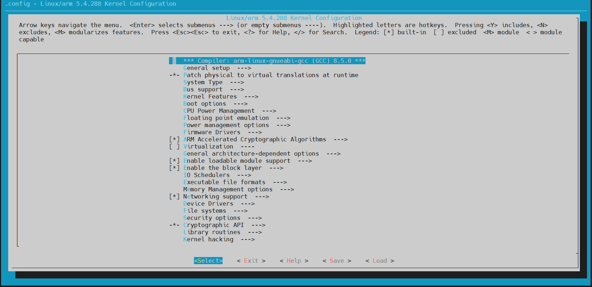
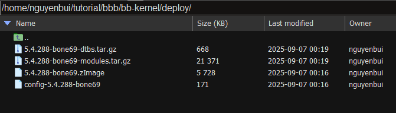

# Phần mềm cần cài đặt

Cài đặt một số phần mềm cần thiết:
- VMWare: [Link hỗ trợ cài đặt](https://docs.google.com/presentation/d/1zJd4UHS3j_v20GyaDKZmFG7pNuLj6h0aqnwkbRMH6GY/edit?usp=sharing)

- MobaXterm

# Tài liệu tham khảo

https://forum.digikey.com/t/debian-getting-started-with-the-beaglebone-black/12967

https://github.com/phuthodien/training_embedded_linux_v3/blob/main/Bai_1_build_image_cho_beaglebone/steps_load_image.txt

# Build image kernel

## Tải tool chain và export biến môi trường cho tool chain

Có nhiều loại toolchain khác nhau, để tránh gặp lỗi trong quá trình build image thì có thể follow theo: https://forum.digikey.com/t/debian-getting-started-with-the-beaglebone-black/12967

```bash
wget -c https://releases.linaro.org/components/toolchain/binaries/6.5-2018.12/arm-linux-gnueabihf/gcc-linaro-6.5.0-2018.12-x86_64_arm-linux-gnueabihf.tar.xz
tar xf gcc-linaro-6.5.0-2018.12-x86_64_arm-linux-gnueabihf.tar.xz
export CC=`pwd`/gcc-linaro-6.5.0-2018.12-x86_64_arm-linux-gnueabihf/bin/arm-linux-gnueabihf-
```

Test Cross compiler xem đã export toolchain thành công chưa bằng cách:

```bash
${CC}gcc --version
```

Nếu nó ra output dạng như này thì ok:

```bash
arm-linux-gnueabi-gcc (GCC) 11.3.0
Copyright (C) 2021 Free Software Foundation, Inc.
This is free software; see the source for copying conditions.  There is NO
warranty; not even for MERCHANTABILITY or FITNESS FOR A PARTICULAR PURPOSE.
```

## Tải code uboot và apply patch

Thực hiện clone uboot trên git:

```bash
git clone -b v2019.04 https://github.com/u-boot/u-boot --depth=1
cd u-boot/
git pull --no-edit https://github.com/beagleboard/u-boot v2019.04-bbb.io-am335x
```

Nếu chưa có git thì cần phải install packet `git` thì mới có thể clone:

```bash
sudo apt install git
```

Với debian/ubuntu, hãy thực hiện việc install packet `build-essential` trước thì mới có thể build uboot được:

```bash
sudo apt install bison build-essential flex swig
```

## Build uboot

```bash
make ARCH=arm CROSS_COMPILE=${CC} distclean
make ARCH=arm CROSS_COMPILE=${CC} am335x_evm_defconfig
make ARCH=arm CROSS_COMPILE=${CC}
```

Nếu chưa có make thì cần phải install packet `make` thì mới có thể thực hiện các lệnh trên:

```bash
sudo apt install make
```

## Tải code linux và apply patch

```bash
cd ../
git clone https://github.com/RobertCNelson/bb-kernel
cd bb-kernel/
git checkout origin/am33x-v5.4 -b tmp
```

## Build kernel

Đối với first build tức lần build đầu tiên thì ta chạy script:

```bash
./build_kernel.sh
```
Đối với các lần build sau, nếu có sử chỉnh sửa trong source code kernel thì ta cần phải chạy script:

```bash
./tool/rebuild.sh
```

Nguyên do là khi chỉnh sửa source code của kernel, thì khi chạy `build_kernel` thì nó sẽ revert đoạn code về từ đầu hay xoá toàn bộ đoạn code đã chỉnh sửa.

Khi build thì nó sẽ hiện một menuconfig như sau:



Ta sẽ chọn `Exit` để thoát và tiếp tục build.

Khi build xong thì nó sẽ tạo ra các file image trong thư mục deploy:



Trong đó:
- `5.X.Y-Z-dtbs.tar.gz`: file device tree cho board bbb
- `5.X.Y-Z-modules.tar.gz`: file kernel header, dùng để build kernel module.
- `5.X.Y-Z.zImage`: file kernel image
- `config-5.X.Y-Z`: file chứa các config cho kernel

## Tải và giải nén root file system

```bash
wget -c https://rcn-ee.com/rootfs/eewiki/minfs/debian-10.10-minimal-armhf-2021-06-20.tar.xz
tar xf debian-10.10-minimal-armhf-2021-06-20.tar.xz
```

## Setup sdcard

Để có thể ghi được linux image vào thẻ nhớ sdcard thì ta cần phải format lại thẻ nhớ theo định dạng mà linux có thể hiểu được.

Khi cắm thẻ nhớ, để kiểm tra xem đã nhận được thẻ nhớ chưa, ta sử dụng lệnh `lsblk`, nó sẽ hiển thị như sau: 

```bash
NAME   MAJ:MIN RM   SIZE RO TYPE MOUNTPOINT
sda      8:0    0 465.8G  0 disk
├─sda1   8:1    0   512M  0 part /boot/efi
└─sda2   8:2    0 465.3G  0 part /                <- Development Machine Root Partition
sdb      8:16   1   962M  0 disk                  <- microSD/USB Storage Device
└─sdb1   8:17   1   961M  0 part                  <- microSD/USB Storage Partition
```

Nếu nó nhận được nó sẽ hiển thị được một device là `sdb`.

Khi đã kiểm tra nhận được thẻ nhớ, ta tiến hành format lại thẻ nhớ. Đầu tiên, ta export một biến `DISK`:

```bash
export DISK=/dev/sdb
```

**Xoá hết tất cả các phân vùng trong thẻ**

```bash
sudo dd if=/dev/zero of=${DISK} bs=1M count=10
```

**Install uboot vào trong thẻ**

Đi vào folder chứa uboot và sử dụng các lệnh sau:

```bash
sudo dd if=./u-boot/MLO of=${DISK} count=1 seek=1 bs=128k
sudo dd if=./u-boot/u-boot.img of=${DISK} count=2 seek=1 bs=384k
```

Uboot nó sẽ ghi vào sector đầu tiên của thẻ, trong đó:
- `MLO`: là second stage bootloader
- `u-boot.img`: là third stage bootloader

**Tiến hành phân vùng thẻ**

Format lại thẻ theo định dạng `ext4`.

```bash
sudo sfdisk ${DISK} <<-__EOF__
4M,,L,*
__EOF__

sudo mkfs.ext4 -L rootfs -O ^metadata_csum,^64bit ${DISK}1
```

## Mount thẻ

mount thẻ vào một folder để có thể copy kernel image vào thẻ thông qua folder. 

```bash
sudo mkdir -p /media/rootfs/
sudo mount ${DISK}1 /media/rootfs/
```

Để kiểm tra mount thành công hay chưa ta sử dụng lệnh `lsblk`

```bash
NAME   MAJ:MIN RM   SIZE RO TYPE MOUNTPOINT
sda      8:0    0 465.8G  0 disk
├─sda1   8:1    0   512M  0 part /boot/efi
└─sda2   8:2    0 465.3G  0 part /
sdb      8:16   1   962M  0 disk
└─sdb1   8:17   1   961M  0 part /media/rootfs
```

Nếu được mount thành công thì sẽ thấy `sdb1` được link với folder `/media/rootfs`.

## Backup bootloader

```bash
sudo mkdir -p /media/rootfs/opt/backup/uboot/
sudo cp -v ./u-boot/MLO /media/rootfs/opt/backup/uboot/
sudo cp -v ./u-boot/u-boot.img /media/rootfs/opt/backup/uboot/
```

## Install kernel and root file system

```bash
export kernel_version=5.X.Y-Z
```

Trong đó:
- `5.X.Y-Z`: phải đúng với tiền tố trong tên file kernel image trong folder `deploy` khi được build ra. 

**Copy root file system**

```bash
sudo tar xfvp ./debian-*-*-armhf-*/armhf-rootfs-*.tar -C /media/rootfs/
sync
```

**Set uname_r in /boot/uEnv.txt**

File `uEnv` là file chứa tham số biến môi trường dùng cho uboot.

```bash
sudo sh -c "echo 'uname_r=${kernel_version}' >> /media/rootfs/boot/uEnv.txt"
```

**Copy kernel image**

```bash
sudo cp -v ./bb-kernel/deploy/${kernel_version}.zImage /media/rootfs/boot/vmlinuz-${kernel_version}
```

**Copy Kernel Device Tree Binaries**

```bash
sudo mkdir -p /media/rootfs/boot/dtbs/${kernel_version}/
sudo tar xfv ./bb-kernel/deploy/${kernel_version}-dtbs.tar.gz -C /media/rootfs/boot/dtbs/${kernel_version}/
```

**Copy Kernel Modules**

```bash
sudo tar xfv ./bb-kernel/deploy/${kernel_version}-modules.tar.gz -C /media/rootfs/
```

**File Systems Table (/etc/fstab)**

```bash
sudo sh -c "echo '/dev/mmcblk0p1  /  auto  errors=remount-ro  0  1' >> /media/rootfs/etc/fstab"
```

**Networking**

```bash
sudo nano /media/rootfs/etc/network/interfaces
```

Và chỉnh sửa như sau:

```
#/etc/network/interfaces
auto lo
iface lo inet loopback
 
auto eth0
iface eth0 inet dhcp
```

**Remove microSD/SD card**

```bash
sync
sudo umount /media/rootfs
```
