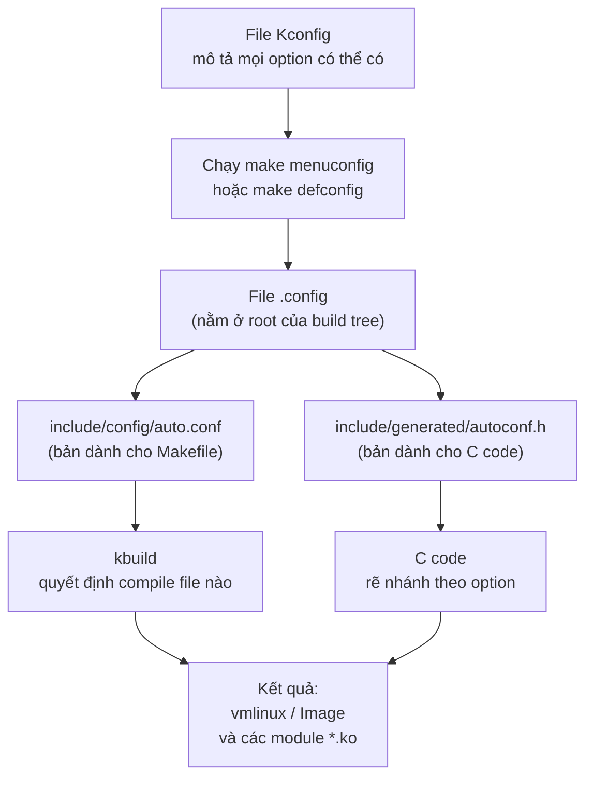
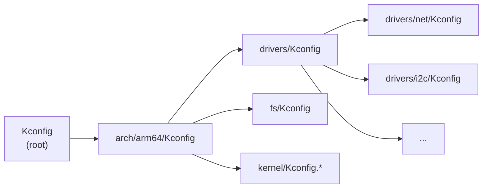

## 1. Kconfig là gì?

**Kconfig** là hệ thống configuration chính thức của Linux kernel. Nó gồm hai phần:

1. **Kconfig language:** một ngôn ngữ khai báo dùng để mô tả các *config option* (gọi là symbol), quan hệ dependency giữa chúng, giá trị default và phần help. Các mô tả này nằm trong những file tên `Kconfig`, phân tán khắp source tree. Kernel hiện nay có hơn 1500 file Kconfig, định nghĩa trên 20.000 symbol.

2. **Kconfig tools:** nằm trong `scripts/kconfig/` gồm parser và các frontend như `menuconfig`, `nconfig`, `xconfig`. Tool đọc toàn bộ file Kconfig, cho phép người dùng lựa chọn, rồi sinh ra file `.config` cùng các header để build system (kbuild) sử dụng.

Nói ngắn gọn, Kconfig trả lời câu hỏi: **kernel sẽ được build với những thành phần nào, ở dạng nào và với tham số gì.** Ví dụ: Driver ethernet của board có được build hay không; nếu có thì build vào kernel image (`=y`) hay build thành module (`=m`).

Kconfig không chỉ dùng trong kernel. Nhiều project lớn đã mượn lại đúng hệ thống này: **U-Boot, Buildroot, BusyBox, Zephyr, ESP-IDF**...Vì vậy, nắm vững Kconfig là nắm được công cụ configuration của gần như toàn bộ hệ sinh thái embedded Linux.

> Vì sao Kconfig ra đời?
>
>Linux kernel phải chạy được trên nhiều loại phần cứng khác nhau, từ các thiết bị embedded, router, điện thoại và server. Điều này tạo ra ba vấn đề:
>- Mỗi board embedded sẽ chỉ cần một số driver cần thiết, hàng nghìn driver còn lại là thừa.
>- RAM và flash trên thiết bị embedded rất hạn chế, nên không thể build tất cả mọi thứ được.
>- Nhiều tính năng phụ thuộc lẫn nhau hoặc loại trừ lẫn nhau. Ví dụ: USB gadget chỉ hoạt động khi USB controller chạy ở chế độ device/OTG.
>
>Vì vậy cần một cơ chế cho phép **chọn tính năng ngay lúc build** và cơ chế đó cũng cần phải **hiểu được dependency** để người dùng không tạo ra config vô lý, chẳng hạn như bật NFS trong khi tắt toàn bộ network stack.

## 2. Kiến trúc tổng thể

### 2.1. Bức tranh toàn cảnh

Toàn bộ hệ thống Kconfig hoạt động theo 4 giai đoạn nối tiếp nhau:

1. **Mô tả:** các file `Kconfig` liệt kê mọi option mà kernel có thể có.
2. **Lựa chọn:** người dùng chạy `make menuconfig` hoặc `make xxx_defconfig` để chọn option nào bật, option nào tắt.
3. **Ghi kết quả:** lựa chọn được lưu vào file `.config` rồi từ file này sinh ra 2 file trung gian.
4. **Build:** kbuild (hệ thống Makefile của kernel) đọc file trung gian để biết cần compile những gì.

Sơ đồ luồng dữ liệu đầy đủ:



Điểm mấu chốt cần nhớ: **`.config` là trung tâm của mọi thứ**. Mọi công cụ (menuconfig, defconfig, script...) suy cho cùng chỉ là các cách khác nhau để tạo ra file `.config`. Từ file `.config`, hệ thống sinh ra hai file trung gian là `auto.conf` cho Makefile và `autoconf.h` cho C code. Cuối cùng, kbuild dựa vào đó để quyết định thành phần nào được build tĩnh vào kernel image, thành phần nào trở thành module.

### 2.2. Các file Kconfig được tổ chức như thế nào?

Kernel có hơn 1.500 file Kconfig, nhưng chúng không rời rạc mà được nối với nhau bằng lệnh `source`, hoạt động giống hệt `#include` trong C: file cha "nhúng" nội dung file con vào vị trí đó.

Điểm bắt đầu là file `Kconfig` ở thư mục gốc. Nội dung của nó rất ngắn, đại ý chỉ có:

```kconfig
# file: Kconfig (ở root của source tree)
source "arch/$(SRCARCH)/Kconfig"
```

Nghĩa là: toàn bộ cây config thực chất bắt đầu từ **file Kconfig của architecture mà ta đang build**. File `arch/arm64/Kconfig` lại `source` tiếp các file khác, tạo thành cây:



Đây chính là lý do khi chạy `make menuconfig` ta **bắt buộc phải set biến `ARCH` cho đúng.** Nếu quên, tool sẽ đọc `arch/x86/Kconfig` theo máy host và ta sẽ không bao giờ thấy các option của SoC ARM trong menu dù chúng vẫn tồn tại trong source.

### 2.3. Các file quan trọng

**File `.config`:** nằm ở thư mục root của cây kernel, là kết quả đầu ra sau khi ta chạy `make menuconfig`, `make defconfig`...Nó là một file văn bản thuần, mỗi dòng là một symbol với giá trị đã được quyết định:

```
CONFIG_USB=y
CONFIG_EXT4_FS=m
CONFIG_HZ=1000
# CONFIG_DEBUG_KERNEL is not set
```

Vài điểm quan trọng cần lưu ý:
- `=y` nghĩa là built-in (compile thẳng vào kernel), `=m` là module, giá trị số/chuỗi thì ghi trực tiếp.
- Symbol bị tắt không ghi `=n` mà được ghi thành một dòng comment `# ... is not set`. Đó là cách Kconfig ghi nhận option này đã được hỏi và người dùng chọn tắt, để phân biệt với option chưa từng được hỏi đến.

Bản thân `.config` chỉ là dữ liệu. Nó không được dùng trực tiếp khi compile, vì hai "khách hàng" cần thông tin cấu hình lại nói hai "ngôn ngữ" khác nhau: hệ thống Makefile và mã nguồn C. Vì vậy Kbuild sinh ra hai file trung gian từ `.config`.

**File `include/config/auto.conf`** — dành cho hệ thống build (Makefile)

Đây gần như là bản sao của `.config` nhưng đã lược bỏ các dòng comment, chỉ giữ những symbol có giá trị, ở định dạng mà `make` có thể `include` trực tiếp.

Nhờ file này, trong các `Makefile` của kernel mới viết được những dòng như:

```makefile
obj-$(CONFIG_LED_MYBOARD) += led-myboard.o
```

Đây là cú pháp cốt lõi của kbuild. Biến `$(CONFIG_USB)` được thay bằng giá trị trong `.config`, nên dòng trên trở thành một trong ba trường hợp:

```makefile
obj-y += led-myboard.o      # khi =y  -> compile và built-in vào vmlinux
obj-m += led-myboard.o      # khi =m  -> compile thành module led-myboard.ko
obj-  += led-myboard.o      # khi tắt -> bỏ qua, khônh được build
```

Một dòng khai báo duy nhất xử lý cả ba trường hợp, đó là lý do mọi Makefile trong kernel đều viết theo mẫu này.

**File `include/generated/autoconf.h`** — dành cho C code:

File header này dịch cấu hình sang các macro để dùng trong code C:

```c
#define CONFIG_USB 1
#define CONFIG_EXT4_FS_MODULE 1
#define CONFIG_HZ 1000
```

Vài quy ước quan trọng:
- Symbol `=y` -> `#define CONFIG_XXX 1`
- Symbol `=m` -> `#define CONFIG_XXX_MODULE 1`
- Symbol tắt  -> không `#define` gì cả.

Nhờ đó trong code C ta có thể viết được:

```c
#ifdef CONFIG_USB
    /* mã chỉ biên dịch khi USB được bật */
#endif
```

Tuy nhiên, trong kernel code hiện đại, cách dùng được khuyến nghị là sử dụng macro `IS_ENABLED()`:

```c
if (IS_ENABLED(CONFIG_MY_FEATURE)) {
        /* chạy khi option = y hoặc = m */
}
```

`IS_ENABLED()` trả về 1 với cả `=y` lẫn `=m`. Compiler thấy điều kiện là hằng số nên tự loại bỏ nhánh không dùng, kết quả giống `#ifdef` nhưng code luôn được kiểm tra cú pháp.

Tóm tắt cả hành trình:

```
Kconfig ── menuconfig ──▶ .config ── make ──▶ auto.conf ──▶ Makefile
                                    	└───▶ autoconf.h ──▶ C code
```

## 3. Ngôn ngữ Kconfig

Tài liệu specification chính thức: `Documentation/kbuild/kconfig-language.rst` trong kernel source.

### 3.1. Các kiểu dữ liệu của symbol

| Kiểu | Giá trị | Ý nghĩa |
|------|----------------|----------|
| `bool` | `y` / `n` | Bật hoặc tắt |
| `tristate` | `y` / `m` / `n` | Built-in, module, hoặc tắt |
| `string` | chuỗi ký tự | Ví dụ tên host |
| `int` | số nguyên | Ví dụ kích thước buffer |
| `hex` | số hex | Ví dụ địa chỉ base |

> **Câu hỏi thường gặp:** khi nào dùng `bool`, khi nào dùng `tristate`? Quy tắc đơn giản: nếu tính năng có thể tách rời thành module nạp sau -> tristate; nếu nó phải nằm sẵn trong kernel từ lúc boot -> bool.

### 3.2. Khai báo cơ bản

Một entry tối thiểu chỉ cần 3 phần:

```kconfig
config LED_MYBOARD
	tristate "LED driver for My Board"
	help
	  Driver for the on-board LED of My Board.
```

Giải thích:

- **Dòng 1** — `config LED_MYBOARD`: khai báo symbol tên `LED_MYBOARD`. Ở các nơi khác (`.config`, C code, Makefile) thì symbol sẽ tự động có prefix `CONFIG_` -> `CONFIG_LED_MYBOARD`. Trong file Kconfig thì không viết prefix.
- **Dòng 2** — `tristate "LED driver for My Board"`: kiểu dữ liệu, kèm theo **prompt** — chuỗi hiển thị trong menuconfig.
- **Dòng 3** — `help`: phần mô tả, hiện ra khi người dùng nhấn `?` trong menuconfig.

Một chi tiết quan trọng về prompt: **symbol không có prompt sẽ bị ẩn hoàn toàn khỏi menuconfig**. Ví dụ:

```kconfig
config LED_INTERNAL_HELPER
	bool
	# không có chuỗi prompt -> người dùng không nhìn thấy, không chọn được
```
 
Symbol dạng này chỉ có thể nhận giá trị qua `default` hoặc bị symbol khác `select`. Kernel dùng rất nhiều symbol ẩn kiểu này làm biến nội bộ.

Bây giờ thêm dần các thuộc tính vào entry:

```kconfig
config LED_MYBOARD
	tristate "LED driver for My Board"
	depends on GPIOLIB          # chỉ khả dụng khi GPIOLIB đã bật
	default n                   # mặc định tắt
	help
	  Driver for the on-board LED of My Board.
```

### 3.3. Biểu thức điều kiện

Mọi biểu thức trong Kconfig trả về một trong ba giá trị và chúng có thứ tự:

```
 n  <  m  <  y
(0)   (1)   (2)
```

Ta cứ hình dung `n = 0`, `m = 1`, `y = 2`. Thứ tự này là chìa khóa để hiểu các toán tử.

| Toán tử | Tên | Ý nghĩa |
| --- | --- | --- |
| `&&` | `AND` | Lấy giá trị nhỏ hơn: `min(A, B)` |
| `\|\|` | `OR` | Lấy giá trị lớn hơn: `max(A, B)` |
| `!` | `NOT` | Đảo ngược: `!n = y`, `!y = n`, `!m = m` |
| `=` `!=` | So sánh bằng | Trả về `y` hoặc `n` |
| `<` `>` `<=` `>=` | So sánh | Trả về `y` hoặc `n` |

Vài điểm quan trọng cần nhớ kỹ:
- `&&` là hàm `min`, không phải phép AND boolean thuần. `y && m = m` vì `min(2,1)=1`.
- `||` là hàm max, , không phải phép OR boolean thuần. `n || m = m` vì `max(0,1)=1`.
- `!m = m`: Đảo của module vẫn là module. Chỉ `y` và `n` mới đảo qua lại.
- Các phép so sánh luôn cho kết quả boolean thuần (`y`/`n`), vì so sánh thì hoặc đúng hoặc sai.

Độ ưu tiên của toán tử từ cao xuống thấp:

```
1. !            	(NOT)
2. = != < > <= >=   (so sánh)
3. &&				(AND)
4. ||           	(OR)
```

Và dấu ngoặc `( )` luôn override tất cả.

Ví dụ `A && B || C` được hiểu là `(A && B) || C` vì `&&` ưu tiên cao hơn `||`.

Khi ta viết `depends on <biểu thức>`, giá trị của biểu thức không chỉ quyết định symbol có hiện hay không, mà còn giới hạn giá trị tối đa mà symbol được phép nhận. Cụ thể:

> Giá trị cuối cùng của symbol = `min(lựa chọn của người dùng, giá trị của depends on)`

Hệ quả:
- `depends on` ra `n`: symbol bị ép về `n`.
- `depends on` ra `m`: symbol chỉ được tối đa là `m`, không thể lên `y`.
- `depends on` ra `y`: symbol tự do là `y`, `m` hoặc `n`.

Ví dụ: Nếu driver của ta `depends on I2C` mà trong config hiện tại `I2C=m`, thì driver chỉ có thể chọn tối đa `=m`, menuconfig sẽ không cho chọn `=y`.

Đây chính là một triết lý của Kconfig: một thứ built-in (`y`) không được phép phụ thuộc vào một module (`m`) vì lúc kernel khởi động, module có thể chưa được nạp nên phần built-in sẽ gọi vào khoảng không.

### 3.4. `depends on`

Đây là cách khai báo dependency phổ biến nhất. Symbol chỉ hiển thị và chọn được khi điều kiện đúng. Nếu điều kiện sai, symbol bị ẩn và ép về `n`:

Ví dụ đơn giản với hai symbol:

```kconfig
config GPIOLIB
	bool "GPIO Support"
 
config LED_MYBOARD
	tristate "LED driver for My Board"
	depends on GPIOLIB
```

Hành vi của `depends on` qua từng kịch bản:

| Trạng thái `GPIOLIB` | Điều gì xảy ra với `LED_MYBOARD` |
|--------------------|-------------------------------|
| `n` | Biến mất khỏi menuconfig, không nhìn thấy, không chọn được |
| `y` | Xuất hiện trong menu, người dùng chọn tự do |

Hai điểm cần để ý:

1. `depends on` không tự bật dependency. Muốn thấy `LED_MYBOARD`, người dùng phải tự tay bật `GPIOLIB` trước. Kconfig không làm hộ.
2. Chính vì vậy, khi một option biến mất khỏi menuconfig, gần như chắc chắn một dependency nào đó của nó đang tắt.

Ngoài ra, khi đọc kernel source, ta sẽ hay gặp mẫu này:

```kconfig
	depends on ARCH_ROCKCHIP || COMPILE_TEST
```
 
Nghĩa là option chỉ dành cho SoC Rockchip, nhưng vẫn cho phép build thử trên architecture khác khi bật `COMPILE_TEST` để cộng đồng kiểm tra lỗi compile trên diện rộng. Đây là convention chuẩn của kernel hiện đại.

### 3.5. `select`

`select` làm điều ngược lại với `depends on`. Khi symbol hiện tại được bật, nó **chủ động ép** symbol khác bật theo.

Ví dụ đơn giản:

```kconfig
config CRC32
	tristate

config LED_MYBOARD
	tristate "LED driver for My Board"
	select CRC32
```

`CRC32` là thư viện helper không có prompt, người dùng không tự bật nó được nên driver cần nó phải `select`.

Tuy nhiên `select` có một số vấn đề cần phải nắm rõ:

1. **`select` bỏ qua `depends on` của symbol đích.** Nếu `CRC32` có dòng `depends on FOO` mà `FOO` đang tắt, `select` vẫn ép `CRC32=y` -> tạo ra config mâu thuẫn, có thể lỗi build. Vì vậy convention của kernel là: chỉ select những symbol không có prompt và không có (hoặc có rất ít) dependency.
2. **Người dùng mất quyền tắt symbol bị select.** Trong menuconfig, symbol đó hiện `-*-` thay vì `[*]`. Muốn tắt nó, phải tắt tất cả các symbol đang select nó.
3. Không select được symbol thuộc `choice`.

### 3.6. `imply`

```kconfig
config NET_DSA
	tristate "Distributed Switch Architecture"
	imply NET_SWITCHDEV
```

`imply` giống `select` nhưng có hai khác biệt then chốt: nó **tôn trọng `depends on` của symbol đích** và **người dùng vẫn được phép tắt** symbol đích. Dùng khi quan hệ chỉ mang tính khuyến nghị: "bật A thì B nên bật theo, nhưng không bắt buộc".

### 3.7. `default` và `range`

```kconfig
config LOG_BUF_SHIFT
	int "Kernel log buffer size (16 => 64KB, 17 => 128KB)"
	range 12 25
	default 17

config SWAP
	bool "Support for paging of anonymous memory (swap)"
	default y

config HZ
	int
	default 100 if HZ_100
	default 250 if HZ_250
	default 1000 if HZ_1000
```

Quy tắc:

- Khi có nhiều dòng `default`, tool xét từ trên xuống và áp dụng dòng đầu tiên có điều kiện thỏa.
- `def_bool y` là cách viết gọn của `bool` kết hợp `default y`; tương tự với `def_tristate`.
- `range MIN MAX` giới hạn khoảng giá trị cho kiểu `int` hoặc `hex`.

### 3.8. `menu`, `menuconfig` và khối `if`

```kconfig
menu "Device Drivers"
	source "drivers/net/Kconfig"
endmenu

menuconfig USB_SUPPORT
	bool "USB support"

if USB_SUPPORT
	source "drivers/usb/Kconfig"
endif
```

- `menu`: tạo một menu con thuần túy để tổ chức giao diện, bản thân nó không phải symbol.
- `menuconfig`: vừa là symbol vừa là menu: có thể bật/tắt và các option con nằm bên dưới nó.
- `if ... endif`: mọi entry bên trong khối tự động nhận thêm `depends on` với điều kiện tương ứng. Đây là cách thông dụng để đặt cả một nhóm driver phụ thuộc vào một symbol tổng.

### 3.9. `choice`

```kconfig
choice
	prompt "Preemption Model"
	default PREEMPT_NONE

config PREEMPT_NONE
	bool "No Forced Preemption (Server)"

config PREEMPT_VOLUNTARY
	bool "Voluntary Kernel Preemption (Desktop)"

config PREEMPT
	bool "Preemptible Kernel (Low-Latency Desktop)"

endchoice
```

Trong một khối `choice`, chỉ đúng **một** option được mang giá trị `=y`. Biến thể `choice` kiểu `tristate` cho phép nhiều option `=m` cùng lúc với một option `=y`, nhưng hiếm gặp và đã bị hạn chế trong các kernel mới.

## 4. Các lệnh config thường dùng

Toàn bộ lệnh dưới đây chạy từ thư mục gốc của kernel source. Khi cross compile, cần set `ARCH` và `CROSS_COMPILE`. Nếu build out-of-tree, thêm tham số `O=`.

### 4.1. Giao diện tương tác

| Lệnh | Mô tả |
|------|-------|
| `make menuconfig` | Giao diện text menu dựa trên ncurses. Phổ biến nhất. |
| `make nconfig` | Cũng ncurses nhưng giao diện mới hơn, tìm kiếm và trợ giúp tiện hơn |
| `make xconfig` | Giao diện đồ họa Qt |
| `make gconfig` | Giao diện đồ họa GTK |
| `make config` | Hỏi tuần tự từng option qua command line, hiện gần như không còn ai dùng |

Các phím quan trọng trong **menuconfig**:

| Phím | Ý nghĩa |
| --- | --- |
| `/` | Tìm kiếm symbol (gõ tên không cần tiền tố `CONFIG_`). |
| `?` hoặc `h` | Xem help và thông tin dependency của option đang chọn |
| `space` | Xoay vòng giữa các giá trị |
| `Z` | Hiển thị các symbol đang bị ẩn kèm lý do |
| `Esc` | Thoát menu hiện tại |

Kết quả tìm kiếm bằng phím `/` hiển thị đầy đủ: kiểu dữ liệu, prompt, vị trí file Kconfig định nghĩa symbol và dòng `Depends on:` kèm giá trị hiện tại của từng vế điều kiện.

### 4.2. Lệnh tạo cấu hình

| Lệnh | Mô tả |
|------|-------|
| `make defconfig` | Dùng cấu hình mặc định cho kiến trúc hiện tại. Ví dụ, trên kiến trúc x86 sẽ lấy `arch/x86/configs/x86_64_defconfig` |
| `make <board>_defconfig` | Dùng `defconfig` cụ thể của một board. Ví dụ `make bcm2711_defconfig` cho Raspberry Pi 4, `make multi_v7_defconfig` cho ARM. |
| `make savedefconfig` | Sinh file `defconfig` tối giản từ `.config` hiện tại, chỉ chứa những giá trị khác default. Dùng khi cần commit config của board |
| `make oldconfig` | Cập nhật `.config` cũ theo cây Kconfig mới, hỏi người dùng với từng option mới xuất hiện |
| `make olddefconfig` | Giống `oldconfig` nhưng tự nhận giá trị default cho option mới |
| `make listnewconfig` | Liệt kê các option mới chưa có trong `.config`, không thay đổi gì |

`olddefconfig` là lệnh ta sẽ dùng nhiều nhất khi nâng cấp kernel: lấy `.config` cũ, chạy lệnh này, mọi option mới trong phiên bản kernel mới sẽ tự nhận giá trị mặc định thay vì bắt ta ngồi trả lời hàng trăm câu hỏi.

`savedefconfig` rất hữu ích khi ta muốn lưu cấu hình vào git hoặc gửi patch, file `.config` đầy đủ dài cả chục nghìn dòng, còn `defconfig` tối giản chỉ vài trăm dòng.

### 4.3. Các config phục vụ test

| Lệnh | Mô tả |
|------|-------|
| `make allnoconfig` | Tắt tất cả những gì có thể tắt được -> kernel tối thiểu |
| `make allyesconfig` | Bật tất cả những gì có thể bật được thành `y` |
| `make allmodconfig` | Bật tối đa thành `m` khi có thể |
| `make randconfig` | Sinh cấu hình ngẫu nhiên -> kiểm thử độ bền của build system |
| `make tinyconfig` | Cấu hình nhỏ nhất có thể (là `allnoconfig` cộng vài tinh chỉnh tối ưu kích thước) |

Ba lệnh `allyesconfig` / `allmodconfig` / `randconfig` chủ yếu phục vụ kiểm thử tự động (CI, phát hiện lỗi compile ở các tổ hợp lạ), không dùng cho kernel chạy thật.

### 4.4. Chỉnh sửa config bằng script

Công cụ command line cho phép chỉnh `.config` mà không cần mở giao diện, rất hữu ích trong build script tự động.

`scripts/config` - sửa trực tiếp từng symbol:

```bash
./scripts/config --enable  CONFIG_DEBUG_INFO                # đặt =y
./scripts/config --disable CONFIG_DEBUG_INFO_NONE           # đặt là "not set"
./scripts/config --module  CONFIG_E1000E                    # đặt =m
./scripts/config --set-val CONFIG_LOG_BUF_SHIFT 18          # đặt giá trị số
./scripts/config --set-str CONFIG_LOCALVERSION "-mycustom"  # đặt chuỗi
./scripts/config --state   CONFIG_SMP                       # đọc giá trị hiện tại
```

Sau khi dùng `scripts/config` để chỉnh sửa config, nhớ chạy `make olddefconfig` để Kconfig kiểm tra và hoàn thiện dependency vì script chỉ sửa file thô, không kiểm tra dependency.

`scripts/kconfig/merge_config.sh` - gộp nhiều mảnh config fragment:

```bash
scripts/kconfig/merge_config.sh -m .config debug.config virtio.config
make olddefconfig
```

Config fragment là file text ngắn chỉ chứa một vài dòng `CONFIG_*`. Đây là nền tảng cho cách Yocto và Buildroot quản lý kernel config: giữ một defconfig gốc rồi chồng thêm các fragment nhỏ cho từng tính năng.

### 4.5. Dọn dẹp

| Lệnh | Mô tả |
| --- | --- |
| `make clean` | Xoá object file, giữ `.config` |
| `make mrproper` | Xoá cả object file lẫn `.config` và các file generated |
| `make distclean` | Như `mrproper` cộng thêm file backup, patch thừa |

:::warning Cẩn thận
`mrproper` sẽ làm mất file `.config`. Nên sao lưu trước.
:::

## 5. Cheat sheet tra cứu nhanh

```bash
# ===== Khởi tạo config =====
make ARCH=arm64 defconfig                    # defconfig mặc định của architecture
make ARCH=arm64 myboard_defconfig            # defconfig của board
make ARCH=arm64 menuconfig                   # chỉnh thủ công (tìm kiếm: /)

# ===== Lưu / tái tạo =====
make savedefconfig                            # .config → defconfig tối giản
cp defconfig arch/arm64/configs/myboard_defconfig

# ===== Cập nhật khi nâng kernel version =====
make listnewconfig                            # xem danh sách option mới
make olddefconfig                             # nhận default cho option mới

# ===== Chỉnh bằng script =====
./scripts/config --enable  CONFIG_FOO
./scripts/config --module  CONFIG_BAR
./scripts/config --set-val CONFIG_N 8
make olddefconfig                             # BẮT BUỘC sau khi chỉnh

# ===== Merge fragment =====
scripts/kconfig/merge_config.sh -m .config debug.config
make olddefconfig

# ===== Debug =====
# menuconfig:  /SYMBOL  -> đọc dòng "Depends on: A [=y] && B [=n]"
grep -rn "config FOO" --include=Kconfig* .    # tìm nơi định nghĩa symbol
grep -rn "select FOO" --include=Kconfig* .    # tìm symbol nào đang ép bật FOO
scripts/diffconfig old.config new.config      # so sánh hai config
zcat /proc/config.gz | grep FOO               # config của kernel đang chạy

# ===== Trong Makefile (kbuild) =====
# obj-$(CONFIG_FOO) += foo.o        y -> built-in, m -> module, n -> bỏ qua

# ===== Trong C code =====
# IS_ENABLED(CONFIG_FOO)            đúng với cả =y và =m (khuyến nghị dùng)
# IS_BUILTIN(CONFIG_FOO)            chỉ đúng với =y
# IS_MODULE(CONFIG_FOO)             chỉ đúng với =m
```

**Tài liệu chính thức trong kernel source:**

- `Documentation/kbuild/kconfig-language.rst` — đặc tả ngôn ngữ Kconfig
- `Documentation/kbuild/kconfig.rst` — các environment variable và hướng dẫn sử dụng
- `Documentation/kbuild/kconfig-macro-language.rst` — cú pháp macro `$( )`
- `Documentation/kbuild/makefiles.rst` — kbuild và cơ chế liên kết Kconfig với Makefile